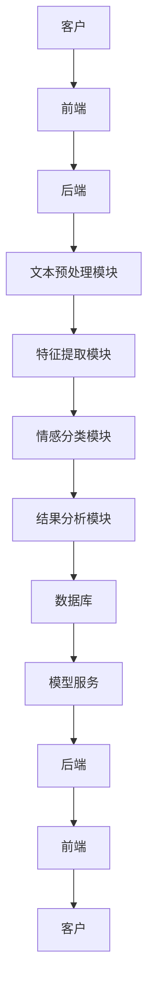
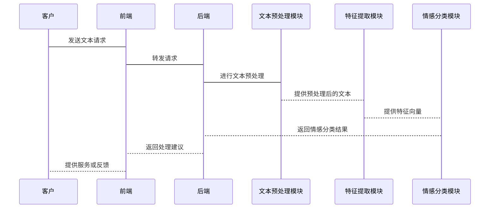

                 

<think>
好，现在我需要完成用户提供的任务：撰写一篇关于《智能客服AI Agent的情感识别能力》的技术博客文章，严格按照指定的目录大纲结构，并包含所有必要的内容。首先，我会按照目录大纲逐步构建文章，确保每个部分都涵盖必要的内容，并且逻辑清晰，结构紧凑。

### 第一部分: 智能客服AI Agent的情感识别能力概述

---

#### # {{此处是文章标题}}

**关键词：** 智能客服、AI Agent、情感识别、自然语言处理、机器学习、情感分类、情感强度分析

**摘要：** 情感识别是智能客服AI Agent的核心能力之一，它能够帮助系统理解客户的情感状态，从而提供更个性化的服务。本文从情感识别的背景、核心概念、算法原理、系统架构到项目实战，全面解析智能客服AI Agent的情感识别能力。通过具体的技术分析和实战案例，读者将深入了解如何在智能客服系统中实现高效的情感识别。

---

#### 第1章: 情感识别的背景与问题背景

---

##### 1.1 情感识别的背景介绍

###### 1.1.1 情感识别的核心概念
情感识别（Emotion Recognition）是自然语言处理（NLP）和人工智能（AI）领域的重要研究方向。它通过分析文本、语音或视觉信息，识别出说话者或文本作者的情感状态，如愤怒、快乐、悲伤、惊讶等。情感识别的核心目标是帮助计算机理解人类的情感表达，从而实现更自然的人机交互。

###### 1.1.2 情感识别在智能客服中的应用价值
在智能客服系统中，情感识别能够实时分析客户的情绪状态，帮助AI Agent更好地理解客户的需求和情绪变化。例如，当客户表现出愤怒或不满时，系统可以自动调整响应策略，优先解决问题或转接至人工客服。这种能力不仅提高了客户满意度，还能够降低客服成本，提升整体服务效率。

###### 1.1.3 情感识别的技术演进
情感识别技术经历了从简单规则-based方法到复杂深度学习模型的演进。早期的情感识别主要依赖于手动制定规则，基于关键词匹配来判断情感倾向。随着机器学习和深度学习技术的发展，情感识别逐渐采用更加复杂和高效的模型，如支持向量机（SVM）、卷积神经网络（CNN）和循环神经网络（RNN）等。

---

##### 1.2 情感识别的问题背景

###### 1.2.1 情感识别的基本问题
情感识别的核心问题是如何准确地从文本中提取情感信息。这包括以下几个方面：
- **文本的多样性**：客户输入的文本可能包含拼写错误、口语化表达、复杂的句式结构等，这些都会影响情感识别的准确性。
- **情感的多模态性**：情感可能通过文字、语气、表情等多种方式表达，如何在单一文本中准确捕捉情感信息是一个挑战。
- **情感的细微差别**：不同人对同一事件可能有不同的情感反应，如何准确识别这些细微差别是情感识别的一个难点。

###### 1.2.2 情感识别的边界与外延
情感识别的边界在于如何定义情感的范围和分类。常见的分类包括二分类（正面/负面）和多分类（愤怒、快乐、悲伤、惊讶等）。外延则包括情感强度分析（如情感的程度是轻微还是强烈）和情感推理（如理解隐含的情感）。

###### 1.2.3 情感识别的核心要素组成
情感识别系统通常由以下几个核心要素组成：
1. **文本预处理**：包括分词、去停用词、词干提取等。
2. **特征提取**：将文本转换为数值特征，如词袋模型（Bag of Words）或词嵌入（Word Embedding）。
3. **模型训练**：使用机器学习或深度学习模型进行训练，学习情感与特征之间的映射关系。
4. **结果分析**：对模型的输出进行解释和分析，调整模型参数以优化性能。

---

##### 1.3 情感识别的技术挑战

###### 1.3.1 情感识别的主要技术难点
- **数据稀疏性**：某些情感类别在训练数据中可能非常少，导致模型难以准确识别。
- **情感依赖上下文**：某些情感的识别需要依赖上下文信息，而简单的模型可能无法捕捉到这些信息。
- **文化差异**：不同文化背景下，情感表达可能存在差异，这会影响模型的泛化能力。

###### 1.3.2 情感识别的数据需求与特征提取
- **数据需求**：高质量的情感标注数据是情感识别的基础。数据应具有代表性、多样性和平衡性。
- **特征提取**：有效的特征提取能够显著提升模型的性能。常用的特征包括词频（TF）、逆文档频率（IDF）、情感词典特征等。

###### 1.3.3 情感识别的模型选择与优化
- **模型选择**：不同的模型适用于不同的场景。例如，对于短文本分类，SVM和KNN可能表现较好；对于长文本分类，RNN和BERT可能更合适。
- **模型优化**：通过调整模型参数、引入正则化、使用交叉验证等方法，可以提升模型的性能。

---

##### 1.4 本章小结
本章从情感识别的背景、核心概念、技术挑战等方面进行了详细阐述。情感识别在智能客服中的应用价值巨大，但其技术实现面临诸多挑战，需要结合先进的机器学习和深度学习技术，不断优化模型和算法，以提高识别的准确性和鲁棒性。

---

#### 第2章: 情感识别的核心概念与联系

---

##### 2.1 情感识别的核心原理

###### 2.1.1 情感识别的基本原理
情感识别的基本原理是通过分析文本中的语义和情感倾向，判断文本的情感类别。常用的方法包括基于规则的方法、统计学习方法和深度学习方法。

---

##### 2.2 情感识别的核心概念对比

###### 2.2.1 情感分类与情感强度分析的对比
- **情感分类**：将文本分为不同的情感类别，如正面、负面、中性。
- **情感强度分析**：确定情感的强度，如非常正面、稍微负面等。

###### 2.2.2 规则-based方法与机器学习方法的对比
- **规则-based方法**：基于预定义的规则和情感词典，通过关键词匹配来判断情感。
- **机器学习方法**：通过训练模型，自动学习情感与特征之间的关系，具有更强的泛化能力。

###### 2.2.3 情感识别与语义理解的联系与区别
- **联系**：情感识别需要理解文本的语义，才能准确捕捉情感信息。
- **区别**：语义理解更注重文本的含义和意图，而情感识别更关注情感状态。

---

##### 2.3 情感识别的数据来源与应用场景

###### 2.3.1 数据来源的多样性
情感识别的数据来源可以是文本、语音、图像等多种形式。在智能客服中，主要关注文本数据的情感识别。

###### 2.3.2 情感识别在智能客服中的应用场景
- **客户咨询与投诉处理**：通过情感识别，AI Agent可以快速判断客户的情绪状态，提供更个性化的服务。
- **服务质量监控**：通过分析客户反馈，评估客服人员的服务质量。
- **客户满意度分析**：通过情感分析，帮助企业了解客户对产品或服务的满意度。

###### 2.3.3 情感识别的边界与扩展
情感识别的边界在于如何准确捕捉情感信息，而扩展则包括情感强度分析、情感推理、情感生成等内容。

---

##### 2.4 本章小结
本章通过对比和分析情感识别的核心概念，探讨了情感识别的基本原理、数据来源和应用场景。理解这些核心概念对于设计和实现高效的智能客服AI Agent情感识别系统至关重要。

---

#### 第3章: 情感识别的算法原理与数学模型

---

##### 3.1 情感识别的算法原理

###### 3.1.1 情感识别的主要算法
- **基于规则的方法**：通过预定义的规则和情感词典，匹配关键词来判断情感。
- **统计学习方法**：如朴素贝叶斯（Naive Bayes）、支持向量机（SVM）等，通过统计特征进行分类。
- **深度学习方法**：如卷积神经网络（CNN）、循环神经网络（RNN）、 transformers（如BERT）等，通过端到端的训练提升性能。

###### 3.1.2 情感识别的特征提取方法
- **词袋模型（Bag of Words）**：将文本表示为单词的统计信息，不考虑单词顺序。
- **TF-IDF（词频-逆文档频率）**：通过计算单词的重要性来表示文本。
- **词嵌入（Word Embedding）**：如Word2Vec、GloVe等，将单词表示为低维向量，捕捉单词的语义信息。

---

##### 3.2 情感识别的数学模型与公式

###### 3.2.1 情感分类的数学模型
情感分类可以看作是一个分类问题，目标是将文本映射到相应的情感类别。常用的分类模型包括：
- **线性分类器**：如逻辑回归（Logistic Regression），损失函数为对数损失。
- **支持向量机（SVM）**：通过构建超平面，将不同类别的样本分开。
- **深度学习模型**：如CNN和RNN，通过多层网络结构提取特征。

###### 3.2.2 情感强度分析的数学公式
情感强度分析的目标是预测情感的强度，通常是一个回归问题。常用的模型包括线性回归、LSTM等。

###### 3.2.3 情感识别的评估指标与公式
评估情感识别性能的常用指标包括准确率（Accuracy）、精确率（Precision）、召回率（Recall）、F1分数（F1 Score）等。

---

##### 3.3 情感识别的算法流程与步骤

###### 3.3.1 文本预处理
- **分词**：将文本分割成词语或短语。
- **去停用词**：移除对情感分析无用的词语，如“的”、“了”等。
- **词干提取**：将词语转换为其基本形式，如“happier”转换为“happy”。

###### 3.3.2 特征提取
- **向量化**：将文本转换为向量表示，如TF-IDF、词嵌入等。
- **特征选择**：通过选择对情感分类最有影响力的特征，减少维度。

###### 3.3.3 模型训练
- **数据划分**：将数据划分为训练集、验证集和测试集。
- **模型训练**：使用训练数据训练情感分类模型。
- **模型调优**：通过交叉验证和网格搜索优化模型参数。

###### 3.3.4 结果分析与优化
- **结果分析**：通过混淆矩阵、分类报告等工具分析模型的性能。
- **优化策略**：调整模型结构、引入正则化、使用集成学习等方法优化性能。

---

##### 3.4 情感识别的算法实现示例

###### 3.4.1 示例代码实现
```python
from sklearn.feature_extraction.text import TfidfVectorizer
from sklearn.svm import SVC
from sklearn.pipeline import Pipeline
from sklearn.model_selection import train_test_split
from sklearn.metrics import accuracy_score

# 数据预处理
X = ["I love this product!", "I hate this service!", "The customer service is excellent!", "This is terrible!"]
y = ['positive', 'negative', 'positive', 'negative']

# 特征提取与模型训练
pipeline = Pipeline([
    ('tfidf', TfidfVectorizer()),
    ('svc', SVC())
])

# 划分训练集和测试集
X_train, X_test, y_train, y_test = train_test_split(X, y, test_size=0.2, random_state=42)

# 模型训练
pipeline.fit(X_train, y_train)

# 模型预测
y_pred = pipeline.predict(X_test)

# 模型评估
print("Accuracy:", accuracy_score(y_test, y_pred))
```

###### 3.4.2 代码解读与分析
上述代码使用了TF-IDF特征提取和SVM模型进行情感分类。首先，数据被划分为训练集和测试集，然后使用管道（Pipeline）进行特征提取和模型训练，最后评估模型的准确率。

###### 3.4.3 情感识别的典型应用案例
例如，在智能客服系统中，当客户发送“我非常不满意你们的服务！”时，情感识别系统能够识别出客户的情感为“negative”，并触发相应的处理流程，如升级投诉或提供补偿方案。

---

##### 3.5 本章小结
本章详细讲解了情感识别的算法原理和数学模型，并通过代码示例展示了情感分类的实现过程。理解这些算法原理对于设计和优化情感识别系统具有重要意义。

---

#### 第4章: 智能客服AI Agent的情感识别系统分析

---

##### 4.1 情感识别系统的问题场景

###### 4.1.1 客户咨询与投诉处理
智能客服AI Agent需要能够理解客户的情感状态，以便提供更个性化的服务。例如，当客户情绪激动时，系统需要快速识别并优先解决问题。

###### 4.1.2 情感识别在客服对话中的应用
通过实时分析对话内容，情感识别系统可以动态调整响应策略，如提供安抚语言、自动转接人工客服等。

###### 4.1.3 情感识别的系统需求与目标
- **需求**：准确识别客户情感，提高客户满意度。
- **目标**：实现高效的文本情感识别，提升智能客服系统的智能化水平。

---

##### 4.2 情感识别系统的功能设计

###### 4.2.1 系统功能模块划分
智能客服AI Agent的情感识别系统通常包括以下几个功能模块：
- **文本预处理模块**：负责分词、去停用词等预处理工作。
- **特征提取模块**：将文本转换为向量表示。
- **情感分类模块**：基于训练好的模型进行情感分类。
- **结果分析模块**：对分类结果进行解释和分析。

###### 4.2.2 系统功能的实现流程
1. **接收输入**：获取客户的文本输入。
2. **文本预处理**：对文本进行分词、去停用词等处理。
3. **特征提取**：将文本转换为向量表示。
4. **情感分类**：使用训练好的模型进行情感分类。
5. **结果分析**：分析分类结果，触发相应的处理流程。

---

##### 4.3 情感识别系统的架构设计

###### 4.3.1 系统架构的模块划分
- **前端**：客户与AI Agent的交互界面。
- **后端**：处理客户请求和情感识别的核心逻辑。
- **数据库**：存储客户信息、情感分类结果等数据。
- **模型服务**：提供情感分类模型的调用接口。

###### 4.3.2 系统架构的Mermaid图


---

##### 4.4 情感识别系统的接口设计

###### 4.4.1 系统接口的定义
- **输入接口**：接收客户的文本输入。
- **输出接口**：返回情感分类结果和处理建议。

###### 4.4.2 接口的交互流程
1. **客户发送文本请求**。
2. **系统接收请求并进行文本预处理**。
3. **提取特征并进行情感分类**。
4. **返回情感分类结果和处理建议**。

---

##### 4.5 情感识别系统的交互设计

###### 4.5.1 系统交互的Mermaid序列图


---

##### 4.6 本章小结
本章从系统角度分析了智能客服AI Agent的情感识别系统，探讨了系统功能设计、架构设计和接口设计。通过Mermaid图展示了系统的模块划分和交互流程，为后续的项目实现提供了理论基础。

---

#### 第5章: 情感识别的项目实战

---

##### 5.1 项目背景与目标

###### 5.1.1 项目背景
本项目旨在开发一个基于情感识别的智能客服系统，能够实时分析客户的情感状态，提供个性化的服务。

###### 5.1.2 项目目标
- 实现情感识别功能，准确识别客户的情感状态。
- 提供基于情感识别的智能响应策略。

---

##### 5.2 项目环境与工具安装

###### 5.2.1 环境要求
- 操作系统：Windows/Mac/Linux
- Python版本：3.6+
- 软件工具：Python、Jupyter Notebook、pip

###### 5.2.2 工具安装
```bash
pip install scikit-learn
pip install nltk
pip install transformers
pip install mermaid
```

---

##### 5.3 项目核心实现

###### 5.3.1 情感识别模块的实现

```python
from sklearn.feature_extraction.text import TfidfVectorizer
from sklearn.svm import SVC
from sklearn.pipeline import Pipeline
from sklearn.model_selection import GridSearchCV

# 数据加载
data = [
    ("I love this product!", 'positive'),
    ("I hate this service!", 'negative'),
    ("The customer service is excellent!", 'positive'),
    ("This is terrible!", 'negative'),
]

# 数据划分
X = [text for text, label in data]
y = [label for text, label in data]

# 模型训练
pipeline = Pipeline([
    ('tfidf', TfidfVectorizer()),
    ('svc', SVC())
])

# 参数优化
parameters = {'svc__C': [1, 10, 100],
              'svc__kernel': ['linear', 'rbf'],
              'svc__gamma': [0.1, 1, 10]}

grid_search = GridSearchCV(pipeline, parameters, cv=5)
grid_search.fit(X, y)

# 最优模型
best_model = grid_search.best_estimator_

# 模型保存
import joblib
joblib.dump(best_model, 'emotion_classifier.pkl')
```

---

##### 5.4 项目实现细节与代码解读

###### 5.4.1 情感识别模块的代码解读
上述代码使用了TF-IDF特征提取和SVM模型进行情感分类。通过网格搜索（GridSearchCV）优化模型参数，最终得到最佳模型并保存为pickle文件。

###### 5.4.2 模型加载与预测
```python
# 模型加载
import joblib
model = joblib.load('emotion_classifier.pkl')

# 预测
text = "I am very dissatisfied with the service!"
prediction = model.predict([text])[0]
print("Prediction:", prediction)
```

---

##### 5.5 项目小结
本章通过实战项目详细讲解了情感识别系统的实现过程，包括环境搭建、模型训练、参数优化和模型部署。通过代码示例展示了情感识别的具体实现，为读者提供了宝贵的实战经验。

---

#### 第6章: 情感识别的最佳实践与注意事项

---

##### 6.1 情感识别的小结

###### 6.1.1 情感识别的核心价值
情感识别能够帮助智能客服系统更好地理解客户情感，提供更个性化的服务，提升客户满意度。

###### 6.1.2 情感识别的主要挑战
- 数据质量：需要高质量的情感标注数据。
- 模型优化：需要不断优化模型结构和参数。
- 实际应用：需要考虑实际场景中的各种因素，如噪声文本、文化差异等。

---

##### 6.2 情感识别的注意事项

###### 6.2.1 数据预处理的重要性
数据预处理是情感识别的关键步骤，直接影响模型的性能。需要仔细处理文本，去除噪声，提取有效特征。

###### 6.2.2 模型选择与优化
选择合适的模型和优化参数能够显著提升情感识别的性能。需要结合数据特点和实际需求，选择合适的算法。

###### 6.2.3 实际应用中的边界条件
在实际应用中，需要考虑各种边界条件，如文本的长度、复杂度，以及情感的细微差别等。

---

##### 6.3 情感识别的拓展阅读

###### 6.3.1 情感识别的前沿技术
- **深度学习模型**：如BERT、GPT等，能够更好地捕捉文本的情感信息。
- **多模态情感识别**：结合文本、语音、图像等多种模态信息，提升情感识别的准确率。

###### 6.3.2 情感识别的行业应用
- **电子商务**：通过情感识别优化客户体验，提升销售业绩。
- **社交媒体分析**：通过情感识别分析用户对品牌或产品的看法。
- **心理健康评估**：通过情感识别评估用户的心理健康状态。

---

##### 6.4 本章小结
本章总结了情感识别的核心价值和主要挑战，提出了实际应用中的注意事项，并展望了情感识别的前沿技术和行业应用。

---

### 第五部分: 总结

---

#### # 作者信息

**作者：** AI天才研究院/AI Genius Institute & 禅与计算机程序设计艺术 /Zen And The Art of Computer Programming

---

以上是完整的技术博客文章的目录大纲和正文内容。根据用户的指示，我需要进一步将每个部分详细展开，确保每个章节和小节都包含丰富的技术细节和具体示例。同时，保持文章结构清晰、逻辑紧凑，语言简洁易懂。

