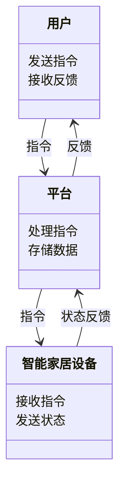
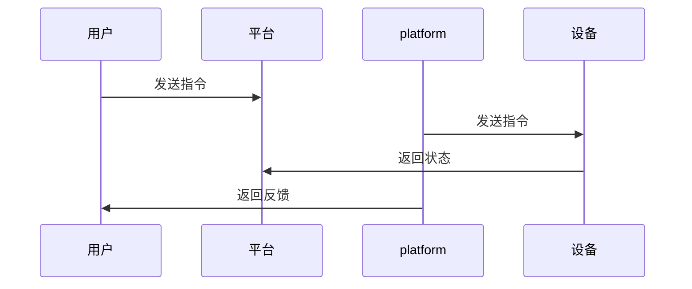

                 


# 智能家居产业链的投资机会分析

> 关键词：智能家居产业链、物联网、人工智能、投资机会、技术分析

> 摘要：本文从智能家居产业链的核心概念出发，分析其技术原理和系统架构，探讨投资机会和风险，并通过实际案例分析提供投资建议。

---

# 第一部分: 智能家居产业链的背景与核心概念

## 第1章: 智能家居产业链的定义与现状

### 1.1 智能家居的定义与核心要素

#### 1.1.1 智能家居的定义
智能家居是指通过物联网（IoT）、人工智能（AI）、大数据等技术，将家庭中的设备、系统和数据进行智能化连接和控制，以提升居住体验的居住环境。

#### 1.1.2 智能家居的核心要素
智能家居的核心要素包括：
- **设备层**：智能硬件，如智能音箱、智能门锁、智能灯泡等。
- **网络层**：通信技术，如Wi-Fi、蓝牙、ZigBee等。
- **平台层**：云平台，负责数据存储和处理。
- **应用层**：用户界面和应用程序，实现设备的控制和数据展示。

#### 1.1.3 智能家居的分类与应用场景
智能家居可以根据功能分为安全、节能、娱乐、健康等多个类别。应用场景包括家庭安全监控、能源管理、远程控制等。

### 1.2 智能家居产业链的结构

#### 1.2.1 产业链的上游、中游和下游
- **上游**：芯片、传感器、通信模块等硬件供应商。
- **中游**：智能设备制造商、平台开发公司。
- **下游**：销售渠道、安装服务、用户。

#### 1.2.2 主要参与者及其角色
- **设备制造商**：如小米、华为、谷歌等。
- **平台提供商**：如Apple HomeKit、Google Nest、亚马逊Alexa等。
- **服务提供商**：如安防公司、能源管理公司。

#### 1.2.3 产业链的协同效应
智能家居产业链的协同效应体现在设备间的互联互通、平台的开放性和数据的共享性。

### 1.3 智能家居的投资机会背景

#### 1.3.1 行业发展趋势
- 智能家居市场增长迅速，预计未来几年年复合增长率超过20%。
- 技术进步推动产品升级，如AI芯片、5G技术的应用。

#### 1.3.2 技术进步对投资的影响
- 人工智能和物联网技术的成熟为智能家居提供了更多的应用场景。
- 云计算和大数据技术的应用提升了智能家居的智能化水平。

#### 1.3.3 市场需求分析
- 消费者对智能化生活的追求推动市场需求增长。
- B端市场（企业级应用）逐渐兴起，如智能办公、智能酒店等。

---

## 第2章: 智能家居产业链的核心概念与联系

### 2.1 智能家居的核心技术原理

#### 2.1.1 物联网（IoT）技术
物联网是智能家居的基础，通过传感器和通信技术实现设备间的互联互通。

#### 2.1.2 人工智能（AI）技术
人工智能用于智能家居的数据分析、语音识别和智能决策。

#### 2.1.3 大数据分析与云计算
大数据分析帮助智能家居优化用户体验，云计算提供数据存储和处理能力。

### 2.2 智能家居产业链的实体关系图


### 2.3 智能家居产业链的核心要素对比

| 核心要素 | 描述 |
|----------|------|
| 设备层   | 包括传感器、智能硬件等 |
| 网络层   | 包括Wi-Fi、蓝牙等通信技术 |
| 平台层   | 包括云平台、数据处理中心等 |
| 应用层   | 包括用户界面、应用程序等 |

---

## 第3章: 智能家居产业链的技术原理与算法分析

### 3.1 智能家居的核心算法

#### 3.1.1 数据采集与处理算法
- 数据采集：通过传感器获取环境数据。
- 数据处理：对采集的数据进行清洗和预处理。

#### 3.1.2 人工智能算法（如机器学习、深度学习）
- 机器学习用于预测用户行为，优化设备运行。
- 深度学习用于图像识别和语音识别。

#### 3.1.3 自然语言处理（NLP）算法
- 用于智能音箱的语音识别和自然语言理解。

### 3.2 智能家居系统的数据流分析


### 3.3 算法的数学模型与公式

#### 3.3.1 机器学习模型
$$ y = \theta_0 + \theta_1x + \theta_2x^2 $$

#### 3.3.2 神经网络模型
$$ \text{激活函数} = \sigma(z) = \frac{1}{1 + e^{-z}} $$

---

## 第4章: 智能家居产业链的系统分析与架构设计

### 4.1 智能家居系统的功能设计

#### 4.1.1 设备层功能
- 数据采集与传输。
- 设备控制与管理。

#### 4.1.2 网络层功能
- 数据传输与通信。
- 网络安全与加密。

#### 4.1.3 平台层功能
- 数据存储与管理。
- 业务逻辑处理。

#### 4.1.4 应用层功能
- 用户界面设计。
- 应用程序开发。

### 4.2 智能家居系统的领域模型



### 4.3 智能家居系统的架构设计


### 4.4 智能家居系统的接口与交互设计



---

## 第5章: 智能家居产业链的项目实战

### 5.1 智能家居项目实战环境安装

#### 5.1.1 开发环境
- 操作系统：Linux或Windows。
- 开发工具：VS Code、PyCharm等。
- 依赖库：Python的numpy、pandas、scikit-learn等。

#### 5.1.2 硬件安装
- 智能设备：如Raspberry Pi、智能传感器等。

### 5.2 智能家居项目的核心代码实现

#### 5.2.1 传感器数据采集
```python
import numpy as np
import pandas as pd

# 读取传感器数据
data = pd.read_csv('sensor_data.csv')
# 数据清洗
data.dropna(inplace=True)
# 数据预处理
data['timestamp'] = pd.to_datetime(data['timestamp'])
```

#### 5.2.2 人工智能算法实现
```python
from sklearn.linear_model import LinearRegression

# 训练机器学习模型
model = LinearRegression()
model.fit(X_train, y_train)
# 预测
y_pred = model.predict(X_test)
```

#### 5.2.3 系统接口设计
```python
# 接收用户指令
def receive_command(command):
    # 处理命令
    pass

# 发送指令到设备
def send_command(device_id, command):
    # 发送指令
    pass
```

### 5.3 智能家居项目实战分析

#### 5.3.1 案例分析
以智能音箱为例，分析其在家庭中的应用场景，如语音控制家电、播放音乐、智能家居设备联动等。

#### 5.3.2 实际案例分析
通过具体案例分析，展示智能家居系统的实际应用效果和经济效益。

---

## 第6章: 智能家居产业链的总结与展望

### 6.1 智能家居产业链的投资策略

#### 6.1.1 上游投资
关注芯片、传感器等硬件供应商，寻找技术领先的企业。

#### 6.1.2 中游投资
投资于智能设备制造商和平台开发公司，关注技术创新和市场拓展。

#### 6.1.3 下游投资
关注销售渠道和服务提供商，尤其是那些能够提供一体化解决方案的企业。

### 6.2 智能家居产业链的风险分析

#### 6.2.1 技术风险
技术更新换代快，可能导致投资损失。

#### 6.2.2 市场风险
市场需求不确定，竞争激烈可能导致收益下降。

#### 6.2.3 安全风险
网络安全问题可能威胁用户隐私和数据安全。

### 6.3 智能家居产业链的未来趋势

#### 6.3.1 技术趋势
- AI和IoT技术的深度融合。
- 5G技术的应用推动智能家居的高速化和智能化。

#### 6.3.2 市场趋势
- B端市场的崛起。
- 全球化布局，拓展新兴市场。

### 6.4 智能家居产业链的最佳实践 tips

- 关注技术创新，选择技术领先的公司。
- 分散投资，降低风险。
- 关注政策支持，选择有政策优势的地区。

---

## 第7章: 总结与注意事项

### 7.1 总结
智能家居产业链的投资机会丰富，但也伴随着技术、市场和安全等多方面的挑战。投资者需要综合考虑技术、市场和政策因素，制定科学的投资策略。

### 7.2 注意事项
- 保持对市场的敏感性，及时调整投资策略。
- 注重风险管理，避免过度集中在某一领域。
- 关注行业动态，抓住新兴技术带来的机会。

### 7.3 拓展阅读
建议阅读相关书籍和报告，深入理解智能家居产业链的技术和市场动态。

---

# 作者：AI天才研究院/AI Genius Institute & 禅与计算机程序设计艺术 /Zen And The Art of Computer Programming

---

以上是《智能家居产业链的投资机会分析》的完整目录和内容概要。每个章节都详细展开了相关知识点，并通过实际案例分析和数学模型的引入，帮助读者全面理解智能家居产业链的投资机会和技术本质。

