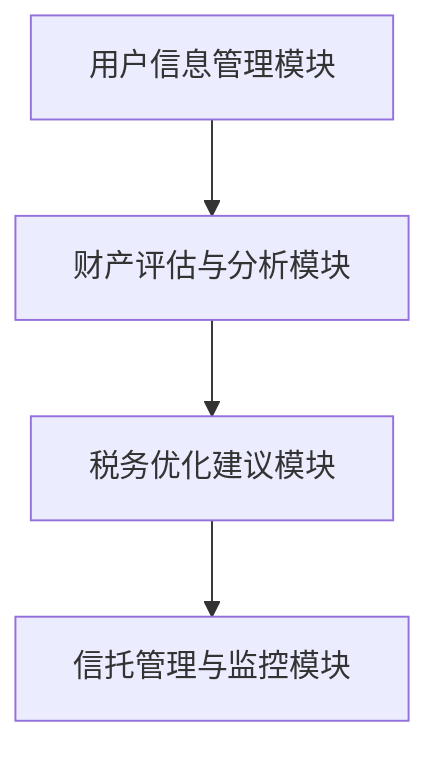
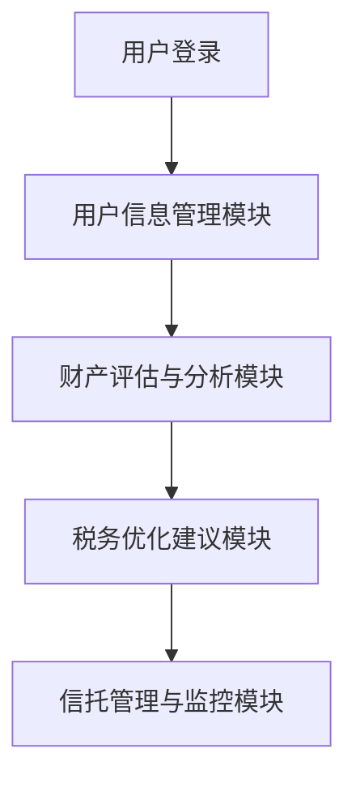

                 

# 智能家族信托规划与税务优化助手

## 关键词：
智能家族信托，税务优化，财富管理，人工智能，算法设计

## 摘要：
智能家族信托规划与税务优化助手是一本结合财富管理和人工智能技术的实用指南，旨在帮助读者通过智能技术优化家族信托的税务结构，实现财富的有效传承与管理。本书详细介绍了智能家族信托的核心概念、算法原理、系统架构设计以及项目实战，为财富管理专业人士和相关技术开发者提供了丰富的理论和实践指导。

---

## 第一部分: 智能家族信托规划与税务优化助手概述

### 第1章: 智能家族信托的背景与意义

#### 1.1 家族信托的基本概念
- **1.1.1 信托的基本定义与功能**
  - 信托的定义：信托是指委托人将财产委托给受托人，由受托人按照信托合同的约定，为受益人的利益或特定目的管理、处分财产的行为。
  - 信托的功能：资产保护、风险隔离、财富传承、税务优化。

- **1.1.2 家族信托的起源与发展**
  - 家族信托的起源：起源于英国的衡平法，经过数百年的发展，逐渐成为财富管理的重要工具。
  - 家族信托的发展：从传统的家族信托到现代的智能家族信托，技术的进步使其更加高效和智能化。

- **1.1.3 智能家族信托的定义与特点**
  - 定义：智能家族信托是指利用人工智能、大数据等技术，实现信托财产的智能化管理、风险控制和税务优化的新型信托模式。
  - 特点：智能化、个性化、高效性、透明性。

#### 1.2 智能家族信托的核心优势
- **1.2.1 传统家族信托的局限性**
  - 传统家族信托的管理效率低，依赖人工操作，成本高。
  - 传统家族信托的税务优化能力有限，难以应对复杂的税务法规变化。

- **1.2.2 智能家族信托的技术创新**
  - 利用人工智能技术实现信托财产的自动化管理。
  - 通过大数据分析优化税务结构，降低税务负担。

- **1.2.3 智能家族信托在财富传承中的作用**
  - 实现财富的长期传承，确保家族财富的安全性和稳定性。
  - 通过智能技术实现财富分配的公平性和透明性。

#### 1.3 智能家族信托与税务优化的关系
- **1.3.1 税务优化的基本原理**
  - 税务优化的目标：在合法合规的前提下，最大限度地减少税务负担，实现财富的保值和增值。
  - 税务优化的手段：通过合理的资产配置、税务规划和法律结构设计。

- **1.3.2 家族信托在税务规划中的应用**
  - 家族信托在遗产税、所得税、资本利得税等方面的优势。
  - 通过家族信托实现财富的隔离和保护，降低税务风险。

- **1.3.3 智能技术如何助力税务优化**
  - 利用人工智能技术实现税务数据的实时分析和预测。
  - 通过大数据技术优化资产配置，实现税务成本的最小化。

### 第2章: 智能家族信托的核心概念与联系

#### 2.1 智能家族信托的核心要素
- **2.1.1 信托财产的定义与分类**
  - 信托财产的定义：信托财产是指委托人转移给受托人的财产，包括动产、不动产、股权、知识产权等。
  - 信托财产的分类：根据财产类型、受益人类型、信托期限等进行分类。

- **2.1.2 受益人的权利与义务**
  - 受益人权利：受益人有权根据信托合同的规定享受信托利益。
  - 受益人义务：受益人应遵守信托合同的规定，不得滥用受益权。

- **2.1.3 信托管理人的角色与职责**
  - 信托管理人的角色：受托人是信托财产的实际管理者，负责按照信托合同的规定管理信托财产。
  - 信托管理人的职责：确保信托财产的安全和保值增值，按时分配信托利益，遵守相关法律法规。

#### 2.2 智能家族信托与税务优化的联系
- **2.2.1 税务优化的目标与原则**
  - 税务优化的目标：在合法合规的前提下，最大限度地减少税务负担，实现财富的保值和增值。
  - 税务优化的原则：合法合规、风险可控、利益最大化。

- **2.2.2 家族信托在税务规划中的应用**
  - 家族信托在遗产税规划中的应用：通过设立家族信托，将遗产税的税基降到最低。
  - 家族信托在所得税规划中的应用：通过合理分配信托收益，降低所得税负担。

- **2.2.3 智能技术在税务优化中的应用**
  - 利用人工智能技术实现税务数据的实时分析和预测。
  - 通过大数据技术优化资产配置，实现税务成本的最小化。

### 第3章: 智能家族信托规划的算法原理

#### 3.1 税务优化的数学模型
- **3.1.1 税后收益最大化模型**
  - 税后收益最大化模型的定义：通过优化信托财产的配置，实现税后收益的最大化。
  - 模型公式：$$\text{最大化收益} = \sum_{i=1}^{n} w_i \cdot r_i - \sum_{j=1}^{m} t_j \cdot a_j$$，其中\(w_i\)是资产\(i\)的权重，\(r_i\)是资产\(i\)的预期收益，\(t_j\)是税率，\(a_j\)是资产\(j\)的税务成本。

- **3.1.2 资产配置优化模型**
  - 资产配置优化模型的定义：根据信托财产的特性和税务优化的目标，合理配置资产，实现收益与风险的平衡。
  - 模型公式：$$\text{最小化风险} = \sum_{i=1}^{n} w_i^2 \cdot \sigma_i^2$$，其中\(w_i\)是资产\(i\)的权重，\(\sigma_i^2\)是资产\(i\)的风险方差。

- **3.1.3 风险最小化模型**
  - 风险最小化模型的定义：通过优化资产配置，实现风险的最小化。
  - 模型公式：$$\text{最小化风险} = \sum_{i=1}^{n} \sum_{j=1}^{n} w_i w_j \sigma_{ij}$$，其中\(\sigma_{ij}\)是资产\(i\)和资产\(j\)之间的协方差。

#### 3.2 智能家族信托规划算法的实现
- **3.2.1 数据预处理与特征提取**
  - 数据预处理：对信托财产数据进行清洗、归一化和特征提取。
  - 特征提取：提取与税务优化相关的特征，如资产类型、税率、收益预期等。

- **3.2.2 算法选择与参数调优**
  - 算法选择：选择适合的优化算法，如遗传算法、模拟退火算法、粒子群优化算法等。
  - 参数调优：通过实验调优算法参数，找到最优解。

- **3.2.3 算法实现与结果分析**
  - 算法实现：编写算法代码，实现信托财产的优化配置。
  - 结果分析：分析优化结果，验证算法的有效性。

### 第4章: 智能家族信托系统的架构设计

#### 4.1 系统功能模块设计
- **4.1.1 用户信息管理模块**
  - 用户信息管理：管理用户的基本信息，如用户ID、姓名、联系方式等。
  - 权限管理：根据用户角色分配不同的权限，如普通用户、管理员等。

- **4.1.2 财产评估与分析模块**
  - 财产评估：对信托财产进行评估，确定财产的价值和类型。
  - 数据分析：分析信托财产的数据，提取与税务优化相关的特征。

- **4.1.3 税务优化建议模块**
  - 税务优化建议：根据信托财产的评估结果，生成税务优化建议。
  - 优化方案生成：生成多个优化方案，供用户选择。

- **4.1.4 信托管理与监控模块**
  - 信托管理：对信托财产进行日常管理，如资产分配、收益分配等。
  - 监控与预警：实时监控信托财产的运行状态，发现异常及时预警。

#### 4.2 系统架构设计
- **4.2.1 分层架构设计**
  - 表现层：包括用户界面和交互设计。
  - 业务逻辑层：处理用户的请求，调用相应的服务。
  - 数据访问层：与数据库进行交互，存储和检索数据。

- **4.2.2 模块之间的交互关系**
  - 用户信息管理模块与系统其他模块的交互：用户信息管理模块为其他模块提供用户的基本信息和权限信息。
  - 财产评估与分析模块与其他模块的交互：资产评估与分析模块为税务优化建议模块提供数据支持。

- **4.2.3 系统接口设计**
  - 接口设计：定义系统各模块之间的接口，如RESTful API。
  - 接口实现：编写接口代码，实现模块之间的通信。

#### 4.3 系统架构图

### 第5章: 智能家族信托项目的实战

#### 5.1 环境安装与配置
- **5.1.1 开发环境的选择**
  - 开发工具：选择适合的开发工具，如PyCharm、IntelliJ IDEA等。
  - 开发语言：选择Python作为开发语言。
  - 开发框架：选择Django或Flask作为Web框架。

- **5.1.2 依赖库的安装**
  - 依赖库：安装必要的依赖库，如NumPy、Pandas、Scikit-learn、Plotly等。
  - 安装命令：使用pip安装依赖库，如`pip install numpy pandas scikit-learn plotly`。

- **5.1.3 数据库的搭建**
  - 数据库选择：选择MySQL或PostgreSQL作为数据库。
  - 数据库安装：安装数据库软件，配置数据库用户和密码。
  - 数据库连接：编写数据库连接代码，测试连接是否成功。

#### 5.2 核心代码实现
- **5.2.1 数据处理与清洗**
  - 数据清洗：删除重复数据，处理缺失值。
  - 数据转换：将数据转换为适合算法处理的格式。

- **5.2.2 算法实现**
  - 算法选择：选择适合的优化算法，如遗传算法。
  - 算法实现：编写算法代码，实现信托财产的优化配置。

- **5.2.3 系统功能实现**
  - 系统功能实现：实现系统各模块的功能，如用户信息管理、财产评估与分析、税务优化建议、信托管理与监控等。
  - 系统测试：进行系统测试，发现并修复系统中的缺陷。

#### 5.3 税务优化案例分析
- **5.3.1 案例背景**
  - 案例背景：介绍案例的基本情况，如家庭成员信息、信托财产情况等。
  - 案例目标：通过智能家族信托实现税务优化，降低税务负担。

- **5.3.2 数据分析与优化方案**
  - 数据分析：对信托财产进行分析，提取与税务优化相关的特征。
  - 优化方案：根据分析结果，生成税务优化方案，如调整资产配置、优化信托结构等。

- **5.3.3 方案实施与效果评估**
  - 方案实施：实施优化方案，调整信托财产的配置。
  - 效果评估：评估优化方案的效果，验证算法的有效性。

#### 5.4 项目小结
- **5.4.1 项目总结**
  - 项目总结：总结项目的实施过程，分析项目的优缺点。
  - 成果展示：展示项目的成果，如优化后的信托结构、降低的税务负担等。

- **5.4.2 未来展望**
  - 未来展望：展望智能家族信托的发展方向，如技术的进一步优化、应用场景的拓展等。

## 第二部分: 智能家族信托系统的技术实现

### 第6章: 智能家族信托系统的功能设计

#### 6.1 系统功能模块设计
- **6.1.1 用户信息管理模块**
  - 用户信息管理：管理用户的基本信息，如用户ID、姓名、联系方式等。
  - 权限管理：根据用户角色分配不同的权限，如普通用户、管理员等。

- **6.1.2 财产评估与分析模块**
  - 财产评估：对信托财产进行评估，确定财产的价值和类型。
  - 数据分析：分析信托财产的数据，提取与税务优化相关的特征。

- **6.1.3 税务优化建议模块**
  - 税务优化建议：根据信托财产的评估结果，生成税务优化建议。
  - 优化方案生成：生成多个优化方案，供用户选择。

- **6.1.4 信托管理与监控模块**
  - 信托管理：对信托财产进行日常管理，如资产分配、收益分配等。
  - 监控与预警：实时监控信托财产的运行状态，发现异常及时预警。

#### 6.2 系统功能流程图

### 第7章: 智能家族信托系统的架构设计

#### 7.1 系统架构设计
- **7.1.1 分层架构设计**
  - 表现层：包括用户界面和交互设计。
  - 业务逻辑层：处理用户的请求，调用相应的服务。
  - 数据访问层：与数据库进行交互，存储和检索数据。

- **7.1.2 模块之间的交互关系**
  - 用户信息管理模块与系统其他模块的交互：用户信息管理模块为其他模块提供用户的基本信息和权限信息。
  - 财产评估与分析模块与其他模块的交互：资产评估与分析模块为税务优化建议模块提供数据支持。

- **7.1.3 系统架构图**

### 第8章: 智能家族信托系统的接口设计

#### 8.1 系统接口设计
- **8.1.1 接口定义**
  - 接口定义：定义系统各模块之间的接口，如RESTful API。
  - 接口实现：编写接口代码，实现模块之间的通信。

- **8.1.2 接口实现**
  - 接口实现：使用Python编写接口代码，实现模块之间的通信。
  - 接口测试：测试接口的正确性，确保模块之间的通信正常。

## 第三部分: 项目实战与优化

### 第9章: 智能家族信托项目的实战

#### 9.1 环境安装与配置
- **9.1.1 开发环境的选择**
  - 开发工具：选择适合的开发工具，如PyCharm、IntelliJ IDEA等。
  - 开发语言：选择Python作为开发语言。
  - 开发框架：选择Django或Flask作为Web框架。

- **9.1.2 依赖库的安装**
  - 依赖库：安装必要的依赖库，如NumPy、Pandas、Scikit-learn、Plotly等。
  - 安装命令：使用pip安装依赖库，如`pip install numpy pandas scikit-learn plotly`。

- **9.1.3 数据库的搭建**
  - 数据库选择：选择MySQL或PostgreSQL作为数据库。
  - 数据库安装：安装数据库软件，配置数据库用户和密码。
  - 数据库连接：编写数据库连接代码，测试连接是否成功。

#### 9.2 核心代码实现
- **9.2.1 数据处理与清洗**
  - 数据清洗：删除重复数据，处理缺失值。
  - 数据转换：将数据转换为适合算法处理的格式。

- **9.2.2 算法实现**
  - 算法选择：选择适合的优化算法，如遗传算法。
  - 算法实现：编写算法代码，实现信托财产的优化配置。

- **9.2.3 系统功能实现**
  - 系统功能实现：实现系统各模块的功能，如用户信息管理、财产评估与分析、税务优化建议、信托管理与监控等。
  - 系统测试：进行系统测试，发现并修复系统中的缺陷。

### 第10章: 智能家族信托项目的优化与总结

#### 10.1 项目优化
- **10.1.1 系统性能优化**
  - 系统性能优化：通过优化算法、减少不必要的计算、使用缓存技术等，提高系统的运行效率。
  - 系统优化方法：如使用并行计算、分布式计算等技术，提高系统的处理能力。

- **10.1.2 系统功能优化**
  - 系统功能优化：根据用户反馈，优化系统功能，提高用户体验。
  - 功能优化方法：如增加用户友好的界面、优化系统响应速度等。

#### 10.2 项目总结
- **10.2.1 项目总结**
  - 项目总结：总结项目的实施过程，分析项目的优缺点。
  - 成果展示：展示项目的成果，如优化后的信托结构、降低的税务负担等。

- **10.2.2 未来展望**
  - 未来展望：展望智能家族信托的发展方向，如技术的进一步优化、应用场景的拓展等。

## 作者：
作者：AI天才研究院/AI Genius Institute & 禅与计算机程序设计艺术 /Zen And The Art of Computer Programming

