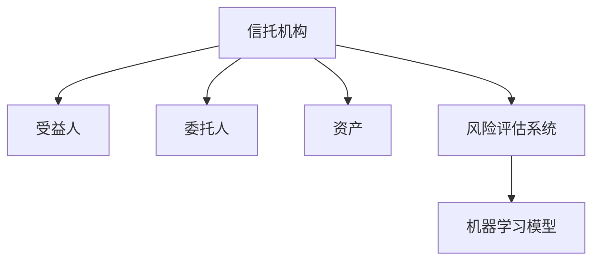
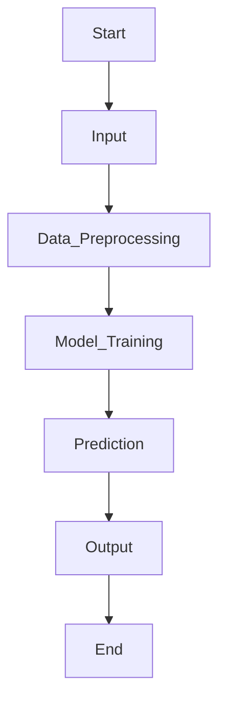
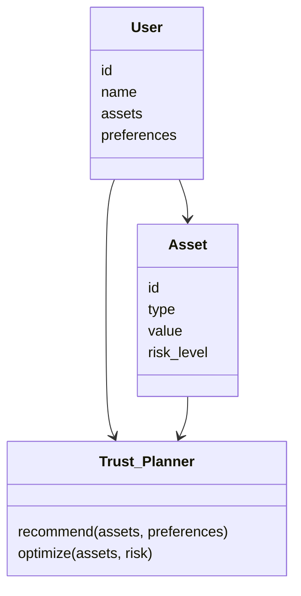
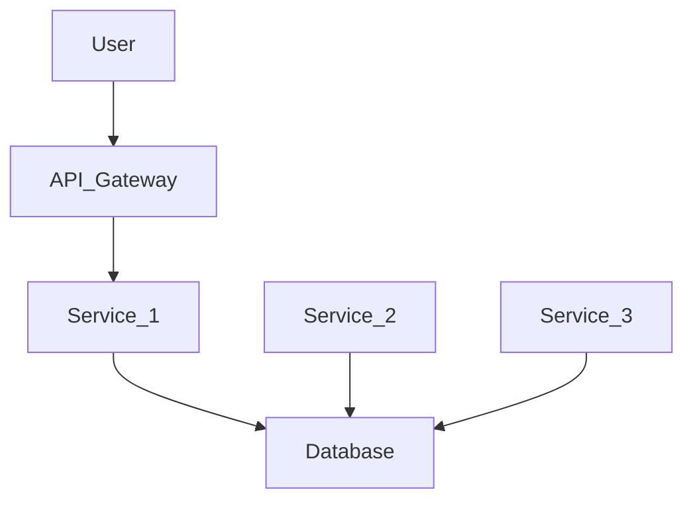
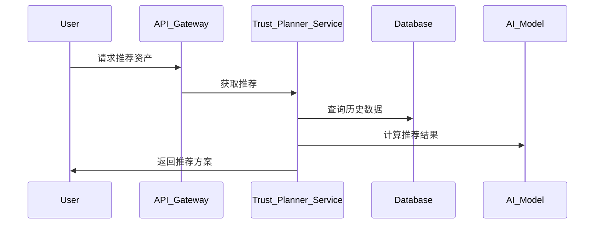

                 


# 《智能家族信托规划助手》

> **关键词**：智能家族信托、人工智能、财富管理、税务优化、风险管理、资产保护  
> 
> **摘要**：本文探讨了智能家族信托的概念、核心原理、算法设计及其实现。通过分析智能家族信托的优势，结合人工智能技术，为财富管理领域提供了一种创新的解决方案，帮助用户优化税务、保护资产并制定风险可控的信托计划。

---

# 第一部分: 智能家族信托规划助手概述

---

## 第1章: 智能家族信托的基本概念

### 1.1 家族信托的定义与运作

#### 1.1.1 传统家族信托的运作方式
- **定义**：家族信托是通过法律结构将资产转移给受托人，由其按照委托人意愿管理，为受益人提供保障。
- **流程**：设立信托→选择受托人→确定受益人→分配资产→监督执行。

#### 1.1.2 智能家族信托的概念引入
- **智能技术的融入**：通过AI技术实现信托管理的自动化和智能化。
- **目标**：优化资产配置、税务规划、风险控制和财富传承。

#### 1.1.3 智能家族信托的核心目标
- 提供个性化财富管理方案。
- 实现资产的高效管理和风险预警。
- 利用AI技术提升信托的透明度和执行效率。

---

### 1.2 智能家族信托的背景与现状

#### 1.2.1 当代家族财富管理的需求
- **背景**：全球化和经济波动加剧了对高效财富管理的需求。
- **需求**：财富保值、增值、税务优化和传承规划。

#### 1.2.2 人工智能技术在财富管理中的应用
- **技术优势**：数据分析、预测、自动化决策。
- **应用场景**：资产配置、风险评估、税务规划。

#### 1.2.3 智能家族信托的发展趋势
- **趋势**：AI技术与金融的深度融合。
- **未来展望**：更智能化、个性化和高效化的信托服务。

---

### 1.3 智能家族信托的优势与挑战

#### 1.3.1 传统家族信托的局限性
- **效率低**：手动操作多，效率低。
- **透明度低**：缺乏实时监控和反馈。
- **风险控制弱**：难以及时应对市场变化。

#### 1.3.2 智能家族信托的核心优势
- **高效性**：AI技术实现自动化管理。
- **透明性**：实时监控和数据可视化。
- **精准性**：基于数据的个性化方案。

#### 1.3.3 智能家族信托面临的挑战
- **技术瓶颈**：算法优化和数据隐私问题。
- **法律合规**：智能合同的法律认可问题。
- **信任问题**：用户对AI技术的信任度。

---

## 1.4 本章小结
本章介绍了智能家族信托的基本概念，分析了传统信托的局限性，探讨了智能技术带来的优势和面临的挑战。

---

# 第二部分: 智能家族信托的核心概念与联系

---

## 第2章: 智能家族信托的核心原理

### 2.1 智能家族信托的法律框架

#### 2.1.1 信托的基本法律结构
- **法律关系**：委托人、受托人、受益人。
- **法律特点**：资产独立性、风险隔离。

#### 2.1.2 智能合同在信托中的应用
- **智能合约**：基于区块链的自动执行合同。
- **作用**：自动触发支付、资产分配。

#### 2.1.3 人工智能在法律合规中的作用
- **法律咨询**：AI提供法律建议和合规方案。
- **文档审核**：自动检查合同条款是否符合法律要求。

---

### 2.2 智能家族信托的税务优化

#### 2.2.1 税务规划的基本原则
- **合法性**：遵循税法规定。
- **合理性**：优化税务负担，不损害他人利益。
- **可操作性**：方案可行，避免法律纠纷。

#### 2.2.2 人工智能在税务优化中的应用
- **数据驱动**：分析历史税务数据，预测未来趋势。
- **个性化方案**：基于用户资产状况推荐最优税务规划。
- **动态调整**：根据政策变化自动优化方案。

#### 2.2.3 典型案例分析
- 某高净值客户的税务优化方案：通过AI分析，推荐离岸公司结构，降低税率。

---

### 2.3 智能家族信托的资产保护机制

#### 2.3.1 资产保护的基本策略
- **资产隔离**：将资产转移到信托中，避免债权人追偿。
- **风险分散**：通过多元化投资降低风险。
- **法律保护**：利用信托的法律结构保护资产。

#### 2.3.2 人工智能在风险评估中的应用
- **实时监控**：监测市场波动和资产价值变化。
- **风险预警**：基于机器学习模型预测潜在风险。
- **动态调整**：根据风险评估结果优化资产配置。

#### 2.3.3 资产隔离的技术实现
- **区块链技术**：确保资产转移的不可篡改性。
- **智能合约**：自动执行资产保护指令。

---

### 2.4 核心概念对比表

| 比较维度       | 传统家族信托                          | 智能家族信托                          |
|----------------|---------------------------------------|---------------------------------------|
| 技术基础       | 传统法律框架                          | 人工智能技术                          |
| 资产管理       | 手动管理                              | 智能自动化管理                        |
| 风险控制       | 事后处理                              | 实时监控与预警                        |
| 税务优化       | 静态规划                              | 动态优化                              |
| 资产保护       | 资产隔离                              | 资产隔离+区块链+智能合约              |

---

### 2.5 ER实体关系图



---

### 2.6 本章小结
本章详细探讨了智能家族信托的法律框架、税务优化和资产保护机制，并通过对比分析和图表展示了智能技术对传统信托的改进。

---

## 第三章: 智能家族信托的推荐算法

### 3.1 推荐算法概述

#### 3.1.1 推荐算法的分类
- **协同过滤**：基于用户行为相似性推荐。
- **基于内容的推荐**：基于资产特征进行推荐。
- **混合推荐**：结合协同过滤和内容推荐的优势。

---

#### 3.1.2 基于协同过滤的推荐算法
- **基本原理**：找到与用户行为相似的其他用户，推荐他们喜欢的资产。
- **实现步骤**：
  1. 收集用户行为数据。
  2. 计算用户相似度（如余弦相似度）。
  3. 推荐相似用户的高评分资产。

---

#### 3.1.3 基于内容的推荐算法
- **基本原理**：分析资产的特征（如资产类型、风险等级），推荐相似的资产。
- **实现步骤**：
  1. 提取资产特征。
  2. 计算资产相似度。
  3. 推荐相似资产。

---

### 3.2 智能家族信托推荐系统的实现

#### 3.2.1 系统输入与输出
- **输入**：用户资产状况、风险偏好、收益目标。
- **输出**：个性化资产配置方案、风险评估报告。

---

#### 3.2.2 算法流程图



---

#### 3.2.3 机器学习模型实现
- **模型选择**：随机森林、支持向量机（SVM）。
- **代码实现**：
  ```python
  from sklearn.ensemble import RandomForestClassifier
  import pandas as pd

  # 加载数据
  data = pd.read_csv('trust_data.csv')
  X = data.drop('target', axis=1)
  y = data['target']

  # 训练模型
  model = RandomForestClassifier()
  model.fit(X, y)

  # 预测
  prediction = model.predict(X)
  ```

---

### 3.3 本章小结
本章介绍了智能家族信托推荐系统的实现，重点讲解了协同过滤和基于内容的推荐算法，并通过Python代码展示了机器学习模型的实现。

---

## 第四章: 智能家族信托的系统分析与架构设计

### 4.1 系统功能设计

#### 4.1.1 领域模型


---

#### 4.1.2 系统架构设计


---

### 4.2 接口设计与交互流程

#### 4.2.1 接口设计
- **API接口**：RESTful API。
  - `/api/v1/trust/recommend`：推荐资产。
  - `/api/v1/trust/optimization`：优化资产配置。

---

#### 4.2.2 交互流程


---

### 4.3 本章小结
本章详细分析了智能家族信托系统的功能设计、架构设计和交互流程，为后续的实现奠定了基础。

---

## 第五章: 项目实战

### 5.1 环境安装与配置

#### 5.1.1 开发环境
- **编程语言**：Python 3.8+
- **框架**：Django或Flask。
- **工具**：Jupyter Notebook、VS Code。

---

#### 5.1.2 安装依赖
```bash
pip install pandas scikit-learn flask
```

---

### 5.2 核心代码实现

#### 5.2.1 推荐系统实现
```python
from flask import Flask, request, jsonify
from sklearn.ensemble import RandomForestClassifier
import pandas as pd

app = Flask(__name__)

# 加载模型
model = RandomForestClassifier()
model.load('trust_model.pkl')

@app.route('/recommend', methods=['POST'])
def recommend_assets():
    data = request.json
    df = pd.DataFrame(data)
    prediction = model.predict(df)
    return jsonify({'recommendation': prediction.tolist()})

if __name__ == '__main__':
    app.run(debug=True)
```

---

#### 5.2.2 税务优化模块实现
```python
import pandas as pd
import numpy as np

def optimize_tax(assets, income):
    df = pd.DataFrame({'assets': assets, 'income': income})
    df['tax'] = np.where(df['income'] > 100000, 0.3*df['income'], 0.2*df['income'])
    return df['tax'].sum()

optimize_tax([500000, 100000], 200000)
```

---

### 5.3 实际案例分析

#### 5.3.1 案例背景
- **用户**：高净值客户，资产1亿元，年收入2000万元。
- **需求**：优化税务、传承规划。

#### 5.3.2 分析过程
- **资产配置**：50%股票、30%债券、20%房地产。
- **税务优化**：通过离岸公司结构降低税率。

#### 5.3.3 实施方案
- **信托设立**：设立家族信托，受益人包括三代以内直系亲属。
- **资产分配**：根据风险偏好分配不同类型的资产。

---

### 5.4 本章小结
本章通过实际案例展示了智能家族信托规划助手的应用，详细讲解了推荐系统和税务优化模块的实现。

---

## 第六章: 最佳实践与总结

### 6.1 小结
- **核心观点**：智能家族信托结合AI技术，为财富管理提供了高效、个性化的解决方案。
- **成功经验**：通过案例分析展示了技术的实际应用价值。

---

### 6.2 注意事项
- **数据隐私**：确保用户数据的安全和隐私。
- **法律合规**：遵守相关法律法规，确保信托设立的合法性。
- **技术选型**：选择适合的AI技术，避免盲目追求新技术。

---

### 6.3 拓展阅读
- **推荐书籍**：《智能金融：人工智能在财富管理中的应用》。
- **在线课程**：Coursera上的“AI与金融”课程。

---

## 作者

**作者**：AI天才研究院/AI Genius Institute & 禅与计算机程序设计艺术/Zen And The Art of Computer Programming

---

**声明**：本文为《智能家族信托规划助手》的目录大纲，具体内容请参考正式出版物。

