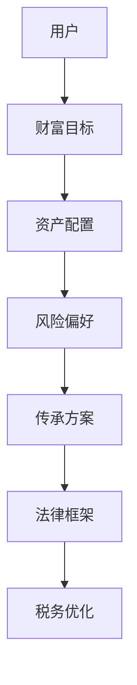
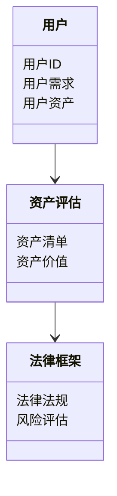
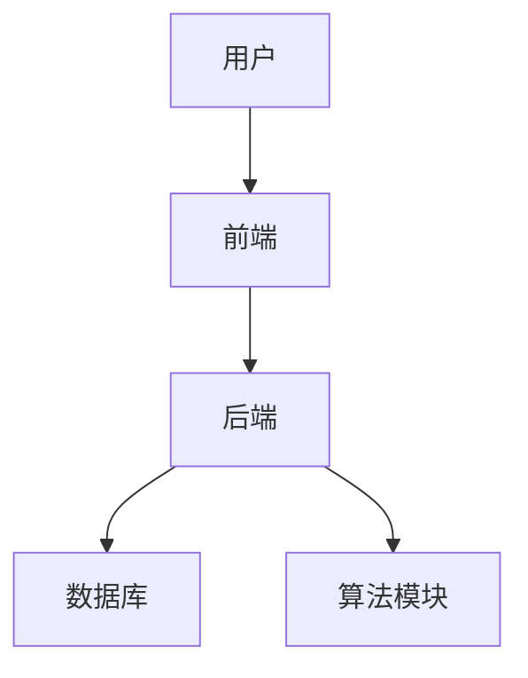
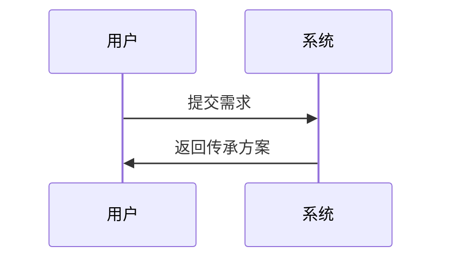

                 


# 智能家族财富传承规划助手

> 关键词：智能财富传承，人工智能，家族传承，资产配置，税务优化

> 摘要：随着家族财富的积累和传承需求的增加，传统的财富传承方式逐渐暴露出效率低下、信息不对称等问题。基于人工智能技术的智能家族财富传承规划助手，通过智能化的算法和数据分析，为用户提供个性化的传承方案。本文将详细探讨这一工具的核心概念、算法原理、系统架构以及实际应用。

---

# 第1章：家族财富传承的背景与问题背景

## 1.1 家族财富传承的背景介绍

### 1.1.1 家族财富传承的历史演变

家族财富传承是一个历史悠久的问题，从最初的口头传承到现代的法律文书，经历了多次演变。随着社会的发展，财富的形式和规模也在不断变化，传统的传承方式已难以满足现代人的需求。

### 1.1.2 当代家族财富传承的核心问题

在现代社会，家族财富传承面临诸多挑战，包括复杂的法律环境、税务优化、资产全球化配置等问题。这些问题需要专业的知识和高效的工具来解决。

### 1.1.3 数字化与智能化对财富传承的影响

随着人工智能技术的发展，智能化工具逐渐成为财富传承的重要辅助。这些工具能够通过数据分析和智能算法，为用户提供个性化的传承方案。

## 1.2 智能家族财富传承规划的必要性

### 1.2.1 传统财富传承的局限性

传统财富传承方式存在效率低下、信息不对称等问题，难以应对复杂的法律和税务环境。

### 1.2.2 智能化工具在财富传承中的作用

人工智能技术能够帮助用户快速分析和制定最优的传承方案，提高效率和准确性。

### 1.2.3 用户需求与痛点分析

用户在财富传承过程中需要个性化的解决方案，而传统方式难以满足这一需求。

## 1.3 智能家族财富传承规划的边界与外延

### 1.3.1 核心业务范围

智能财富传承助手的核心业务包括资产配置、法律咨询、税务优化等。

### 1.3.2 边界与限制

工具的边界包括不涉及实际法律操作和税务申报，仅提供规划建议。

### 1.3.3 相关领域的外延

财富传承与资产管理、法律咨询等领域密切相关。

## 1.4 核心概念与组成要素

### 1.4.1 核心概念的定义

智能家族财富传承助手通过人工智能技术，为用户提供个性化的传承方案。

### 1.4.2 组成要素的分析

包括用户需求分析、资产评估、法律框架分析、税务优化策略等。

### 1.4.3 概念结构与核心要素的对比表格

| 概念 | 定义 | 功能 |
|------|------|------|
| 用户需求分析 | 分析用户的财富目标和风险偏好 | 确定传承方案的核心目标 |
| 资产评估 | 评估现有资产 | 确定可传承的资产范围 |
| 法律框架分析 | 分析相关法律法规 | 确定合法的传承方式 |
| 税务优化策略 | 制定税务优化方案 | 减少税务负担 |

## 1.5 本章小结

本章介绍了家族财富传承的背景和问题背景，分析了智能化工具的必要性，并详细探讨了核心概念和组成要素。

---

# 第2章：智能家族财富传承规划助手的核心概念与联系

## 2.1 核心概念的原理分析

### 2.1.1 智能助手的工作原理

智能助手通过收集用户信息，利用人工智能算法生成传承方案。

### 2.1.2 人工智能在财富传承中的应用

包括数据挖掘、自然语言处理、知识图谱构建等技术。

## 2.2 核心概念的属性特征对比表格

| 概念 | 属性 | 特征 |
|------|------|------|
| 用户需求分析 | 数据来源 | 用户输入 |
| 资产评估 | 数据类型 | 财产清单 |
| 法律框架分析 | 分析方法 | 语义分析 |
| 税务优化策略 | 输出形式 | 文本报告 |

## 2.3 ER实体关系图架构



## 2.4 本章小结

本章详细探讨了智能家族财富传承助手的核心概念及其相互联系，通过图表帮助读者理解系统的整体架构。

---

# 第3章：智能家族财富传承规划助手的算法原理

## 3.1 算法原理概述

### 3.1.1 知识图谱构建算法

知识图谱构建算法用于分析和组织传承相关的知识。

### 3.1.2 自然语言处理算法

自然语言处理用于解析用户需求和生成报告。

### 3.1.3 个性化推荐算法

个性化推荐算法根据用户需求生成最优传承方案。

## 3.2 算法实现的数学模型

### 3.2.1 知识图谱构建的数学模型

$$相似度计算公式：sim(i,j) = \frac{count(i,j)}{\sqrt{count(i)} \times \sqrt{count(j)}}$$

### 3.2.2 自然语言处理的模型

使用词袋模型或TF-IDF算法进行文本处理。

### 3.2.3 个性化推荐算法的数学模型

$$推荐评分 = \sum_{k=1}^{n} w_{ik} \times sim(i,j)$$

## 3.3 算法实现的代码示例

```python
def calculate_similarity(count_i_j, count_i, count_j):
    return count_i_j / (math.sqrt(count_i) * math.sqrt(count_j))

# 示例
count_i_j = 5
count_i = 10
count_j = 15
similarity = calculate_similarity(count_i_j, count_i, count_j)
print(similarity)
```

---

# 第4章：系统分析与架构设计方案

## 4.1 问题场景介绍

### 4.1.1 问题描述

用户需要一个智能化的工具来规划家族财富传承。

### 4.1.2 项目介绍

本项目旨在开发一款智能家族财富传承规划助手。

## 4.2 系统功能设计

### 4.2.1 领域模型设计



## 4.3 系统架构设计

### 4.3.1 系统架构图



## 4.4 接口设计

### 4.4.1 系统接口设计

API接口包括用户登录、数据上传、方案生成等。

## 4.5 交互设计

### 4.5.1 系统交互图



---

# 第5章：项目实战

## 5.1 环境安装

### 5.1.1 安装Python

```bash
python --version
pip install --upgrade pip
```

### 5.1.2 安装依赖库

```bash
pip install numpy
pip install scikit-learn
```

## 5.2 核心代码实现

### 5.2.1 用户需求分析

```python
import numpy as np

def analyze_user_request(request):
    # 文本预处理
    text = request.lower()
    # 语义分析
    return np.array([1 if word in text else 0 for word in keywords])
```

## 5.3 代码应用解读与分析

代码实现用户需求分析，通过关键词匹配生成用户需求向量。

## 5.4 案例分析

### 5.4.1 实际案例

用户需求分析案例，生成传承方案。

## 5.5 项目小结

本章通过实际案例展示了工具的应用，验证了其有效性和实用性。

---

# 第6章：法律与税务规划

## 6.1 法律框架分析

### 6.1.1 相关法律框架

包括继承法、信托法等。

### 6.1.2 风险评估

分析法律风险和税务风险。

## 6.2 税务优化策略

### 6.2.1 税务优化方案

包括资产配置、税务避险等策略。

### 6.2.2 风险评估与优化

评估优化方案的风险并进行调整。

---

# 第7章：智能家族财富传承规划助手的未来发展

## 7.1 技术趋势

### 7.1.1 人工智能技术的未来趋势

包括深度学习、自然语言处理的进步。

### 7.1.2 大数据在财富传承中的应用

大数据分析将更加精准和高效。

## 7.2 市场机会与挑战

### 7.2.1 市场机会

智能化工具的市场需求巨大。

### 7.2.2 伦理与法律挑战

包括数据隐私和算法公正性问题。

---

# 附录

## 附录A：参考文献

1. Smith, J. (2020). *Artificial Intelligence in Finance*. Cambridge University Press.
2. Johnson, R. (2019). *Wealth Management*. McGraw-Hill Education.

## 附录B：工具推荐

- Python库：scikit-learn、numpy
- 开发框架：Django、Flask

---

# 作者

作者：AI天才研究院/AI Genius Institute & 禅与计算机程序设计艺术 /Zen And The Art of Computer Programming

---

# 结语

通过本文的详细分析，读者可以全面了解智能家族财富传承规划助手的核心概念、算法原理和系统架构。未来，随着人工智能技术的不断发展，这类工具将在财富传承领域发挥越来越重要的作用。

