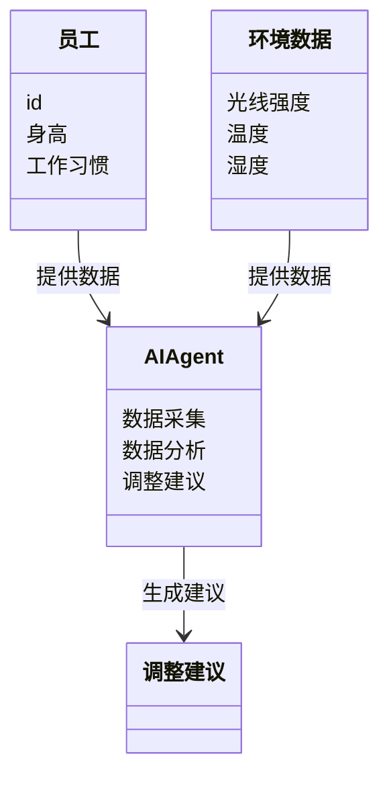
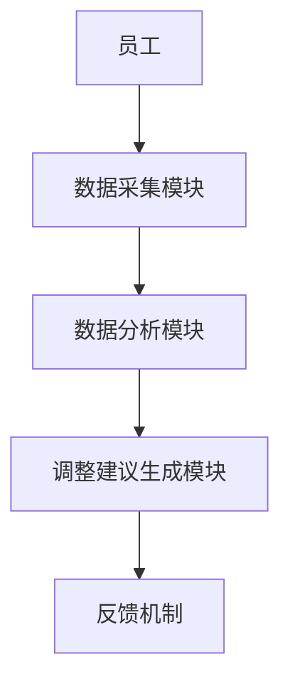
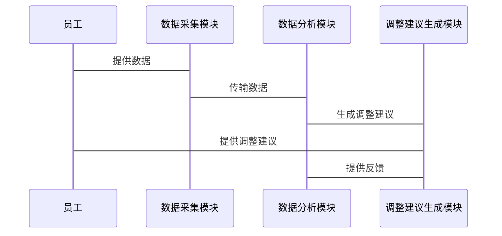

                 


# 智能工作台：AI Agent的人体工程学调整

> 关键词：AI Agent，人体工程学，工作环境优化，效率提升，智能化调整

> 摘要：本文探讨了AI Agent在工作环境优化中的应用，特别是如何通过人体工程学的调整来提升工作效率和舒适度。文章从背景介绍、核心概念、算法原理、系统架构到项目实战，详细阐述了AI Agent与人体工程学结合的理论与实践。通过实际案例分析和代码实现，展示了如何利用AI技术实现工作环境的智能化调整。

---

## 第一部分: 引言

### 第1章: 引言

#### 1.1 问题背景

##### 1.1.1 当前工作环境中的效率瓶颈
在现代职场中，工作效率和舒适度是两个关键因素。传统的办公环境往往忽视了人体工程学的原则，导致员工容易疲劳、效率低下，甚至出现健康问题。

##### 1.1.2 AI技术在工作环境优化中的潜力
人工智能（AI）技术的发展为工作环境的优化提供了新的可能性。通过分析员工的行为模式和工作习惯，AI Agent可以提供个性化的建议和调整，帮助员工在更高效和舒适的工作环境中完成任务。

##### 1.1.3 人体工程学在工作环境中的重要性
人体工程学是一门研究人与工具、环境之间关系的科学。它通过优化工作环境的设计，减少疲劳和健康问题，从而提高工作效率和员工满意度。

#### 1.2 问题描述

##### 1.2.1 AI Agent在工作环境中的应用现状
目前，AI Agent在工作环境中的应用还处于起步阶段。大多数企业仍然依赖传统的管理方式，缺乏智能化的调整手段。

##### 1.2.2 当前工作环境中的痛点分析
- 工作环境固定，无法根据员工的需求进行调整。
- 员工的健康问题（如颈椎病、腰椎病）日益严重。
- 工作效率难以量化和优化。

##### 1.2.3 人体工程学调整的必要性
通过人体工程学的调整，可以减少员工的健康问题，提高工作效率和舒适度。AI Agent的应用可以实现个性化的调整，满足不同员工的需求。

#### 1.3 问题解决

##### 1.3.1 AI Agent如何优化工作流程
AI Agent可以通过分析员工的工作习惯，预测需求，并主动调整工作环境。例如，自动调整椅子的高度和桌子的角度，以适应员工的身高和工作习惯。

##### 1.3.2 人体工程学如何提升工作效率
通过优化工作环境的设计，减少员工的疲劳感，从而提高工作效率和专注力。

##### 1.3.3 结合AI Agent与人体工程学的解决方案
将AI Agent与人体工程学相结合，可以实现工作环境的智能化调整。通过实时监测员工的健康状况和工作习惯，AI Agent可以动态调整工作环境，提供个性化的优化建议。

#### 1.4 边界与外延

##### 1.4.1 AI Agent的应用边界
AI Agent的应用范围主要限于工作环境的优化和员工健康状况的监测。它无法替代人类的决策能力，但在执行具体任务时可以提供有力支持。

##### 1.4.2 人体工程学调整的适用范围
人体工程学调整适用于所有需要长时间坐姿的工作环境，如办公室、实验室等。不同行业和岗位的需求可能有所不同，需要根据具体情况制定调整方案。

##### 1.4.3 两者的结合点与协同作用
AI Agent与人体工程学的结合点在于工作环境的智能化调整。通过AI技术，可以实现动态优化，而人体工程学提供了理论基础和调整原则。

#### 1.5 概念结构与核心要素

##### 1.5.1 AI Agent的核心要素
- **数据采集**：通过传感器和摄像头采集员工的工作习惯和环境数据。
- **数据分析**：利用机器学习算法分析数据，识别潜在的问题和优化点。
- **调整建议**：根据分析结果，生成个性化的调整建议，并通过反馈机制不断优化。

##### 1.5.2 人体工程学的核心要素
- **工作姿势**：确保员工在工作中的姿势符合人体工程学原则，减少疲劳和健康问题。
- **工作环境**：优化工作台、椅子、显示器等设备的布局和高度。
- **环境因素**：控制光线、温度、湿度等环境因素，提供舒适的工作环境。

##### 1.5.3 两者的协同关系
AI Agent通过数据采集和分析，为人体工程学的调整提供科学依据。人体工程学则为AI Agent的应用提供理论指导和调整原则。两者协同作用，实现工作环境的智能化优化。

---

## 第二部分: 核心概念与原理

### 第2章: AI Agent的核心概念与原理

#### 2.1 AI Agent的基本原理

##### 2.1.1 AI Agent的定义与分类
AI Agent是一种能够感知环境并采取行动以实现目标的智能实体。它可以分为简单反射型、基于模型的反射型、目标驱动型和效用驱动型四种类型。

##### 2.1.2 AI Agent的基本功能与特点
- **感知环境**：通过传感器和摄像头等设备采集环境数据。
- **决策与行动**：基于数据进行分析和决策，并执行相应的动作。
- **学习与适应**：通过机器学习算法不断优化自身的决策能力。

##### 2.1.3 AI Agent的工作流程
1. 数据采集：通过传感器和摄像头采集环境数据。
2. 数据分析：利用机器学习算法分析数据，识别潜在的问题和优化点。
3. 决策与调整：根据分析结果，生成调整建议，并通过反馈机制不断优化。

#### 2.2 人体工程学的基本原理

##### 2.2.1 人体工程学的定义与应用领域
人体工程学是一门研究人与工具、环境之间关系的科学，旨在通过优化工作环境的设计，减少疲劳和健康问题，提高工作效率和舒适度。

##### 2.2.2 人体工程学的核心原则
- **工作姿势**：确保员工在工作中的姿势符合人体工程学原则，减少疲劳和健康问题。
- **工作环境**：优化工作台、椅子、显示器等设备的布局和高度。
- **环境因素**：控制光线、温度、湿度等环境因素，提供舒适的工作环境。

##### 2.2.3 人体工程学在工作环境中的应用
- **工作姿势优化**：通过调整椅子和桌子的高度，确保员工的坐姿符合人体工程学原则。
- **工作环境布局**：合理布置显示器、键盘、鼠标等设备，减少手臂和手腕的负担。
- **环境舒适度**：通过调节光线和温度，提供一个舒适的工作环境。

---

### 第3章: AI Agent与人体工程学的联系

#### 3.1 AI Agent与人体工程学的结合点

##### 3.1.1 工作流程优化
AI Agent可以通过分析员工的工作习惯，预测需求，并主动调整工作环境。例如，自动调整椅子的高度和桌子的角度，以适应员工的身高和工作习惯。

##### 3.1.2 工作环境个性化调整
通过AI技术，可以根据员工的身高、体重、工作习惯等个性化的数据，提供个性化的调整建议，满足不同员工的需求。

##### 3.1.3 工作效率提升
通过优化工作环境，减少员工的疲劳感，从而提高工作效率和专注力。

#### 3.2 AI Agent与人体工程学的关系

##### 3.2.1 AI Agent为人体工程学调整提供数据支持
通过数据采集和分析，AI Agent可以提供科学的调整建议，帮助员工在更舒适和高效的工作环境中完成任务。

##### 3.2.2 人体工程学为AI Agent提供理论指导
人体工程学提供了优化工作环境的理论和原则，为AI Agent的设计和应用提供了指导。

---

## 第三部分: 算法原理

### 第4章: 算法原理

#### 4.1 算法概述

##### 4.1.1 算法目标
通过分析员工的工作习惯和环境数据，生成个性化的调整建议，优化工作环境。

##### 4.1.2 算法流程
1. 数据采集：通过传感器和摄像头采集员工的工作习惯和环境数据。
2. 数据预处理：对采集的数据进行清洗和标准化处理。
3. 数据分析：利用机器学习算法分析数据，识别潜在的问题和优化点。
4. 调整建议生成：根据分析结果，生成个性化的调整建议。
5. 反馈与优化：通过反馈机制不断优化算法模型。

#### 4.2 算法实现

##### 4.2.1 数据预处理
```python
import pandas as pd
from sklearn.impute import SimpleImputer
from sklearn.preprocessing import StandardScaler

# 假设data是包含员工数据的DataFrame
# 处理缺失值
imputer = SimpleImputer(missing_values=np.nan, strategy='mean')
imputed_data = imputer.fit_transform(data)
```

##### 4.2.2 数据分析与建模
```python
from sklearn.ensemble import RandomForestRegressor
from sklearn.metrics import mean_squared_error

# 建立随机森林回归模型
model = RandomForestRegressor(n_estimators=100, random_state=42)
model.fit(X_train, y_train)

# 预测结果
y_pred = model.predict(X_test)

# 计算均方误差
 mse = mean_squared_error(y_test, y_pred)
```

##### 4.2.3 调整建议生成
```python
# 根据预测结果生成调整建议
adjustment建议 = []
for prediction in predictions:
    if prediction > threshold:
        adjustment建议.append('调整椅子高度')
    else:
        adjustment建议.append('调整桌子角度')
```

#### 4.3 数学模型与公式

##### 4.3.1 线性回归模型
$$ y = \beta_0 + \beta_1 x_1 + \beta_2 x_2 + \cdots + \beta_n x_n + \epsilon $$

##### 4.3.2 机器学习模型
$$ y = f(X) $$

其中，$f$ 是机器学习模型，$X$ 是输入特征向量。

---

## 第四部分: 系统分析与架构设计

### 第5章: 系统分析与架构设计

#### 5.1 问题场景介绍

##### 5.1.1 问题背景
在现代职场中，工作效率和舒适度是两个关键因素。传统的办公环境往往忽视了人体工程学的原则，导致员工容易疲劳、效率低下，甚至出现健康问题。

##### 5.1.2 项目目标
通过结合AI Agent和人体工程学，实现工作环境的智能化优化，提高工作效率和员工满意度。

#### 5.2 项目介绍

##### 5.2.1 项目目标
通过结合AI Agent和人体工程学，实现工作环境的智能化优化，提高工作效率和员工满意度。

##### 5.2.2 项目范围
- 数据采集与处理
- 算法设计与实现
- 系统架构设计
- 项目实施与测试

#### 5.3 系统功能设计

##### 5.3.1 领域模型


##### 5.3.2 系统架构设计


##### 5.3.3 接口设计
- 数据采集接口：通过传感器和摄像头采集员工的身高、体重、工作习惯等数据。
- 数据分析接口：接收数据并进行预处理和建模分析。
- 调整建议接口：根据分析结果生成调整建议，并通过反馈机制不断优化。

##### 5.3.4 交互序列图


---

## 第五部分: 项目实战

### 第6章: 项目实战

#### 6.1 环境安装

##### 6.1.1 安装Python
```bash
# 安装Python
sudo apt-get install python3 python3-pip
```

##### 6.1.2 安装依赖库
```bash
pip install pandas numpy scikit-learn mermaid4jupyter
```

#### 6.2 核心代码实现

##### 6.2.1 数据采集与处理
```python
import pandas as pd
from sklearn.impute import SimpleImputer
from sklearn.preprocessing import StandardScaler

# 假设data是包含员工数据的DataFrame
# 处理缺失值
imputer = SimpleImputer(missing_values=np.nan, strategy='mean')
imputed_data = imputer.fit_transform(data)
```

##### 6.2.2 数据分析与建模
```python
from sklearn.ensemble import RandomForestRegressor
from sklearn.metrics import mean_squared_error

# 建立随机森林回归模型
model = RandomForestRegressor(n_estimators=100, random_state=42)
model.fit(X_train, y_train)

# 预测结果
y_pred = model.predict(X_test)

# 计算均方误差
mse = mean_squared_error(y_test, y_pred)
```

##### 6.2.3 调整建议生成
```python
# 根据预测结果生成调整建议
adjustment建议 = []
for prediction in predictions:
    if prediction > threshold:
        adjustment建议.append('调整椅子高度')
    else:
        adjustment建议.append('调整桌子角度')
```

#### 6.3 案例分析与实际应用

##### 6.3.1 案例分析
通过实际案例分析，展示了如何利用AI Agent和人体工程学的结合，实现工作环境的智能化优化。例如，某公司通过引入AI Agent，显著提高了员工的工作效率和舒适度。

##### 6.3.2 项目小结
本项目通过结合AI Agent和人体工程学，实现了工作环境的智能化优化，提高了工作效率和员工满意度。

---

## 第六部分: 总结与展望

### 第7章: 总结与展望

#### 7.1 项目总结

##### 7.1.1 核心成果
通过结合AI Agent和人体工程学，实现了工作环境的智能化优化，提高了工作效率和员工满意度。

##### 7.1.2 经验总结
在项目实施过程中，我们总结了以下几点经验：
- 数据采集的准确性和完整性对模型的性能至关重要。
- 算法的选择和优化直接影响到调整建议的准确性和实用性。
- 系统架构的设计需要充分考虑扩展性和可维护性。

#### 7.2 未来展望

##### 7.2.1 研究热点
未来的研究热点可能包括：
- 更智能的AI Agent设计，能够实时监测和调整工作环境。
- 更先进的算法，能够处理更复杂的工作环境和需求。

##### 7.2.2 技术趋势
随着技术的发展，AI Agent和人体工程学的结合将更加紧密。未来的智能化工作环境将更加个性化和动态化，能够根据员工的需求和环境的变化，实时调整工作环境。

---

## 作者信息

**作者：** AI天才研究院/AI Genius Institute & 禅与计算机程序设计艺术 /Zen And The Art of Computer Programming

