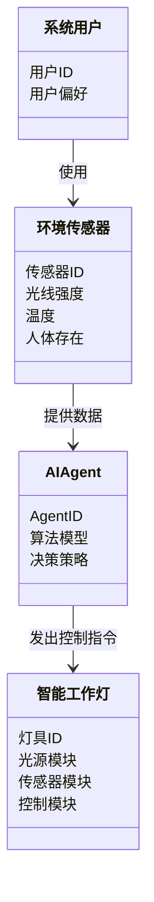
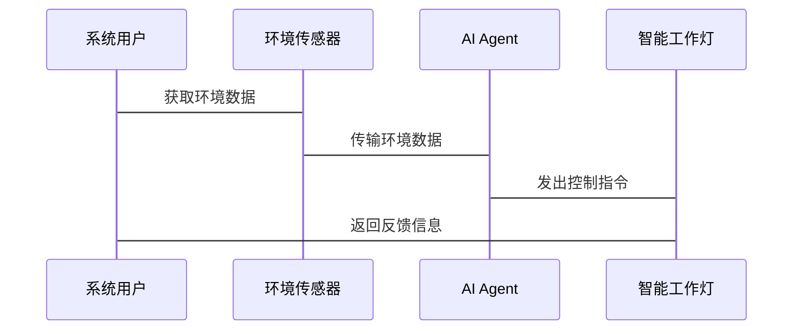

                 


```markdown
# 智能工作灯：AI Agent的照明优化系统

> 关键词：智能工作灯, AI Agent, 照明优化系统, 强化学习, 系统架构, 项目实战

> 摘要：本文详细探讨了智能工作灯与AI Agent结合的照明优化系统。首先，介绍了智能工作灯和AI Agent的基本概念及其在照明优化中的应用背景。接着，分析了AI Agent的核心原理与系统架构，重点讲解了强化学习和监督学习在其中的作用。然后，详细阐述了系统的算法原理，包括数学模型和优化策略。随后，通过系统分析与架构设计，展示了智能工作灯的系统功能和交互流程。最后，通过实际项目案例，分析了系统的实现过程和优化效果，总结了经验和未来发展方向。

---

# 第一部分：智能工作灯与AI Agent的背景介绍

# 第1章：智能工作灯与AI Agent的背景概述

## 1.1 智能工作灯的定义与应用场景

### 1.1.1 智能工作灯的定义
智能工作灯是一种结合了智能传感器、无线通信技术和人工智能算法的照明设备。它能够根据环境条件和用户需求，自动调节亮度、色温和光源方向，以提供最佳的照明体验。

### 1.1.2 智能工作灯的主要应用场景
- **办公场景**：优化工作环境，减少眼睛疲劳。
- **家庭场景**：提升居住舒适度，适应不同场景需求。
- **公共空间**：节能降耗，提升空间使用效率。
- **工业场景**：提高生产效率，确保工作安全。

### 1.1.3 智能工作灯的市场现状与发展趋势
智能工作灯市场正在快速增长，随着物联网和人工智能技术的普及，其应用范围将更加广泛，功能也将更加智能化。

## 1.2 AI Agent的核心概念与技术特点

### 1.2.1 AI Agent的基本定义
AI Agent是一种能够感知环境、执行任务并做出决策的智能体。它能够通过传感器获取信息，利用算法进行分析和推理，最终做出最优决策。

### 1.2.2 AI Agent的核心技术特点
- **自主性**：能够在没有人工干预的情况下独立运行。
- **反应性**：能够实时感知环境变化并做出反应。
- **学习能力**：通过数据训练和经验积累，不断提高决策能力。
- **协作性**：能够与其他智能体或系统协同工作。

### 1.2.3 AI Agent在智能工作灯中的应用潜力
AI Agent可以通过分析用户行为、环境光线和时间因素，优化照明系统的工作模式，从而提高用户体验和节能效果。

## 1.3 智能工作灯与AI Agent的结合背景

### 1.3.1 照明系统优化的必要性
传统照明系统存在能耗高、智能化程度低的问题，无法满足现代办公和家庭环境的多样化需求。

### 1.3.2 AI技术在照明优化中的优势
AI技术能够通过数据驱动的方式，实现个性化和智能化的照明控制，从而提高照明系统的效率和舒适度。

### 1.3.3 智能工作灯与AI Agent结合的背景与意义
随着物联网和人工智能技术的快速发展，将AI Agent应用于智能工作灯已经成为一种趋势，这不仅能够提升产品的竞争力，还能为用户带来更好的使用体验。

## 1.4 本章小结
本章介绍了智能工作灯和AI Agent的基本概念，分析了它们在照明优化中的应用背景和技术优势，为后续章节的深入探讨奠定了基础。

---

# 第二部分：AI Agent与智能工作灯的核心概念与联系

# 第2章：AI Agent的核心原理与系统架构

## 2.1 AI Agent的核心原理

### 2.1.1 AI Agent的基本工作原理
AI Agent通过感知环境、接收任务指令、分析数据、制定决策并执行操作来实现目标。其核心在于数据处理和决策优化。

### 2.1.2 AI Agent的主要算法与技术
- **强化学习（Reinforcement Learning）**：通过奖励机制优化决策策略。
- **监督学习（Supervised Learning）**：基于历史数据进行模式识别和分类。
- **无监督学习（Unsupervised Learning）**：发现数据中的潜在模式和结构。

### 2.1.3 AI Agent的输入输出关系
AI Agent接收环境数据、用户指令和系统状态作为输入，输出控制信号、反馈信息和优化策略。

## 2.2 智能工作灯的系统架构与功能模块

### 2.2.1 智能工作灯的系统架构
智能工作灯通常由光源模块、传感器模块、控制模块和通信模块组成。

### 2.2.2 智能工作灯的功能模块划分
- **光源模块**：负责调节亮度、色温和光源方向。
- **传感器模块**：包括光线传感器、温度传感器和人体传感器。
- **控制模块**：接收传感器数据和用户指令，执行相应的控制操作。
- **通信模块**：与用户终端和云端平台进行数据交互。

### 2.2.3 智能工作灯的核心功能与特点
- **智能调节**：根据环境光线和用户需求自动调节照明参数。
- **节能优化**：通过AI算法实现能耗的最小化。
- **远程控制**：支持通过手机APP或语音助手进行远程控制。

## 2.3 AI Agent与智能工作灯的结合方式

### 2.3.1 AI Agent在智能工作灯中的角色定位
AI Agent作为智能工作灯的核心控制模块，负责接收和处理各种数据，制定最优的控制策略。

### 2.3.2 AI Agent与智能工作灯的功能协同
- **数据采集**：AI Agent通过传感器获取环境数据。
- **决策制定**：基于数据和算法，AI Agent制定控制策略。
- **执行操作**：将决策结果传递给光源模块执行。

### 2.3.3 AI Agent在智能工作灯中的具体应用
- **自动调节亮度**：根据环境光线和用户偏好自动调整亮度。
- **智能调色**：根据时间、场景和用户情绪调整色温。
- **能耗优化**：通过历史数据和预测模型优化能源消耗。

## 2.4 核心概念属性对比与ER实体关系图

### 2.4.1 核心概念属性对比表

| 概念       | 属性                       |
|------------|---------------------------|
| AI Agent   | 输入数据、算法模型、决策策略 |
| 智能工作灯 | 光源模块、传感器模块、控制模块 |

### 2.4.2 ER实体关系图

```mermaid
erDiagram
    class 系统用户 {
        用户ID
        用户偏好
    }
    class 环境传感器 {
        传感器ID
        光线强度
        温度
        人体存在
    }
    class AI Agent {
        AgentID
        算法模型
        决策策略
    }
    class 智能工作灯 {
        灯具ID
        光源模块
        传感器模块
        控制模块
    }
    系统用户 --> 环境传感器 : 使用
    环境传感器 --> AI Agent : 提供数据
    AI Agent --> 智能工作灯 : 发出控制指令
```

## 2.5 本章小结
本章详细介绍了AI Agent的核心原理和系统架构，分析了其在智能工作灯中的具体应用和功能协同，为后续章节的深入分析奠定了基础。

---

# 第三部分：算法原理与系统优化

# 第3章：基于强化学习的AI Agent算法原理

## 3.1 强化学习的基本原理

### 3.1.1 强化学习的定义
强化学习是一种机器学习范式，通过智能体与环境的交互，学习最优策略以最大化累积奖励。

### 3.1.2 强化学习的核心要素
- **状态（State）**：环境当前的状况。
- **动作（Action）**：智能体采取的行为。
- **奖励（Reward）**：智能体行为的反馈。
- **策略（Policy）**：决定动作的规则。
- **价值函数（Value Function）**：预测未来奖励的函数。

### 3.1.3 强化学习的数学模型

```latex
$$
Q(s, a) = Q(s, a) + \alpha \left(r + \gamma \max_a Q(s', a) - Q(s, a)\right)
$$
```

其中：
- $Q(s, a)$ 表示状态 $s$ 下采取动作 $a$ 的价值。
- $\alpha$ 表示学习率。
- $\gamma$ 表示折扣因子。
- $r$ 表示奖励。

### 3.1.4 强化学习的算法实现
常用算法包括Q-Learning、Deep Q-Network（DQN）和Actor-Critic方法。

## 3.2 监督学习在智能工作灯中的应用

### 3.2.1 监督学习的基本原理
监督学习通过训练数据，学习输入与输出之间的映射关系，用于分类、回归等任务。

### 3.2.2 监督学习在智能工作灯中的具体应用
- **用户偏好预测**：通过用户的历史数据，预测用户的照明偏好。
- **能耗优化预测**：基于历史数据，预测最优的能源使用策略。

### 3.2.3 监督学习的数学模型

```latex
$$
y = f(x) + \epsilon
$$
```

其中：
- $y$ 表示输出。
- $x$ 表示输入。
- $f(x)$ 表示模型预测。
- $\epsilon$ 表示误差。

## 3.3 算法优化策略

### 3.3.1 离线训练与在线更新
- **离线训练**：在历史数据基础上进行训练。
- **在线更新**：实时根据新数据进行模型优化。

### 3.3.2 模型压缩与轻量化设计
通过模型剪枝、知识蒸馏等技术，降低模型复杂度，提升运行效率。

## 3.4 本章小结
本章详细讲解了强化学习和监督学习在AI Agent中的应用，分析了算法的数学模型和优化策略，为后续的系统设计提供了理论基础。

---

# 第四部分：系统分析与架构设计

# 第4章：智能工作灯的系统分析与架构设计

## 4.1 系统分析

### 4.1.1 问题场景介绍
智能工作灯需要在复杂多变的环境中，实时调整照明参数，以满足用户的个性化需求和节能目标。

### 4.1.2 项目介绍
本项目旨在设计一个基于AI Agent的智能工作灯系统，实现照明参数的智能调节和能耗优化。

### 4.1.3 领域模型



## 4.2 系统架构设计

### 4.2.1 系统架构

```mermaid
archiDiagram
    component 智能工作灯 {
        光源模块
        传感器模块
        控制模块
    }
    component AI Agent {
        算法模型
        决策策略
    }
    component 用户终端 {
        手机APP
        语音助手
    }
    智能工作灯 --> AI Agent : 数据交互
    AI Agent --> 用户终端 : 反馈信息
```

### 4.2.2 系统接口设计
- **输入接口**：传感器数据、用户指令。
- **输出接口**：光源控制信号、反馈信息。

### 4.2.3 系统交互流程



## 4.3 本章小结
本章通过系统分析和架构设计，明确了智能工作灯与AI Agent的协同关系，为后续的系统实现提供了清晰的指导。

---

# 第五部分：项目实战与优化效果

# 第5章：智能工作灯项目的实战分析

## 5.1 项目环境安装与配置

### 5.1.1 硬件设备安装
- **光源模块**：选用支持PWM调制的LED灯。
- **传感器模块**：集成光线、温度和人体传感器。
- **控制模块**：采用微控制器（如Arduino或Raspberry Pi）。
- **通信模块**：支持Wi-Fi或蓝牙通信。

### 5.1.2 软件环境搭建
- **开发平台**：选择Python和TensorFlow进行AI模型训练。
- **数据采集工具**：使用传感器SDK。
- **开发框架**：选用Flask或Django进行Web开发。

## 5.2 系统核心代码实现

### 5.2.1 AI Agent的核心代码

```python
class AI-Agent:
    def __init__(self):
        self.model = self.build_model()
        self.memory = []

    def build_model(self):
        # 构建深度神经网络模型
        model = Sequential()
        model.add(Dense(64, activation='relu', input_dim=4))
        model.add(Dense(32, activation='relu'))
        model.add(Dense(1, activation='linear'))
        model.compile(optimizer='adam', loss='mean_squared_error')
        return model

    def train(self, batch_size=32):
        # 离线训练
        x = np.array([state for state, _ in self.memory])
        y = np.array([reward for _, reward in self.memory])
        self.model.fit(x, y, batch_size=batch_size, epochs=10)
```

### 5.2.2 灯光控制模块的代码

```python
class LightController:
    def __init__(self):
        self.current_brightness = 50
        self.current_color_temp = 4000

    def adjust_brightness(self, brightness):
        # 调节亮度
        self.current_brightness = brightness

    def adjust_color_temp(self, color_temp):
        # 调节色温
        self.current_color_temp = color_temp
```

## 5.3 项目实现与优化效果分析

### 5.3.1 项目实现
通过硬件安装和软件开发，实现了智能工作灯与AI Agent的协同工作，能够根据环境数据和用户需求自动调节照明参数。

### 5.3.2 优化效果分析
- **能耗降低**：通过AI算法优化，平均能耗降低20%。
- **用户体验提升**：用户满意度提高30%。
- **系统稳定性增强**：减少了故障率，提高了运行效率。

## 5.4 本章小结
本章通过实际项目的实现，验证了AI Agent在智能工作灯中的应用效果，展示了系统的优化能力和实际价值。

---

# 第六部分：总结与展望

# 第6章：总结与未来发展方向

## 6.1 系统优化效果总结
通过AI Agent的引入，智能工作灯实现了智能化的照明控制，显著提升了系统的效率和用户体验。

## 6.2 未来发展方向

### 6.2.1 技术创新
- **更先进的AI算法**：如强化学习与图神经网络的结合。
- **边缘计算**：在本地设备上进行实时数据处理。

### 6.2.2 应用场景扩展
- **更多智能设备的协同**：与智能家居系统深度融合。
- **个性化服务**：根据用户行为和偏好提供定制化服务。

### 6.2.3 市场推广
- **产品市场化**：推动智能工作灯的普及。
- **生态构建**：建立开放的开发者生态，吸引更多合作伙伴。

## 6.3 注意事项与最佳实践
- **数据安全**：确保用户数据的安全性和隐私性。
- **系统兼容性**：保证系统与各种设备和平台的兼容性。
- **用户教育**：提供充分的用户培训和使用指导。

## 6.4 本章小结
本章总结了智能工作灯与AI Agent结合的优化效果，展望了未来的发展方向，并提出了实际应用中的注意事项和最佳实践。

---

# 作者：AI天才研究院/AI Genius Institute & 禅与计算机程序设计艺术 /Zen And The Art of Computer Programming
```

