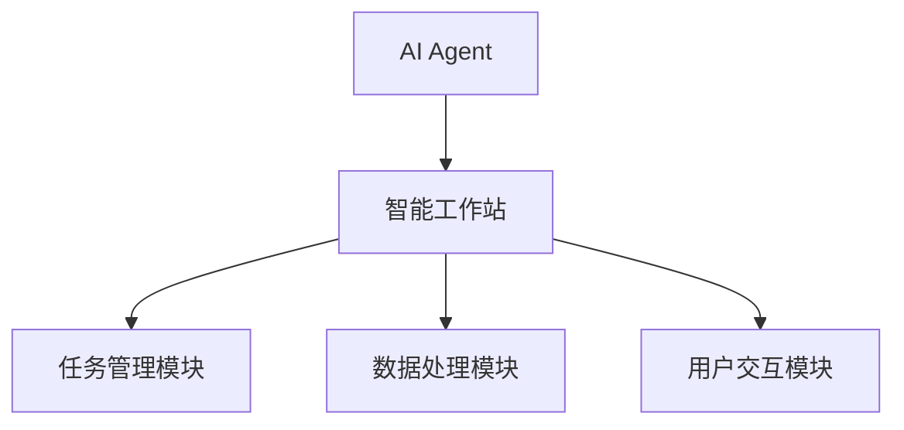
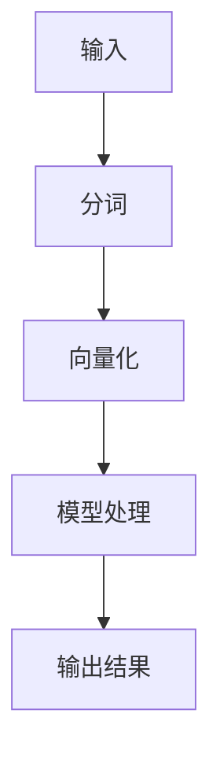
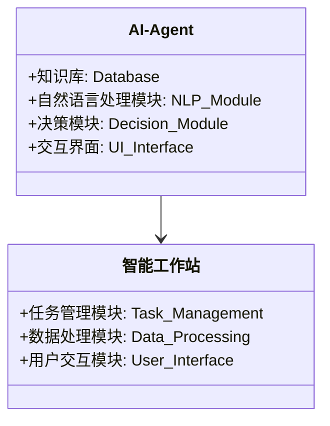
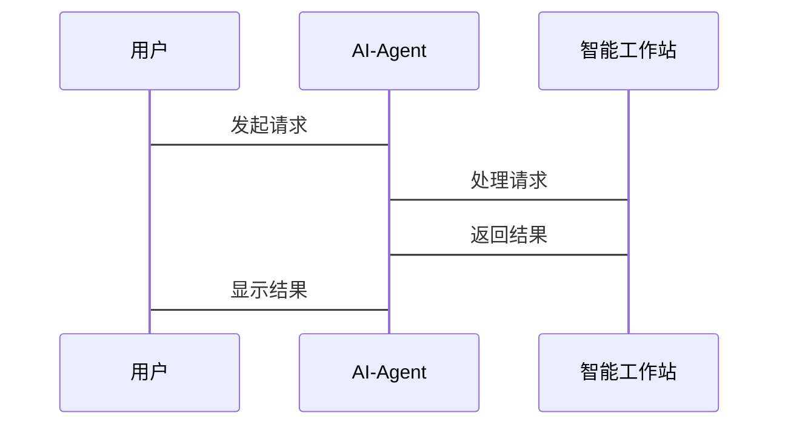

                 


# 智能工作站：AI Agent的效率优化助手

## 关键词：AI Agent，智能工作站，效率优化，算法原理，系统架构，项目实战

## 摘要：  
本文探讨了AI Agent在智能工作站中的应用，分析其如何通过自动化任务和优化流程提升效率。文章详细介绍了AI Agent的核心概念、算法原理、系统架构，并通过实际案例展示了其在项目中的应用，提供了最佳实践和优化建议。

---

# 第1章: AI Agent与智能工作站概述

## 1.1 AI Agent的基本概念  
### 1.1.1 AI Agent的定义  
AI Agent（人工智能代理）是一种能够感知环境并采取行动以实现目标的智能实体。它可以理解、学习和执行任务，具备自主决策能力。

### 1.1.2 AI Agent的核心特征  
- **自主性**：无需外部干预，自主完成任务。  
- **反应性**：实时感知环境并做出反应。  
- **目标导向**：所有行为都围绕实现特定目标。  
- **学习能力**：通过数据和经验不断优化性能。  

### 1.1.3 AI Agent与传统软件的区别  
AI Agent具备智能性和适应性，能够处理复杂任务；而传统软件依赖预设规则，难以应对未知情况。

## 1.2 智能工作站的概念与特点  
### 1.2.1 智能工作站的定义  
智能工作站是结合AI、大数据和自动化技术的高效工作平台，旨在优化工作流程并提升生产力。

### 1.2.2 智能工作站的核心功能  
- **任务自动化**：自动执行重复性任务。  
- **智能决策支持**：基于数据提供决策建议。  
- **人机协作**：无缝结合人类与AI的优势。  

### 1.2.3 智能工作站的应用场景  
- **企业办公**：自动化邮件、日程管理。  
- **研发领域**：代码审查、实验数据分析。  
- **客户服务**：智能客服、客户关系管理。  

## 1.3 AI Agent在智能工作站中的作用  
### 1.3.1 AI Agent作为效率优化工具  
AI Agent能够自动化处理任务，减少人工干预，提升效率。  

### 1.3.2 AI Agent在任务自动化中的应用  
- **流程自动化**：从订单处理到报告生成，AI Agent可以自动完成。  
- **数据处理**：从数据清洗到分析，AI Agent提供支持。  

### 1.3.3 AI Agent与人类协作的模式  
AI Agent作为辅助工具，帮助人类完成复杂任务，同时结合人类创造力和判断力。

## 1.4 本章小结  
本章介绍了AI Agent的基本概念、特点，以及其在智能工作站中的作用，为后续内容奠定了基础。

---

# 第2章: AI Agent的核心概念与联系  

## 2.1 AI Agent的结构与功能模块  
### 2.1.1 知识库模块  
知识库存储AI Agent所需的信息，包括数据、规则和经验。  

### 2.1.2 自然语言处理模块  
用于理解和生成人类语言，实现人机交互。  

### 2.1.3 决策与推理模块  
基于输入信息，进行分析和决策。  

### 2.1.4 交互界面模块  
提供用户与AI Agent交互的界面，支持多种输入方式。  

## 2.2 AI Agent与智能工作站的实体关系  
### 2.2.1 实体关系图  


## 2.3 AI Agent的核心原理  
### 2.3.1 自然语言处理原理  
通过词干提取、句法分析等技术，理解用户输入。  

### 2.3.2 机器学习算法  
AI Agent使用监督学习、无监督学习等算法，优化性能。  

### 2.3.3 知识图谱构建  
通过构建知识图谱，AI Agent能够更好地理解和推理信息。  

## 2.4 本章小结  
本章详细介绍了AI Agent的结构、功能模块及其核心原理，为后续章节奠定了基础。

---

# 第3章: AI Agent的算法原理  

## 3.1 自然语言处理算法  
### 3.1.1 Transformer模型  
- **定义**：基于自注意力机制的模型，广泛应用于NLP任务。  
- **优势**：并行处理能力强，效果优异。  

### 3.1.2 BERT模型  
- **定义**：预训练语言模型，通过双向训练提升理解能力。  
- **应用**：文本分类、问答系统等。  

### 3.1.3 GPT模型  
- **定义**：生成式预训练模型，擅长文本生成任务。  
- **应用**：对话系统、内容生成等。  

## 3.2 机器学习算法  
### 3.2.1 深度学习算法  
- **卷积神经网络（CNN）**：用于图像识别和分类。  
- **循环神经网络（RNN）**：用于序列数据处理。  

### 3.2.2 强化学习算法  
- **策略梯度法**：通过最大化累积奖励来优化策略。  
- **Q-learning**：通过经验回放和目标网络提升性能。  

### 3.2.3 聚类与分类算法  
- **K-means**：无监督学习中的聚类算法。  
- **支持向量机（SVM）**：监督学习中的分类算法。  

## 3.3 算法流程图  


## 3.4 数学模型与公式  
### 3.4.1 损失函数  
$$L = -\sum_{i=1}^{n} y_i \log p(y_i) + (1 - y_i) \log (1 - p(y_i))$$  

### 3.4.2 梯度下降  
$$\theta = \theta - \eta \frac{\partial L}{\partial \theta}$$  

## 3.5 本章小结  
本章详细讲解了AI Agent中常用的算法原理，包括自然语言处理和机器学习算法，并通过流程图和公式加深了理解。

---

# 第4章: 智能工作站的系统分析与架构设计  

## 4.1 系统功能需求  
### 4.1.1 任务管理功能  
- **任务分配**：根据优先级分配任务。  
- **进度跟踪**：实时监控任务进度。  

### 4.1.2 数据处理功能  
- **数据清洗**：去除无效数据。  
- **数据分析**：生成数据报告。  

## 4.2 系统架构设计  
### 4.2.1 领域模型类图  


### 4.2.2 系统架构图  


## 4.3 接口与交互设计  
### 4.3.1 接口设计  
- **API接口**：定义了AI Agent与智能工作站之间的交互方式。  
- **数据格式**：JSON格式，确保数据传输的高效性。  

### 4.3.2 交互流程图  


## 4.4 本章小结  
本章通过系统分析和架构设计，详细讲解了智能工作站的工作原理和实现方式，为后续章节提供了理论基础。

---

# 第5章: 项目实战  

## 5.1 环境安装与配置  
- **工具安装**：安装Python、TensorFlow、Keras等工具。  
- **依赖管理**：使用pip安装所需的库。  

## 5.2 系统核心实现  
### 5.2.1 AI Agent实现  
```python
class AI-Agent:
    def __init__(self):
        self.knowledge_base = Database()
        self.nlp_module = NLP_Module()
        self.decision_module = Decision_Module()
        self.ui_interface = UI_Interface()
```

### 5.2.2 智能工作站实现  
```python
class 智能工作站:
    def __init__(self):
        self.task_management = Task_Management()
        self.data_processing = Data_Processing()
        self.user_interface = User_Interface()
```

## 5.3 实际案例分析  
### 5.3.1 案例背景  
某公司希望优化其客户服务流程，采用AI Agent辅助客服人员处理客户咨询。  

### 5.3.2 案例实现  
AI Agent通过自然语言处理理解客户需求，自动分类并生成回复，提升效率。  

## 5.4 项目小结  
本章通过实际案例展示了AI Agent在智能工作站中的应用，验证了其高效性和实用性。

---

# 第6章: 最佳实践与总结  

## 6.1 最佳实践  
- **数据质量管理**：确保数据的准确性和完整性。  
- **模型持续优化**：定期更新模型，提升性能。  

## 6.2 小结  
本文详细介绍了AI Agent在智能工作站中的应用，从理论到实践，全面分析了其优化效率的能力。

## 6.3 注意事项  
- **隐私保护**：确保数据安全和隐私合规。  
- **用户体验**：保持交互界面的简洁和友好。  

## 6.4 拓展阅读  
- 推荐阅读《Deep Learning》和《Natural Language Processing with Python》深入学习相关技术。

---

# 作者：AI天才研究院 & 禅与计算机程序设计艺术

