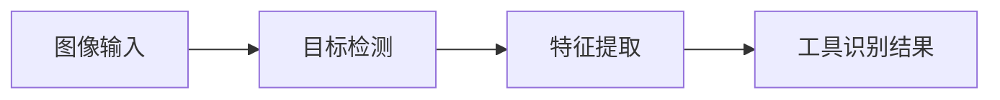
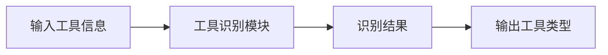
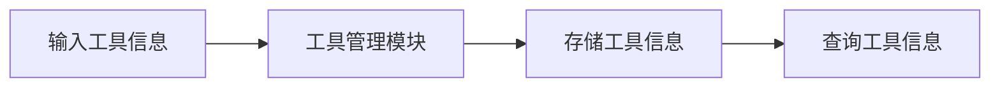
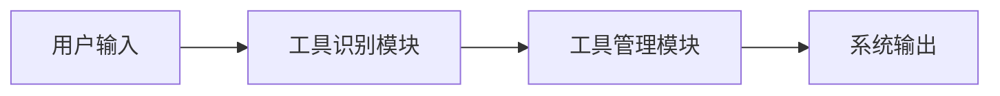

                 


```markdown
# 智能工具箱：AI Agent的工具识别与管理

> 关键词：AI Agent, 工具识别, 工具管理, 算法原理, 系统架构, 项目实战

> 摘要：本文将详细介绍AI Agent在工具识别与管理方面的核心概念、算法原理、系统架构以及实际应用。通过逐步分析，我们将探讨如何设计一个高效的AI Agent工具管理系统，涵盖工具识别算法、工具分类模型、系统功能设计、架构实现以及实际案例分析。文章最后将总结AI Agent工具管理的关键点，并展望未来的发展方向。

---

## 第一部分: AI Agent与工具识别管理概述

### 第1章: AI Agent与工具识别管理的背景介绍

#### 1.1 AI Agent的基本概念
##### 1.1.1 AI Agent的定义与核心要素
- AI Agent：具备自主决策和执行能力的智能体，能够根据环境信息做出决策并执行任务。
- 核心要素：感知能力、决策能力、执行能力、学习能力。

##### 1.1.2 工具识别管理的定义与背景
- 工具识别管理：AI Agent通过感知环境中的工具并识别其类型、功能，从而选择合适的工具完成任务。
- 背景：随着AI技术的发展，AI Agent需要处理的任务越来越复杂，工具识别与管理成为关键能力。

##### 1.1.3 问题背景与问题描述
- 问题背景：AI Agent在处理复杂任务时，需要依赖多种工具，但如何高效识别和管理这些工具是一个挑战。
- 问题描述：如何设计一个高效的工具识别与管理系统，使得AI Agent能够快速识别工具并合理分配任务。

##### 1.1.4 问题解决的思路与方法
- 思路：通过自然语言处理和计算机视觉技术，结合机器学习算法，实现工具的自动识别和分类。
- 方法：基于工具的特征（如名称、功能、类型）设计分类模型，优化工具识别的准确率和效率。

##### 1.1.5 概念结构与核心要素组成
- 概念结构：AI Agent → 工具识别 → 工具管理 → 任务执行。
- 核心要素：感知模块、识别算法、分类模型、管理模块。

---

### 第2章: 工具识别与分类的算法原理

#### 2.1 工具识别的核心算法
##### 2.1.1 基于自然语言处理的工具识别
- 分词处理：将文本分割成词语或短语，提取关键词。
- 关键词提取：从文本中提取与工具相关的关键词，用于分类。
- 示例：输入“Python脚本”，提取关键词“Python”和“脚本”进行分类。

##### 2.1.2 基于计算机视觉的工具识别
- 目标检测：使用CNN（卷积神经网络）检测图像中的工具。
- 示例：识别图像中的“剪刀”、“锤子”等工具。




#### 2.2 工具分类的数学模型
##### 2.2.1 分类器原理
- 概率分类器：计算样本属于某一类别的概率。
  $$ P(y|x) = \frac{P(x|y)P(y)}{P(x)} $$
- 分类器选择：根据任务需求选择合适的分类器（如SVM、RF、CNN）。

##### 2.2.2 常见分类算法对比
| 算法 | 描述 |
|------|------|
| SVM | 支持向量机，适用于小规模数据集。 |
| RF | 随机森林，适用于高维数据。 |
| CNN | 卷积神经网络，适用于图像数据。 |

---

### 第3章: 工具管理的策略与方法

#### 3.1 工具的生命周期管理
##### 3.1.1 工具的获取与存储
- 工具获取：通过API、数据库或文件获取工具信息。
- 工具存储：将工具信息存储在数据库中，支持快速查询。

##### 3.1.2 工具的更新与维护
- 工具更新：定期更新工具信息，确保最新版本。
- 工具维护：修复工具的错误或优化工具性能。

#### 3.2 工具的动态管理策略
##### 3.2.1 动态工具链管理
- 工具链动态选择：根据任务需求动态选择工具。
- 工具链动态扩展：根据任务复杂度扩展工具链。

##### 3.2.2 工具的优先级排序
- 工具优先级：根据任务的重要性和工具的效率进行排序。
- 示例：优先使用性能高的工具完成关键任务。

---

## 第二部分: 工具管理的系统架构与实现

### 第4章: 系统功能设计

#### 4.1 系统功能模块
##### 4.1.1 工具识别模块
- 功能：识别环境中的工具并分类。
- 输入：文本或图像。
- 输出：工具类型和名称。

##### 4.1.2 工具管理模块
- 功能：存储、查询和管理工具信息。
- 输入：工具信息。
- 输出：工具列表或单个工具信息。

#### 4.2 系统功能流程
##### 4.2.1 工具识别流程


##### 4.2.2 工具管理流程


---

### 第5章: 系统架构设计

#### 5.1 系统架构图


#### 5.2 系统交互流程


---

## 第三部分: 项目实战与应用

### 第6章: 项目实战

#### 6.1 环境安装与配置
- 安装Python、TensorFlow、OpenCV等工具。
- 配置开发环境：如Jupyter Notebook或PyCharm。

#### 6.2 核心代码实现
##### 6.2.1 工具识别模块
```python
import tensorflow as tf
from tensorflow.keras import layers

# 构建CNN模型
model = tf.keras.Sequential([
    layers.Conv2D(32, (3,3), activation='relu', input_shape=(224, 224, 3)),
    layers.MaxPooling2D((2,2)),
    layers.Conv2D(64, (3,3), activation='relu'),
    layers.MaxPooling2D((2,2)),
    layers.Flatten(),
    layers.Dense(128, activation='relu'),
    layers.Dense(num_classes, activation='softmax')
])
```

##### 6.2.2 工具管理模块
```python
import sqlite3

conn = sqlite3.connect('tools.db')
cursor = conn.cursor()

cursor.execute('''CREATE TABLE tools
                 (id INT PRIMARY KEY,
                  name TEXT,
                  type TEXT,
                  description TEXT)''')
```

#### 6.3 实际案例分析
##### 6.3.1 案例背景
- 任务：图像处理。
- 工具：图像编辑软件（如Photoshop、GIMP）。

##### 6.3.2 工具识别与选择
- 输入图像：检测工具类型。
- 输出：选择合适的图像处理工具。

---

### 第7章: 总结与展望

#### 7.1 本章小结
- AI Agent的工具识别与管理是实现智能系统的关键能力。
- 通过自然语言处理和计算机视觉技术，结合机器学习算法，可以高效地识别和管理工具。

#### 7.2 未来展望
- 智能工具箱的扩展：支持更多类型的工具识别与管理。
- 工具管理的优化：优化工具识别算法，提高准确率和效率。
- 人机协作的未来趋势：AI Agent与人类协作，共同完成复杂任务。

---

## 作者：AI天才研究院/AI Genius Institute & 禅与计算机程序设计艺术 /Zen And The Art of Computer Programming

---

**本文为AI Agent工具识别与管理领域的一份详细指南，通过系统化的分析与实践，帮助读者深入了解AI Agent的工具管理能力，并掌握实际应用的方法与技巧。**

