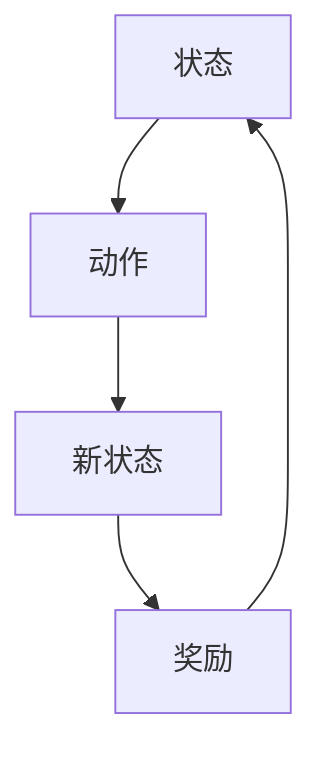
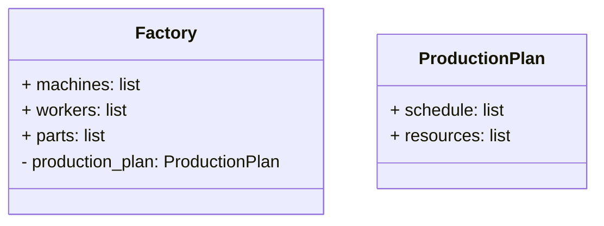

                 


# 智能工厂：AI Agent的生产线优化

> 关键词：智能工厂，AI Agent，生产线优化，强化学习，算法实现

> 摘要：本文探讨了AI Agent在智能工厂中的应用，重点分析了其在生产线优化中的核心作用。通过详细阐述AI Agent的核心原理、算法实现、系统架构设计和实际案例，展示了如何利用AI技术提升生产效率和质量。文章还提供了丰富的图表和代码示例，帮助读者深入理解AI Agent的应用价值。

---

## 目录大纲

1. 第一部分: 智能工厂与AI Agent的背景介绍
   1.1 智能工厂概述
   1.2 AI Agent的基本概念

2. 第二部分: AI Agent的核心原理与算法
   2.1 AI Agent的核心原理
   2.2 AI Agent的算法实现

3. 第三部分: 系统架构设计
   3.1 问题场景分析
   3.2 系统功能设计
   3.3 系统架构设计

4. 第四部分: 项目实战
   4.1 环境安装与配置
   4.2 核心功能实现
   4.3 实际案例分析

5. 第五部分: 最佳实践与小结
   5.1 小结
   5.2 注意事项
   5.3 拓展阅读

---

## 正文

### 第一部分: 智能工厂与AI Agent的背景介绍

#### 1.1 智能工厂概述

##### 1.1.1 智能工厂的定义与特点
智能工厂是指通过物联网、大数据、人工智能等技术，实现生产过程的智能化、自动化和高效化。其特点包括：
- **智能化**：利用AI技术优化生产流程。
- **自动化**：设备间高度协同，减少人工干预。
- **数据驱动**：基于实时数据进行决策。

##### 1.1.2 智能工厂的核心特点
- **实时监控**：通过传感器和物联网设备收集数据。
- **预测性维护**：提前预测设备故障，减少停机时间。
- **灵活生产**：适应市场需求变化，快速调整生产计划。

##### 1.1.3 智能工厂与传统工厂的区别
| 特性        | 智能工厂                     | 传统工厂                     |
|-------------|------------------------------|-------------------------------|
| 生产效率     | 高                          | 一般                         |
| 人工干预     | 少                          | 多                           |
| 数据利用     | 高效                        | 有限                        |

#### 1.2 AI Agent的基本概念

##### 1.2.1 AI Agent的定义与分类
AI Agent是一种智能体，能够感知环境并采取行动以实现目标。根据智能水平，可分为：
- **反应式AI Agent**：基于当前感知做出反应。
- **认知式AI Agent**：具备推理和规划能力。

##### 1.2.2 AI Agent在智能工厂中的应用
- **设备监控**：实时监测设备状态，预测维护。
- **流程优化**：优化生产流程，减少资源浪费。
- **质量控制**：通过视觉识别提升产品质量。

### 第二部分: AI Agent的核心原理与算法

#### 2.1 AI Agent的核心原理

##### 2.1.1 知识表示与推理
知识表示是AI Agent理解世界的基础。常用方法包括：
- **知识图谱**：构建概念网络。
- **逻辑推理**：通过规则推导结论。

##### 2.1.2 行为决策
行为决策是AI Agent的核心功能，常用算法包括：
- **强化学习**：通过奖励机制优化决策。
- **决策树**：基于条件判断做出选择。

#### 2.2 AI Agent的算法实现

##### 2.2.1 强化学习算法
强化学习是AI Agent行为决策的重要方法。以下以Q-Learning为例：



代码实现：

```python
class QLearning:
    def __init__(self, state_space, action_space):
        self.q_table = pd.DataFrame(columns=action_space, index=state_space)
    
    def choose_action(self, state, epsilon=0.1):
        if np.random.random() < epsilon:
            return np.random.choice(self.q_table.columns)
        else:
            return self.q_table.loc[state].idxmax()
    
    def update_q_value(self, state, action, reward, next_state, alpha=0.1):
        self.q_table.loc[state][action] = (1-alpha)*self.q_table.loc[state][action] + alpha*reward
```

### 第三部分: 系统架构设计

#### 3.1 问题场景分析
假设我们有一个汽车制造厂，需要优化生产线的排程。问题包括：
- 设备故障率高。
- 生产周期长。
- 资源利用率低。

#### 3.2 系统功能设计

##### 3.2.1 领域模型


#### 3.3 系统架构设计

##### 3.3.1 系统架构图


### 第四部分: 项目实战

#### 4.1 环境安装与配置
安装必要的库：
```bash
pip install numpy pandas scikit-learn matplotlib
```

#### 4.2 核心功能实现
实现强化学习算法：
```python
import numpy as np
import pandas as pd

class AI-Agent:
    def __init__(self, state_size, action_size):
        self.state_size = state_size
        self.action_size = action_size
        self.q_table = np.zeros((state_size, action_size))
    
    def take_action(self, state):
        if np.random.rand() < 0.1:
            return np.random.randint(self.action_size)
        else:
            return np.argmax(self.q_table[state])
    
    def learn(self, state, action, reward, next_state):
        self.q_table[state][action] = self.q_table[state][action] * 0.9 + reward * 0.1
```

### 第五部分: 最佳实践与小结

#### 5.1 小结
AI Agent在智能工厂中的应用显著提升了生产效率和产品质量。

#### 5.2 注意事项
- 数据质量至关重要。
- 算法选择需结合实际场景。
- 系统维护和更新不可忽视。

#### 5.3 拓展阅读
建议深入学习强化学习和图神经网络在工业中的应用。

---

## 作者：AI天才研究院 & 禅与计算机程序设计艺术

