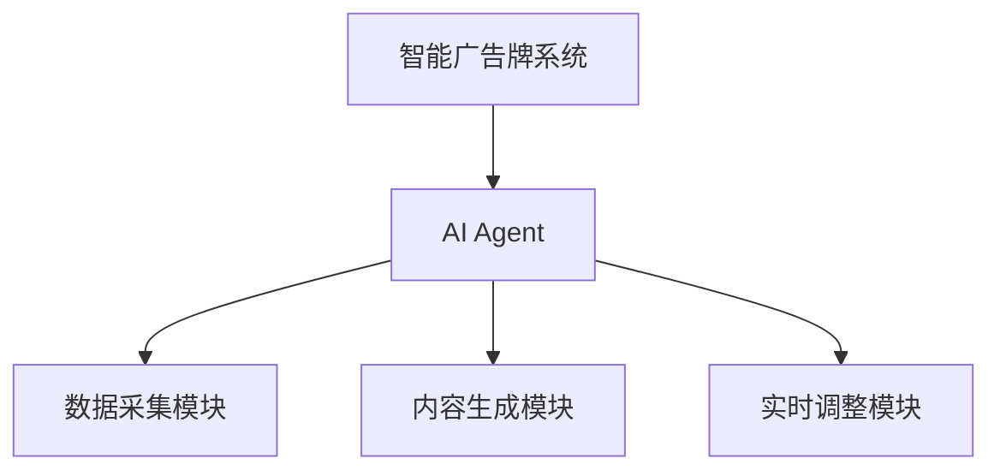
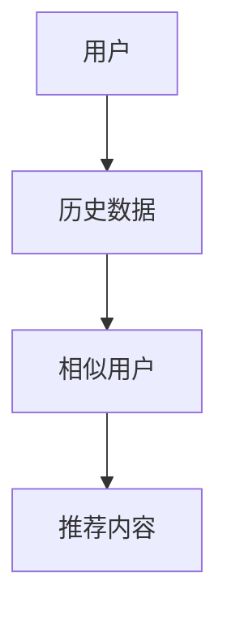
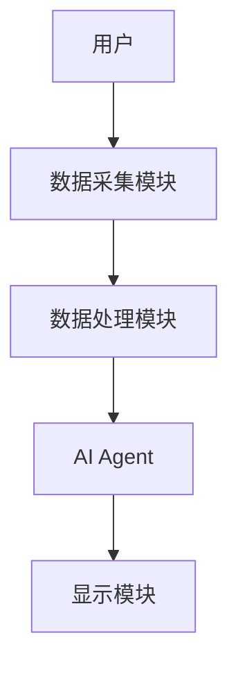

                 


# 智能广告牌：AI Agent的实时内容调整

> 关键词：智能广告牌，AI Agent，实时内容调整，推荐算法，系统架构，项目实战

> 摘要：本文深入探讨了智能广告牌结合AI Agent进行实时内容调整的技术原理和实现方法。从背景介绍、核心概念、算法原理到系统架构设计，再到项目实战和最佳实践，全面解析智能广告牌如何通过AI技术实现高效的内容优化。

---

## 第1章: 智能广告牌的背景与现状

### 1.1 智能广告牌的发展历程

#### 1.1.1 传统广告牌的局限性
传统的广告牌通常静态展示内容，无法根据环境变化或观众需求进行实时调整。这种固定展示方式导致广告效果受限，难以最大化用户体验和广告效果。

#### 1.1.2 智能广告牌的定义与特点
智能广告牌是一种结合了物联网、人工智能和大数据技术的智能设备，能够实时采集环境数据、观众行为数据，并通过AI算法动态调整显示内容。其特点包括：
- **实时性**：能够快速响应环境变化和观众需求。
- **智能化**：通过AI算法实现内容的智能推荐和优化。
- **交互性**：支持与观众的互动，提供个性化的广告体验。

#### 1.1.3 当前智能广告牌的应用场景
智能广告牌广泛应用于商场、车站、机场、体育场馆等公共场所，用于展示商品信息、促销活动、交通信息等。其应用场景多样，能够显著提升广告效果和用户体验。

### 1.2 AI Agent在智能广告牌中的作用

#### 1.2.1 AI Agent的基本概念
AI Agent（人工智能代理）是一种能够感知环境、执行任务并做出决策的智能系统。在智能广告牌中，AI Agent负责采集数据、分析用户需求、生成和调整广告内容。

#### 1.2.2 AI Agent在广告内容调整中的应用
AI Agent通过分析观众的行为数据、时间、天气等环境因素，结合广告目标，实时优化广告内容的展示方式，以提高广告点击率和用户满意度。

#### 1.2.3 AI Agent与智能广告牌的结合
AI Agent与智能广告牌的结合使得广告内容能够动态调整，满足不同观众的需求，同时提高广告投放效率和效果。

### 1.3 智能广告牌的优势与挑战

#### 1.3.1 智能广告牌的优势
- 提高广告投放的精准度。
- 增强用户体验，提升广告点击率。
- 支持多场景、多设备的无缝衔接。

#### 1.3.2 当前面临的技术挑战
- 数据采集的实时性和准确性。
- AI算法的复杂性和计算效率。
- 系统的安全性和稳定性。

#### 1.3.3 未来发展的潜力
随着AI技术的不断进步，智能广告牌将在更多场景中得到应用，广告内容的个性化和智能化程度将不断提高，为广告行业带来更大的变革。

---

## 第2章: 智能广告牌的核心概念与联系

### 2.1 智能广告牌的核心概念

#### 2.1.1 智能广告牌的系统架构
智能广告牌的系统架构通常包括以下几个模块：
- **数据采集模块**：采集观众行为数据、环境数据等。
- **AI Agent模块**：负责数据分析、内容生成和调整。
- **显示模块**：实时显示优化后的广告内容。

#### 2.1.2 AI Agent的功能模块
AI Agent的功能模块包括：
- **数据采集**：通过传感器、摄像头等设备采集环境和观众数据。
- **数据处理**：对采集的数据进行清洗、分析和建模。
- **内容生成**：基于分析结果生成广告内容。
- **实时调整**：根据反馈不断优化广告内容。

#### 2.1.3 实时内容调整的实现机制
实时内容调整的实现机制包括数据采集、分析、生成和优化四个步骤。通过AI算法，系统能够快速响应变化，动态调整广告内容。

### 2.2 智能广告牌与AI Agent的关系

#### 2.2.1 系统整体架构图


#### 2.2.2 各模块的功能对比表
| 模块名称         | 功能描述                               |
|------------------|--------------------------------------|
| 数据采集模块     | 采集环境数据和观众行为数据           |
| 内容生成模块     | 根据数据生成广告内容                 |
| 实时调整模块     | 根据反馈优化广告内容                 |

### 2.3 智能广告牌的核心要素

#### 2.3.1 数据采集与处理
数据采集是智能广告牌系统的第一步，主要包括观众的行为数据（如点击、停留时间）和环境数据（如天气、时间）。

#### 2.3.2 内容生成与优化
通过AI算法，系统能够生成和优化广告内容，以满足不同观众的需求。

#### 2.3.3 实时调整与反馈
系统能够根据实时反馈不断优化广告内容，提高广告效果。

---

## 第3章: 智能广告牌AI Agent的算法原理

### 3.1 推荐算法的基础原理

#### 3.1.1 协同过滤推荐算法
协同过滤是一种基于用户相似性推荐算法，通过分析用户行为数据，找到相似用户的偏好，从而推荐相关内容。



#### 3.1.2 基于内容的推荐算法
基于内容的推荐算法通过分析广告内容的特征，推荐与当前内容相关的内容。

#### 3.1.3 实时调整的推荐机制
实时调整的推荐机制结合了协同过滤和基于内容的推荐算法，能够快速响应变化，动态优化广告内容。

---

## 第4章: 智能广告牌的系统分析与架构设计

### 4.1 系统整体架构设计

#### 4.1.1 系统功能设计
智能广告牌系统包括数据采集、内容生成、实时调整三个核心功能模块。

#### 4.1.2 系统架构图


#### 4.1.3 接口设计
系统需要与传感器、摄像头等设备进行数据交互，同时与广告内容管理系统进行对接。

#### 4.1.4 交互序列图


---

## 第5章: 智能广告牌的项目实战

### 5.1 环境搭建
需要搭建硬件设备（如传感器、摄像头）和软件环境（如Python、TensorFlow），并配置相关API接口。

### 5.2 核心代码实现

#### 5.2.1 数据采集模块
```python
import numpy as np

# 示例代码：数据采集模块
def collect_data():
    # 采集环境数据和观众行为数据
    temperature = np.random.uniform(10, 30)
    time = np.random.randint(0, 24)
    user_behavior = np.random.randint(0, 100)
    return temperature, time, user_behavior
```

#### 5.2.2 数据处理模块
```python
def process_data(temp, time, behavior):
    # 数据清洗和预处理
    normalized_temp = (temp - 10) / 20
    normalized_time = (time - 0) / 24
    normalized_behavior = (behavior - 0) / 100
    return normalized_temp, normalized_time, normalized_behavior
```

#### 5.2.3 AI Agent模块
```python
def ai_agent(temp, time, behavior):
    # AI算法实现
    import tensorflow as tf
    model = tf.keras.models.load_model('ad_recommender.h5')
    prediction = model.predict(np.array([temp, time, behavior]))
    return prediction
```

#### 5.2.4 显示模块
```python
def display_content(prediction):
    # 示例代码：显示优化后的广告内容
    print(f"推荐内容：{prediction}")
```

### 5.3 功能解读与分析
通过上述代码实现，我们可以看到智能广告牌系统的核心功能包括数据采集、数据处理、AI算法推荐和内容显示。每一部分都紧密配合，确保广告内容能够实时调整。

### 5.4 案例分析
通过一个具体案例，分析智能广告牌如何根据环境和观众行为调整广告内容，展示其实时性和智能化的特点。

---

## 第6章: 最佳实践与总结

### 6.1 小结
智能广告牌通过AI Agent实现了实时内容调整，显著提升了广告效果和用户体验。

### 6.2 注意事项
- 数据采集的准确性和实时性是关键。
- 系统的安全性和稳定性需要高度重视。
- 算法的优化和调优是持续改进的重要部分。

### 6.3 拓展阅读
推荐相关书籍和论文，供读者深入学习智能广告牌和AI Agent的技术细节。

---

## 作者

作者：AI天才研究院/AI Genius Institute & 禅与计算机程序设计艺术 /Zen And The Art of Computer Programming

