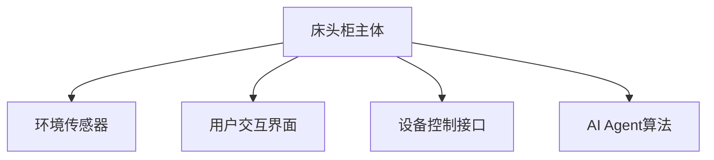
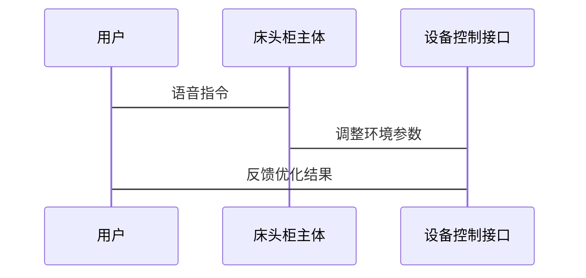

                 


# 智能床头柜：AI Agent的睡眠环境优化

## 关键词：智能床头柜, AI Agent, 睡眠环境优化, 环境感知, AI算法, 智能家居

## 摘要：  
智能床头柜是一种结合AI Agent技术的智能家居设备，旨在通过环境感知、用户行为分析和多目标优化算法，为用户提供个性化的睡眠环境优化方案。本文将从背景、概念、算法、系统架构到项目实战，全面解析智能床头柜的技术实现和应用场景，为读者提供深入的技术洞察。

---

# 第一部分: 智能床头柜的背景与概念

## 第1章: 智能床头柜的背景介绍

### 1.1 问题背景
#### 1.1.1 睡眠健康的重要性
睡眠是人体健康的核心要素，直接影响精力、情绪和免疫力。现代人普遍存在睡眠质量差的问题，如失眠、浅眠、打鼾等。这些问题不仅影响个人生活，还可能导致工作效率下降、健康问题加剧。

#### 1.1.2 现有睡眠环境优化的不足
传统的睡眠优化设备（如智能床垫、空气净化器等）多为单一功能，缺乏系统的协同优化。用户需要手动调整设备，且不同设备间难以联动，导致睡眠环境优化效果有限。

#### 1.1.3 智能床头柜的提出与目标
智能床头柜通过集成AI Agent技术，实现多设备协同、环境感知和个性化优化，为用户提供智能化的睡眠解决方案。其目标是通过技术手段，提升睡眠质量，改善用户的生活质量。

### 1.2 问题描述
#### 1.2.1 睡眠环境的多维度优化需求
睡眠环境的优化需要综合考虑温度、湿度、光照、噪音、空气质量和床铺舒适度等多个因素。单一设备难以覆盖所有维度，需要系统化的解决方案。

#### 1.2.2 用户行为与环境的关联性
用户的睡眠状态与其行为习惯密切相关，如睡前使用电子设备、饮食习惯、运动量等。AI Agent需要通过感知用户行为，动态调整环境参数。

#### 1.2.3 当前技术的局限性
现有技术难以实现多设备协同优化，且缺乏智能化的动态调整能力。传统的自动化系统基于预设规则，难以应对复杂多变的用户需求。

### 1.3 问题解决
#### 1.3.1 AI Agent的核心作用
AI Agent通过环境感知、数据处理和决策优化，实现睡眠环境的智能化调整。它可以协同多个设备，动态优化睡眠环境，满足用户的个性化需求。

#### 1.3.2 智能床头柜的设计理念
智能床头柜的设计理念是“以人为本”，通过AI技术实现人与环境的智能交互，打造个性化的睡眠空间。

#### 1.3.3 技术实现的关键点
- 多传感器集成：温度、湿度、光照、噪音等环境参数的实时感知。
- 用户行为分析：通过行为数据优化睡眠环境。
- 多目标优化算法：在多个目标之间找到最优平衡。

### 1.4 边界与外延
#### 1.4.1 智能床头柜的功能边界
智能床头柜的功能包括环境感知、设备控制、数据处理和用户交互，但不涉及设备的硬件生产。

#### 1.4.2 与智能家居的关联
智能床头柜是智能家居的一部分，通过与家庭Wi-Fi、智能音箱等设备联动，实现更广泛的场景优化。

#### 1.4.3 与其他睡眠优化设备的区分
智能床头柜的核心区别在于其AI Agent的智能化优化能力，而传统设备仅能实现单一功能。

### 1.5 概念结构与核心要素
#### 1.5.1 核心概念的组成
- 环境感知模块：收集睡眠环境数据。
- AI Agent：处理数据并生成优化方案。
- 执行模块：调整环境参数。

#### 1.5.2 系统架构的核心要素
- 传感器网络：环境数据采集。
- AI算法：数据处理与决策。
- 设备控制：执行优化方案。

#### 1.5.3 功能模块的划分
- 环境感知模块：温度、湿度、光照、噪音传感器。
- 数据处理模块：AI Agent算法。
- 设备控制模块：连接智能设备的接口。

---

# 第二部分: AI Agent的核心概念与原理

## 第2章: AI Agent的定义与工作原理

### 2.1 AI Agent的定义
#### 2.1.1 AI Agent的基本概念
AI Agent（人工智能代理）是一种能够感知环境、做出决策并采取行动的智能实体。它通过与环境交互，实现特定目标。

#### 2.1.2 AI Agent的核心属性
- 感知能力：通过传感器或数据接口获取环境信息。
- 决策能力：基于感知数据做出最优决策。
- 执行能力：通过动作影响环境或与用户交互。

#### 2.1.3 AI Agent与传统程序的区别
AI Agent具有自主性、反应性和目标导向性，能够动态调整行为以应对变化。

### 2.2 AI Agent的工作原理
#### 2.2.1 感知层
AI Agent通过传感器或API获取环境数据，例如温度、湿度、光照强度等。

#### 2.2.2 决策层
基于感知数据，AI Agent利用机器学习算法生成优化方案。例如，使用强化学习优化睡眠环境参数。

#### 2.2.3 执行层
通过设备接口调整环境参数，例如调节空调温度或开启空气净化器。

### 2.3 AI Agent的核心算法
#### 2.3.1 机器学习算法
- 监督学习：用于分类和回归任务，如预测睡眠质量。
- 无监督学习：用于聚类分析，如识别用户的睡眠模式。

#### 2.3.2 自然语言处理
通过语音交互优化用户睡眠环境，例如用户可以通过语音命令调整床头柜的设置。

#### 2.3.3 多目标优化算法
在多个目标（如温度、湿度、噪音）之间找到最优平衡，确保睡眠环境的舒适性。

## 第3章: AI Agent与智能床头柜的结合

### 3.1 AI Agent在床头柜中的应用
#### 3.1.1 睡眠环境感知
AI Agent通过传感器实时感知睡眠环境，如温度、湿度、光照和噪音。

#### 3.1.2 用户行为分析
AI Agent分析用户的睡眠习惯，如入睡时间、起床时间、睡眠周期等。

#### 3.1.3 环境优化决策
AI Agent根据感知数据和用户行为，优化睡眠环境参数，如调整空调温度或开启空气净化器。

### 3.2 AI Agent的核心特征对比
#### 3.2.1 与传统传感器的对比
- 传统传感器：只能采集数据，无法优化环境。
- AI Agent：能够感知、决策并执行优化。

#### 3.2.2 与简单自动化设备的对比
- 简单自动化设备：基于预设规则执行动作。
- AI Agent：能够动态优化，适应用户需求。

#### 3.2.3 与复杂AI系统的对比
- 复杂AI系统：可能涉及多个目标和复杂场景。
- AI Agent：专注于睡眠环境优化，功能更聚焦。

### 3.3 实现细节与优化策略
#### 3.3.1 多目标优化的数学模型
$$ \text{目标函数：} \quad f(x) = \argmax_{x} \sum_{i=1}^{n} w_i x_i $$
其中，$w_i$ 是目标 $i$ 的权重，$x_i$ 是目标 $i$ 的优化值。

#### 3.3.2 动态调整的算法流程
1. 感知环境数据。
2. 分析用户行为。
3. 优化睡眠环境参数。
4. 执行优化方案。
5. 反馈优化结果。

---

# 第三部分: 睡眠环境优化算法

## 第4章: 睡眠环境优化的数学模型

### 4.1 睡眠环境的多目标优化
睡眠环境优化涉及多个目标，如温度、湿度、光照、噪音等。我们需要在这些目标之间找到最优平衡。

### 4.2 基于强化学习的优化算法
强化学习是一种通过试错优化的行为决策方法，适用于动态环境下的睡眠优化问题。

### 4.3 算法实现的步骤
1. 初始化环境参数。
2. 收集环境数据。
3. 训练强化学习模型。
4. 执行优化方案。
5. 反馈优化结果。

---

# 第四部分: 系统分析与架构设计

## 第5章: 智能床头柜的系统架构

### 5.1 系统功能设计
- 环境感知：温度、湿度、光照、噪音传感器。
- 用户交互：语音交互、触控界面。
- 环境优化：AI Agent算法优化睡眠环境。

### 5.2 系统架构图


### 5.3 系统接口设计
- 设备控制接口：与空调、空气净化器等设备通信。
- 用户交互接口：支持语音和触控交互。

### 5.4 系统交互流程


---

# 第五部分: 项目实战

## 第6章: 项目实战

### 6.1 环境安装
- 硬件安装：安装温度、湿度、光照和噪音传感器。
- 软件安装：部署AI Agent算法和系统架构。

### 6.2 系统实现
#### 6.2.1 环境感知模块
```python
# 传感器数据采集
def get_environment_data():
    temperature = read_temp_sensor()
    humidity = read_humidity_sensor()
    light = read_light_sensor()
    noise = read_noise_sensor()
    return temperature, humidity, light, noise
```

#### 6.2.2 AI Agent算法实现
```python
# 强化学习优化算法
class SleepOptimizer:
    def __init__(self):
        self.temperature_weight = 0.3
        self.humidity_weight = 0.2
        self.light_weight = 0.2
        self.noise_weight = 0.3

    def optimize_sleep_env(self, temperature, humidity, light, noise):
        # 计算优化值
        total_score = self.temperature_weight * temperature + \
                      self.humidity_weight * humidity + \
                      self.light_weight * light + \
                      self.noise_weight * noise
        return total_score
```

### 6.3 实际案例分析
案例1：用户睡眠质量差，AI Agent通过优化温度、湿度和噪音，提升睡眠质量。

---

# 第六部分: 总结与展望

## 第7章: 总结与展望

### 7.1 最佳实践 tips
- 数据隐私保护：确保用户数据的安全性。
- 系统稳定性：确保AI Agent的稳定运行。

### 7.2 小结
智能床头柜通过AI Agent技术，实现睡眠环境的智能化优化，为用户提供个性化的睡眠解决方案。

### 7.3 注意事项
- 硬件设备的兼容性。
- 系统的可扩展性。

### 7.4 拓展阅读
- 智能家居的发展趋势。
- AI Agent在其他领域的应用。

---

# 作者：AI天才研究院/AI Genius Institute & 禅与计算机程序设计艺术 /Zen And The Art of Computer Programming

