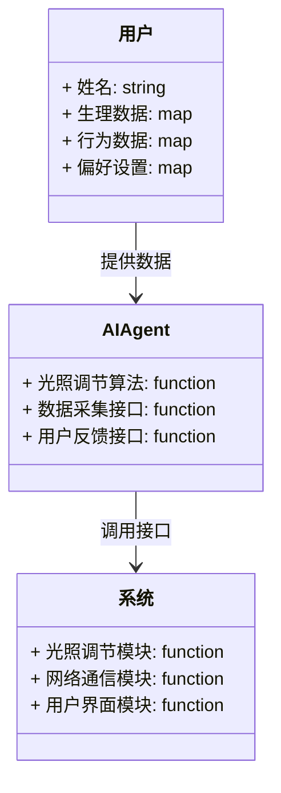
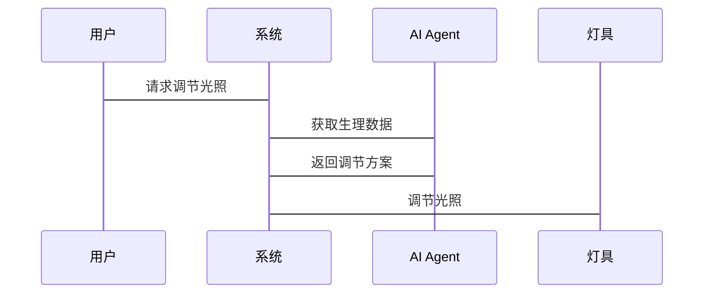

                 


# 智能床头灯：AI Agent的生理节律光照调节

> 关键词：智能床头灯、AI Agent、生理节律、光照调节、人工智能、健康科技

> 摘要：本文深入探讨了智能床头灯在AI Agent技术下的生理节律光照调节应用。通过分析人体生理节律与光照调节的关系，结合AI Agent的核心算法和系统架构设计，详细讲解了如何利用人工智能技术实现智能化的光照调节，从而改善睡眠质量、提升健康水平。本文还提供了实际项目实现的代码示例和系统设计图，帮助读者全面理解智能床头灯的技术实现和应用价值。

---

## 第1章 智能床头灯与AI Agent概述

### 1.1 智能床头灯的基本概念

#### 1.1.1 智能床头灯的定义
智能床头灯是一种结合了物联网（IoT）和人工智能（AI）技术的智能设备，能够根据用户的生理需求和环境变化，自动调节光照强度、色温和开关时间，以优化用户的睡眠质量和健康状态。

#### 1.1.2 AI Agent在智能床头灯中的作用
AI Agent（人工智能代理）是智能床头灯的核心技术，负责接收用户的生理数据、环境数据和行为数据，通过算法分析和决策，实现智能化的光照调节。

#### 1.1.3 智能床头灯的应用场景与价值
智能床头灯主要应用于家庭卧室、医院病房、酒店客房等场景，通过个性化光照调节帮助用户改善睡眠质量、调节情绪、提高工作效率，具有重要的健康科技价值。

---

### 1.2 生理节律与光照调节的关系

#### 1.2.1 生理节律的基本概念
生理节律是指人体内生物钟调控的各种生理功能的周期性变化，主要包括睡眠-觉醒周期、体温调节、激素分泌等。

#### 1.2.2 光照对生理节律的影响
光照是调节生理节律的重要因素，尤其是蓝光对褪黑激素分泌的影响。光照强度、色温和照射时间都会显著影响人体的生理节律。

#### 1.2.3 生理节律与健康的关系
生理节律紊乱可能导致失眠、疲劳、情绪低落等问题，长期影响身体健康和生活质量。

---

## 第2章 人体生理节律与光照调节的原理

### 2.1 人体生理节律的生物钟机制

#### 2.1.1 生物钟的基本原理
人体内的生物钟由下丘脑的视交叉上核（SCN）调控，通过基因表达和蛋白质相互作用实现周期性节律。

#### 2.1.2 光照对生物钟的影响
光照通过视网膜中的视杆细胞和视锥细胞传递信号到SCN，调节生物钟的节律。

#### 2.1.3 生物钟紊乱的健康影响
生物钟紊乱可能导致失眠、抑郁症、免疫功能下降等健康问题。

---

### 2.2 光照调节的生理机制

#### 2.2.1 光照对褪黑激素的影响
褪黑激素是调节睡眠的重要激素，光照强度和波长直接影响其分泌水平。

#### 2.2.2 光照对睡眠周期的调节
光照通过影响褪黑激素和体温调节，调控睡眠的深度和周期。

#### 2.2.3 光照对情绪和精力的影响
光照通过影响大脑皮层的神经活动，调节情绪和精力水平。

---

## 第3章 AI Agent在智能床头灯中的应用

### 3.1 AI Agent的基本概念与特点

#### 3.1.1 AI Agent的定义
AI Agent是一种能够感知环境、自主决策并执行任务的智能体，具有学习、推理和自适应能力。

#### 3.1.2 AI Agent的核心特点
- 感知环境
- 自主决策
- 学习能力
- 人机交互

---

### 3.2 AI Agent在智能床头灯中的功能设计

#### 3.2.1 光照调节的智能化需求
- 根据用户生理数据自动调节光照
- 个性化定制光照方案
- 实时反馈与优化

#### 3.2.2 AI Agent的目标设定
- 提供健康优化的光照方案
- 最大化用户舒适度
- 最小化能耗

#### 3.2.3 AI Agent的功能模块划分
- 数据采集模块
- 算法处理模块
- 光照调节模块
- 用户反馈模块

---

## 第4章 光照调节的数学模型与算法原理

### 4.1 生理节律与光照强度的关系模型

#### 4.1.1 光照强度与褪黑激素分泌的关系
光照强度与褪黑激素分泌呈负相关关系，公式表示为：
$$ I = k \times (1 - e^{-t/\tau}) $$

#### 4.1.2 光照强度与睡眠周期的数学模型
睡眠周期的数学模型可以表示为：
$$ S(t) = A \times \sin(2\pi t / T) + B $$

#### 4.1.3 光照强度与情绪调节的数学关系
情绪调节与光照强度的关系可以用线性回归模型表示：
$$ M = \beta_1 I + \beta_0 $$

---

### 4.2 AI Agent的光照调节算法

#### 4.2.1 基于生理节律的光照调节算法
- 输入：用户生理数据（心率、体温、活动量）
- 输出：光照调节方案（强度、色温）

#### 4.2.2 基于用户行为数据的自适应算法
- 输入：用户行为数据（起床时间、睡眠时长）
- 输出：个性化光照调节策略

#### 4.2.3 算法的优化与迭代
- 使用遗传算法优化光照调节参数
- 实时反馈优化算法

---

## 第5章 系统分析与架构设计方案

### 5.1 问题场景介绍
智能床头灯需要在复杂的家庭环境中，根据用户的生理数据和行为数据，实时调节光照参数，满足用户的健康需求。

### 5.2 系统功能设计

#### 5.2.1 领域模型（Mermaid类图）


### 5.3 系统架构设计

#### 5.3.1 系统架构图（Mermaid架构图）
```mermaid
archi
    title 智能床头灯系统架构
    client -> server: HTTP请求
    server -> db: 查询用户数据
    server -> agent: 调用AI Agent
    agent -> light: 发送调节指令
```

### 5.4 系统接口设计

#### 5.4.1 系统交互（Mermaid序列图）


---

## 第6章 项目实战：智能床头灯的实现

### 6.1 环境安装

#### 6.1.1 Python环境安装
```bash
pip install numpy
pip install matplotlib
pip install scikit-learn
```

#### 6.1.2 系统架构安装
```bash
# 安装mqtt协议支持
pip install paho-mqtt
```

### 6.2 系统核心实现源代码

#### 6.2.1 AI Agent核心代码
```python
import numpy as np
from sklearn.linear_model import LinearRegression

class AIAgent:
    def __init__(self):
        self.model = LinearRegression()
        self.data = []
    
    def train(self, X, y):
        self.model.fit(X, y)
    
    def predict(self, X):
        return self.model.predict(X)
```

#### 6.2.2 光照调节模块代码
```python
import time
import serial

class LightingController:
    def __init__(self, port):
        self.ser = serial.Serial(port, 9600)
    
    def set_brightness(self, brightness):
        command = f"Brightness:{brightness}\n"
        self.ser.write(command.encode())
    
    def set_color_temp(self, color_temp):
        command = f"ColorTemp:{color_temp}\n"
        self.ser.write(command.encode())
```

### 6.3 代码应用解读与分析

#### 6.3.1 数据采集与处理
```python
# 采集用户生理数据
import heartpy as hp

def process_heart_rate(data):
    # 数据预处理
    filtered = hp.detrend(data)
    # 心率计算
    peaks = hp.find_peaks(filtered)
    heart_rate = hp.get_heart_rate(peaks)
    return heart_rate
```

#### 6.3.2 算法实现与优化
```python
# 训练AI Agent模型
agent = AIAgent()
X = np.array([[1, 2], [3, 4], [5, 6]])
y = np.array([7, 8, 9])
agent.train(X, y)
```

### 6.4 实际案例分析与详细讲解

#### 6.4.1 案例分析
假设用户A长期失眠，系统通过采集心率、体温和活动数据，自动调节床头灯的光照强度和色温，帮助用户建立健康的睡眠习惯。

#### 6.4.2 详细讲解
- 系统采集用户生理数据
- AI Agent分析数据并生成调节方案
- 系统执行光照调节
- 用户反馈调节效果
- 系统优化调节策略

### 6.5 项目小结
智能床头灯的实现需要结合硬件、算法和系统架构设计，通过不断优化AI Agent的算法和系统交互，可以实现更加智能化和个性化的光照调节。

---

## 第7章 最佳实践、小结与注意事项

### 7.1 最佳实践
- 定期校准AI Agent模型
- 保持硬件设备的清洁与维护
- 合理设置光照调节参数

### 7.2 小结
本文详细讲解了智能床头灯的生理节律光照调节技术，从理论到实践，全面分析了AI Agent的应用和实现。

### 7.3 注意事项
- 注意数据隐私保护
- 确保系统运行的稳定性
- 定期更新系统软件

### 7.4 拓展阅读
- 《人工智能在健康科技中的应用》
- 《光照调节与人体健康的研究进展》

---

## 作者：AI天才研究院/AI Genius Institute & 禅与计算机程序设计艺术/Zen And The Art of Computer Programming

