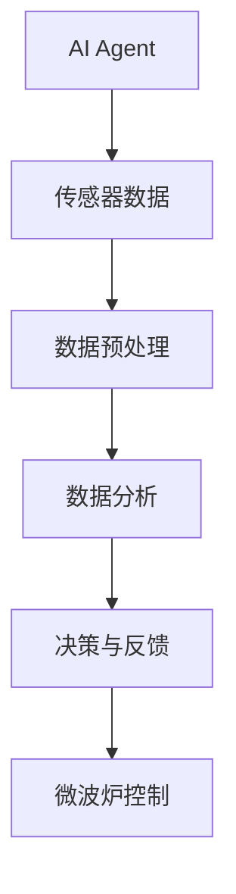

                 


# 智能微波炉：AI Agent的食品安全监控系统

> 关键词：智能微波炉, AI Agent, 食品安全, 物联网, 传感器数据

> 摘要：本文探讨了智能微波炉在食品安全监控中的创新应用，通过AI Agent和物联网技术的结合，提出了一种全新的食品安全监控系统解决方案。文章详细介绍了系统的核心概念、算法原理、系统架构设计以及项目实战，为读者提供了一套完整的智能微波炉食品安全监控系统实现方案。

---

## 第一部分: 智能微波炉与AI Agent的背景介绍

### 第1章: 智能微波炉与食品安全监控系统概述

#### 1.1 问题背景介绍

食品安全是人类生活中最重要的问题之一。随着生活水平的提高，人们对食品的质量和安全要求越来越高。然而，现有的食品安全监控系统存在以下问题：

- **数据采集不全面**：传统监控系统依赖人工检查，无法实时采集食品在微波炉中的温度、湿度等关键参数。
- **监控效率低**：人工检查耗时耗力，难以满足大规模食品加工和储存的需求。
- **数据处理复杂**：采集的数据需要人工分析，无法快速做出决策。

#### 1.2 问题描述

智能微波炉作为一种常见的厨房设备，其核心功能是加热食品。然而，食品在微波炉中的加热过程涉及温度、湿度等多种因素，这些因素直接影响食品的安全性。传统微波炉无法实时监控这些参数，导致食品可能在加热过程中出现过热或不均匀加热的问题，从而引发食品安全隐患。

#### 1.3 解决方案概述

为了克服传统微波炉在食品安全监控方面的不足，我们提出了一种基于AI Agent的智能微波炉食品安全监控系统。该系统通过集成多种传感器，实时采集食品在微波炉中的温度、湿度等参数，并通过AI Agent进行数据分析和决策，确保食品在加热过程中的安全性和均匀性。

#### 1.4 边界与外延

- **系统的边界**：智能微波炉食品安全监控系统仅关注食品在微波炉中的加热过程，不涉及食品储存和加工的其他环节。
- **相关概念的扩展**：AI Agent不仅能够处理传感器数据，还可以通过学习优化加热过程，提高食品安全性。
- **系统功能的限制**：系统仅针对食品加热过程进行监控，不涉及食品成分分析或其他类型的食品安全检测。

#### 1.5 概念结构与核心要素

- **核心概念**：AI Agent、物联网、传感器、食品安全。
- **概念关系**：AI Agent通过物联网技术整合传感器数据，实现对食品加热过程的智能监控。

---

## 第二部分: 核心概念与联系

### 第2章: AI Agent与物联网的基础知识

#### 2.1 AI Agent的核心原理

- **AI Agent的定义**：AI Agent是一种能够感知环境并采取行动以实现目标的智能体。
- **AI Agent的特点**：
  - 感知环境：通过传感器获取数据。
  - 决策与行动：基于数据做出决策并执行操作。
  - 学习与优化：通过机器学习算法优化自身的决策能力。

- **AI Agent的应用场景**：智能助手、自动驾驶、智能家居、工业自动化等。

#### 2.2 物联网在智能微波炉中的应用

- **物联网的基本概念**：物联网（IoT）是指通过各种信息传感设备，如传感器、射频识别（RFID）、全球定位系统（GPS）、红外感应器等，按照约定的协议，把任何物品与互联网连接起来，进行信息交换和通信，以实现智能化识别、定位、跟踪、监控和管理。

- **微波炉中的传感器与数据采集**：
  - **温度传感器**：监测食品在微波炉中的温度变化。
  - **湿度传感器**：监测食品周围的湿度。
  - **压力传感器**：监测微波炉内部的压力变化。

- **物联网在食品安全监控中的作用**：
  - 实时采集食品在微波炉中的温度、湿度等参数。
  - 通过物联网技术将数据传输到云端，进行分析和处理。

#### 2.3 AI Agent与物联网的协同工作

- **数据流的整合与处理**：
  - 传感器数据 → AI Agent → 数据分析与决策 → 控制微波炉的加热过程。

- **AI Agent在数据处理中的角色**：
  - 数据预处理：对传感器数据进行清洗和归一化处理。
  - 数据分析：通过机器学习算法分析数据，预测食品加热过程中的潜在问题。
  - 决策与反馈：根据分析结果，调整微波炉的加热参数，确保食品的安全性。

- **系统架构与协作**：
  - 智能微波炉 → 传感器 → AI Agent → 数据分析 → 微波炉控制。

#### 2.4 核心概念对比表格

| 概念       | AI Agent                          | 物联网                            |
|------------|-----------------------------------|-----------------------------------|
| 定义       | 智能体，能够感知环境并采取行动     | 通过传感器和网络连接实现智能监控   |
| 应用场景     | 智能助手、自动驾驶、工业自动化      | 智能家居、智慧城市、工业物联网      |
| 数据处理    | 强调数据分析与决策               | 强调数据采集与传输                |

#### 2.5 ER实体关系图

```mermaid
er
  actor(AI Agent)
  actor(物联网)
  actor(微波炉)
  actor(传感器)
  entity(温度数据)
  entity(湿度数据)
  entity(压力数据)
  relation(拥有)
  relation(收集)
  relation(传输)
```

---

## 第三部分: 算法原理讲解

### 第3章: AI Agent的算法原理

#### 3.1 数据收集与处理

- **数据采集**：通过传感器实时采集食品在微波炉中的温度、湿度等参数。
- **数据预处理**：对采集的数据进行清洗、归一化处理，确保数据的准确性。

#### 3.2 数据分析与决策

- **数据分析**：
  - 使用机器学习算法对传感器数据进行分析，预测食品加热过程中的潜在问题。
  - 常用算法：支持向量机（SVM）、随机森林（Random Forest）、神经网络等。

- **决策与反馈**：
  - 根据分析结果，AI Agent会调整微波炉的加热参数，确保食品的安全性和均匀性。

#### 3.3 传感器数据的数学模型

- **温度变化模型**：
  - 模型输入：传感器采集的温度数据。
  - 模型输出：食品加热过程中的温度变化趋势。
  - 数学公式：
    $$
    T(t) = a \cdot t + b
    $$
    其中，$T(t)$ 表示时间 $t$ 时的温度，$a$ 是温度变化率，$b$ 是初始温度。

- **湿度变化模型**：
  - 模型输入：传感器采集的湿度数据。
  - 模型输出：食品加热过程中的湿度变化趋势。
  - 数学公式：
    $$
    H(t) = c \cdot t + d
    $$
    其中，$H(t)$ 表示时间 $t$ 时的湿度，$c$ 是湿度变化率，$d$ 是初始湿度。

#### 3.4 AI Agent的工作流程



#### 3.5 代码实现

- **数据预处理**：
  ```python
  import numpy as np
  import pandas as pd

  # 读取传感器数据
  data = pd.read_csv('sensor_data.csv')
  # 数据清洗
  data = data.dropna()
  # 数据归一化
  data = (data - data.mean()) / data.std()
  ```

- **数据分析与决策**：
  ```python
  from sklearn import svm

  # 训练模型
  model = svm.SVC()
  model.fit(X_train, y_train)
  # 预测结果
  y_pred = model.predict(X_test)
  ```

---

## 第四部分: 系统分析与架构设计方案

### 第4章: 系统架构设计

#### 4.1 问题场景介绍

智能微波炉食品安全监控系统的应用场景包括家庭厨房、食品加工厂、餐厅等场所。系统的主要任务是实时监控食品在微波炉中的加热过程，确保食品的安全性和均匀性。

#### 4.2 系统功能设计

- **领域模型设计**：
  ```mermaid
  classDiagram
      class 微波炉 {
          int 温度;
          int 湿度;
          int 压力;
      }
      class 传感器 {
          float 读取温度();
          float 读取湿度();
          float 读取压力();
      }
      class AI Agent {
          void 监控(传感器 sensor);
          void 调整加热参数();
      }
      微波炉 --> 传感器
      传感器 --> AI Agent
      AI Agent --> 微波炉
  ```

- **系统架构设计**：
  ```mermaid
  graph TD
      A[传感器] --> B[数据采集]
      B --> C[数据预处理]
      C --> D[数据分析]
      D --> E[决策与反馈]
      E --> F[微波炉控制]
  ```

- **系统接口设计**：
  - 传感器接口：提供温度、湿度、压力数据的读取接口。
  - AI Agent接口：提供数据分析和决策接口。
  - 微波炉控制接口：提供加热参数调整的接口。

- **系统交互序列图**：
  ```mermaid
  sequenceDiagram
      感知环境 -> AI Agent
      AI Agent -> 传感器: 获取数据
      传感器 -> AI Agent: 返回数据
      AI Agent -> 数据分析: 分析数据
      数据分析 -> AI Agent: 返回结果
      AI Agent -> 微波炉: 调整加热参数
  ```

---

## 第五部分: 项目实战

### 第5章: 项目实现与案例分析

#### 5.1 环境安装

- **硬件环境**：
  - 微波炉（支持物联网模块）
  - 各类传感器（温度、湿度、压力传感器）
  - 物联网通信模块（Wi-Fi或蓝牙）

- **软件环境**：
  - Python编程语言
  - 机器学习库（scikit-learn、TensorFlow）
  - 数据库（MySQL、MongoDB）

#### 5.2 系统核心实现源代码

- **数据采集模块**：
  ```python
  import serial

  ser = serial.Serial('COM3', 9600)
  while True:
      data = ser.readline().decode()
      print(data)
  ```

- **数据分析与决策模块**：
  ```python
  from sklearn import svm

  X_train = [...]  # 训练数据
  y_train = [...]  # 标签
  model = svm.SVC()
  model.fit(X_train, y_train)
  ```

- **微波炉控制模块**：
  ```python
  import serial

  ser = serial.Serial('COM3', 9600)
  ser.write(b'adjust_power\n')
  ```

#### 5.3 代码应用解读与分析

- **数据采集模块**：通过串口通信读取传感器数据，确保数据的实时性。
- **数据分析与决策模块**：使用机器学习算法对传感器数据进行分析，预测食品加热过程中的潜在问题。
- **微波炉控制模块**：根据分析结果，调整微波炉的加热参数，确保食品的安全性和均匀性。

#### 5.4 实际案例分析

- **案例1**：食品加热过程中温度异常
  - 数据采集：传感器检测到温度异常。
  - 数据分析：AI Agent预测食品可能过热。
  - 决策与反馈：AI Agent调整微波炉的加热功率，确保食品温度在安全范围内。

- **案例2**：食品加热过程中湿度异常
  - 数据采集：传感器检测到湿度异常。
  - 数据分析：AI Agent预测食品可能受潮。
  - 决策与反馈：AI Agent调整微波炉的加热时间，确保食品湿度在安全范围内。

#### 5.5 项目小结

通过实际案例分析可以看出，智能微波炉AI Agent食品安全监控系统能够实时监控食品在微波炉中的加热过程，确保食品的安全性和均匀性。系统通过传感器数据采集、数据分析与决策、微波炉控制等模块的协同工作，实现了食品加热过程的智能化监控。

---

## 第六部分: 总结与展望

### 第6章: 总结与展望

#### 6.1 最佳实践

- **数据采集**：确保传感器数据的准确性和实时性。
- **数据分析**：使用多种机器学习算法进行分析，提高系统的鲁棒性。
- **系统优化**：通过优化算法和硬件设计，提高系统的性能和稳定性。

#### 6.2 小结

智能微波炉AI Agent食品安全监控系统通过集成传感器、物联网和机器学习技术，实现对食品加热过程的智能化监控。系统能够实时采集食品在微波炉中的温度、湿度等参数，通过AI Agent进行数据分析和决策，确保食品的安全性和均匀性。

#### 6.3 注意事项

- **数据隐私**：确保传感器数据的安全性和隐私性。
- **系统稳定性**：确保系统的稳定性和可靠性，避免因系统故障导致食品加热过程中的安全隐患。
- **用户操作**：提供友好的用户界面，方便用户操作和监控。

#### 6.4 未来展望

未来，智能微波炉AI Agent食品安全监控系统可以在以下几个方面进行优化和扩展：

- **多传感器融合**：引入更多的传感器，如气味传感器，进一步提高系统的监控能力。
- **边缘计算**：通过边缘计算技术，提高系统的实时性和响应速度。
- **智能化升级**：通过深度学习和强化学习技术，进一步优化系统的决策能力。

---

## 参考文献

1. [传感器数据采集与处理](https://example.com/sensor_data)
2. [机器学习算法在食品安全监控中的应用](https://example.com/ml_application)
3. [物联网技术在智能家居中的应用](https://example.com/iot_application)

---

## 作者

作者：AI天才研究院/AI Genius Institute & 禅与计算机程序设计艺术 /Zen And The Art of Computer Programming

