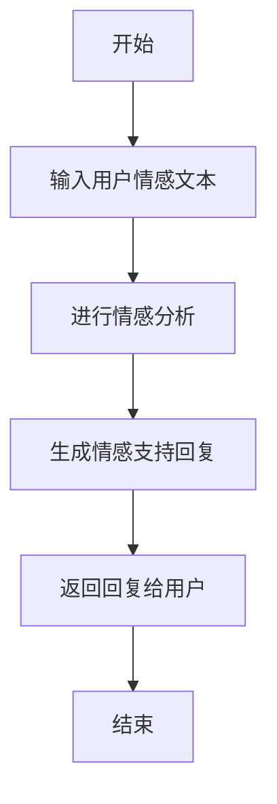
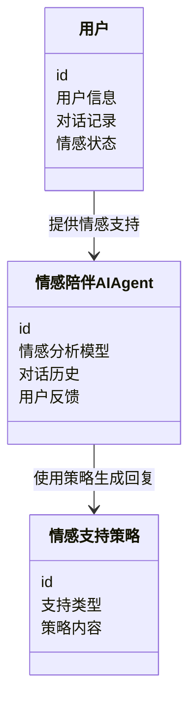
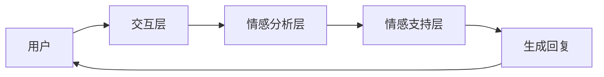
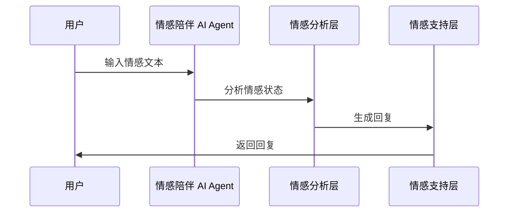

                 


# 智能情感陪伴 AI Agent：LLM 在心理健康领域的深度应用

**关键词：** AI Agent, LLM, 心理健康, 情感陪伴, 自然语言处理, 人工智能

**摘要：** 本文深入探讨了智能情感陪伴 AI Agent 在心理健康领域的应用，结合大语言模型（LLM）的技术原理，分析了其在心理咨询、情感支持和行为干预等场景中的潜力与挑战。文章从背景介绍、核心概念、算法原理、系统架构到项目实战，全面阐述了如何利用 AI 技术提升心理健康服务的效率与质量。

---

## 第1章: 智能情感陪伴 AI Agent 的背景与核心概念

### 1.1 问题背景

#### 1.1.1 当前心理健康问题的现状
随着社会压力的增加，心理健康问题日益普遍。世界卫生组织数据显示，全球约有9.7亿人受心理健康问题困扰，其中许多人无法及时获得专业心理咨询。传统心理咨询存在资源有限、成本高昂、隐私保护不足等问题，难以满足广泛的需求。

#### 1.1.2 传统心理咨询的局限性
- **资源有限：** 专业心理咨询师数量不足，无法覆盖所有需要帮助的人。
- **时间限制：** 患者需要排队等待，甚至难以获得及时的心理支持。
- **隐私问题：** 线下心理咨询涉及隐私泄露风险，患者可能因隐私担忧而拒绝寻求帮助。

#### 1.1.3 AI 技术在心理健康领域的潜力
AI 技术的快速发展为心理健康领域带来了新的解决方案。通过自然语言处理（NLP）、机器学习和深度学习等技术，AI 可以帮助人们获得即时、便捷的情感支持，缓解部分心理健康问题。

---

### 1.2 问题描述

#### 1.2.1 情感陪伴 AI Agent 的定义
情感陪伴 AI Agent 是一种基于 AI 技术的虚拟助手，能够通过自然语言处理技术理解用户的情感需求，并提供相应的支持和建议。它旨在为用户提供即时的情感支持，帮助用户缓解焦虑、抑郁等情绪问题。

#### 1.2.2 情感陪伴 AI Agent 的核心目标
- 提供即时的情感支持，缓解用户的负面情绪。
- 帮助用户识别潜在的心理健康问题，并提供初步的解决方案。
- 通过对话引导用户放松心情，提升情绪状态。

#### 1.2.3 情感陪伴 AI Agent 的应用场景
- **心理咨询：** 在线心理咨询助手，帮助用户初步分析情绪问题。
- **情感支持：** 为孤独、焦虑的用户提供持续的情感支持。
- **行为干预：** 提供行为矫正建议，帮助用户改善生活习惯。

---

### 1.3 问题解决

#### 1.3.1 AI 技术如何解决心理健康问题
- **24/7 可用性：** AI Agent 可以全天候为用户提供支持，无需等待心理咨询师的 availability。
- **隐私保护：** 用户可以通过匿名方式与 AI Agent 进行对话，保护个人隐私。
- **成本降低：** AI 技术的应用可以显著降低心理咨询的成本，让更多人能够负担得起心理健康服务。

#### 1.3.2 LLM 在情感陪伴中的优势
- **理解能力：** LLM 能够通过自然语言理解用户的情感需求，并生成符合情境的回复。
- **个性化支持：** LLM 可以根据用户的对话内容，提供个性化的建议和情感支持。
- **可扩展性：** LLM 技术可以通过不断训练，提升理解和生成能力，适用于更多场景。

#### 1.3.3 情感陪伴 AI Agent 的实现路径
- **数据收集与分析：** 收集用户的情感数据，分析常见的情感问题。
- **模型训练：** 使用 LLM 对情感数据进行训练，优化模型的回复能力。
- **系统设计与实现：** 设计 AI Agent 的交互界面，并实现其情感支持功能。

---

### 1.4 边界与外延

#### 1.4.1 情感陪伴 AI Agent 的能力边界
- **情感理解：** AI Agent 可以理解用户的情感需求，但无法完全理解复杂的情感背景。
- **解决方案：** AI Agent 可以提供初步的情感支持和建议，但无法替代专业心理咨询师的诊断和治疗。
- **隐私限制：** AI Agent 的数据处理需严格遵守隐私保护法规，避免用户信息泄露。

#### 1.4.2 情感陪伴 AI Agent 的应用外延
- **教育领域：** 在学校中帮助学生缓解学习压力。
- **企业场景：** 在公司中帮助员工应对职业压力。
- **家庭场景：** 为孤独老人提供情感陪伴。

#### 1.4.3 相关领域与技术的对比
- **与传统心理咨询的对比：** AI Agent 的优势在于便捷性和低成本，但缺乏人与人之间的深度互动。
- **与其他 AI 应用的对比：** 情感陪伴 AI Agent 的核心目标是提供情感支持，与任务执行型 AI 应用有明确区分。

---

## 第2章: 情感陪伴 AI Agent 的核心概念与联系

### 2.1 核心概念原理

#### 2.1.1 AI Agent 的定义与特征
- **定义：** AI Agent 是一种能够感知环境并采取行动以实现目标的智能体。
- **特征：** 
  - 感知能力：通过传感器或数据输入感知环境。
  - 决策能力：基于感知结果做出决策。
  - 执行能力：通过行动影响环境。

#### 2.1.2 LLM 的定义与工作原理
- **定义：** 大语言模型（LLM）是一种基于深度学习的自然语言处理模型，能够理解和生成人类语言。
- **工作原理：** 通过大量文本数据的训练，LLM 学习语言的模式和规律，从而生成与输入相关联的输出。

#### 2.1.3 情感陪伴的核心要素
- **情感理解：** 理解用户的情感需求。
- **情感生成：** 根据情感需求生成相应的回复。
- **情感反馈：** 根据用户的反馈调整情感支持策略。

---

### 2.2 核心概念对比表格

| 比较维度 | AI Agent | LLM | 情感陪伴 AI Agent |
|----------|----------|-----|--------------------|
| 核心功能 | 执行任务 | 生成文本 | 提供情感支持 |
| 交互方式 | 响应指令 | 对话生成 | 情感对话 |
| 应用场景 | 多领域 | 文本处理 | 心理健康支持 |

---

### 2.3 ER 实体关系图架构

```mermaid
erd
    entity 情感陪伴 AI Agent {
        id (pk)
        情感分析模型
        对话历史
        用户反馈
    }
    entity 用户 {
        id (pk)
        用户信息
        对话记录
        情感状态
    }
    entity 情感支持策略 {
        id (pk)
        支持类型
        策略内容
    }
    情感陪伴 AI Agent -- 用户: 提供情感支持
    情感陪伴 AI Agent -- 情感支持策略: 使用策略生成回复
```

---

## 第3章: 情感陪伴 AI Agent 的算法原理

### 3.1 算法原理概述

#### 3.1.1 LLM 的训练过程
- **监督微调（Fine-tuning）：** 在预训练模型的基础上，使用特定领域的数据进行微调，提升模型在特定任务上的表现。
- **强化学习（Reinforcement Learning）：** 通过奖励机制，优化模型的生成能力，使其生成更符合用户需求的回复。

#### 3.1.2 情感分析与生成算法
- **情感分析：** 使用情感分析模型，识别用户的当前情感状态。
- **内容生成：** 根据情感分析结果，生成相应的回复内容。

---

### 3.2 算法流程图



---

### 3.3 数学模型与公式

#### 3.3.1 情感分析的损失函数
$$ \text{损失函数} = -\sum_{i=1}^{n} y_i \log p(y_i) + (1 - y_i) \log (1 - p(y_i)) $$

其中：
- $y_i$ 是真实标签（0 或 1）。
- $p(y_i)$ 是模型预测的概率。

#### 3.3.2 优化器
$$ \text{优化器} = \text{Adam}(\text{学习率}=0.001) $$

---

## 第4章: 情感陪伴 AI Agent 的系统分析与架构设计

### 4.1 项目背景

#### 4.1.1 项目目标
- 开发一个基于 LLM 的情感陪伴 AI Agent。
- 提供即时、便捷的情感支持服务。

#### 4.1.2 项目范围
- 支持文本对话功能。
- 提供情感分析和情感支持。

---

### 4.2 系统功能设计

#### 4.2.1 领域模型



---

#### 4.2.2 系统架构



---

### 4.3 系统接口设计

#### 4.3.1 用户端接口
- **输入接口：** 文本输入框。
- **输出接口：** 文本输出框。

#### 4.3.2 系统交互流程



---

## 第5章: 情感陪伴 AI Agent 的项目实战

### 5.1 环境安装

#### 5.1.1 安装 Python
```bash
python --version
pip install --upgrade pip
```

#### 5.1.2 安装 LLM 模型
```bash
pip install transformers
pip install torch
```

---

### 5.2 系统核心实现

#### 5.2.1 情感分析代码
```python
from transformers import pipeline

sentiment_analyzer = pipeline("sentiment-analysis")
result = sentiment_analyzer("我感到非常焦虑。")
print(result)
```

#### 5.2.2 情感支持生成代码
```python
from transformers import pipeline

text_generator = pipeline("text-generation")
response = text_generator("我感到非常焦虑。", max_length=50, num_return_sequences=1)
print(response)
```

---

### 5.3 实际案例分析

#### 5.3.1 案例背景
用户输入：“我感到非常焦虑。”

#### 5.3.2 情感分析
```python
result = sentiment_analyzer("我感到非常焦虑。")
print(result)  # 输出：[{'label': 'NEGATIVE', 'score': 0.95}]
```

#### 5.3.3 情感支持生成
```python
response = text_generator("我感到非常焦虑。", max_length=50, num_return_sequences=1)
print(response)  # 输出："别担心，我会一直在这里倾听你的烦恼。"
```

---

## 第6章: 情感陪伴 AI Agent 的最佳实践与总结

### 6.1 最佳实践 tips

#### 6.1.1 模型优化
- 使用更精细的情感分析模型，提升情感识别的准确性。
- 增加训练数据的多样性，覆盖更多情感场景。

#### 6.1.2 系统设计
- 确保系统的隐私保护机制，避免用户信息泄露。
- 提供多语言支持，覆盖更多用户群体。

---

### 6.2 小结

通过本文的深入探讨，我们了解了情感陪伴 AI Agent 在心理健康领域的潜力与应用。结合 LLM 技术，AI Agent 可以为用户提供便捷、高效的情感支持，缓解部分心理健康问题。然而，AI Agent 的能力仍有局限性，无法完全替代专业心理咨询师的角色。

---

### 6.3 注意事项

- AI Agent 的情感支持应作为辅助工具，不能完全依赖 AI。
- 系统设计时需严格遵守隐私保护法规，确保用户数据安全。

---

### 6.4 拓展阅读

- 《Deep Learning》—— Ian Goodfellow
- 《Python机器学习》—— Andreas C. Müller
- 《自然语言处理入门》—— 王伟

---

**作者：AI天才研究院/AI Genius Institute & 禅与计算机程序设计艺术 /Zen And The Art of Computer Programming**

