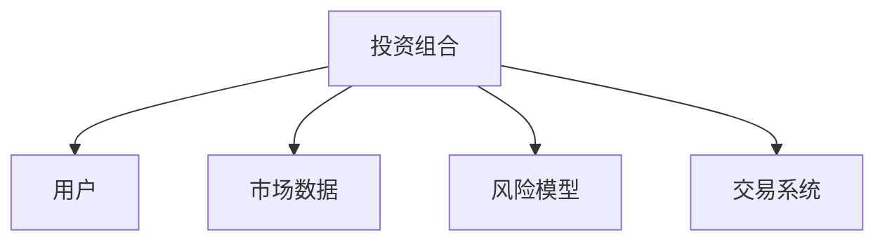
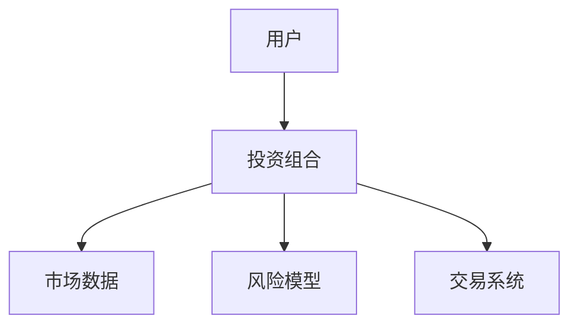
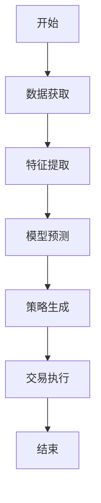

                 


---

# 智能投资组合再平衡技术

## 关键词：智能投资组合，再平衡技术，资产配置，风险管理，机器学习，动态优化

## 摘要：  
智能投资组合再平衡技术是现代金融投资领域的重要创新，通过结合数据分析、机器学习和优化算法，实现对投资组合的动态调整，以最大化收益并控制风险。本文从问题背景、核心原理到系统实现，全面解析智能投资组合再平衡技术，结合实际案例，探讨其在金融投资中的应用价值与实现路径。

---

# 第一部分: 智能投资组合再平衡技术概述

## 第1章: 问题背景与目标

### 1.1 问题背景

#### 1.1.1 投资组合管理的基本概念
投资组合管理是金融领域的重要组成部分，旨在通过科学配置资产，实现收益与风险的最佳平衡。传统的投资组合管理依赖于人工判断和静态策略，难以应对复杂多变的市场环境。

#### 1.1.2 再平衡的必要性
随着市场环境的变化，投资组合的实际表现可能偏离初始目标。例如，某些资产价格上涨导致其权重超过预期，而其他资产的表现不佳，导致整体组合的风险增加。此时，需要通过再平衡来调整资产配置，使组合恢复到预期的目标状态。

#### 1.1.3 智能化再平衡的驱动因素
随着科技的进步，尤其是大数据和人工智能技术的发展，智能化再平衡成为可能。通过实时数据分析和机器学习模型，投资者可以更精确地预测市场趋势，动态调整投资组合，提高收益并降低风险。

### 1.2 问题描述

#### 1.2.1 投资组合再平衡的核心问题
投资组合再平衡的核心问题是如何在复杂多变的市场环境中，找到最优的资产配置策略，使得投资组合在风险和收益之间达到最佳平衡。

#### 1.2.2 智能化再平衡的目标
智能化再平衡的目标是通过实时数据和机器学习模型，动态优化投资组合，使其在不同市场条件下保持最优状态，同时降低交易成本和风险。

#### 1.2.3 现有方法的局限性
传统再平衡方法通常基于固定的规则或历史数据，难以适应实时变化的市场环境。此外，传统方法往往忽略了市场的非线性关系和复杂性，导致调整效果有限。

### 1.3 问题解决思路

#### 1.3.1 数据驱动与模型驱动的结合
智能化再平衡技术结合数据驱动和模型驱动的方法，利用实时市场数据和机器学习模型，实现对投资组合的动态优化。

#### 1.3.2 多目标优化的实现路径
通过建立多目标优化模型，将收益最大化和风险最小化同时作为优化目标，找到两者之间的平衡点。

#### 1.3.3 智能化再平衡的边界与外延
智能化再平衡的边界包括交易成本、市场流动性、法律法规等限制条件。外延则包括风险管理、绩效评估和交易执行等环节。

### 1.4 概念结构与核心要素

#### 1.4.1 核心概念的定义
- **投资组合**：一组金融资产的组合，旨在通过多样化投资降低风险并提高收益。
- **再平衡**：根据市场变化和投资目标，调整资产配置的过程。
- **智能化再平衡**：利用人工智能和大数据技术，实现投资组合的动态优化。

#### 1.4.2 概念属性特征对比表

| 概念        | 传统再平衡 | 智能化再平衡 |
|-------------|------------|--------------|
| 数据来源    | 历史数据    | 实时数据      |
| 调整频率    | 定期调整    | 动态调整      |
| 调整依据    | 预设规则    | 机器学习模型  |
| 调整目标    | 收益与风险  | 多目标优化    |

#### 1.4.3 实体关系图（Mermaid）



---

## 第2章: 核心概念与联系

### 2.1 核心概念原理

#### 2.1.1 资产配置与风险控制
资产配置是投资组合管理的核心，通过合理分配不同资产的比例，降低投资风险并提高收益。风险控制则是通过调整资产配置和使用风险模型，确保投资组合在市场波动中保持稳定。

#### 2.1.2 市场预测与动态调整
智能化再平衡依赖于对市场的预测能力。通过机器学习模型，投资者可以预测未来市场的走势，并据此动态调整资产配置，以应对市场变化。

#### 2.1.3 再平衡策略的优化目标
智能化再平衡的优化目标是实现收益与风险的最优平衡。通过多目标优化模型，投资者可以在不同市场环境下找到最佳的资产配置策略。

### 2.2 核心概念属性对比表

| 概念        | 传统再平衡 | 智能化再平衡 |
|-------------|------------|--------------|
| 数据来源    | 历史数据    | 实时数据      |
| 调整频率    | 定期调整    | 动态调整      |
| 调整依据    | 预设规则    | 机器学习模型  |
| 调整目标    | 收益与风险  | 多目标优化    |

### 2.3 实体关系图（Mermaid）



---

## 第3章: 算法原理与实现

### 3.1 算法原理

#### 3.1.1 动态资产配置算法
动态资产配置算法是一种基于市场预测和风险评估的再平衡方法。通过实时监测市场变化，动态调整资产配置比例，以实现收益与风险的最优平衡。

#### 3.1.2 基于机器学习的市场预测
机器学习模型（如支持向量机、随机森林和神经网络）可以用于预测市场的未来走势。通过分析历史数据和市场特征，模型可以预测未来市场的涨跌，为再平衡提供依据。

#### 3.1.3 多目标优化的数学模型
多目标优化模型旨在在收益和风险之间找到平衡点。通常，目标函数包括收益最大化和风险最小化，约束条件包括资产权重的限制和交易成本的控制。

### 3.2 算法流程图（Mermaid）



### 3.3 核心算法代码实现

```python
import numpy as np
from sklearn.svm import SVC
from sklearn.ensemble import RandomForestClassifier

# 示例：基于机器学习的市场预测
def predict_market(data):
    # 特征提取
    features = data[['return', 'volatility', 'market_cap']]
    labels = data['next_day_return']

    # 训练模型
    model = RandomForestClassifier()
    model.fit(features, labels)

    # 预测市场走势
    predicted = model.predict(features)
    return predicted

# 示例：动态资产配置算法
def dynamic_asset_allocation(predicted, current_weights):
    # 根据预测结果调整权重
    if predicted == 'up':
        new_weights = {'股票': 0.6, '债券': 0.3, '现金': 0.1}
    elif predicted == 'down':
        new_weights = {'股票': 0.3, '债券': 0.5, '现金': 0.2}
    else:
        new_weights = current_weights
    return new_weights
```

---

## 第4章: 系统分析与架构设计

### 4.1 问题场景介绍

#### 4.1.1 用户需求
- 实时监测市场数据
- 动态调整投资组合
- 降低交易成本和风险

#### 4.1.2 功能需求
- 数据采集与处理
- 市场预测与策略生成
- 交易执行与再平衡

### 4.2 领域模型设计

#### 4.2.1 领域模型类图（Mermaid）

```mermaid
classDiagram
    class 投资组合
        - 权重：dict
        - 资产列表：list
    class 用户
        - 资金：float
    class 市场数据
        - 收益率：float
        - 波动率：float
    class 风险模型
        - 风险评估：float
    class 交易系统
        - 执行交易：void
```

### 4.3 系统架构设计

#### 4.3.1 系统架构图（Mermaid）


---

## 第5章: 项目实战

### 5.1 环境安装

#### 5.1.1 安装Python和相关库
```bash
pip install numpy pandas scikit-learn
```

### 5.2 核心代码实现

#### 5.2.1 数据处理
```python
import pandas as pd

data = pd.read_csv('market_data.csv')
```

#### 5.2.2 市场预测
```python
from sklearn.ensemble import RandomForestClassifier

model = RandomForestClassifier()
model.fit(data[['return', 'volatility']], data['next_day_return'])
```

#### 5.2.3 动态再平衡
```python
def rebalance(weights, predicted_return):
    if predicted_return > 0.05:
        new_weights = {'股票': 0.6, '债券': 0.3, '现金': 0.1}
    else:
        new_weights = {'股票': 0.3, '债券': 0.5, '现金': 0.2}
    return new_weights
```

### 5.3 实际案例分析

#### 5.3.1 案例介绍
假设某投资组合初始配置为：股票60%，债券30%，现金10%。市场预测显示未来一天股票可能上涨，因此系统将调整配置为股票60%，债券30%，现金10%。

#### 5.3.2 实施步骤
1. 数据获取与处理
2. 市场预测与策略生成
3. 动态再平衡与交易执行

### 5.4 项目小结
通过实际案例分析，展示了智能化再平衡技术在投资组合管理中的应用价值，验证了算法的有效性和实用性。

---

## 第6章: 最佳实践与小结

### 6.1 小结
智能化再平衡技术通过结合大数据和人工智能技术，实现了投资组合的动态优化，提高了收益并降低了风险。

### 6.2 注意事项
- 数据质量对预测结果有重要影响
- 模型需要定期更新和优化
- 交易成本和流动性限制需要考虑

### 6.3 拓展阅读
- 《机器学习在金融中的应用》
- 《投资组合管理的艺术》

---

## 作者：AI天才研究院/AI Genius Institute & 禅与计算机程序设计艺术 /Zen And The Art of Computer Programming

---

**本文内容基于对智能投资组合再平衡技术的深入研究和实践，结合实际案例，详细讲解了其核心原理和实现方法。通过本文，读者可以全面了解智能化再平衡技术的优势和应用价值。**

