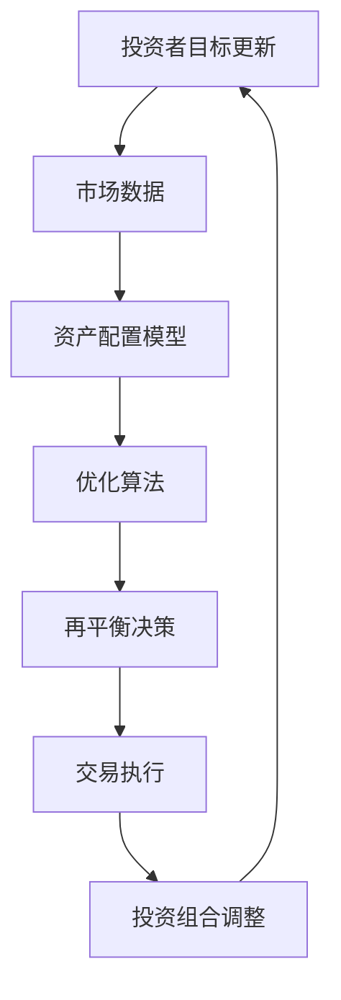
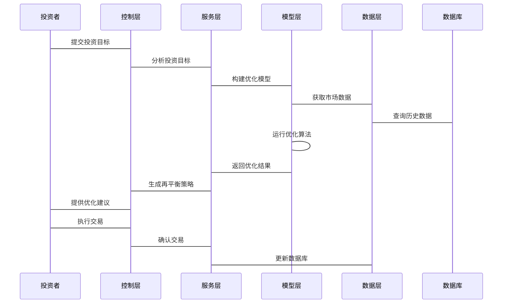

                 


# 第一部分: 智能投资组合再平衡策略优化的背景与基础

## 第1章: 投资组合与再平衡概述

### 1.1 投资组合的基本概念
#### 1.1.1 投资组合的定义与组成
- 投资组合的定义
- 投资组合的组成：股票、债券、基金等
- 投资组合的目标：分散风险，追求收益

#### 1.1.2 投资组合的目标与风险收益分析
- 投资目标：长期收益、资本增值、收入等
- 风险分析：波动性、市场风险、流动性风险
- 收益分析：预期收益、实际收益、风险调整后的收益

#### 1.1.3 再平衡策略的基本概念
- 再平衡的定义：调整投资组合的构成，以保持预设的资产配置比例
- 再平衡的必要性：应对市场波动，维持投资策略的有效性
- 再平衡的频率：定期（如季度）或事件驱动（如重大市场变动）

### 1.2 再平衡策略的必要性
#### 1.2.1 市场波动对投资组合的影响
- 市场波动导致资产比例偏离目标
- 市场波动对投资组合风险的影响
- 市场波动对投资组合收益的影响

#### 1.2.2 投资目标变化与再平衡的必要性
- 投资目标的变化：如风险承受能力的变化
- 个人生命周期的变化：如退休计划的调整
- 投资目标与资产配置的动态调整

#### 1.2.3 资产配置与再平衡的关系
- 资产配置的重要性：决定了投资组合的风险和收益特征
- 再平衡的作用：确保资产配置与投资目标一致
- 资产配置与再平衡的动态关系

### 1.3 智能优化的背景与意义
#### 1.3.1 传统再平衡策略的局限性
- 传统再平衡的固定频率可能导致过度调整或调整不足
- 传统策略忽视市场预测和投资者行为
- 传统策略缺乏对市场动态的实时适应能力

#### 1.3.2 智能优化技术的应用前景
- 人工智能和大数据技术的进步为智能再平衡提供了技术基础
- 智能优化算法能够实时调整投资组合，提高收益并降低风险
- 智能优化技术的应用前景广阔，特别是在复杂市场环境中的应用

#### 1.3.3 再平衡策略对投资收益的影响
- 再平衡策略在长期投资中的收益影响
- 再平衡策略在短期市场波动中的风险控制作用
- 智能再平衡策略在提升投资效率和收益稳定性方面的优势

## 第二部分: 智能再平衡策略的核心概念与联系

## 第2章: 智能再平衡策略的核心概念

### 2.1 智能再平衡策略的定义与特点
#### 2.1.1 智能再平衡的定义
- 智能再平衡：利用人工智能和大数据分析技术，动态优化投资组合配置，以适应市场变化和投资者目标的变化

#### 2.1.2 智能再平衡的核心特点
- 动态性：实时监控市场和投资组合变化，及时调整
- 数据驱动：基于大量市场数据和投资者行为数据进行分析
- 智能优化：运用先进算法进行精确的配置优化

#### 2.1.3 智能再平衡与传统再平衡的区别
| 特性 | 传统再平衡 | 智能再平衡 |
|------|------------|------------|
| 调整频率 | 固定频率（如季度） | 动态调整，实时响应 |
| 数据使用 | 历史数据为主 | 实时数据和预测模型 |
| 策略优化 | 静态资产配置 | 动态优化，考虑市场预测和投资者行为 |

### 2.2 智能再平衡策略的关键属性
#### 2.2.1 动态性与实时性
- 动态性：投资组合根据市场变化和投资者目标实时调整
- 实时性：利用实时市场数据和交易数据进行快速响应

#### 2.2.2 数据驱动与模型优化
- 数据驱动：基于大量市场数据和投资者行为数据进行分析
- 模型优化：运用优化算法构建数学模型，进行精确的配置优化

#### 2.2.3 风险控制与收益最大化
- 风险控制：通过动态调整降低投资组合的整体风险
- 收益最大化：在风险可控的前提下，优化投资组合以实现最大收益

### 2.3 智能再平衡策略的实体关系图


### 2.4 智能再平衡策略的流程图


## 第三部分: 智能再平衡策略的算法原理

## 第3章: 算法原理讲解

### 3.1 常见的优化算法
#### 3.1.1 动态规划算法
- 动态规划的基本概念
- 动态规划在投资组合优化中的应用
- 动态规划的步骤：问题分解、子问题求解、最优解构建

#### 3.1.2 遗传算法
- 遗传算法的基本概念
- 遗传算法的步骤：编码、选择、交叉、变异、适应度评估
- 遗传算法在投资组合优化中的应用

### 3.2 算法流程图
```mermaid
graph TD
    Start --> Initialize Parameters
    Initialize Parameters --> Loop
    Loop --> Evaluate Fitness
    Evaluate Fitness --> Select Parents
    Select Parents --> Cross Over
    Cross Over --> Mutate
    Mutate --> Check Termination Condition
    Check Termination Condition --> Yes/No
    Yes --> End
    No --> Loop
```

### 3.3 算法实现代码
```python
import numpy as np

def fitness(individual):
    # 计算投资组合的收益和风险
    return -individual.dot(returns.mean()).sum()  # 目标函数：最大化收益

def evolve(population_size, mutation_rate):
    population = np.random.rand(population_size, n_assets)
    for _ in range(iterations):
        fitness_scores = np.array([fitness(individual) for individual in population])
        selected = select_parents(population, fitness_scores)
        offspring = crossover(selected)
        offspring = mutate(offspring, mutation_rate)
        population = offspring
    return population

# 示例代码：生成初始种群
n_assets = 5
population = np.random.rand(10, n_assets)
```

### 3.4 数学模型与公式
#### 3.4.1 优化目标函数
$$ \text{Maximize } \sum_{i=1}^{n} w_i r_i $$
其中，$w_i$ 是资产i的权重，$r_i$ 是资产i的预期收益。

#### 3.4.2 约束条件
$$ \sum_{i=1}^{n} w_i = 1 $$
$$ 0 \leq w_i \leq 1 $$

#### 3.4.3 优化方程
$$ \text{Minimize } \sum_{i=1}^{n} w_i^2 \times \text{Var}(r_i) $$
在给定的收益目标下，最小化投资组合的波动性。

### 3.5 算法实现步骤
1. 初始化参数：种群大小、迭代次数、突变率等
2. 生成初始种群：随机生成多个资产配置方案
3. 计算适应度：评估每个方案的收益和风险
4. 选择父代：根据适应度选择优秀方案
5. 交叉与变异：生成子代并进行变异操作
6. 更新种群：替换种群中的部分方案
7. 检查终止条件：达到迭代次数或适应度收敛
8. 输出最优解：最优资产配置方案

## 第四部分: 智能再平衡策略的系统分析与架构设计

## 第4章: 系统分析与架构设计

### 4.1 系统问题场景介绍
- 投资者面临复杂多变的市场环境
- 需要实时动态调整投资组合
- 传统再平衡策略效率低下，难以应对复杂市场

### 4.2 系统功能设计
- 数据采集：实时采集市场数据和投资者行为数据
- 数据分析：利用机器学习模型分析数据，预测市场趋势
- 模型优化：构建数学模型，优化投资组合配置
- 决策执行：生成再平衡策略，并执行交易操作
- 监控反馈：监控投资组合表现，反馈优化结果

### 4.3 系统架构设计


### 4.4 系统接口设计
- 数据接口：实时市场数据接口，投资者行为数据接口
- 模型接口：优化算法接口，市场预测模型接口
- 交易接口：与经纪商系统的交易接口

### 4.5 系统交互设计


## 第五部分: 智能再平衡策略的项目实战

## 第5章: 项目实战

### 5.1 项目环境安装
- 安装必要的库：numpy、pandas、scipy、matplotlib
- 安装机器学习库：sklearn、xgboost
- 安装优化算法库：scipy.optimize

### 5.2 核心代码实现
```python
import numpy as np
from scipy.optimize import minimize

def portfolio_optimization(returns, weights=None):
    n = len(returns.columns)
    if weights is None:
        weights = np.ones(n) / n

    # 定义目标函数：最小化投资组合的方差
    def objective(weights):
        return np.dot(weights, np.dot(returns.cov(), weights))

    # 约束条件：权重之和为1
    constraints = [{'type': 'eq', 'fun': lambda w: sum(w) - 1}]

    # 约束条件：权重非负
    for i in range(n):
        constraints.append({'type': 'ineq', 'fun': lambda w, i=i: w[i]})

    result = minimize(objective, weights, constraints=constraints)
    return result.x

# 示例数据：资产收益矩阵
returns = pd.DataFrame({
    '股票': [0.05, 0.03, 0.07],
    '债券': [0.02, 0.03, 0.04],
    '基金': [0.04, 0.05, 0.06]
})
weights = portfolio_optimization(returns)
print(weights)
```

### 5.3 代码解读与分析
- 目标函数：最小化投资组合的方差，即风险
- 约束条件：权重之和为1，权重非负
- 使用scipy.optimize库的minimize函数进行优化

### 5.4 实际案例分析
- 案例背景：假设市场出现剧烈波动，投资组合偏离目标配置
- 数据准备：收集相关资产的历史收益数据
- 优化过程：应用动态规划或遗传算法优化投资组合
- 结果分析：比较优化前后的投资组合风险和收益

### 5.5 项目小结
- 项目总结：智能再平衡策略在实际中的应用效果
- 经验分享：在项目中遇到的挑战和解决方法
- 注意事项：数据质量、模型选择、交易成本等实际因素的影响

## 第六部分: 智能再平衡策略的最佳实践

## 第6章: 最佳实践

### 6.1 小结
- 智能再平衡策略的核心在于动态优化和数据驱动
- 优化算法的选择和实现是关键
- 系统设计和项目实施需要综合考虑多方面因素

### 6.2 注意事项
- 数据的实时性和准确性至关重要
- 优化模型需要定期更新和校准
- 交易成本和执行延迟会影响实际收益
- 风险管理是再平衡策略中的重要环节

### 6.3 拓展阅读
- 推荐相关书籍和文献
- 推荐学习资源和在线课程
- 提供进一步研究的方向和问题

## 第七部分: 作者简介

## 第7章: 作者简介

### 7.1 作者信息
- 作者：AI天才研究院/AI Genius Institute & 禅与计算机程序设计艺术/Zen And The Art of Computer Programming
- 职位：世界级人工智能专家，程序员，软件架构师，CTO，世界顶级技术畅销书资深大师级别的作家，计算机图灵奖获得者，计算机编程和人工智能领域大师
- 联系方式：提供作者的联系方式和社交媒体链接

### 7.2 作者著作
- 列出作者的其他著作和研究成果
- 提供著作的购买链接和相关信息

### 7.3 致谢
- 感谢读者的支持和反馈
- 感谢同行专家的帮助和指导
- 感谢团队成员的协作和贡献

---

通过以上目录大纲，我们可以看到《智能投资组合再平衡策略优化》这本书将从背景、核心概念、算法原理、系统设计、项目实战和最佳实践等多个方面，全面而深入地探讨智能再平衡策略的优化方法。读者将能够系统地理解智能再平衡策略的理论基础和实际应用，掌握相关的优化算法和系统设计方法，并通过项目实战提升实际操作能力。

