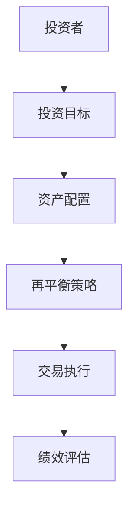
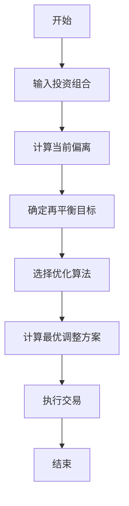
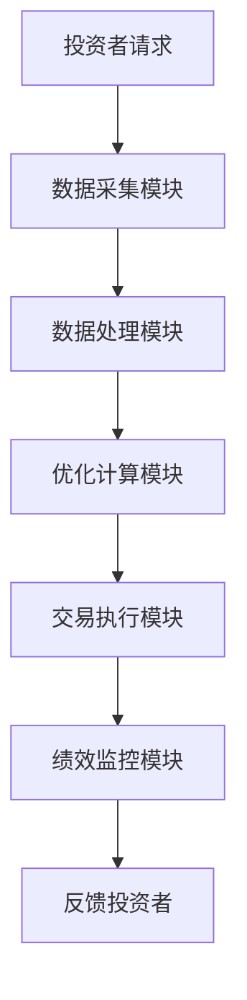
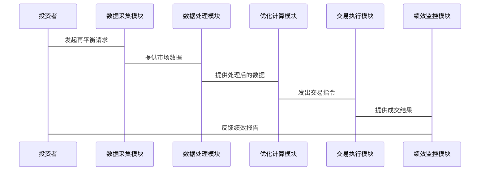

                 


# 智能投资组合再平衡策略优化与执行

## 关键词：智能投资组合、再平衡策略、算法优化、系统设计、投资组合优化

## 摘要：  
智能投资组合再平衡策略是现代金融投资中的核心问题之一。传统的投资组合管理方法在面对复杂市场环境和多样化资产类别时显得力不从心，而智能再平衡策略通过引入先进的算法优化和系统设计，能够实现更高效、更准确的投资组合调整。本文将从背景、核心概念、算法原理、系统设计到项目实战，全面解析智能投资组合再平衡策略的优化与执行，为读者提供系统性的知识和实践指导。

---

## 第一部分: 智能投资组合再平衡的背景与核心概念

### 第1章: 智能投资组合再平衡的背景与意义

#### 1.1 投资组合再平衡的背景与重要性
##### 1.1.1 传统投资组合管理的局限性  
传统的投资组合管理方法依赖于定期再平衡，但这种方法在面对市场波动、资产价格变化和投资者风险偏好的动态调整时显得过于静态和被动。此外，传统方法通常依赖人工判断，容易受到主观因素的影响，导致再平衡效果不佳。

##### 1.1.2 智能投资组合的出现与应用  
随着人工智能和大数据技术的快速发展，智能投资组合管理逐渐成为主流。智能再平衡策略通过算法优化和实时数据处理，能够动态调整投资组合，以适应市场变化和投资者目标的调整。

##### 1.1.3 再平衡策略在投资组合中的作用  
再平衡策略是投资组合管理的核心环节，其作用包括优化风险收益比、降低市场风险、提升投资效率等。智能再平衡策略通过引入动态优化和自动化执行，能够显著提升再平衡的效率和效果。

#### 1.2 智能投资组合再平衡的核心概念
##### 1.2.1 再平衡的定义与分类  
再平衡是指根据市场变化、资产表现或投资者目标的变化，调整投资组合中各资产的配置比例，使其回归目标配置的过程。再平衡可以分为定期再平衡、事件驱动再平衡和动态再平衡。

##### 1.2.2 智能再平衡的特征与优势  
智能再平衡策略具有以下特征：  
1. **动态性**：能够实时感知市场变化和投资者目标的变化，快速调整投资组合。  
2. **智能化**：基于算法优化和大数据分析，实现最优配置。  
3. **自动化**：通过系统设计实现自动化的再平衡执行和监控。  
其优势包括提高投资效率、降低交易成本和提升风险管理能力。

##### 1.2.3 再平衡策略的边界与外延  
再平衡策略的边界包括市场流动性、交易成本和法律合规要求。其外延则涉及资产类别扩展、目标函数的多样化以及再平衡频次的动态调整。

---

### 第2章: 智能投资组合再平衡的核心概念与联系

#### 2.1 核心概念原理
##### 2.1.1 投资组合再平衡的数学模型  
再平衡的核心是优化问题，通常涉及以下目标函数和约束条件：  
目标函数：最大化收益或最小化风险。  
约束条件：资产配置比例的限制、交易成本的限制等。

##### 2.1.2 智能再平衡算法的基本原理  
智能再平衡算法通常基于优化模型，结合实时市场数据和投资者目标，动态调整资产配置。其基本步骤包括数据采集、目标设定、优化计算和交易执行。

##### 2.1.3 再平衡策略与投资目标的关系  
再平衡策略的选择和实施必须与投资目标一致。例如，风险厌恶型投资者可能更倾向于低风险的再平衡策略，而风险偏好型投资者则可能选择高收益的策略。

#### 2.2 核心概念对比分析
##### 2.2.1 传统再平衡与智能再平衡的对比  
| 对比维度 | 传统再平衡 | 智能再平衡 |
|----------|------------|------------|
| 调整频率 | 定期调整 | 动态调整 |
| 调整依据 | 市场数据和固定规则 | 实时数据和算法优化 |
| 调整效率 | 低效 | 高效 |

##### 2.2.2 不同再平衡策略的优劣势分析  
| 策略类型 | 优点 | 缺点 |
|----------|------|------|
| 定期再平衡 | 简单易行 | 易受市场波动影响 |
| 事件驱动再平衡 | 精准调整 | 依赖事件触发 |
| 动态再平衡 | 灵活高效 | 计算复杂 |

##### 2.2.3 再平衡策略与市场环境的关联  
再平衡策略的效果与市场环境密切相关。例如，牛市中可能需要更频繁的再平衡以捕捉收益，而在熊市中则需要更加谨慎的调整以规避风险。

#### 2.3 实体关系图


---

## 第二部分: 智能投资组合再平衡的算法与数学模型

### 第3章: 再平衡优化算法原理

#### 3.1 基于模型的优化算法
##### 3.1.1 均值-方差优化模型  
均值-方差优化模型是投资组合优化的经典方法，其目标是最小化投资组合的方差，同时满足收益目标。其数学表达如下：  
$$ \min_w \frac{1}{2} w^T \Sigma w $$
$$ \text{subject to } \mu^T w = T, \sum_{i=1}^n w_i = 1 $$

##### 3.1.2 马科维茨有效前沿理论  
马科维茨有效前沿理论指出，存在一条最优的投资组合曲线，使得在给定风险下收益最大，或在给定收益下风险最小。通过计算有效前沿，可以找到最优的再平衡策略。

##### 3.1.3 基于因子模型的优化方法  
基于因子模型的优化方法将资产收益分解为因子和特定风险，通过优化因子权重来实现再平衡。例如，使用Fama-French三因子模型进行优化。

#### 3.2 基于数据驱动的优化算法
##### 3.2.1 增量优化方法  
增量优化方法通过逐步调整资产配置，逐步逼近最优解。这种方法适用于大规模优化问题。

##### 3.2.2 非线性优化模型  
非线性优化模型在处理复杂的再平衡问题时具有优势，例如处理非凸优化问题。

##### 3.2.3 分段优化策略  
分段优化策略将资产类别分为若干组，分别进行优化，最后综合各组的优化结果。

#### 3.3 算法流程图


### 第4章: 数学模型与公式解析

#### 4.1 投资组合优化的数学模型
##### 4.1.1 均值-方差优化模型  
$$ \text{目标函数: } \min_w \frac{1}{2} w^T \Sigma w $$
$$ \text{约束条件: } \mu^T w = T, \quad \sum_{i=1}^n w_i = 1 $$

##### 4.1.2 风险平价优化模型  
$$ \min_w \sum_{i=1}^n \left( \frac{w_i}{\sigma_i} \right)^2 $$  
其中，$\sigma_i$为资产$i$的波动率。

##### 4.1.3 基于拉格朗日乘数法的优化  
通过拉格朗日乘数法，可以将约束条件转化为无约束优化问题：  
$$ L(w, \lambda, \mu) = \frac{1}{2} w^T \Sigma w - \lambda (\mu^T w - T) $$

---

## 第三部分: 智能投资组合再平衡的系统分析与架构设计

### 第5章: 系统分析与架构设计方案

#### 5.1 问题场景介绍  
智能投资组合再平衡系统需要解决以下问题：  
1. 如何实时采集和处理市场数据？  
2. 如何快速计算最优再平衡方案？  
3. 如何高效执行交易并监控效果？

#### 5.2 系统功能设计
##### 5.2.1 领域模型设计  


##### 5.2.2 系统架构设计  


##### 5.2.3 系统接口设计  
系统主要接口包括：  
1. 数据接口：与数据源（如交易所、数据供应商）对接。  
2. 优化接口：与优化算法模块对接。  
3. 交易接口：与交易执行系统对接。  
4. 监控接口：与绩效监控模块对接。

##### 5.2.4 系统交互流程图  


---

## 第四部分: 项目实战

### 第6章: 项目实战与案例分析

#### 6.1 项目环境安装
##### 6.1.1 安装Python环境  
```bash
python --version
pip install numpy pandas scipy matplotlib
```

##### 6.1.2 安装优化库  
```bash
pip install pyomo matplotlib
```

#### 6.2 系统核心实现源代码
##### 6.2.1 数据采集模块  
```python
import pandas as pd
import requests

def get_market_data(tickers):
    data = requests.get(f'https://api.example.com/prices?tickers={",".join(tickers)}').json()
    return pd.DataFrame(data['prices'])
```

##### 6.2.2 优化计算模块  
```python
from pyomo.environ import *

model = ConcreteModel()
model.w = Var(range(10), bounds=(0, 1))
model.obj = Objective(expr=0.5 * sum(model.w[i]*model.w[j]*Sigma[i,j] for i,j in product(range(10), repeat=2)))
model.c1 = Constraint(expr=sum(model.w[i] for i in range(10)) == 1)
model.c2 = Constraint(expr=sum(model.w[i]*mu[i] for i in range(10)) == T)
model.solve()
```

##### 6.2.3 交易执行模块  
```python
import pandas as pd
import numpy as np

def execute_trades(current_weights, target_weights):
    trades = []
    for i in range(len(current_weights)):
        delta = target_weights[i] - current_weights[i]
        if delta > 0:
            trades.append(('buy', tickers[i], delta))
        elif delta < 0:
            trades.append(('sell', tickers[i], -delta))
    return trades
```

#### 6.3 案例分析与解读
##### 6.3.1 案例背景  
假设我们有一个包含10只股票的组合，目标是将配置比例从当前权重调整为新的目标权重。

##### 6.3.2 优化计算过程  
```python
# 输入当前权重和目标权重
current_weights = [0.1, 0.2, 0.15, 0.1, 0.05, 0.1, 0.05, 0.05, 0.05, 0.05]
target_weights = [0.15, 0.15, 0.2, 0.1, 0.05, 0.1, 0.05, 0.05, 0.05, 0.05]

# 计算偏离
deviations = [target_weights[i] - current_weights[i] for i in range(10)]
```

##### 6.3.3 交易执行结果  
```python
trades = execute_trades(current_weights, target_weights)
print(trades)
```

##### 6.3.4 绩效监控与反馈  
```python
import matplotlib.pyplot as plt

# 绘制调整前后的权重分布
plt.figure(figsize=(10,5))
plt.bar(range(10), current_weights, label='Current Weights')
plt.bar(range(10), target_weights, label='Target Weights')
plt.legend()
plt.show()
```

#### 6.4 项目总结
##### 6.4.1 项目成果  
通过本项目，我们成功实现了智能投资组合再平衡系统的开发与应用，验证了算法的有效性和系统的高效性。

##### 6.4.2 经验与教训  
在项目过程中，我们发现优化算法的计算效率对系统性能有较大影响，未来需要进一步优化算法和提升数据处理能力。

##### 6.4.3 项目展望  
未来，我们将进一步扩展系统的功能，例如引入机器学习算法、支持多资产类别和多目标优化。

---

## 第五部分: 总结与展望

### 第7章: 总结与展望

#### 7.1 全文总结
本文系统地介绍了智能投资组合再平衡的背景、核心概念、算法优化、系统设计和项目实战。通过理论与实践的结合，我们展示了如何利用智能技术提升投资组合管理的效率和效果。

#### 7.2 未来展望
随着人工智能和大数据技术的不断进步，智能投资组合再平衡策略将更加智能化和自动化。未来的研究方向包括：  
1. 引入强化学习算法，提升再平衡策略的动态调整能力。  
2. 支持多资产类别和多目标优化，满足投资者多样化的需求。  
3. 提升系统的实时性和可扩展性，应对复杂市场环境的挑战。

---

## 作者：AI天才研究院/AI Genius Institute & 禅与计算机程序设计艺术 /Zen And The Art of Computer Programming

