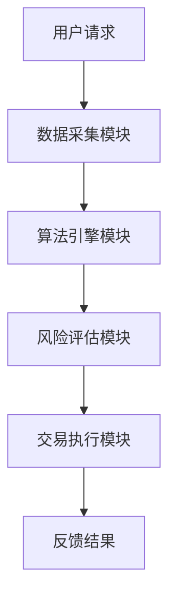

                 


# 智能投资组合再平衡算法

## 关键词：智能投资组合，再平衡算法，动态优化，风险管理，收益最大化，数据驱动

## 摘要：智能投资组合再平衡算法是一种基于数据驱动的动态优化方法，旨在根据市场波动和投资者风险偏好，自动调整投资组合配置，以实现收益最大化和风险最小化。本文将从背景、原理、算法实现、数学模型、系统架构到项目实战，全面解析智能投资组合再平衡算法的核心思想和实现方法，帮助投资者和开发者更好地理解和应用这一技术。

---

# 第一部分: 智能投资组合再平衡算法背景与概念

## 第1章: 智能投资组合再平衡算法概述

### 1.1 投资组合再平衡的背景与问题背景
#### 1.1.1 投资组合管理的基本概念
投资组合是指将资金分配到不同资产（如股票、债券、基金等）上的配置方式。通过合理的资产配置，投资者可以在风险可控的前提下，追求收益的最大化。

#### 1.1.2 再平衡的定义与必要性
再平衡是指根据市场变化和投资者风险偏好的调整，定期或不定期地对投资组合进行调整，以维持既定的资产配置比例。再平衡的必要性在于：
- 市场波动会导致资产比例偏离初始设定。
- 投资者的风险偏好可能发生变化。
- 新的资金流入或流出需要重新分配。

#### 1.1.3 智能再平衡的提出与目标
传统的再平衡方法通常是定期（如季度或半年）进行，且依赖于人工判断。智能再平衡算法通过实时监测市场数据和投资者行为，利用算法自动优化投资组合配置，以实现更精准、更高效的再平衡。

### 1.2 智能投资组合再平衡的核心概念
#### 1.2.1 动态再平衡的定义
动态再平衡是指根据市场变化和投资者需求，实时调整投资组合配置，以应对短期波动和长期目标的变化。

#### 1.2.2 智能再平衡与传统再平衡的对比
| 对比维度         | 传统再平衡                 | 智能再平衡                 |
|------------------|---------------------------|---------------------------|
| 时间频率         | 定期（如季度、半年）       | 实时或动态调整             |
| 调整依据         | 市场波动、定期评估         | 数据驱动、算法优化         |
| 调整效率         | 人工干预为主               | 自动化、智能化             |

#### 1.2.3 智能再平衡的边界与外延
- **边界**：智能再平衡仅针对投资组合的调整，不涉及资产选择和初始配置。
- **外延**：智能再平衡可以结合机器学习、大数据分析等技术，进一步提升优化效果。

### 1.3 智能投资组合再平衡的核心要素
#### 1.3.1 数据驱动的特征
智能再平衡依赖于实时的市场数据、投资者行为数据和宏观经济指标。

#### 1.3.2 算法优化的目标
- 最大化收益。
- 最小化风险。
- 平衡流动性与收益性。

#### 1.3.3 多目标优化的数学模型
智能再平衡的核心是通过多目标优化模型，找到风险与收益的最佳平衡点。

---

# 第二部分: 智能投资组合再平衡算法的核心原理

## 第2章: 智能投资组合再平衡算法的核心原理

### 2.1 动态再平衡的原理与机制
#### 2.1.1 动态再平衡的基本原理
动态再平衡通过实时监测市场波动和投资者需求，利用算法快速调整投资组合配置，以应对短期市场变化。

#### 2.1.2 市场波动对再平衡的影响
市场波动会导致资产价格的变化，从而影响投资组合的配置比例。智能再平衡算法能够根据波动幅度自动调整资产权重。

#### 2.1.3 风险与收益的平衡机制
智能再平衡算法通过优化模型，在风险与收益之间找到最佳平衡点。例如，使用均值-方差模型优化投资组合的风险和收益。

### 2.2 智能再平衡的核心算法
#### 2.2.1 基于动量策略的再平衡算法
动量策略是一种趋势跟踪策略，利用资产价格的动量效应进行再平衡。

- **步骤**：
  1. 计算各资产的动量指标（如均线、动量振荡指标）。
  2. 根据动量指标调整各资产的权重。
  3. 执行交易指令。

- **mermaid流程图**：
  ```mermaid
  graph TD
      A[市场数据] --> B[计算动量指标]
      B --> C[调整资产权重]
      C --> D[执行交易]
  ```

#### 2.2.2 基于均值-方差优化的再平衡算法
均值-方差优化是一种经典的资产配置方法，通过最小化投资组合的方差（风险）来实现收益最大化。

- **步骤**：
  1. 收集各资产的预期收益和协方差矩阵。
  2. 使用优化算法求解最优权重。
  3. 执行再平衡操作。

- **数学模型**：
  $$ \text{目标函数：} \min \sum_{i=1}^{n} w_i^2 \sigma_i^2 $$
  $$ \text{约束条件：} \sum_{i=1}^{n} w_i = 1, \sum_{i=1}^{n} w_i r_i = \text{目标收益} $$

#### 2.2.3 基于遗传算法的再平衡策略
遗传算法是一种全局优化算法，适用于复杂的多目标优化问题。

- **步骤**：
  1. 初始化种群。
  2. 计算各方案的适应度（收益-风险）。
  3. 选择、交叉、变异，生成新种群。
  4. 重复迭代，直到收敛。

- **mermaid流程图**：
  ```mermaid
  graph TD
      A[初始化种群] --> B[计算适应度]
      B --> C[选择、交叉、变异]
      C --> D[收敛判断]
      D --> E[输出最优解]
  ```

### 2.3 算法核心概念的联系与对比
#### 2.3.1 不同再平衡算法的优缺点对比
| 算法类型         | 优点                       | 缺点                         |
|------------------|---------------------------|-----------------------------|
| 动量策略         | 简单高效，适合趋势跟踪     | 易受市场短期波动影响         |
| 均值-方差优化     | 最小化风险，收益最大化     | 计算复杂，需高频数据         |
| 遗传算法         | 全局优化，适应性强         | 计算时间长，参数敏感性高     |

---

# 第三部分: 智能投资组合再平衡算法的数学模型与公式

## 第3章: 数学模型与公式解析

### 3.1 投资组合优化的数学模型
#### 3.1.1 投资组合优化的目标函数
$$ \text{目标函数：} \min \sum_{i=1}^{n} w_i^2 \sigma_i^2 $$
其中，\( w_i \) 是第 \( i \) 个资产的权重，\( \sigma_i \) 是其波动率。

#### 3.1.2 约束条件的数学表达
$$ \sum_{i=1}^{n} w_i = 1 $$
$$ \sum_{i=1}^{n} w_i r_i = \text{目标收益} $$
其中，\( r_i \) 是第 \( i \) 个资产的预期收益。

#### 3.1.3 优化问题的求解方法
使用拉格朗日乘数法求解上述优化问题。

---

# 第四部分: 智能投资组合再平衡算法的系统架构设计

## 第4章: 系统架构设计

### 4.1 问题场景介绍
智能投资组合再平衡系统需要实时处理大量的市场数据和投资者需求，快速生成优化后的投资组合配置。

### 4.2 系统功能设计
#### 4.2.1 数据采集模块
- 数据来源：金融市场数据（股票价格、债券收益率等）。
- 数据处理：清洗、转换和存储。

#### 4.2.2 算法引擎模块
- 实现各种再平衡算法（动量策略、均值-方差优化、遗传算法）。
- 根据输入数据生成优化后的权重。

#### 4.2.3 风险评估模块
- 计算投资组合的风险指标（如VaR、CVaR）。
- 评估市场波动对投资组合的影响。

#### 4.2.4 交易执行模块
- 根据优化结果生成交易指令。
- 执行交易并反馈结果。

### 4.3 系统架构设计
#### 4.3.1 系统架构图


#### 4.3.2 系统接口设计
- 数据接口：提供REST API用于数据交互。
- 交易接口：与 brokers 对接，执行交易指令。

#### 4.3.3 系统交互流程图


---

# 第五部分: 智能投资组合再平衡算法的项目实战与最佳实践

## 第5章: 项目实战

### 5.1 项目介绍
本项目实现一个基于均值-方差优化的智能再平衡系统。

### 5.2 核心代码实现
#### 5.2.1 环境配置
```python
import numpy as np
import pandas as pd
```

#### 5.2.2 核心代码
```python
def mean_variance_optimization(returns, risk_aversion=1):
    n = len(returns.columns)
    cov_matrix = returns.cov()
    inv_cov = np.linalg.inv(cov_matrix.values)
    ones = np.ones(n)
    w = inv_cov @ ones / (ones.T @ inv_cov @ ones)
    return pd.DataFrame({'权重': w}, index=returns.columns)
```

#### 5.2.3 代码应用解读
该代码通过计算资产的协方差矩阵，求解均值-方差优化问题，得到最优权重。

### 5.3 实际案例分析
以股票和债券为例，假设股票的预期收益为 8%，波动率为 15%；债券的预期收益为 5%，波动率为 8%。优化结果可能显示股票权重为 60%，债券权重为 40%。

### 5.4 项目小结
本项目展示了如何利用均值-方差优化算法实现智能再平衡。

---

## 第6章: 最佳实践与注意事项

### 6.1 最佳实践
- **风险管理**：在算法中加入风险控制机制。
- **数据质量**：确保数据来源可靠，数据清洗充分。
- **算法选择**：根据具体情况选择合适的算法。

### 6.2 注意事项
- **市场风险**：再平衡操作可能会引发额外的交易成本。
- **数据延迟**：实时数据可能存在延迟，影响优化效果。
- **模型过拟合**：避免过度优化导致的模型过拟合。

### 6.3 拓展阅读
- 《投资学》（课本）。
- 《算法交易：isanshi智能化投资组合管理》。

---

## 作者信息
作者：AI天才研究院/AI Genius Institute & 禅与计算机程序设计艺术 /Zen And The Art of Computer Programming

