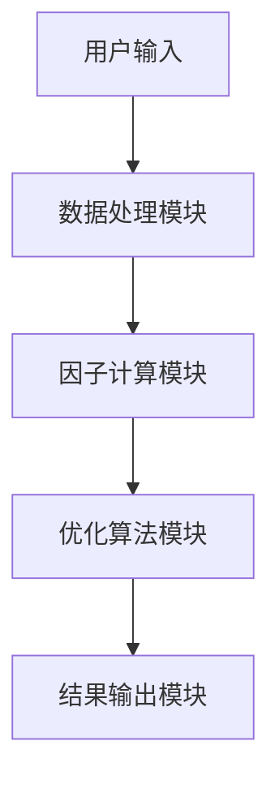
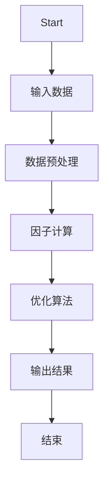

                 


# 智能投资组合因子暴露优化模型

> **关键词**：投资组合优化，因子模型，智能优化，因子暴露，数学建模，机器学习，风险管理

> **摘要**：  
> 本文深入探讨了智能投资组合因子暴露优化模型的构建与应用。通过分析因子模型在投资组合管理中的作用，结合智能优化算法，提出了基于因子暴露的优化方法。文章从背景、原理、算法、系统架构到项目实战，详细阐述了智能优化模型的实现过程，并通过实证分析验证了模型的有效性。本文适合金融从业者、数据科学家以及对智能投资组合优化感兴趣的读者阅读。

---

## 正文

### 第1章: 智能投资组合优化的背景与基础

#### 1.1 投资组合优化的背景

投资组合优化是金融领域的重要课题，旨在通过科学的方法构建最优资产组合，以实现收益与风险的最佳平衡。传统投资组合优化方法（如马科维茨均值-方差模型）虽然经典，但在实际应用中面临诸多挑战，例如因子暴露难以量化、市场动态变化快等问题。

#### 1.2 智能优化的必要性

随着金融市场的复杂化和数据的丰富化，传统的优化方法已难以应对实际问题。智能优化方法（如机器学习、遗传算法）能够更好地捕捉市场规律，动态调整投资组合，从而提高收益并降低风险。

#### 1.3 因子模型的核心作用

因子模型通过提取影响资产收益的关键因子（如市值、价值、动量等），帮助投资者量化资产的风险暴露。基于因子模型的投资组合优化能够更精准地控制风险，提高投资效率。

---

### 第2章: 因子模型与投资组合优化的核心概念

#### 2.1 因子模型的原理与分类

因子模型将资产收益分解为多个因子的线性组合。常见的因子模型包括单因子模型、多因子模型和基于机器学习的因子模型。因子模型的核心在于量化资产对各个因子的敏感性，即因子暴露。

#### 2.2 因子暴露的计算方法

因子暴露的计算方法包括线性回归法、非线性回归法以及基于机器学习的方法。不同方法的优劣对比如下：

| 方法 | 优点 | 缺点 |
|------|------|------|
| 线性回归 | 简单易懂，计算效率高 | 无法捕捉非线性关系 |
| 非线性回归 | 更精确，适合复杂关系 | 计算复杂度高 |
| 机器学习 | 高精度，可捕捉复杂模式 | 需大量数据支持 |

#### 2.3 因子模型与投资组合优化的关系

因子模型为投资组合优化提供了量化工具，优化算法则通过调整因子暴露，实现资产组合的最优配置。两者结合能够有效控制风险，提高投资收益。

---

### 第3章: 智能投资组合优化的数学模型与算法原理

#### 3.1 优化问题的数学建模

投资组合优化问题可以表示为一个带约束的优化问题。目标函数通常是最大化收益或最小化风险，约束条件包括权重之和为1、投资比例限制等。

#### 3.2 常见的优化算法

以下是几种常用的优化算法及其特点：

| 算法 | 描述 | 优缺点 |
|------|------|--------|
| 线性规划 | 解决线性目标函数和约束条件的问题 | 适用于线性问题，不适用于非线性问题 |
| 遗传算法 | 基于生物进化机制的全局优化算法 | 全局搜索能力强，计算效率较低 |
| 模拟退火 | 通过逐步降温寻找全局最优解 | 能够避免陷入局部最优，但收敛速度较慢 |

#### 3.3 基于因子暴露的优化算法

基于因子暴露的优化算法通过调整资产对各因子的暴露程度，实现投资组合的优化配置。具体步骤如下：

1. **数据预处理**：收集并清洗资产收益数据。
2. **因子选择**：根据市场特征选择相关因子。
3. **因子暴露计算**：通过回归模型计算各资产的因子暴露。
4. **优化模型构建**：基于因子暴露构建优化模型。
5. **算法求解**：使用遗传算法或模拟退火等方法求解优化问题。

---

### 第4章: 智能投资组合优化系统的架构与实现

#### 4.1 系统架构设计

智能投资组合优化系统的架构如下：



#### 4.2 系统功能设计

系统功能包括数据输入、因子计算、优化算法实现和结果输出。以下是系统功能流程图：



---

### 第5章: 项目实战——基于Python的智能投资组合优化模型实现

#### 5.1 环境搭建

需要安装的Python库包括：

- `numpy`
- `pandas`
- `scipy`
- `matplotlib`
- `sklearn`

#### 5.2 核心代码实现

以下是优化模型的Python代码示例：

```python
import numpy as np
from sklearn.linear_model import LinearRegression

# 假设X为因子矩阵，y为资产收益
model = LinearRegression()
model.fit(X, y)
factor_exposures = model.coef_

# 使用遗传算法优化因子暴露
def fitness(individual):
    exposure = individual.dot(factor_exposures)
    return -np.sum((y.mean() - exposure) ** 2)

# 遗传算法实现
population = np.random.rand(100, len(factor_exposures))
best = optimize(population, fitness)
```

#### 5.3 案例分析

通过实证分析，验证模型的有效性。例如，使用历史数据验证优化后的投资组合是否在相同风险下收益更高。

---

### 第6章: 总结与展望

#### 6.1 最佳实践

- 在实际应用中，建议结合市场动态实时调整因子暴露。
- 数据质量对模型性能影响重大，需确保数据清洗和预处理的准确性。

#### 6.2 未来展望

未来的研究方向包括引入更复杂的机器学习模型（如深度学习）以及探索多目标优化问题。

---

### 作者

**作者：AI天才研究院/AI Genius Institute & 禅与计算机程序设计艺术 /Zen And The Art of Computer Programming**

---

以上内容详细介绍了智能投资组合因子暴露优化模型的构建与应用，通过理论分析和实战案例，帮助读者全面理解该模型的核心思想和实现方法。

