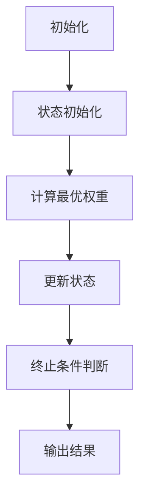
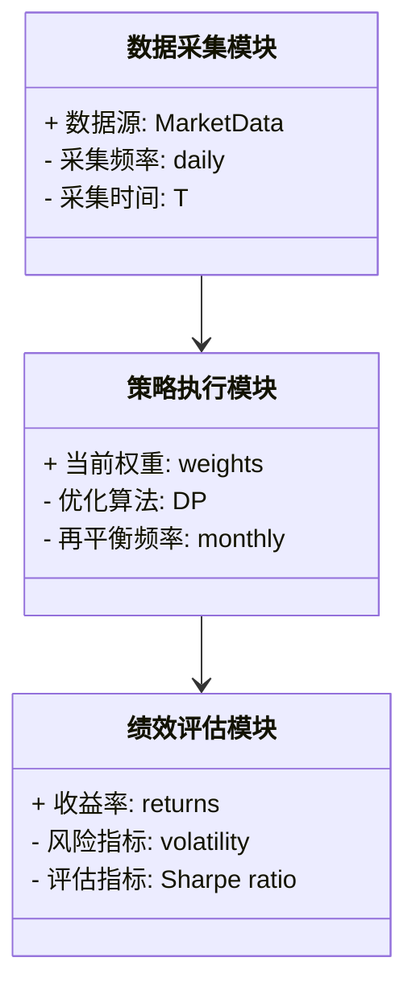

                 


# 智能投资组合多周期再平衡策略

> **关键词**: 智能投资组合, 多周期再平衡, 投资组合优化, 动态规划, 人工智能

> **摘要**:  
本文系统性地探讨了智能投资组合多周期再平衡策略的核心概念、算法原理、系统架构及实际应用。文章从投资组合优化的基本概念出发，深入分析了多周期再平衡策略的背景与挑战，结合动态规划、遗传算法等人工智能技术，详细阐述了多周期再平衡策略的数学模型与实现方法。通过实际案例分析，本文验证了多周期再平衡策略的有效性，并总结了相关经验与最佳实践。

---

# 第一部分: 智能投资组合多周期再平衡策略概述

## 第1章: 投资组合优化与再平衡基础

### 1.1 投资组合优化的基本概念

#### 1.1.1 投资组合优化的定义
投资组合优化是通过科学的资产配置方法，在给定风险水平下追求最大收益，或在给定收益水平下最小化风险的过程。其核心目标是实现资产的最优配置，以满足投资者的财务目标。

#### 1.1.2 投资组合优化的核心目标
投资组合优化的目标通常包括以下几点：
1. 最大化收益：在给定风险下。
2. 最小化风险：在给定收益下。
3. 稳定性：降低投资组合的波动性。
4. 多目标优化：在收益、风险、流动性之间找到平衡。

#### 1.1.3 投资组合优化的边界与外延
投资组合优化的边界包括：
- 资产类别：股票、债券、现金等。
- 投资期限：短期、中期、长期。
- 风险承受能力：根据投资者的风险偏好。

外延则包括税收优化、交易成本、市场流动性等实际因素。

---

### 1.2 多周期再平衡策略的定义

#### 1.2.1 多周期再平衡的定义
多周期再平衡是指在不同时间周期内（如日、周、月、季度）动态调整投资组合的资产配置，以适应市场变化和投资者目标的变化。

#### 1.2.2 多周期再平衡的核心要素
1. **再平衡频率**：确定再平衡的时间间隔。
2. **资产配置权重**：根据市场变化调整各资产的权重。
3. **再平衡成本**：包括交易成本和机会成本。

#### 1.2.3 多周期再平衡与传统再平衡的区别
| 对比维度      | 多周期再平衡                 | 传统再平衡                  |
|---------------|------------------------------|-----------------------------|
| 再平衡频率    | 多个周期，动态调整           | 固定周期，定期调整           |
| 资产权重调整   | 根据市场变化动态调整         | 根据初始计划调整             |
| 灵活性         | 高                           | 较低                        |

---

## 第2章: 智能投资组合优化的背景与挑战

### 2.1 智能投资组合优化的背景

#### 2.1.1 传统投资组合优化的局限性
1. **静态性**：传统再平衡通常基于固定的时间间隔，无法适应市场的实时变化。
2. **低效性**：在市场波动剧烈时，固定频率的再平衡可能导致较大损失。
3. **复杂性**：面对多资产类别和多周期的复杂场景，传统方法难以处理。

#### 2.1.2 智能投资组合优化的兴起
人工智能技术（如机器学习、深度学习）的应用，使得投资组合优化更加动态化、个性化和智能化。

#### 2.1.3 人工智能在投资组合优化中的作用
1. **数据处理**：快速处理海量数据。
2. **模式识别**：发现市场中的潜在规律。
3. **动态调整**：根据实时市场变化优化资产配置。

---

### 2.2 多周期再平衡策略的挑战

#### 2.2.1 市场波动性对再平衡的影响
市场波动性可能导致再平衡成本增加，甚至引发更大的亏损。

#### 2.2.2 不同周期的资产配置问题
不同周期的资产配置权重需要协调一致，避免冲突。

#### 2.2.3 再平衡成本与收益的平衡
频繁的再平衡可能导致较高的交易成本，但收益可能不明显。

---

# 第二部分: 多周期再平衡策略的核心概念与联系

## 第3章: 多周期再平衡策略的数学模型

### 3.1 动态规划模型在多周期再平衡中的应用

#### 3.1.1 动态规划的基本原理
动态规划是一种解决多阶段决策问题的优化方法，适用于投资组合的多周期优化。

#### 3.1.2 多周期再平衡的动态规划模型
$$
\text{目标函数} = \max \sum_{t=1}^{T} r_t \cdot w_t
$$

其中，$r_t$ 为第 $t$ 期的资产收益，$w_t$ 为第 $t$ 期的权重。

#### 3.1.3 动态规划模型的优化目标
动态规划通过递归方式，逐步优化各阶段的资产权重，确保整体收益最大化。

---

### 3.2 马科维茨均值-方差模型在多周期再平衡中的应用

#### 3.2.1 均值-方差模型的定义
马科维茨的均值-方差模型是投资组合理论的基础，通过优化资产的期望收益和方差来确定最优权重。

#### 3.2.2 多周期再平衡中的均值-方差优化
$$
\min_w \sigma^2(w) \quad \text{subject to} \quad E(r(w)) = \mu
$$

其中，$\sigma^2(w)$ 为投资组合的方差，$E(r(w))$ 为期望收益。

---

## 第4章: 多周期再平衡策略的核心概念对比

### 4.1 不同再平衡策略的对比分析

#### 4.1.1 定期再平衡与不定期再平衡的对比
| 对比维度      | 定期再平衡                 | 不定期再平衡              |
|---------------|--------------------------|--------------------------|
| 再平衡频率    | 固定时间间隔             | 根据市场变化动态调整      |
| 成本           | 较低                     | 较高                     |
| 灵活性         | 低                       | 高                       |

---

# 第三部分: 算法原理讲解

## 第5章: 基于动态规划的多周期再平衡算法

### 5.1 动态规划算法的基本原理

#### 5.1.1 状态定义
状态：第 $t$ 期的资产权重 $w_t$。

#### 5.1.2 状态转移
$$
w_{t+1} = f(w_t, r_t)
$$

其中，$f$ 为转移函数，$r_t$ 为第 $t$ 期的收益。

#### 5.1.3 动态规划流程图



---

## 第6章: 基于遗传算法的多周期再平衡策略

### 6.1 遗传算法的基本原理

#### 6.1.1 初始化
随机生成初始种群。

#### 6.1.2 适应度函数
$$
f(w) = \text{投资组合收益} - \text{风险调整成本}
$$

#### 6.1.3 选择与交叉
根据适应度值选择优秀个体，并进行基因交叉。

#### 6.1.4 突变
随机改变部分个体的基因。

---

# 第四部分: 系统分析与架构设计方案

## 第7章: 项目背景与系统功能设计

### 7.1 项目背景
本项目旨在开发一个基于多周期再平衡策略的投资组合优化系统。

### 7.2 系统功能设计

#### 7.2.1 功能模块
1. 数据采集模块：获取市场数据。
2. 策略执行模块：实现多周期再平衡算法。
3. 绩效评估模块：评估投资组合的表现。

#### 7.2.2 类图设计



---

## 第8章: 系统架构设计

### 8.1 系统架构图


---

# 第五部分: 项目实战

## 第9章: 环境安装与核心代码实现

### 9.1 环境安装
1. 安装Python。
2. 安装相关库（如numpy、pandas、scipy）。

### 9.2 核心代码实现

#### 9.2.1 动态规划算法实现

```python
import numpy as np

def dynamic_programming_rebalance(initial_weights, returns, periods):
    # 初始化状态
    states = [initial_weights]
    for i in range(periods):
        # 计算最优权重
        current_weights = states[-1]
        optimized_weights = optimize(current_weights, returns[i])
        states.append(optimized_weights)
    return states
```

---

## 第10章: 实际案例分析

### 10.1 案例背景
假设我们有两只股票和一个现金资产，投资期限为一年，再平衡频率为每月一次。

### 10.2 数据分析

#### 10.2.1 数据来源
使用历史股价数据。

#### 10.2.2 计算结果
通过动态规划算法计算出最优权重序列。

---

# 第六部分: 最佳实践与总结

## 第11章: 最佳实践 tips

### 11.1 风险管理
1. 设定合理的止损点。
2. 定期评估模型的有效性。

### 11.2 数据质量
1. 使用高质量的市场数据。
2. 考虑数据的完整性和及时性。

### 11.3 模型可解释性
1. 确保模型的逻辑清晰。
2. 定期审查和调整模型参数。

---

## 第12章: 总结与展望

### 12.1 总结
本文系统性地探讨了智能投资组合多周期再平衡策略的核心概念、算法原理、系统架构及实际应用。通过动态规划和遗传算法的结合，提出了一种高效的多周期再平衡方法。

### 12.2 展望
未来，可以进一步研究多周期再平衡策略在复杂市场环境下的应用，如引入强化学习技术，提升策略的适应性。

---

**作者：AI天才研究院 & 禅与计算机程序设计艺术**

