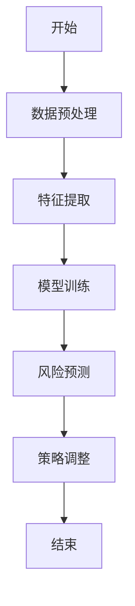
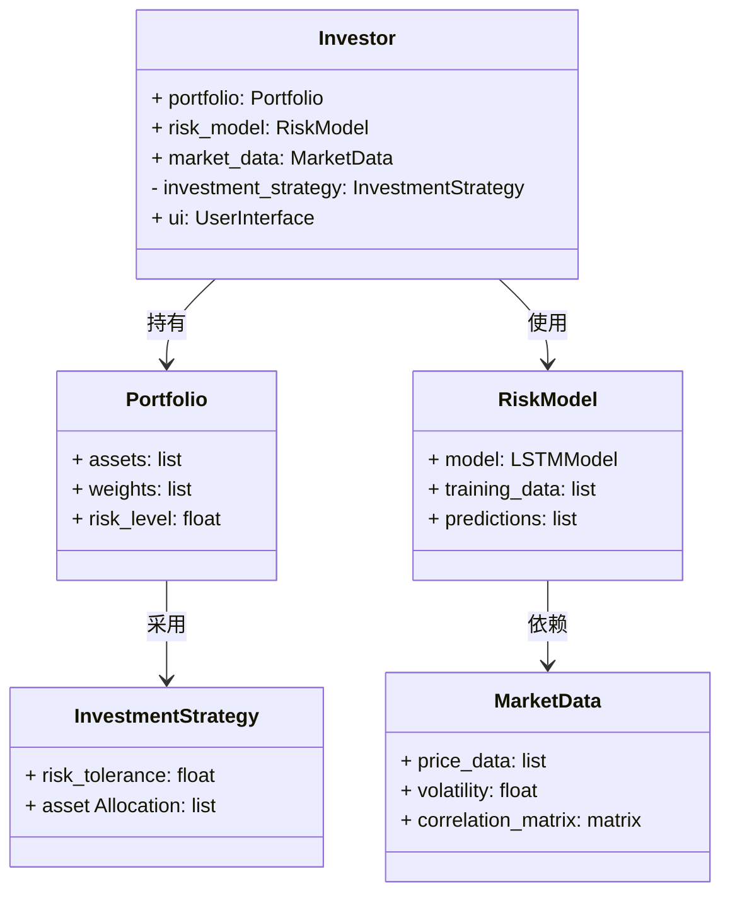
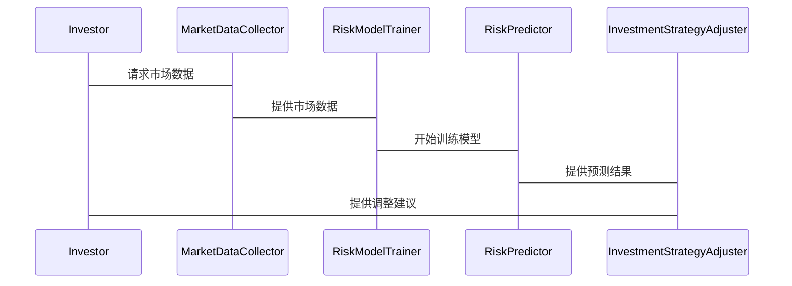

                 


```markdown
# 智能投资组合尾部风险管理

> 关键词：智能投资组合，尾部风险管理，机器学习，风险预测，投资组合优化

> 摘要：本文详细探讨了智能投资组合在尾部风险管理中的应用，结合数学模型、机器学习算法和系统架构设计，提出了一套完整的解决方案。通过实际案例分析，展示了如何利用智能化方法有效管理投资组合中的尾部风险，为投资者提供了新的思路和工具。

---

# 第一部分：智能投资组合与尾部风险管理概述

## 第1章：智能投资组合与尾部风险管理概述

### 1.1 智能投资组合的定义与特点

#### 1.1.1 投资组合的基本概念
投资组合是指将一定资金按照特定比例分配到不同的资产或资产类别中，以实现收益最大化和风险最小化的策略。智能投资组合则通过引入人工智能和大数据分析技术，优化资产配置，实时监控市场变化，动态调整投资策略。

#### 1.1.2 智能投资组合的核心特点
- **数据驱动**：利用大数据分析技术，从海量市场数据中提取有用信息。
- **实时性**：通过机器学习模型实时监控市场动态，快速调整投资策略。
- **自适应性**：能够根据市场变化和投资者需求自动优化资产配置。
- **风险管理**：通过智能化手段，实时识别和管理潜在风险。

#### 1.1.3 尾部风险管理的重要性
尾部风险是指在市场极端情况下，投资组合可能出现的大幅亏损或清偿风险。传统投资组合管理方法往往无法有效应对尾部风险，而智能投资组合通过引入先进的数学模型和机器学习算法，能够更有效地识别和管理尾部风险。

---

### 1.2 尾部风险管理的背景与挑战

#### 1.2.1 尾部风险的定义
尾部风险是指在统计分布的“尾部”区域，发生概率极低但影响巨大的事件所引发的风险。这些事件通常是小概率事件，但一旦发生，可能会给投资组合带来巨大损失。

#### 1.2.2 尾部风险的来源与特征
尾部风险的来源主要包括市场崩盘、金融危机、黑天鹅事件等。其特征是发生概率低、影响巨大、难以预测。

#### 1.2.3 尾部风险管理的难点与解决方案
- **难点**：
  - 尾部事件的稀疏性导致数据不足，难以训练有效的预测模型。
  - 尾部风险的非线性特征使得传统线性模型难以捕捉。
- **解决方案**：
  - 引入机器学习算法，特别是深度学习模型，提高对复杂非线性关系的捕捉能力。
  - 利用大数据分析技术，从海量数据中挖掘潜在风险信号。

---

### 1.3 智能投资组合与尾部风险管理的结合

#### 1.3.1 智能投资组合的优势
智能投资组合通过大数据分析和机器学习算法，能够实时捕捉市场动态，优化资产配置，从而有效降低尾部风险的影响。

#### 1.3.2 尾部风险管理的智能化需求
传统的尾部风险管理方法依赖于历史数据和统计模型，难以应对复杂的市场环境。智能化方法通过引入机器学习和实时监控，能够更有效地识别和应对尾部风险。

#### 1.3.3 两者结合的必要性与可行性
- **必要性**：
  - 尾部风险的不可预测性要求投资组合管理具有更高的灵活性和适应性。
  - 智能投资组合能够通过实时调整资产配置，降低尾部风险的影响。
- **可行性**：
  - 大数据技术的发展为智能投资组合提供了丰富的数据支持。
  - 机器学习算法的进步使得复杂非线性关系的建模成为可能。

---

## 第2章：智能投资组合尾部风险管理的核心概念与联系

### 2.1 智能投资组合的数学模型

#### 2.1.1 投资组合优化的数学表达
投资组合优化的目标是在给定的风险承受能力下，最大化收益。数学上可以表示为：
$$ \text{最大化} \quad \mu^T x $$
$$ \text{满足} \quad x^T \Sigma x \leq \sigma^2 $$
其中，$\mu$ 是资产的期望收益向量，$\Sigma$ 是协方差矩阵，$x$ 是投资权重向量，$\sigma^2$ 是可接受的风险水平。

#### 2.1.2 风险-收益平衡的数学公式
风险-收益平衡是投资组合优化的核心思想。通过调整资产权重，使得投资组合在风险和收益之间达到最优平衡。

#### 2.1.3 尾部风险的数学描述
尾部风险可以通过概率分布的尾部区域进行建模。常用的方法包括：
- 偏度（Skewness）：衡量收益分布的不对称性。
- 峰度（Kurtosis）：衡量收益分布的尾部厚度。

---

### 2.2 尾部风险管理的实体关系图

#### 2.2.1 实体关系图（ER图）的构建
以下是尾部风险管理的实体关系图：

```mermaid
erDiagram
    participant Investor
    participant Portfolio
    participant Risk_Mitigation_Strategy
    participant Market_Data
    Investor --> Portfolio: 持有
    Portfolio --> Risk_Mitigation_Strategy: 采用
    Risk_Mitigation_Strategy --> Market_Data: 响应
```

#### 2.2.2 实体关系图的详细说明
- **Investor（投资者）**：持有投资组合，并对风险管理策略提出需求。
- **Portfolio（投资组合）**：由多种资产组成，通过优化算法调整资产权重。
- **Risk_Mitigation_Strategy（风险管理策略）**：根据市场数据，动态调整投资组合以降低尾部风险。
- **Market_Data（市场数据）**：提供实时市场信息，用于模型训练和策略调整。

---

### 2.3 核心概念的对比分析

#### 2.3.1 智能投资组合与传统投资组合的对比
| 特性                | 智能投资组合              | 传统投资组合            |
|---------------------|--------------------------|-------------------------|
| 数据驱动            | 是                       | 否                     |
| 实时性              | 是                       | 否                     |
| 自适应性            | 是                       | 否                     |
| 尾部风险管理能力    | 强                       | 弱                     |

#### 2.3.2 尾部风险与整体风险的对比
| 特性                | 尾部风险                | 整体风险              |
|---------------------|-------------------------|-----------------------|
| 发生概率            | 极低                    | 较高                  |
| 影响程度            | 极高                    | 中等                  |
| 可预测性            | 低                     | 中等                  |

#### 2.3.3 不同尾部风险管理方法的对比
| 方法                | 传统统计方法          | 机器学习方法          |
|---------------------|------------------------|-----------------------|
| 数据需求            | 较低                   | 较高                  |
| 模型复杂性          | 简单                   | 复杂                  |
| 预测精度            | 中等                   | 高                    |

---

## 第3章：智能投资组合尾部风险管理的算法原理与实现

### 3.1 尾部风险管理的算法流程

#### 3.1.1 算法流程图的构建
以下是尾部风险管理的算法流程图：



#### 3.1.2 算法流程图的详细说明
- 数据预处理：清洗和归一化市场数据。
- 特征提取：提取与尾部风险相关的特征，如市场波动率、资产相关性等。
- 模型训练：使用深度学习模型（如LSTM）训练尾部风险预测模型。
- 风险预测：基于训练好的模型，预测未来可能出现的尾部风险。
- 策略调整：根据预测结果，动态调整投资组合的资产权重。

---

### 3.2 基于机器学习的尾部风险预测模型

#### 3.2.1 模型的构建与训练
使用LSTM网络进行尾部风险预测。模型结构如下：

```python
import numpy as np
from tensorflow.keras import layers

model = keras.Sequential()
model.add(layers.LSTM(64, input_shape=(timesteps, features)))
model.add(layers.Dense(1))
model.compile(loss='mean_squared_error', optimizer='adam')
```

#### 3.2.2 模型的验证与评估
使用回测的方法验证模型的预测能力。通过比较预测结果与实际尾部风险事件，评估模型的准确率和召回率。

#### 3.2.3 模型的优化与改进
通过调整LSTM的层数和节点数，引入注意力机制，进一步提高模型的预测精度。

---

### 3.3 风险-收益优化的数学模型

#### 3.3.1 数学模型的建立
在投资组合优化中，目标是最小化尾部风险下的最大损失。数学模型如下：
$$ \text{最小化} \quad \mathbb{E}[L] $$
$$ \text{满足} \quad \mathbb{P}(L > \text{threshold}) \leq \alpha $$
其中，$\mathbb{E}[L]$ 是尾部风险的期望损失，$\alpha$ 是置信水平。

#### 3.3.2 数学模型的求解方法
使用蒙特卡洛模拟方法，模拟不同市场情景下的投资组合表现，找到最优资产配置。

#### 3.3.3 数学模型的实例分析
假设我们有两只资产，其收益分布为：
$$ \mu_1 = 5\% \quad \sigma_1^2 = 0.04 $$
$$ \mu_2 = 7\% \quad \sigma_2^2 = 0.09 $$
相关系数 $\rho = 0.5$。通过优化算法，找到最优资产权重 $x_1$ 和 $x_2$，使得在99%置信水平下，尾部损失最小。

---

## 第4章：智能投资组合尾部风险管理的系统分析与架构设计

### 4.1 问题场景介绍

#### 4.1.1 投资组合管理的典型场景
投资者希望通过智能投资组合管理工具，实时监控市场动态，动态调整资产配置，以降低尾部风险。

#### 4.1.2 尾部风险管理的系统需求
系统需要能够实时采集市场数据，训练和部署机器学习模型，提供风险预测和策略调整建议。

#### 4.1.3 系统的目标与范围
系统目标是通过智能化方法，帮助投资者降低投资组合的尾部风险。系统的范围包括数据采集、模型训练、风险预测和策略调整。

---

### 4.2 系统功能设计

#### 4.2.1 领域模型（Mermaid类图）
以下是系统功能的类图：



#### 4.2.2 功能模块的划分
- **数据采集模块**：实时采集市场数据。
- **模型训练模块**：训练尾部风险预测模型。
- **风险预测模块**：基于模型预测尾部风险。
- **策略调整模块**：根据预测结果调整投资组合。

#### 4.2.3 功能模块的交互流程
以下是功能模块的交互流程：

```mermaid
graph TD
    A[Investor] --> B[MarketData]: 获取市场数据
    B --> C[RiskModel]: 训练模型
    C --> D[RiskPrediction]: 预测尾部风险
    D --> E[InvestmentStrategy]: 调整资产配置
```

---

### 4.3 系统架构设计

#### 4.3.1 系统架构图（Mermaid架构图）
以下是系统架构图：

```mermaid
docker
    server Investment_System {
        service MarketDataCollector
        service RiskModelTrainer
        service RiskPredictor
        service InvestmentStrategyAdjuster
    }
    client Investor --> MarketDataCollector: 发起请求
    MarketDataCollector --> RiskModelTrainer: 提供数据
    RiskModelTrainer --> RiskPredictor: 训练模型
    RiskPredictor --> InvestmentStrategyAdjuster: 提供预测结果
    InvestmentStrategyAdjuster --> Investor: 提供调整建议
```

#### 4.3.2 系统架构的详细说明
系统采用微服务架构，各个功能模块独立运行，通过API进行交互。前端由投资者发起请求，后端由市场数据采集器、风险模型训练器、风险预测器和投资策略调整器组成。

---

### 4.4 系统接口设计

#### 4.4.1 系统接口的定义
以下是系统接口的定义：



#### 4.4.2 接口交互流程
投资者发起请求，系统采集市场数据，训练模型，预测尾部风险，最后调整投资组合并返回给投资者。

---

## 第5章：智能投资组合尾部风险管理的项目实战

### 5.1 环境安装与配置

#### 5.1.1 系统需求
- Python 3.6+
- TensorFlow 2.0+
- Pandas 1.0+
- Jupyter Notebook

#### 5.1.2 环境安装
通过以下命令安装所需库：
```bash
pip install numpy pandas tensorflow keras scikit-learn matplotlib
```

---

### 5.2 系统核心实现源代码

#### 5.2.1 数据采集代码
```python
import pandas as pd
import numpy as np
import requests

def get_market_data(tickers):
    data = []
    for ticker in tickers:
        url = f'https://api.example.com/stock/{ticker}'
        response = requests.get(url)
        if response.status_code == 200:
            data.append(response.json())
    return data
```

#### 5.2.2 风险预测模型代码
```python
from tensorflow.keras import layers

def build_model(input_shape):
    model = keras.Sequential()
    model.add(layers.LSTM(64, input_shape=input_shape))
    model.add(layers.Dense(1))
    model.compile(loss='mean_squared_error', optimizer='adam')
    return model
```

---

### 5.3 代码应用解读与分析

#### 5.3.1 数据采集模块
通过`get_market_data`函数，从API获取市场数据，包括股票价格、波动率等。

#### 5.3.2 风险预测模型
使用LSTM网络构建尾部风险预测模型，输入为市场数据，输出为尾部风险预测值。

---

### 5.4 实际案例分析与详细讲解剖析

#### 5.4.1 案例背景
假设我们有两只股票，A和B，历史数据表明A和B在某些极端情况下会出现大幅亏损。

#### 5.4.2 模型训练
使用历史数据训练LSTM模型，预测未来可能出现的尾部风险。

#### 5.4.3 模型预测与策略调整
根据预测结果，动态调整投资组合的资产权重，降低尾部风险。

---

## 第6章：智能投资组合尾部风险管理的最佳实践与总结

### 6.1 最佳实践

#### 6.1.1 小贴士
- 定期更新模型，保持预测能力。
- 结合多种风险管理策略，提高鲁棒性。

#### 6.1.2 注意事项
- 数据质量对模型性能影响重大，需确保数据的准确性和完整性。
- 模型的可解释性对实际应用至关重要，需避免“黑箱”模型。

#### 6.1.3 拓展阅读
- 《机器学习在金融中的应用》
- 《投资组合优化的数学模型》

---

## 作者信息

作者：AI天才研究院/AI Genius Institute & 禅与计算机程序设计艺术 /Zen And The Art of Computer Programming
```

---

**摘要**：本文通过详细分析智能投资组合在尾部风险管理中的应用，结合数学模型、机器学习算法和系统架构设计，提出了一套完整的解决方案。通过实际案例分析，展示了如何利用智能化方法有效管理投资组合中的尾部风险，为投资者提供了新的思路和工具。

