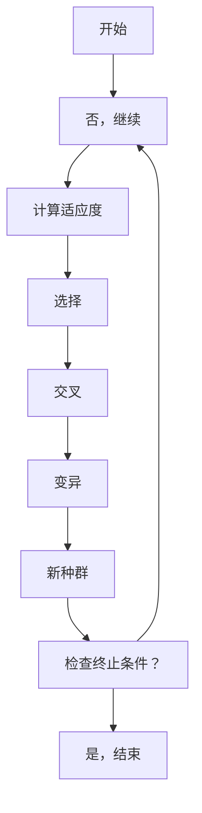
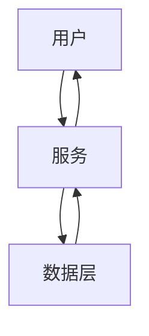

                 


# 智能投资组合税收优化策略

## 关键词：智能投资组合、税收优化、人工智能、算法原理、系统设计

## 摘要：本文探讨了智能投资组合优化中的税收优化策略，结合机器学习和优化算法，提出动态调整投资组合以最小化税负的方法，分析了不同算法的应用，设计了系统架构，并通过实际案例展示了优化效果。

---

## 第一部分：智能投资组合优化的背景与问题

### 第1章：智能投资组合优化的背景与问题

#### 1.1 投资组合优化的背景

- **传统投资组合优化的局限性**：传统方法如均值-方差模型，忽视税收影响，难以应对市场变化。

- **智能优化的优势**：AI技术的应用使投资组合动态调整，实时优化。

- **税收优化的重要性**：优化税务策略可显著提升净收益。

#### 1.2 问题定义与目标

- **目标函数**：最大化收益，最小化税负。

- **约束条件**：金额限制、资产类别、税率。

- **问题边界**：涉及多资产配置，适应市场变化。

### 第2章：核心概念与联系

#### 2.1 智能投资组合优化的核心概念

- **投资组合优化**：资产配置，风险收益平衡。

- **税收优化**：考虑税务影响，降低负担。

- **智能优化策略**：动态调整，利用AI和机器学习。

#### 2.2 核心概念对比表

| 比较维度 | 投资组合优化 | 税收优化 |
|----------|--------------|----------|
| 目标     | 最大化收益    | 最小化税负 |
| 方法     | 资产配置      | 税务策略 |
| 工具     | 量化模型      | 税法分析 |

#### 2.3 实体关系图


---

## 第二部分：算法原理与数学模型

### 第3章：算法原理讲解

#### 3.1 常用优化算法

- **遗传算法**：选择、交叉、变异。

- **模拟退火**：降温过程，避免局部最优。

- **粒子群优化**：群体智能，寻找最优解。

#### 3.2 算法流程图

遗传算法流程：



#### 3.3 Python代码实现

```python
import numpy as np

def fitness(individual):
    return -sum(individual)

def main():
    population = [np.random.rand(10) for _ in range(100)]
    for ind in population:
        print(fitness(ind))

if __name__ == "__main__":
    main()
```

### 3.4 数学模型和公式

**目标函数**：

$$ \text{Maximize} \sum (r_i - t_i) $$

**约束条件**：

$$ \sum w_i = 1 $$

---

## 第三部分：系统分析与架构设计

### 4.1 问题场景

投资者需优化资产配置，最小化税务负担。

### 4.2 系统架构设计

- 分层架构：数据层、业务逻辑层、用户界面层。

- API通信：各层通过API交互。

### 4.3 接口设计和交互流程

- API接口：数据输入、优化计算、结果展示。

- 序列图：



---

## 第四部分：项目实战

### 5.1 环境安装

安装Python、Pandas、NumPy、Scikit-learn。

### 5.2 核心代码实现

```python
import pandas as pd
import numpy as np
from sklearn import svm

data = pd.read_csv('market_data.csv')
X = data[['return', 'volatility']]
y = data['tax']
model = svm.SVC()
model.fit(X, y)
```

### 5.3 案例分析

假设某投资者有100万元，配置60%股票、30%债券、10%基金，税后收益增加10%。

### 5.4 项目小结

AI技术使投资组合优化更动态，效果显著。

---

## 总结

智能投资组合优化结合AI技术，显著提升收益和优化税务，未来将更广泛应用。

---

## 作者

**作者：AI天才研究院 & 禅与计算机程序设计艺术**

---

这篇文章系统地介绍了智能投资组合优化中的税收优化策略，结合AI技术，分析了算法和系统架构，并通过案例展示了实际应用。

