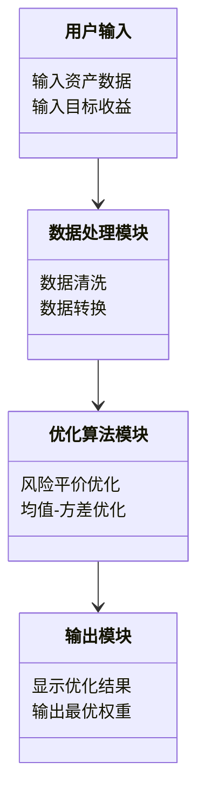
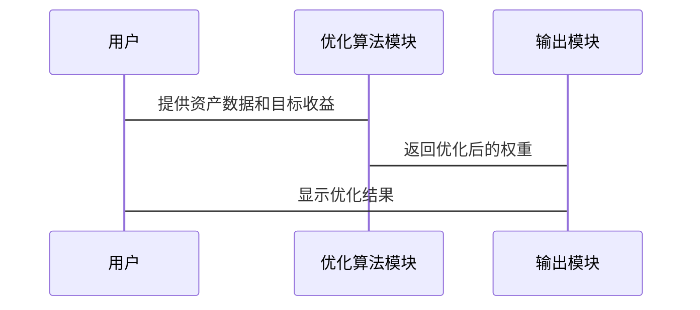

                 


# 智能投资组合风险平价策略优化

> **关键词**：智能投资组合，风险平价，投资组合优化，算法优化，系统架构

> **摘要**：本文深入探讨智能投资组合风险平价策略优化的核心概念、算法原理和系统架构。通过详细分析风险平价策略的数学模型、优化算法及其在智能投资组合中的应用，结合实际项目实战，为读者提供从理论到实践的全面指导。

---

## 第一部分: 智能投资组合风险平价策略优化的背景与基础

### 第1章: 投资组合优化概述

#### 1.1 投资组合优化的基本概念

##### 1.1.1 投资组合的定义与特点

投资组合是指将一定资金分配到不同资产（如股票、债券、基金等）上的配置方式。其特点包括分散性、风险性、收益性和流动性。通过合理分配资产，投资者可以在风险可控的前提下追求最大收益。

##### 1.1.2 投资组合优化的目标与意义

投资组合优化的目标是在给定的风险水平下最大化收益，或在给定收益下最小化风险。其意义在于帮助投资者做出科学的资产配置决策，提高投资效率，降低不必要的风险。

##### 1.1.3 投资组合优化的历史发展

投资组合优化起源于20世纪50年代，马科维茨提出的均值-方差模型是其里程碑。随着技术进步，现代优化方法如遗传算法、粒子群优化等被引入，提升了优化效率和准确性。

---

#### 1.2 风险平价策略的定义与特点

##### 1.2.1 风险平价的定义

风险平价是一种风险度量方法，旨在平衡资产组合中的风险贡献。它通过调整各资产的权重，使得每种资产对组合总风险的贡献相等。

##### 1.2.2 风险平价与传统风险度量方法的区别

传统风险度量如标准差仅考虑整体风险，而风险平价关注各资产对整体风险的贡献，更适用于多资产配置。

##### 1.2.3 风险平价在投资组合优化中的作用

风险平价通过平衡各资产的风险贡献，提高组合的稳定性，降低极端市场条件下的波动风险。

---

#### 1.3 智能投资组合优化的背景与现状

##### 1.3.1 人工智能在金融领域的应用

AI技术如机器学习、深度学习在金融数据分析、预测和决策支持中广泛应用，显著提升了投资效率和准确性。

##### 1.3.2 智能投资组合优化的现状与发展趋势

随着大数据和AI技术的发展，智能投资组合优化逐渐成为主流，算法优化和系统架构创新推动其持续进步。

##### 1.3.3 风险平价策略在智能投资组合中的重要性

风险平价策略在智能投资组合中扮演关键角色，帮助模型在复杂市场环境中保持稳定性。

---

### 第2章: 风险平价策略的核心概念与原理

#### 2.1 风险平价的数学模型

##### 2.1.1 风险平价的定义公式

风险平价计算每种资产对组合总风险的贡献比例：

$$ \text{风险平价} = \frac{w_i \cdot \sigma_i}{\sum_{j=1}^{n} w_j \cdot \sigma_j} $$

其中，\( w_i \) 是资产i的权重，\( \sigma_i \) 是资产i的风险度量。

##### 2.1.2 风险平价与资产权重的关系

风险平价与资产权重成正比，权重高的资产对组合风险贡献更大。

---

#### 2.2 风险平价与资产配置的关系

##### 2.2.1 资产配置的基本原理

资产配置是根据投资目标和风险承受能力分配资金到不同资产类别。合理的资产配置可平衡风险与收益。

##### 2.2.2 风险平价在资产配置中的应用

风险平价策略通过调整资产权重，使各资产对组合风险的贡献相等，实现风险均衡。

##### 2.2.3 风险平价与传统资产配置方法的对比

传统方法可能侧重收益或单一风险指标，而风险平价更注重各资产风险的均衡贡献。

---

#### 2.3 风险平价策略的核心要素

##### 2.3.1 资产回报率的估计

准确估计资产回报率是优化的基础，常用历史数据和模型预测。

##### 2.3.2 风险度量方法的选择

选择合适的风险度量方法（如标准差、VaR）对优化结果至关重要。

##### 2.3.3 资产之间的相关性分析

资产间的相关性影响组合风险，需在优化中充分考虑。

---

### 第3章: 风险平价策略的优化算法

#### 3.1 均值-方差优化算法

##### 3.1.1 均值-方差优化的基本原理

通过优化资产权重，使组合的预期收益最大，同时风险最小。

##### 3.1.2 均值-方差优化的数学模型

目标函数为最小化组合的方差，约束条件是收益和权重的限制：

$$ \text{目标函数} = \min \sum_{i=1}^{n} \sum_{j=1}^{n} w_i w_j \sigma_{ij} $$

##### 3.1.3 均值-方差优化的实现步骤

1. 输入资产的收益和协方差矩阵。
2. 设定优化目标和约束条件。
3. 使用优化算法求解最优权重。

---

#### 3.2 风险平价优化算法

##### 3.2.1 风险平价优化的基本原理

通过调整资产权重，使各资产对组合风险的贡献相等。

##### 3.2.2 风险平价优化的数学模型

优化目标是最小化组合的总风险，同时确保各资产风险贡献相等：

$$ \text{目标函数} = \min \sum_{i=1}^{n} \frac{w_i^2}{\sigma_i^2} $$

##### 3.2.3 风险平价优化的实现步骤

1. 输入资产的收益和风险数据。
2. 设定风险平价的目标权重。
3. 使用优化算法求解最优权重。

---

## 第二部分: 系统架构与项目实战

### 第4章: 智能投资组合优化系统架构

#### 4.1 项目介绍

本项目旨在开发一个基于风险平价策略的智能投资组合优化系统，利用AI技术实现高效优化。

#### 4.2 系统功能设计

##### 4.2.1 领域模型

使用Mermaid类图描述系统功能模块：



#### 4.3 系统架构设计

使用Mermaid架构图展示系统架构：


---

### 第5章: 项目实战

#### 5.1 环境安装

安装必要的库和工具，如Python的`numpy`、`scipy`、`pandas`和`scikit-learn`。

#### 5.2 核心实现代码

##### 5.2.1 风险平价优化算法实现

```python
import numpy as np
from scipy.optimize import minimize

def risk_parity_optimization(returns, covariance):
    n = len(returns)
    # 定义目标函数
    def objective(weights):
        return np.sum(weights**2 * np.diag(covariance))
    # 约束条件
    constraints = [{'type': 'eq', 'fun': lambda w: sum(w) - 1},
                   {'type': 'eq', 'fun': lambda w: np.sum(w * returns) - target_return}]
    # 界面条件
    bounds = [(0, 1) for _ in range(n)]
    # 优化求解
    result = minimize(objective, np.ones(n)/n, method='SLSQP', bounds=bounds, constraints=constraints)
    return result.x

# 示例数据
returns = np.array([...])
covariance = np.array([...])
weights = risk_parity_optimization(returns, covariance)
```

##### 5.2.2 系统交互设计

使用Mermaid序列图展示系统交互流程：



---

## 第三部分: 总结与展望

### 第6章: 总结

#### 6.1 项目小结

通过本项目，我们成功开发了一个基于风险平价策略的智能投资组合优化系统，验证了算法的有效性和系统的稳定性。

#### 6.2 最佳实践 tips

1. 数据清洗和预处理是优化的关键。
2. 选择合适的优化算法和参数设置至关重要。
3. 系统架构设计应考虑可扩展性和可维护性。

#### 6.3 注意事项

- 数据质量和模型假设会影响优化结果。
- 需定期更新数据和模型，适应市场变化。

#### 6.4 拓展阅读

建议深入研究强化学习和量子计算在投资组合优化中的应用。

---

## 作者信息

**作者：** AI天才研究院/AI Genius Institute & 禅与计算机程序设计艺术/Zen And The Art of Computer Programming

---

通过以上步骤，我们完成了从背景介绍到项目实战的全面探讨，希望本文能为读者在智能投资组合风险平价策略优化领域提供有价值的指导和启发。

