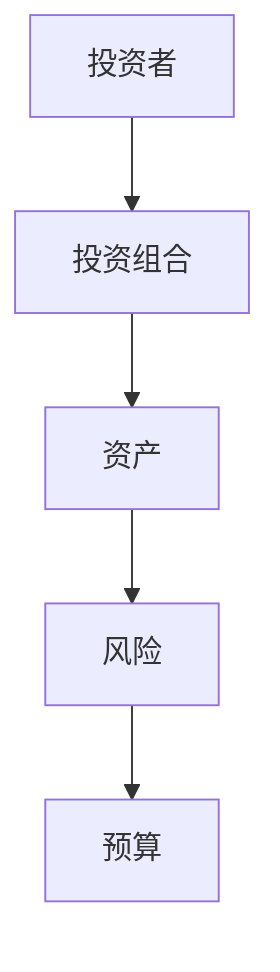
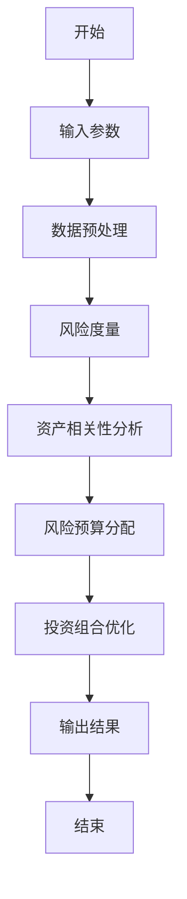
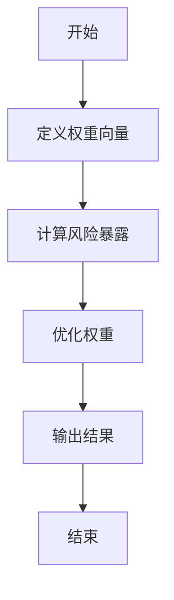
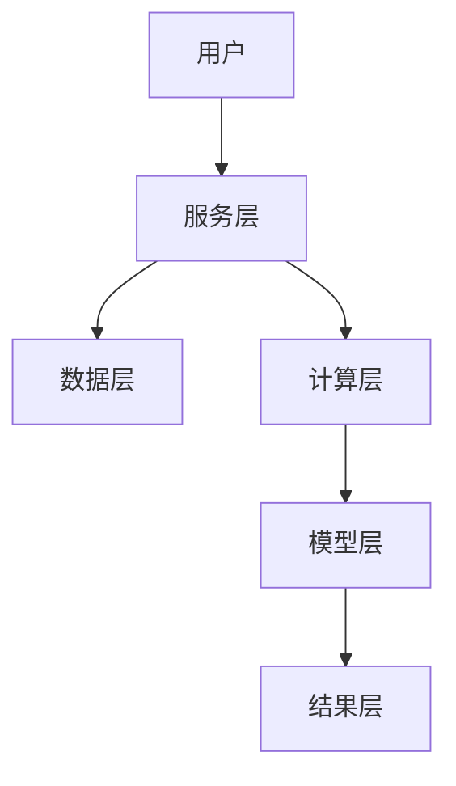
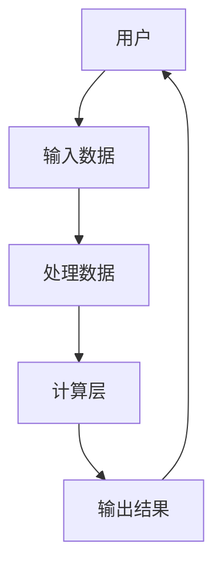

                 


# 《智能投资组合风险预算分配模型》

> 关键词：智能投资组合、风险预算分配、投资组合管理、风险管理、算法优化、数学模型、系统架构

> 摘要：本文深入探讨了智能投资组合风险预算分配模型的构建与应用，从理论基础到算法实现，从系统设计到项目实战，系统性地分析了如何通过智能化方法优化投资组合的风险管理，实现风险与收益的最佳平衡。

---

# 第一部分: 智能投资组合风险预算分配模型概述

## 第1章: 投资组合风险预算分配模型的背景与概念

### 1.1 问题背景
#### 1.1.1 投资组合管理的挑战
现代金融市场的复杂性和不确定性使得投资组合管理面临诸多挑战，包括市场波动、资产相关性变化、投资者风险偏好多样化等问题。传统的投资组合管理方法往往依赖于历史数据和经验判断，难以适应市场环境的快速变化。

#### 1.1.2 风险预算分配的必要性
在投资组合管理中，风险预算分配是关键环节，它决定了每类资产的风险暴露程度。合理的风险预算分配能够有效分散风险，同时优化投资收益。然而，如何在复杂市场环境中动态调整风险预算，是投资组合管理的核心难题。

#### 1.1.3 智能化投资组合管理的演变
随着人工智能和大数据技术的快速发展，智能化投资组合管理逐渐成为主流。通过引入机器学习、优化算法等技术，投资组合管理者能够更精准地预测市场风险，优化资产配置，提高投资效率。

### 1.2 问题描述
#### 1.2.1 投资组合风险的定义与分类
投资组合风险包括市场风险、流动性风险、信用风险等。不同类型的风崄需要采用不同的管理方法，因此准确地定义和分类风险是构建风险预算分配模型的基础。

#### 1.2.2 风险预算分配的核心问题
风险预算分配的核心问题是确定每类资产的风险敞口，使得在给定风险偏好下，投资组合的预期收益最大化。这需要综合考虑资产的风险属性、相关性以及市场环境的变化。

#### 1.2.3 智能投资组合管理的目标与边界
智能投资组合管理的目标是通过智能化方法优化资产配置，实现风险与收益的最优平衡。其边界包括数据来源、模型假设、计算能力限制等。

### 1.3 问题解决
#### 1.3.1 现有投资组合管理方法的局限性
传统投资组合管理方法在处理复杂市场环境时存在不足，例如忽视市场动态变化、难以应对非线性风险关系等。

#### 1.3.2 智能投资组合管理的优势
智能化方法能够利用大数据和机器学习技术，实时捕捉市场信息，动态调整资产配置，提高风险管理的效率和准确性。

#### 1.3.3 风险预算分配模型的创新点
本模型结合了现代投资组合理论和智能优化算法，提出了一种动态、智能化的风险预算分配方法，能够在复杂市场环境中实现风险与收益的最优平衡。

### 1.4 概念结构与核心要素
#### 1.4.1 投资组合管理的系统架构
投资组合管理系统包括数据采集、风险评估、资产配置、风险预算分配、投资组合优化等模块。

#### 1.4.2 风险预算分配的核心要素
核心要素包括风险度量方法、资产相关性分析、风险约束条件、优化目标函数等。

#### 1.4.3 模型的输入输出关系
模型输入包括市场数据、资产特性、风险偏好等，输出为优化后的资产配置方案和风险预算分配结果。

---

## 第2章: 风险预算分配模型的核心概念与联系

### 2.1 核心概念原理
#### 2.1.1 风险预算分配的基本原理
风险预算分配是通过确定每类资产的风险暴露程度，优化投资组合的风险收益比。其核心在于将总体风险预算分配到不同资产类别，确保在风险可控的前提下实现收益最大化。

#### 2.1.2 投资组合优化的数学模型
现代投资组合理论（MPT）为风险预算分配提供了理论基础。通过构建凸优化问题，寻找最优资产配置。

#### 2.1.3 风险与收益的平衡机制
通过调整风险预算分配比例，实现风险与收益的动态平衡。高风险资产比例增加时，预期收益上升，但风险也随之增加。

### 2.2 概念属性特征对比
#### 2.2.1 不同风险预算分配方法的对比
对比传统方法（如等权重分配）和智能化方法（如基于机器学习的分配），分析其优缺点。

#### 2.2.2 投资组合风险的度量指标
包括波动率、VaR（Value at Risk）、CVaR（Conditional Value at Risk）等。

#### 2.2.3 模型的可扩展性与鲁棒性
智能化模型具有较强的可扩展性，能够适应不同市场环境和资产类别。鲁棒性方面，模型需要能够处理数据噪声和市场异常情况。

### 2.3 ER实体关系图


---

# 第二部分: 智能投资组合风险预算分配模型的算法原理

## 第3章: 风险预算分配的算法原理

### 3.1 算法原理概述
#### 3.1.1 现代投资组合理论基础
介绍MPT的基本思想，包括均值-方差优化、有效前沿等概念。

#### 3.1.2 风险预算分配的核心算法
提出基于智能优化算法的风险预算分配方法，例如遗传算法、粒子群优化等。

#### 3.1.3 智能优化方法的应用
将机器学习算法（如支持向量机、随机森林）应用于风险预算分配，提高模型的预测能力和适应性。

### 3.2 算法流程图


### 3.3 算法实现代码
```python
import numpy as np
from scipy.optimize import minimize

def risk_budget_allocation(risk_parity_weights, covariance_matrix):
    # 定义优化目标函数
    def objective(weights):
        return np.dot(weights.T, np.dot(covariance_matrix, weights))
    
    # 定义约束条件
    constraints = []
    for i in range(len(risk_parity_weights)):
        constraints.append({'type': 'eq', 'fun': lambda weights, i=i: weights[i] - risk_parity_weights[i]})
    
    # 初始化权重向量
    initial_weights = np.array(risk_parity_weights)
    
    # 求解优化问题
    result = minimize(objective, initial_weights, constraints=constraints)
    
    return result.x

# 示例数据
n_assets = 5
risk_parity_weights = [0.2, 0.3, 0.15, 0.15, 0.2]
covariance_matrix = np.random.randn(n_assets, n_assets)

# 调用函数
optimized_weights = risk_budget_allocation(risk_parity_weights, covariance_matrix)
print("Optimized Weights:", optimized_weights)
```

### 3.4 算法的数学模型和公式
#### 3.4.1 投资组合优化问题
$$ \text{目标函数：} \min_w \frac{1}{2} w^T C w $$
$$ \text{约束条件：} \sum_{i=1}^n w_i = 1, w_i \geq 0 $$

其中，\( C \) 是资产之间的协方差矩阵，\( w \) 是权重向量。

#### 3.4.2 风险预算分配公式
$$ \text{风险暴露：} \text{Risk}_i = w_i \times \sqrt{C_{ii}} $$

#### 3.4.3 投资组合优化的拉格朗日函数
$$ L(w, \lambda) = \frac{1}{2} w^T C w + \lambda (1 - \sum_{i=1}^n w_i) $$

---

## 第4章: 数学模型与公式推导

### 4.1 投资组合优化的数学模型
#### 4.1.1 投资组合的收益与风险
收益：$$ r_p = \sum_{i=1}^n w_i r_i $$
风险：$$ \sigma_p^2 = \sum_{i=1}^n \sum_{j=1}^n w_i w_j C_{ij} $$

#### 4.1.2 现代投资组合理论的核心公式
有效前沿：$$ E(r) = \max \quad \text{在风险约束下} $$

### 4.2 风险预算分配的数学推导
#### 4.2.1 风险预算分配的基本假设
假设风险偏好系数相同，市场无摩擦。

#### 4.2.2 风险预算分配的优化问题
$$ \min_w \sum_{i=1}^n (w_i \times \text{Risk}_i)^2 $$
$$ \text{约束条件：} \sum_{i=1}^n w_i = 1 $$

### 4.3 风险预算分配的数学实现


---

## 第5章: 系统分析与架构设计

### 5.1 系统分析
#### 5.1.1 问题场景介绍
描述投资组合管理的典型场景，例如机构投资者如何在市场波动中动态调整资产配置。

#### 5.1.2 系统功能需求
包括数据采集、风险评估、资产配置、风险预算分配、投资组合优化等功能。

### 5.2 系统架构设计
#### 5.2.1 领域模型设计


#### 5.2.2 系统架构图


### 5.3 系统接口设计
#### 5.3.1 输入接口
数据输入格式：JSON或CSV格式，包含资产价格、收益率、协方差矩阵等。

#### 5.3.2 输出接口
输出结果格式：JSON格式，包含优化后的资产配置方案、风险预算分配结果等。

### 5.4 系统交互设计


---

## 第6章: 项目实战

### 6.1 环境安装与配置
#### 6.1.1 安装Python环境
安装Python 3.x，建议使用虚拟环境管理依赖。

#### 6.1.2 安装必要的库
```bash
pip install numpy pandas scipy matplotlib
```

### 6.2 系统核心实现
#### 6.2.1 数据采集与预处理
编写代码从数据库或API获取市场数据，进行清洗和转换。

#### 6.2.2 风险预算分配实现
实现基于优化算法的风险预算分配函数。

### 6.3 代码应用解读
#### 6.3.1 核心代码解读
解释代码的功能和实现逻辑，例如优化函数、约束条件等。

#### 6.3.2 系统功能分析
分析系统在实际投资组合管理中的应用场景，例如实时调整、风险监控等。

### 6.4 实际案例分析
#### 6.4.1 案例背景
描述一个实际的投资组合管理案例，例如机构投资者管理50只股票的投资组合。

#### 6.4.2 案例分析
详细分析如何应用智能投资组合风险预算分配模型优化资产配置，降低风险。

### 6.5 项目小结
总结项目实现的关键点，经验教训，以及未来改进方向。

---

## 第7章: 最佳实践与小结

### 7.1 最佳实践
#### 7.1.1 数据源选择
建议选择高质量的市场数据源，确保数据的准确性和完整性。

#### 7.1.2 模型优化技巧
例如，如何选择优化算法参数，如何处理数据噪声等。

#### 7.1.3 系统维护
定期更新模型参数，监控系统运行状态，及时处理异常情况。

### 7.2 小结
总结全文的核心内容，强调智能投资组合风险预算分配模型的重要性和应用价值。

### 7.3 注意事项
提醒读者在实际应用中注意数据隐私、模型鲁棒性等问题。

### 7.4 拓展阅读
推荐相关领域的书籍和论文，供读者深入学习。

---

# 作者：AI天才研究院/AI Genius Institute & 禅与计算机程序设计艺术 /Zen And The Art of Computer Programming

