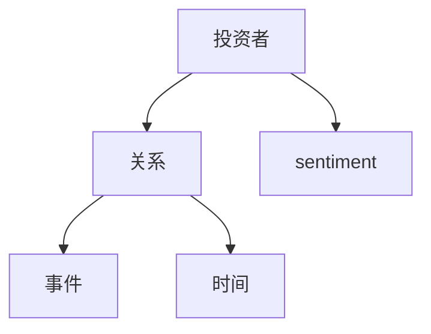
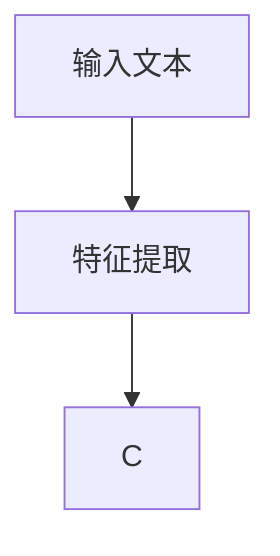
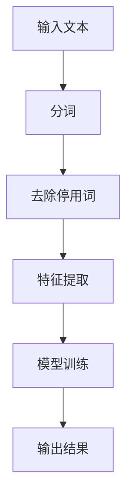
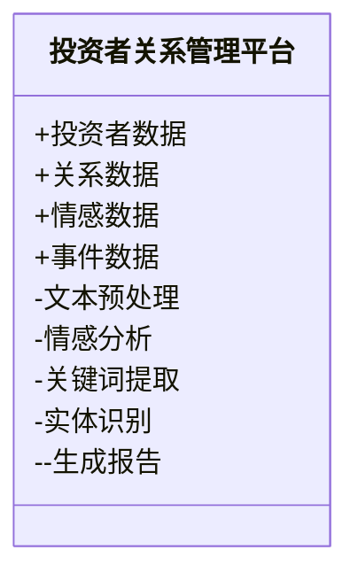
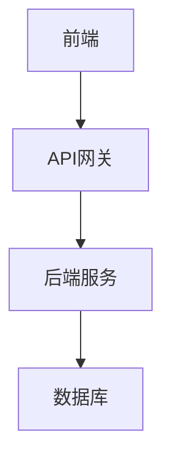
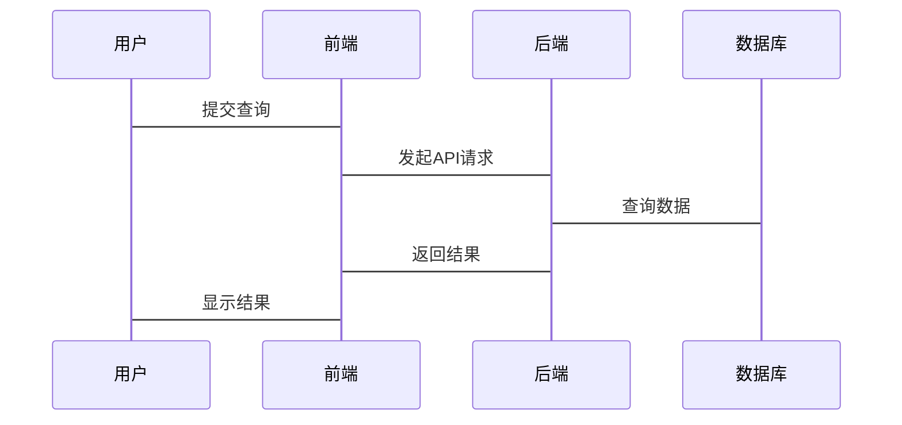

                 


# 智能投资者关系分析平台

## 关键词：投资者关系管理，人工智能，自然语言处理，情感分析，数据挖掘，机器学习

## 摘要：智能投资者关系分析平台通过结合自然语言处理、机器学习和数据挖掘技术，提供实时的投资者情绪分析、新闻事件关联和市场趋势预测。该平台利用先进的算法和系统架构，帮助企业和投资者更高效地进行沟通和决策。

---

# 第一部分: 智能投资者关系分析平台背景与核心概念

## 第1章: 智能投资者关系分析平台概述

### 1.1 投资者关系管理的背景与意义
#### 1.1.1 投资者关系管理的定义与重要性
投资者关系管理（Investor Relations Management,IRM）是指企业通过与投资者、潜在投资者以及其他利益相关者进行有效沟通，以建立和维护良好的关系。良好的投资者关系管理有助于提升企业形象、增强投资者信心、优化资本结构，并最终为企业创造长期价值。

#### 1.1.2 传统投资者关系管理的局限性
传统的投资者关系管理主要依赖于人工操作，包括定期发布财务报告、举办投资者会议、回答投资者提问等。这种方式效率较低，难以实时响应投资者需求，且难以对大量非结构化数据（如社交媒体评论、新闻报道）进行有效分析。

#### 1.1.3 智能化投资者关系管理的必要性
随着信息技术的发展，投资者关系管理也需要智能化。通过利用人工智能、自然语言处理和大数据分析等技术，企业可以更高效地处理海量信息，实时监控投资者情绪，预测市场趋势，并为决策提供数据支持。

### 1.2 智能投资者关系分析平台的核心目标
#### 1.2.1 提高投资者沟通效率
通过自动化处理投资者查询、自动分类投资者问题、生成个性化回复等方式，提高投资者关系管理的效率。

#### 1.2.2 实时监控投资者情绪
利用自然语言处理技术，实时分析投资者评论、社交媒体帖子等，识别投资者情绪（如正面、负面、中性），并及时反馈给企业。

#### 1.2.3 数据驱动的决策支持
通过分析投资者行为数据、市场趋势数据等，为企业提供数据支持，帮助企业在资本市场上做出更明智的决策。

### 1.3 平台的边界与外延
#### 1.3.1 平台的功能边界
智能投资者关系分析平台的核心功能包括：
- 数据采集与处理：从多种数据源（如新闻网站、社交媒体、财经论坛等）采集投资者相关数据，并进行清洗和预处理。
- 情感分析：对文本数据进行情感分析，识别投资者情绪。
- 关键词提取：提取文本中的关键词，识别重要事件。
- 实体识别：识别文本中的公司名称、人物、时间等实体。
- 可视化：生成图表，展示投资者情绪趋势、关键词分布等。

#### 1.3.2 平台的外延应用
智能投资者关系分析平台的应用范围不仅限于企业内部，还可以扩展到金融服务业、政府监管机构等领域。

#### 1.3.3 平台与现有系统的集成
智能投资者关系分析平台可以与其他企业系统（如ERP、CRM）集成，提供更全面的投资者关系管理解决方案。

### 1.4 核心概念与组成要素
#### 1.4.1 数据源的多样性
智能投资者关系分析平台需要处理多种数据源，包括：
- 文本数据：新闻报道、社交媒体帖子、投资者评论等。
- 结构化数据：财务报表、股价数据等。
- 非结构化数据：视频、音频等。

#### 1.4.2 分析模型的复杂性
平台需要结合多种分析模型，包括：
- 情感分析模型：用于识别文本情感。
- 关键词提取模型：用于提取文本中的关键词。
- 实体识别模型：用于识别文本中的实体。

#### 1.4.3 用户界面的友好性
平台需要提供直观的用户界面，方便用户进行操作和数据可视化。

### 1.5 本章小结
本章介绍了智能投资者关系分析平台的背景、核心目标、边界与外延，以及平台的核心概念与组成要素。通过这些内容，读者可以对智能投资者关系分析平台有一个全面的了解。

---

## 第2章: 智能投资者关系分析平台的核心概念与联系

### 2.1 自然语言处理在投资者关系分析中的应用
#### 2.1.1 文本预处理与特征提取
文本预处理包括分词、去除停用词、文本向量化等步骤。特征提取则是从文本中提取对情感分析有影响的关键特征。

#### 2.1.2 情感分析与关键词提取
情感分析用于识别文本情感，关键词提取用于识别文本中的重要主题。

#### 2.1.3 实体识别与关系抽取
实体识别用于识别文本中的公司名称、人物、时间等实体，关系抽取用于识别实体之间的关系。

### 2.2 数据挖掘与预测模型
#### 2.2.1 时间序列分析
时间序列分析用于分析投资者情绪的时间变化趋势。

#### 2.2.2 机器学习模型的构建
机器学习模型包括监督学习模型（如支持向量机、随机森林）和无监督学习模型（如聚类分析）。

#### 2.2.3 深度学习模型的应用
深度学习模型（如LSTM、BERT）在情感分析和文本生成中表现优异。

### 2.3 核心概念对比分析
#### 2.3.1 规则引擎与机器学习模型的对比
规则引擎基于预定义的规则进行判断，适用于简单的场景；机器学习模型基于数据学习，适用于复杂场景。

#### 2.3.2 不同算法的性能对比
通过对比不同算法的性能，选择最适合当前场景的算法。

#### 2.3.3 数据特征对模型性能的影响
不同的数据特征对模型性能有不同影响，需要根据具体场景选择合适的特征。

### 2.4 ER实体关系图


### 2.5 本章小结
本章通过对比分析不同技术在投资者关系分析中的应用，帮助读者更好地理解智能投资者关系分析平台的核心概念与联系。

---

## 第3章: 智能投资者关系分析平台的算法原理

### 3.1 情感分析算法原理
#### 3.1.1 情感分析的数学模型
$$f(x) = w·x + b$$

#### 3.1.2 支持向量机模型


#### 3.1.3 情感分析的流程图


#### 3.1.4 Python实现示例
```python
from sklearn.svm import SVC
from sklearn.feature_extraction.text import TfidfVectorizer

# 数据预处理
vectorizer = TfidfVectorizer()
X = vectorizer.fit_transform(corpus)

# 模型训练
model = SVC()
model.fit(X, y)

# 预测
test_corpus = ["公司业绩不佳，股价下跌"]
test_X = vectorizer.transform(test_corpus)
print(model.predict(test_X))
```

### 3.2 本章小结
本章详细讲解了情感分析算法的原理，并通过Python代码示例，帮助读者理解模型的实现过程。

---

## 第4章: 智能投资者关系分析平台的系统分析与架构设计

### 4.1 问题场景介绍
投资者关系分析平台需要处理海量的非结构化数据，实时分析投资者情绪，并生成可视化报告。

### 4.2 系统功能设计
#### 4.2.1 领域模型


#### 4.2.2 系统架构设计


#### 4.2.3 系统接口设计
- API接口：提供RESTful API，供前端调用。
- 数据接口：与第三方数据源（如新闻网站）对接。

#### 4.2.4 系统交互设计


### 4.3 本章小结
本章通过系统分析与架构设计，展示了智能投资者关系分析平台的技术实现方案。

---

## 第5章: 智能投资者关系分析平台的项目实战

### 5.1 环境安装
- Python 3.8+
- scikit-learn
- nltk
- mermaid

### 5.2 系统核心实现源代码
```python
import nltk
from sklearn.svm import SVC
from sklearn.feature_extraction.text import TfidfVectorizer

nltk.download('stopwords')

# 数据预处理
def preprocess(text):
    words = nltk.word_tokenize(text)
    filtered = [word for word in words if word.lower() not in nltk stopwords]
    return ' '.join(filtered)

# 模型训练
vectorizer = TfidfVectorizer()
model = SVC()

# 训练数据
corpus = ["公司业绩良好，股价上涨", "管理层变动频繁，公司前景不明"]
y = [1, 0]

corpus = [preprocess(text) for text in corpus]
X = vectorizer.fit_transform(corpus)

model.fit(X, y)

# 测试数据
test_corpus = ["公司发布新产品，市场反应热烈"]
test_X = vectorizer.transform([preprocess(test_corpus)])
print(model.predict(test_X))
```

### 5.3 实际案例分析
通过分析某公司的新闻数据，生成投资者情绪趋势图。

### 5.4 项目小结
本章通过实际案例分析，展示了智能投资者关系分析平台的实现过程。

---

## 第6章: 智能投资者关系分析平台的最佳实践

### 6.1 小结
智能投资者关系分析平台通过结合多种技术，为企业和投资者提供高效、智能的解决方案。

### 6.2 注意事项
- 数据隐私保护
- 模型的可解释性
- 系统的可扩展性

### 6.3 拓展阅读
建议读者进一步阅读相关领域的书籍和论文，如《自然语言处理实战》、《机器学习实战》等。

---

## 作者：AI天才研究院/AI Genius Institute & 禅与计算机程序设计艺术 /Zen And The Art of Computer Programming

