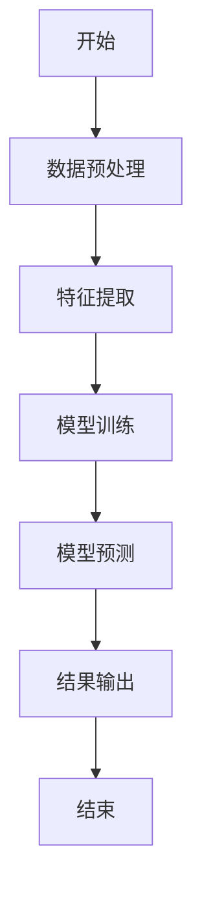
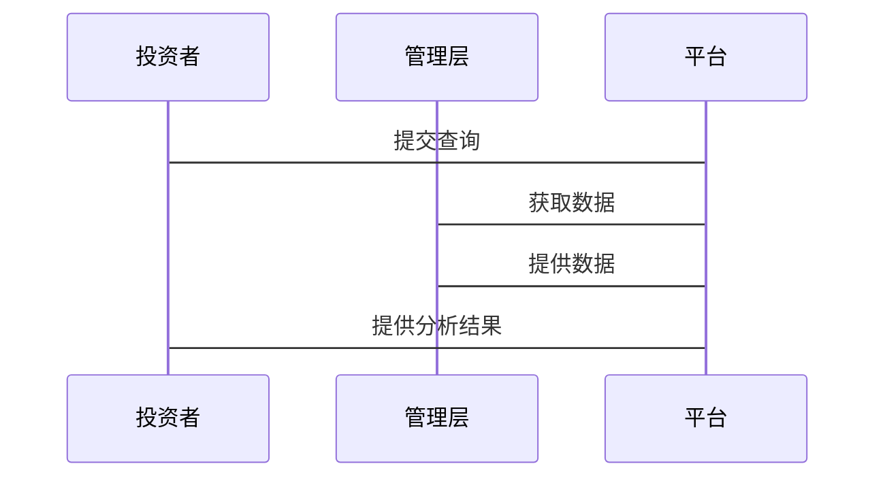

                 


# 智能投资者关系管理平台

## 关键词：
- 智能投资者关系管理平台
- 人工智能
- 自然语言处理
- 机器学习
- 数据分析

## 摘要：
智能投资者关系管理平台是一种结合人工智能和大数据分析的创新解决方案，旨在优化企业与投资者之间的沟通和管理。通过自然语言处理（NLP）和机器学习技术，该平台能够自动化处理投资者的反馈，实时分析市场动态，并提供精准的决策支持。本文将详细探讨智能投资者关系管理平台的核心概念、算法原理、系统架构以及实际应用案例。

---

# 第1章 智能投资者关系管理平台的背景与意义

## 1.1 问题背景
投资者关系管理（IRM）是企业与投资者之间建立有效沟通的重要环节。传统的投资者关系管理依赖人工处理，效率低下，且难以应对海量数据和复杂市场环境。随着大数据和人工智能技术的发展，智能化投资者关系管理成为必然趋势。

## 1.2 问题描述
企业在投资者关系管理中面临以下挑战：
- 数据分散：投资者反馈、市场报告、新闻等多种数据来源难以整合。
- 信息处理效率低：人工处理大量数据耗时耗力，难以快速响应投资者需求。
- 决策支持不足：缺乏实时数据分析，难以提供精准的市场洞察。

## 1.3 解决方案
智能投资者关系管理平台通过以下方式解决上述问题：
- **自动化数据处理**：利用NLP技术自动提取和分析文本数据。
- **智能预测与推荐**：基于机器学习算法预测市场趋势，为投资者提供个性化建议。
- **实时反馈机制**：通过实时数据分析，快速响应投资者需求。

## 1.4 边界与外延
智能投资者关系管理平台的边界包括投资者数据的采集、处理和分析，外延则延伸至市场动态预测、投资策略优化等领域。

---

# 第2章 智能投资者关系管理平台的核心概念

## 2.1 核心概念原理
- **自然语言处理（NLP）**：用于理解和分析投资者的文本反馈，如情感分析和关键词提取。
- **机器学习**：用于预测市场趋势和投资者行为，如监督学习和非监督学习。
- **数据挖掘**：用于从海量数据中提取有价值的信息，如关联规则挖掘。

## 2.2 核心概念属性特征对比
以下表格展示了智能投资者关系管理与传统投资者关系管理的核心区别：

| 属性 | 传统投资者关系管理 | 智能投资者关系管理 |
|------|---------------------|--------------------|
| 处理方式 | 人工处理 | 自动化处理 |
| 分析效率 | 低效 | 高效 |
| 数据来源 | 单一 | 多源化 |

## 2.3 ER实体关系图架构
以下是智能投资者关系管理平台的ER图：

```mermaid
erDiagram
    actor 投资者 {
        <属性> 姓名
        <属性> 股票代码
        <属性> 投资金额
    }
    actor 管理层 {
        <属性> 公司名称
        <属性> 财务数据
        <属性> 业务计划
    }
    actor 平台 {
        <属性> 平台ID
        <属性> 数据存储
        <属性> 分析结果
    }
    投资者 --> 管理层 : 提交查询
    管理层 --> 平台 : 提供数据
    平台 --> 投资者 : 提供分析结果
```

---

# 第3章 智能投资者关系管理平台的算法原理

## 3.1 自然语言处理（NLP）算法

### 3.1.1 文本预处理
文本预处理是NLP的关键步骤，包括以下内容：
- **分词**：将文本分割成单词或短语。
- **去除停用词**：移除常见的无意义词汇，如“的”、“了”等。
- **词干提取**：将词汇还原为其基本形式。

### 3.1.2 情感分析算法
情感分析用于判断投资者反馈中的情感倾向。常用的算法包括：
- **基于规则的情感分析**：通过预定义规则判断情感。
- **基于机器学习的情感分析**：使用训练好的模型进行分类。

### 3.1.3 主题分类算法
主题分类用于将投资者反馈归类到特定主题，如财务状况、公司治理等。

## 3.2 机器学习算法

### 3.2.1 数据特征提取
特征提取是机器学习的基础，常用方法包括：
- **TF-IDF**：计算单词的重要性。
- **Word2Vec**：将单词转换为向量表示。

### 3.2.2 监督学习模型
常用的监督学习模型包括：
- **逻辑回归**：用于分类任务。
- **支持向量机（SVM）**：适用于小规模数据分类。

### 3.2.3 非监督学习模型
非监督学习用于无标签数据的聚类分析，常用方法包括：
- **K-means**：基于距离的聚类算法。
- **层次聚类**：基于层次结构的聚类方法。

## 3.3 算法流程图
以下是智能投资者关系管理平台的算法流程图：



---

# 第4章 智能投资者关系管理平台的系统架构设计

## 4.1 问题场景介绍
投资者与管理层之间的信息不对称问题亟待解决。智能投资者关系管理平台通过实时数据分析，为投资者提供精准的市场洞察。

## 4.2 系统功能设计
系统功能包括：
- **数据采集模块**：从多种数据源采集投资者反馈。
- **数据分析模块**：对数据进行清洗、特征提取和建模。
- **反馈模块**：将分析结果反馈给投资者和管理层。

## 4.3 系统架构图
以下是系统架构图：


## 4.4 系统接口设计
系统接口包括：
- **投资者接口**：接收投资者反馈和查询。
- **管理层接口**：提供数据分析结果和市场预测。

## 4.5 系统交互图
以下是系统交互图：



---

# 第5章 智能投资者关系管理平台的项目实战

## 5.1 环境安装
安装Python和以下库：
- `numpy`
- `pandas`
- `scikit-learn`
- `spacy`

## 5.2 核心代码实现

### 5.2.1 数据预处理
```python
import spacy

nlp = spacy.load("en_core_web_sm")
doc = nlp("This company has great potential.")

for token in doc:
    print(token.text)
```

### 5.2.2 情感分析
```python
from sklearn.feature_extraction.text import TfidfVectorizer
from sklearn.svm import SVC

vectorizer = TfidfVectorizer()
X = vectorizer.fit_transform(documents)
model = SVC()
model.fit(X, labels)
```

## 5.3 案例分析
以某科技公司为例，分析投资者反馈并生成报告。

## 5.4 项目小结
通过实战案例，验证了智能投资者关系管理平台的有效性和实用性。

---

# 第6章 最佳实践与注意事项

## 6.1 最佳实践
- 数据质量：确保数据的准确性和完整性。
- 模型优化：定期更新模型，保持预测准确性。

## 6.2 注意事项
- 投资者隐私：严格保护投资者数据。
- 模型解释性：确保模型结果可解释。

## 6.3 拓展阅读
- 《机器学习实战》
- 《自然语言处理入门》

---

# 作者：AI天才研究院/AI Genius Institute & 禅与计算机程序设计艺术 /Zen And The Art of Computer Programming

