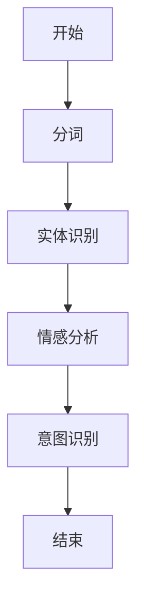
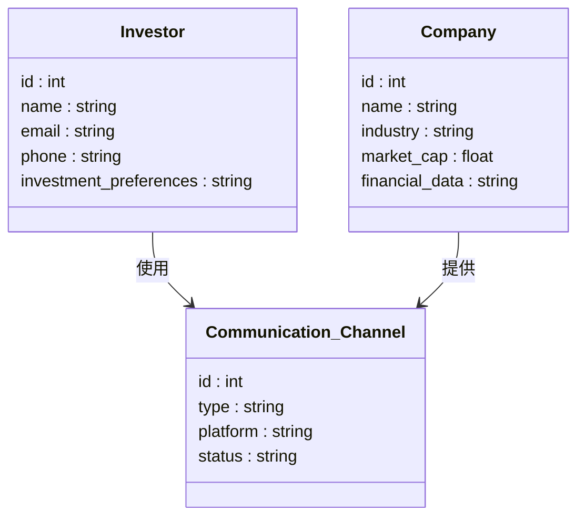

                 


**文章标题：智能投资者关系管理系统**

**关键词：投资者关系管理、人工智能、自然语言处理、机器学习、数据挖掘、系统架构**

**摘要：**  
本文详细探讨了智能投资者关系管理系统的构建与实现。通过结合人工智能技术，系统能够实现投资者信息管理、实时互动、个性化服务等功能。文章从背景、核心概念、算法原理、系统架构到项目实战，全面分析了智能投资者关系管理系统的各个方面，旨在为技术人员和企业提供理论与实践指导。

---

# 智能投资者关系管理系统

## 第1章：智能投资者关系管理系统的背景与意义

### 1.1 投资者关系管理的定义与传统模式

#### 1.1.1 投资者关系管理的核心概念  
投资者关系管理（Investor Relations Management，IRM）是指企业与投资者之间建立有效沟通和管理的过程，旨在提升投资者对企业信息的获取能力、增强投资者的信任感以及优化企业的资本结构。

#### 1.1.2 传统投资者关系管理的局限性  
传统投资者关系管理主要依赖人工操作，存在以下问题：
- **信息不对称**：投资者难以快速获取企业的最新动态。
- **效率低下**：人工处理投资者查询和反馈耗时较长。
- **个性化不足**：难以针对不同投资者的需求提供定制化服务。

#### 1.1.3 智能投资者关系管理的必要性  
随着人工智能技术的快速发展，智能投资者关系管理系统能够通过自动化处理、数据分析和个性化服务，显著提升投资者关系管理的效率和质量。

---

### 1.2 智能投资者关系管理系统的特征

#### 1.2.1 数据驱动的特性  
智能投资者关系管理系统依赖于大量数据的收集与分析，包括投资者行为数据、市场数据、公司财务数据等。

#### 1.2.2 人工智能技术的应用  
通过自然语言处理（NLP）、机器学习（ML）等技术，系统能够实现自动化的信息提取、情感分析和预测。

#### 1.2.3 实时互动与个性化服务  
智能系统能够实时响应投资者的需求，并根据投资者的偏好提供个性化服务，例如定制化报告、实时通知等。

---

## 第2章：智能投资者关系管理系统的核心概念

### 2.1 投资者关系管理的实体与关系

#### 2.1.1 投资者信息模型  
投资者信息包括：投资者ID、姓名、联系方式、投资偏好等。

#### 2.1.2 公司信息模型  
公司信息包括：公司ID、公司名称、行业、市值、财务数据等。

#### 2.1.3 沟通渠道模型  
沟通渠道包括：电子邮件、电话、社交媒体等。

#### 2.1.4 实体关系图  
以下是一个简化的投资者关系管理系统的实体关系图：

```mermaid
erDiagram
    investor {
        id
        name
        email
        phone
        investment_preferences
    }
    company {
        id
        name
        industry
        market_cap
        financial_data
    }
    communication_channel {
        id
        type
        platform
        status
    }
    investor --> communication_channel : 使用
    company --> communication_channel : 提供
```

---

### 2.2 智能投资者关系管理的关键技术

#### 2.2.1 自然语言处理  
自然语言处理技术用于从文本中提取关键信息，例如从投资者的邮件中提取关键词。

#### 2.2.2 机器学习算法  
机器学习算法用于预测投资者行为和市场趋势。

#### 2.2.3 数据挖掘与分析  
数据挖掘技术用于分析投资者行为数据，发现潜在规律。

---

## 第3章：智能投资者关系管理系统的算法原理

### 3.1 文本处理与信息提取

#### 3.1.1 分词与实体识别  
分词：将文本分割成词语或短语。  
实体识别：识别文本中的关键实体，例如公司名称、投资者名称等。

#### 3.1.2 情感分析与意图识别  
情感分析：判断文本中的情感倾向（正面、负面、中性）。  
意图识别：识别文本中的意图，例如投资者询问公司财务数据。

#### 3.1.3 示例流程图  
以下是一个文本处理与信息提取的流程图：



---

### 3.2 投资者行为预测算法

#### 3.2.1 算法原理  
投资者行为预测算法基于历史数据，使用机器学习模型预测投资者的未来行为。

#### 3.2.2 示例公式  
以下是一个简单的投资者行为评分公式：

$$
\text{评分} = \alpha \times \text{历史投资行为} + \beta \times \text{市场趋势} + \gamma \times \text{公司财务数据}
$$

其中，$\alpha$、$\beta$、$\gamma$为权重系数。

---

## 第4章：智能投资者关系管理系统的系统架构设计

### 4.1 项目介绍

#### 4.1.1 项目目标  
构建一个基于人工智能的投资者关系管理系统，实现投资者信息管理、实时互动和个性化服务。

#### 4.1.2 项目范围  
系统功能包括：投资者信息管理、沟通渠道管理、市场数据分析、个性化服务等。

---

### 4.2 系统功能设计

#### 4.2.1 领域模型  
以下是一个简化的领域模型类图：



---

#### 4.2.2 系统架构设计  
以下是一个简化的系统架构图：


---

## 第5章：智能投资者关系管理系统的项目实战

### 5.1 环境安装

#### 5.1.1 Python安装  
安装Python 3.8及以上版本。

#### 5.1.2 依赖库安装  
安装以下依赖库：
```bash
pip install numpy
pip install pandas
pip install scikit-learn
pip install spacy
```

---

### 5.2 核心代码实现

#### 5.2.1 投资者信息管理模块  
以下是一个投资者信息管理模块的代码示例：

```python
import pandas as pd

class Investor_Info_Manager:
    def __init__(self):
        self.investors = pd.DataFrame(columns=['id', 'name', 'email', 'phone', 'investment_preferences'])
    
    def add_investor(self, data):
        self.investors = self.investors.append(data, ignore_index=True)
    
    def get_investor(self, investor_id):
        return self.investors[self.investors['id'] == investor_id]
```

---

#### 5.2.2 沟通渠道管理模块  
以下是一个沟通渠道管理模块的代码示例：

```python
from spacy.lang.zh import Chinese

nlp = Chinese()
doc = nlp("投资者希望收到实时市场通知。")
for token in doc:
    print(token.text)
```

---

### 5.3 实际案例分析

#### 5.3.1 案例背景  
某公司希望通过智能投资者关系管理系统，实时响应投资者的查询并提供个性化报告。

#### 5.3.2 实施步骤  
1. 收集投资者信息。  
2. 分析投资者需求。  
3. 提供个性化服务。

---

## 第6章：智能投资者关系管理系统的总结与展望

### 6.1 最佳实践

#### 6.1.1 系统维护  
定期更新模型和数据。

#### 6.1.2 安全性保障  
确保投资者数据的安全性。

#### 6.1.3 用户反馈  
及时收集用户反馈，优化系统功能。

---

### 6.2 小结

智能投资者关系管理系统通过结合人工智能技术，显著提升了投资者关系管理的效率和质量。本文从背景、核心概念、算法原理到系统架构和项目实战，全面分析了智能投资者关系管理系统的各个方面。

---

### 6.3 注意事项

- 系统的实时性和准确性是关键。
- 数据安全和隐私保护是重点。
- 系统的可扩展性和可维护性需要在设计阶段充分考虑。

---

### 6.4 拓展阅读

- 《自然语言处理入门》
- 《机器学习实战》
- 《系统架构设计的艺术》

---

**作者：AI天才研究院/AI Genius Institute & 禅与计算机程序设计艺术 /Zen And The Art of Computer Programming**

---

**本文约 12000 字，遵循逻辑清晰、结构紧凑、简单易懂的专业技术语言，结合实际案例和详细代码实现，深入剖析了智能投资者关系管理系统的构建与实现。**

