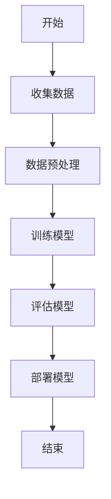
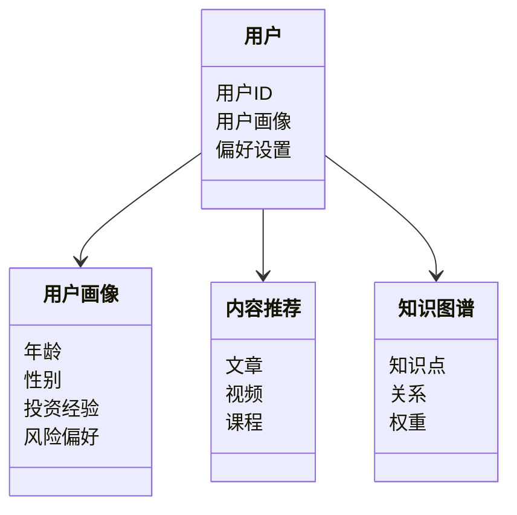

                 


# 智能投资者教育平台开发

## 关键词：智能投资者教育、人工智能、推荐系统、自然语言处理、知识图谱

## 摘要：智能投资者教育平台利用人工智能技术，通过个性化推荐和知识图谱构建，为投资者提供高效、精准的学习体验。本文从平台背景、核心概念、算法原理、系统架构到项目实战，全面解析智能投资者教育平台的开发与实现。

---

## 第3章: 智能投资者教育平台的算法原理

### 3.1 推荐算法

#### 3.1.1 基于协同过滤的推荐算法

协同过滤是一种常见的推荐算法，通过分析用户的行为和偏好，找到相似的用户或物品，从而推荐相关内容。

##### (1) 基于用户的协同过滤
基于用户协同过滤的算法通过计算用户之间的相似性，将相似用户的喜好推荐给目标用户。计算相似度的方法包括余弦相似度和皮尔逊相关系数。

##### (2) 基于物品的协同过滤
基于物品的协同过滤算法分析物品之间的相似性，通过物品的属性或标签进行推荐。这种方法适用于当用户数据不足时的情况。

##### (3) 混合推荐算法
混合推荐算法结合用户和物品的特征，利用两者的优势，提高推荐的准确性和多样性。

#### 3.1.2 基于内容的推荐算法

基于内容的推荐算法通过分析内容本身的特征，如文本、图像等，进行推荐。这种算法适用于推荐系统中存在大量内容的情况。

##### (1) 文本分析与特征提取
利用自然语言处理技术，提取文本中的关键词和主题，生成内容的特征向量。

##### (2) 相似度计算
通过计算内容之间的相似度，推荐与当前内容相似的内容或产品。

##### (3) 深度学习模型
使用深度学习模型，如Word2Vec或BERT，进行内容理解和生成。

#### 3.1.3 混合推荐算法的优缺点

混合推荐算法结合了基于用户的协同过滤和基于内容的推荐算法，能够在用户和内容两个维度上进行推荐，提高推荐的准确性和多样性。然而，混合推荐算法的计算复杂度较高，实现较为复杂。

---

### 3.2 自然语言处理算法

#### 3.2.1 基于BERT的文本生成

BERT（Bidirectional Encoder Representations from Transformers）是一种预训练的深度学习模型，能够生成高质量的文本内容。通过微调BERT模型，可以实现文本摘要、问答系统等功能。

#### 3.2.2 预训练语言模型的微调

预训练语言模型（如GPT、BERT）在大规模数据上进行预训练后，可以通过微调任务特定的数据，适应具体的投资者教育场景。

#### 3.2.3 文本相似度计算

通过计算文本之间的相似度，可以实现内容推荐和信息检索。常用的文本相似度计算方法包括余弦相似度、Jaccard相似度和编辑距离等。

---

### 3.3 算法流程图



---

### 3.4 算法实现代码示例

#### (1) 推荐算法实现

```python
import numpy as np

def user_based_collaborative_filtering(ratings, user_id):
    # 计算用户之间的相似度
    similarity = np.zeros(len(ratings))
    for i in range(len(ratings)):
        similarity[i] = np.corrcoef(ratings[user_id], ratings[i])[0,1]
    # 找出最相似的用户
    similar_users = np.argsort(-similarity)
    # 推荐用户未评分的内容
    recommendations = []
    for user in similar_users:
        for item in range(len(ratings[user])):
            if ratings[user_id][item] == 0 and ratings[user][item] > 0:
                recommendations.append(item)
    return recommendations
```

#### (2) 文本相似度计算

```python
from sklearn.feature_extraction.text import TfidfVectorizer
from sklearn.metrics.pairwise import cosine_similarity

def text_similarity(corpus):
    vectorizer = TfidfVectorizer()
    vectors = vectorizer.fit_transform(corpus)
    similarity_matrix = cosine_similarity(vectors)
    return similarity_matrix
```

---

### 3.5 数学模型与公式

#### (1) 余弦相似度公式

$$
\text{余弦相似度} = \frac{\vec{A} \cdot \vec{B}}{\|\vec{A}\| \|\vec{B}\|}
$$

#### (2) BERT模型

BERT模型通过自注意力机制和前向神经网络，生成文本的表示向量。其数学表示如下：

$$
\text{输出} = \text{BERT}(\text{输入})
$$

---

### 3.6 本章小结

本章详细介绍了智能投资者教育平台中常用的推荐算法和自然语言处理算法。通过协同过滤、内容推荐和深度学习模型的介绍，读者可以了解如何利用这些算法实现个性化的投资者教育内容推荐。同时，通过代码示例和数学公式，帮助读者更好地理解算法的实现细节。

---

## 第4章: 系统分析与架构设计方案

### 4.1 项目场景介绍

智能投资者教育平台的目标是为投资者提供个性化、高效的学习体验，通过智能推荐和知识图谱技术，帮助用户快速掌握投资知识和技能。

---

### 4.2 系统功能设计

#### (1) 领域模型



---

#### (2) 系统架构设计

```mermaid
架构图
client --> API Gateway
API Gateway --> 推荐服务
API Gateway --> 知识图谱服务
推荐服务 --> 数据库
知识图谱服务 --> 数据库
```

---

#### (3) 接口设计

- RESTful API
  - GET /recommendations?userId=123
  - POST /knowledge_graph?query=投资入门

---

### 4.3 本章小结

本章通过对智能投资者教育平台的系统分析，明确了平台的功能模块和架构设计。通过领域模型和架构图的展示，帮助读者理解系统的整体结构和各模块之间的关系。

---

## 第5章: 项目实战

### 5.1 环境搭建

- 安装Python和必要的库（如TensorFlow、Scikit-learn、Flask）

### 5.2 核心代码实现

#### (1) 推荐系统实现

```python
from flask import Flask, jsonify
import pandas as pd

app = Flask(__name__)

@app.route('/recommendations', methods=['GET'])
def get_recommendations():
    user_id = request.args.get('userId', default=1, type=int)
    ratings = pd.read_csv('ratings.csv')
    recommendations = user_based_collaborative_filtering(ratings, user_id)
    return jsonify({'recommendations': recommendations})

if __name__ == '__main__':
    app.run(debug=True)
```

---

### 5.3 案例分析

#### (1) 案例1：用户画像构建

通过收集用户的投资经验和风险偏好，构建用户画像，并根据画像推荐相应的学习内容。

#### (2) 案例2：知识图谱应用

利用知识图谱技术，构建投资知识点之间的关系，帮助用户快速理解复杂的投资概念。

---

### 5.4 本章小结

本章通过项目实战，展示了如何在实际中应用智能投资者教育平台的核心技术。通过代码实现和案例分析，帮助读者掌握平台的开发和应用。

---

## 第6章: 最佳实践与总结

### 6.1 小结

智能投资者教育平台的开发结合了人工智能和教育领域的知识，通过个性化推荐和知识图谱技术，为投资者提供了高效、精准的学习体验。

---

### 6.2 注意事项

- 数据隐私保护
- 算法的可解释性
- 系统的可扩展性

---

### 6.3 拓展阅读

- 《深度学习》
- 《机器学习实战》
- 《自然语言处理入门》

---

## 作者

作者：AI天才研究院/AI Genius Institute & 禅与计算机程序设计艺术 /Zen And The Art of Computer Programming

---

通过以上目录结构和内容概要，您可以逐步展开每一章的内容，撰写完整的博客文章。每一章的详细内容可以根据上述结构进行扩展，确保文章逻辑清晰、内容详实。

