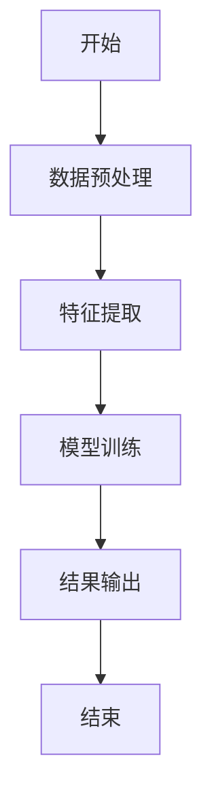

                 


# 智能投资者行为分析与预测平台

**关键词**：投资者行为分析，预测模型，机器学习，自然语言处理，行为特征提取，平台架构设计

**摘要**：  
智能投资者行为分析与预测平台通过结合机器学习、自然语言处理和行为特征提取等技术，对投资者的行为进行深入分析，并基于这些分析结果构建预测模型，为投资者提供个性化的行为预测服务。本文将从背景介绍、核心概念、算法原理、系统架构设计、实战案例以及总结等方面，详细阐述智能投资者行为分析与预测平台的构建过程和实现方法。

---

## 第一部分：智能投资者行为分析与预测平台背景介绍

### 第1章：智能投资者行为分析的背景与意义

#### 1.1 问题背景

投资者行为分析是金融领域中的重要研究方向。传统的投资者行为分析依赖于人工观察和经验判断，存在主观性强、效率低、覆盖面窄等局限性。随着大数据和人工智能技术的发展，智能投资者行为分析逐渐成为可能，通过自动化数据处理和机器学习算法，可以更高效地捕捉投资者行为特征，从而为投资决策提供更精准的参考。

#### 1.2 问题描述

投资者行为的复杂性主要体现在以下几个方面：

1. **多样性**：不同投资者的决策风格和行为模式差异显著。
2. **动态性**：投资者行为会受到市场环境、个人情绪等多种因素的影响。
3. **数据分散性**：投资者行为数据来源广泛，包括文本、语音、行为记录等，数据整合和处理难度大。

#### 1.3 问题解决

智能投资者行为分析的核心目标是通过数据驱动的方法，对投资者的行为进行建模和预测，从而帮助投资者优化决策、降低风险。平台化解决方案的优势在于可以将分析过程模块化，支持大规模数据处理和多维度特征提取。

---

## 第2章：投资者行为分析的核心概念与联系

### 2.1 核心概念原理

投资者行为分析的关键在于从多源数据中提取行为特征，并通过这些特征构建预测模型。以下是核心概念的具体解释：

1. **数据来源**：包括交易记录、社交媒体评论、新闻报道、访谈记录等。
2. **行为特征**：如情绪特征、认知特征、决策特征等。
3. **预测模型**：如逻辑回归、支持向量机（SVM）、神经网络等。

### 2.2 概念属性特征对比表格

| 概念       | 属性       | 特征                     |
|------------|------------|--------------------------|
| 数据来源    | 多样性     | 文本、语音、行为数据等   |
| 行为特征    | 综合性     | 心理、情绪、决策等       |
| 预测模型    | 复杂性     | 线性回归、神经网络等     |

### 2.3 ER实体关系图

```mermaid
er
  actor(investor, "投资者")
  actor(system, "系统")
  actor(data_source, "数据源")
  actor(predictor, "预测器")
  actor(result, "结果")
  system "智能投资者行为分析平台"
  system --> data_source: 获取数据
  system --> predictor: 传输数据
  predictor --> result: 返回预测结果
  system --> result: 显示结果
  investor --> system: 提交请求
```

---

## 第3章：智能投资者行为分析的算法原理

### 3.1 数据预处理

数据预处理是智能分析的第一步，主要包括：

1. **数据清洗**：去除噪声数据和异常值。
2. **数据归一化**：将数据标准化，便于模型处理。
3. **数据增强**：通过数据扩展技术提高数据多样性。

### 3.2 特征提取

特征提取是行为分析的关键步骤，主要包括：

1. **文本特征提取**：使用自然语言处理（NLP）技术提取文本中的情感、主题等特征。
2. **行为特征提取**：通过分析投资者的历史交易记录，提取其风险偏好、决策风格等特征。

### 3.3 算法选择与实现

#### 3.3.1 线性回归模型

线性回归模型是一种简单但有效的预测模型，适用于线性关系较强的场景。其数学表达式如下：

$$ y = \beta_0 + \beta_1x_1 + \beta_2x_2 + \ldots + \beta_nx_n $$

其中，$y$ 是目标变量，$x_i$ 是特征变量，$\beta_i$ 是模型参数。

#### 3.3.2 支持向量机（SVM）

SVM适用于分类和回归问题，特别适合高维数据。其核心思想是通过构建超平面将数据分为不同类别。

#### 3.3.3 神经网络模型

神经网络模型（如深度学习模型）在处理非线性关系和复杂特征时表现优异，但需要大量的数据和计算资源。

### 3.4 算法流程图



---

## 第4章：系统架构设计与实现

### 4.1 问题场景介绍

智能投资者行为分析与预测平台需要处理海量数据，并支持实时预测功能。系统架构设计需要考虑高可用性、可扩展性和安全性。

### 4.2 系统功能设计

系统功能模块包括：

1. **数据采集模块**：负责从多种数据源采集投资者行为数据。
2. **特征提取模块**：对采集的数据进行预处理和特征提取。
3. **模型训练模块**：基于特征数据训练预测模型。
4. **预测模块**：根据输入数据生成预测结果。

### 4.3 系统架构设计

系统架构采用微服务架构，各模块通过API进行交互。


### 4.4 系统接口设计

系统接口设计需要考虑模块之间的交互，例如：

1. 数据采集模块通过API向特征提取模块传递数据。
2. 特征提取模块通过API向模型训练模块传递特征数据。

### 4.5 系统交互流程图

```mermaid
sequenceDiagram
    participant Investor: 投资者
    participant System: 系统
    participant Data_source: 数据源
    participant Predictor: 预测器
    participant Result: 结果

    Investor -> System: 提交请求
    System -> Data_source: 获取数据
    System -> Predictor: 传输数据
    Predictor -> Result: 返回预测结果
    System -> Result: 显示结果
```

---

## 第5章：实战案例分析

### 5.1 环境安装与数据准备

环境安装包括安装Python、TensorFlow、Keras等工具。数据准备包括收集投资者行为数据，并进行预处理。

### 5.2 核心实现代码

以下是核心实现代码示例：

```python
import numpy as np
from sklearn.model_selection import train_test_split
from sklearn.linear_model import LinearRegression

# 数据预处理
data = np.array([[1, 2], [3, 4], [5, 6]])
X_train, X_test, y_train, y_test = train_test_split(data[:, 0], data[:, 1], test_size=0.2)

# 模型训练
model = LinearRegression()
model.fit(X_train.reshape(-1, 1), y_train.reshape(-1, 1))

# 预测
y_pred = model.predict(X_test.reshape(-1, 1))
print(y_pred)
```

### 5.3 案例分析与结果解读

通过上述代码，我们可以看到线性回归模型在投资者行为预测中的应用。实际案例中，预测结果可以帮助投资者优化决策。

---

## 第6章：总结与展望

### 6.1 总结

智能投资者行为分析与预测平台通过结合机器学习和行为分析技术，为投资者提供了一个高效、精准的行为预测工具。平台的核心优势在于其模块化设计和高效的数据处理能力。

### 6.2 展望

未来，智能投资者行为分析将更加依赖于人工智能和大数据技术，预测模型也将更加复杂和精确。同时，隐私保护和数据安全问题也需要得到更多关注。

---

**作者：AI天才研究院/AI Genius Institute & 禅与计算机程序设计艺术 /Zen And The Art of Computer Programming**

