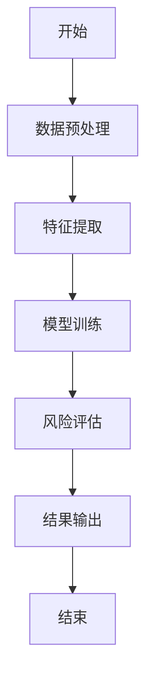
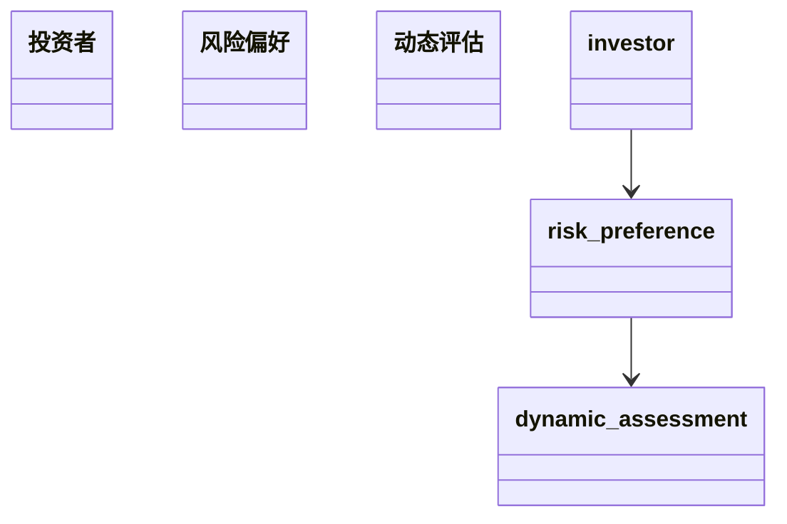

                 


# 智能投资者风险偏好动态评估

> 关键词：智能投资者，风险偏好，动态评估，机器学习，投资决策，风险控制，系统架构

> 摘要：本文探讨了智能投资者风险偏好动态评估的核心概念、算法原理和系统架构。通过机器学习模型，分析投资者行为数据，建立动态风险评估模型，实现个性化投资决策支持，提出优化建议。

---

# 第1章 智能投资者风险偏好动态评估的背景与概念

## 1.1 问题背景与描述

### 1.1.1 投资者风险偏好的传统评估方法
传统的投资者风险偏好评估基于静态模型，如凯利公式和马科维茨均值-方差模型，存在以下问题：
- 数据假设的局限性
- 忽略市场动态变化
- 无法捕捉投资者实时行为特征

### 1.1.2 动态评估的必要性与优势
现代金融环境的复杂性要求投资者风险偏好需动态评估：
- 市场波动性增强
- 投资者行为变化
- 个性化投资需求

动态评估的优势：
- 识别投资者风险承受能力变化
- 提供实时投资建议
- 优化投资组合配置

### 1.1.3 智能投资者的定义与特征
智能投资者是结合人类智慧与AI技术的投资者，具备以下特征：
- 数据驱动决策
- 自适应投资策略
- 实时风险监控

## 1.2 问题解决与边界

### 1.2.1 问题解决
动态评估模型解决传统评估的静态问题，实时捕捉投资者风险偏好变化。

### 1.2.2 边界与外延
- 限定条件：单个投资者
- 范围：短期投资行为
- 排除因素：不可预测事件

## 1.3 核心概念与联系

### 1.3.1 核心概念
- 智能投资者：AI驱动的投资者
- 风险偏好：风险承受度
- 动态评估：实时评估方法

### 1.3.2 实体关系图
```mermaid
er
actor 投资者
actor 评估系统
actor 数据源
```

---

# 第2章 核心概念与联系

## 2.1 智能投资者的核心概念

### 2.1.1 智能投资者的定义
结合人类智慧与AI技术的投资者，通过数据驱动决策。

### 2.1.2 风险偏好的多维度分析
从风险厌恶、风险中性和风险偏好三个维度分析投资者行为。

## 2.2 核心概念的属性对比

### 2.2.1 智能投资者与传统投资者对比
| 属性 | 智能投资者 | 传统投资者 |
|------|------------|------------|
| 决策依据 | 数据驱动 | 经验驱动 |
| 决策速度 | 实时 | 延时 |

### 2.2.2 风险偏好的时间维度特征
- 短期波动
- 长期稳定性

## 2.3 ER实体关系图
```mermaid
er
actor:投资者
actor:评估系统
actor:数据源
```

---

# 第3章 算法原理讲解

## 3.1 算法原理概述

### 3.1.1 风险偏好评估的核心算法
使用机器学习模型分析投资者行为数据。

## 3.2 算法流程图



## 3.3 算法实现代码

### 3.3.1 风险评估公式

$$
R = \alpha \cdot X + \beta \cdot Y + \gamma
$$

### 3.3.2 风险评估代码

```python
def risk_assessment(data):
    # 数据预处理
    preprocessed_data = preprocess(data)
    # 特征提取
    features = extract_features(preprocessed_data)
    # 模型预测
    model = load_model()
    predictions = model.predict(features)
    return predictions
```

---

# 第4章 数学模型

## 4.1 风险评估公式推导

$$
R = \sum_{i=1}^{n} w_i x_i
$$

---

# 第5章 系统分析与架构设计

## 5.1 系统功能设计

### 5.1.1 领域模型



---

# 第6章 项目实战

## 6.1 环境安装

### 6.1.1 安装依赖
- Python 3.8+
- scikit-learn
- pandas
- numpy

## 6.2 核心代码实现

### 6.2.1 风险评估代码

```python
def risk_assessment(data):
    # 数据预处理
    preprocessed_data = preprocess(data)
    # 特征提取
    features = extract_features(preprocessed_data)
    # 模型预测
    model = load_model()
    predictions = model.predict(features)
    return predictions
```

## 6.3 案例分析

### 6.3.1 案例分析
- 投资者A：风险厌恶
- 投资者B：风险中性
- 投资者C：风险偏好

## 6.4 项目小结

---

# 第7章 总结与展望

## 7.1 最佳实践 tips

### 7.1.1 数据质量
确保数据完整性和准确性。

### 7.1.2 模型优化
定期更新模型参数。

## 7.2 注意事项

### 7.2.1 数据隐私
保护投资者隐私。

### 7.2.2 模型局限
考虑市场不可预测因素。

## 7.3 拓展阅读

### 7.3.1 推荐书籍
- 《机器学习实战》
- 《投资学原理》

### 7.3.2 技术博客
- Towards Data Science
- Medium: AI in Finance

---

作者：AI天才研究院/AI Genius Institute & 禅与计算机程序设计艺术 /Zen And The Art of Computer Programming

