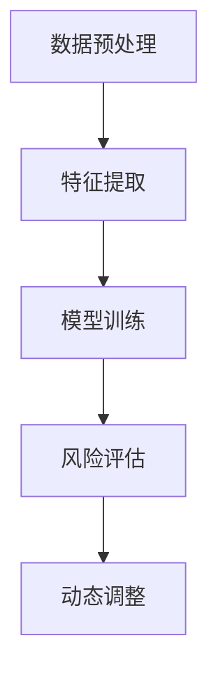
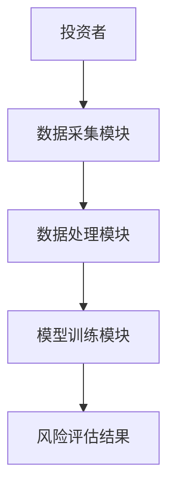
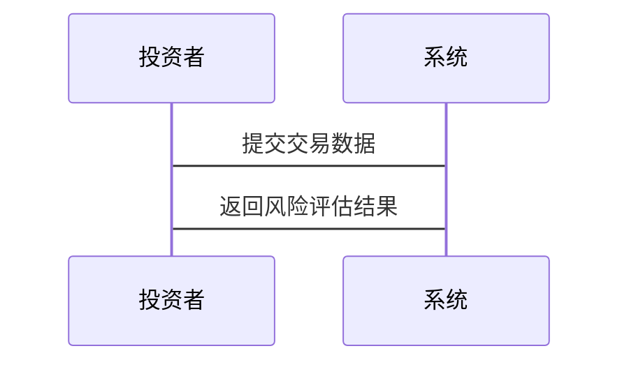

                 


# 智能投资者风险偏好动态评估系统

> 关键词：智能投资者，风险偏好，动态评估系统，机器学习，系统架构

> 摘要：本文介绍了一种智能投资者风险偏好动态评估系统，通过结合机器学习和大数据分析，实时动态评估投资者的风险偏好，为投资决策提供科学依据。文章详细讲解了系统的核心概念、算法原理、系统架构，并通过实际案例展示了系统的应用。

---

## 第1章：背景介绍

### 1.1 问题背景
随着金融市场的复杂化，投资者的行为变得越来越难以预测。传统的静态风险评估方法难以捕捉市场变化对投资者风险偏好的影响，导致评估结果不够准确。投资者的决策往往受到市场波动、个人情绪等多种因素的影响，如何实时捕捉这些变化，动态调整风险评估模型，成为一个亟待解决的问题。

### 1.2 问题描述
投资者的风险偏好并非一成不变，它会受到市场环境、个人情绪、投资经验等多种因素的影响。传统的风险评估方法通常基于静态数据，无法捕捉这些动态变化。因此，投资者可能在市场变化时做出错误的决策，导致投资损失。

### 1.3 问题解决
引入智能系统，通过实时收集和分析投资者的行为数据，动态调整风险评估模型。该系统能够根据市场变化和个人行为的变化，实时更新风险偏好评估结果，为投资者提供及时的决策支持。

### 1.4 边界与外延
智能投资者风险偏好动态评估系统的适用范围包括所有参与金融市场的投资者，但其评估结果仅供参考，不承担投资决策的法律责任。系统的主要局限性在于数据质量和模型的准确性，需结合其他信息进行综合判断。

### 1.5 核心要素
- 数据来源：市场数据、投资者行为数据。
- 模型构建：机器学习模型、时间序列分析。
- 结果应用：投资决策支持、风险预警。

---

## 第2章：核心概念与联系

### 2.1 核心概念解析
- 投资者行为分析：研究投资者在不同市场条件下的决策行为。
- 风险评估模型：通过数据建模评估投资者的风险偏好。
- 动态调整机制：根据实时数据更新评估结果。

### 2.2 概念属性对比
| 概念         | 属性                     |
|--------------|--------------------------|
| 投资者行为    | 行为数据来源、行为模式    |
| 风险评估模型  | 模型类型、评估指标        |
| 动态调整机制  | 调整频率、调整策略        |

### 2.3 ER实体关系图
```mermaid
er
    投资者
    帐户
    行为数据
    风险评估结果
    市场数据

    投资者 --> 帐户: 拥有
    帐户 --> 行为数据: 记录
    行为数据 --> 风险评估结果: 评估
    市场数据 --> 风险评估结果: 分析
```

---

## 第3章：算法原理

### 3.1 算法选择
- **机器学习模型**：使用线性回归模型预测风险偏好。
- **时间序列分析**：分析市场数据的时间依赖性。

### 3.2 算法流程


### 3.3 数学模型
- **线性回归模型**：
  $$ y = \beta_0 + \beta_1 x_1 + \beta_2 x_2 + \epsilon $$
  其中，$y$ 表示风险偏好，$x_1$ 和 $x_2$ 是投资者行为特征，$\beta$ 是回归系数，$\epsilon$ 是误差项。

### 3.4 代码实现
```python
import numpy as np
from sklearn.linear_model import LinearRegression

# 示例数据
X = np.array([[1, 2], [3, 4], [5, 6]])
y = np.array([2, 4, 6])

# 训练模型
model = LinearRegression()
model.fit(X, y)

# 预测
print(model.predict([[7, 8]]))
```

---

## 第4章：系统分析与架构设计

### 4.1 项目背景
本项目旨在开发一个智能投资者风险偏好动态评估系统，帮助投资者做出更明智的投资决策。

### 4.2 系统功能设计
- **投资者信息收集**：收集投资者的基本信息和交易历史。
- **风险评估**：基于收集的数据，评估投资者的风险偏好。
- **动态调整**：根据市场变化和投资者行为调整评估结果。

### 4.3 系统架构设计


### 4.4 系统接口设计
- **输入接口**：投资者行为数据接口。
- **输出接口**：风险评估结果接口。

### 4.5 系统交互流程


---

## 第5章：项目实战

### 5.1 环境安装
- 安装Python和必要的库：
  ```bash
  pip install numpy pandas scikit-learn
  ```

### 5.2 核心代码实现
```python
import pandas as pd
from sklearn.model_selection import train_test_split
from sklearn.metrics import mean_squared_error

# 数据加载
data = pd.read_csv('investor_data.csv')

# 特征选择
X = data[['age', 'investmentExperience']]
y = data['risk_score']

# 数据分割
X_train, X_test, y_train, y_test = train_test_split(X, y, test_size=0.2)

# 模型训练
model = LinearRegression()
model.fit(X_train, y_train)

# 模型评估
predictions = model.predict(X_test)
print(mean_squared_error(y_test, predictions))
```

### 5.3 案例分析
通过实际数据，展示模型的预测结果，并分析其准确性。例如，假设模型预测某投资者的风险偏好为高风险，而实际投资行为与预测相符，说明模型的有效性。

---

## 第6章：最佳实践

### 6.1 小结
智能投资者风险偏好动态评估系统通过实时数据采集和机器学习模型，能够有效评估投资者的风险偏好，为投资决策提供科学支持。

### 6.2 注意事项
- 数据质量：确保数据的准确性和完整性。
- 模型更新：定期更新模型，适应市场变化。

### 6.3 拓展阅读
建议进一步研究其他机器学习算法（如随机森林、神经网络）在风险评估中的应用，以及如何结合市场情绪指标（如VIX指数）进行更精准的预测。

---

## 作者

作者：AI天才研究院/AI Genius Institute & 禅与计算机程序设计艺术 /Zen And The Art of Computer Programming

---

**本文由AI天才研究院出品，转载请注明出处。**

