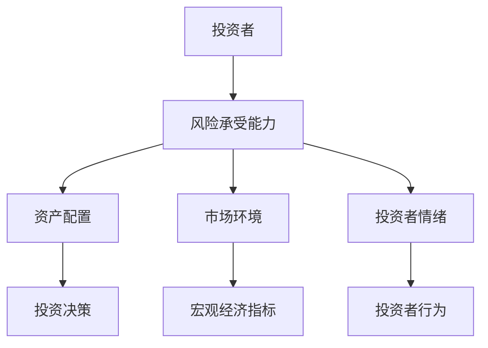
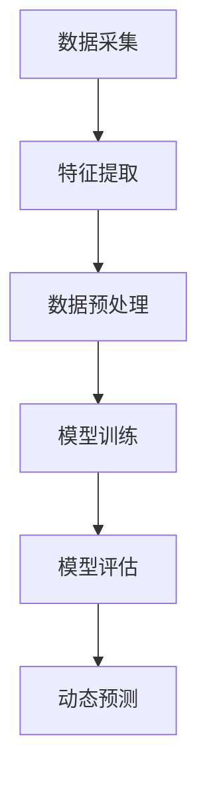
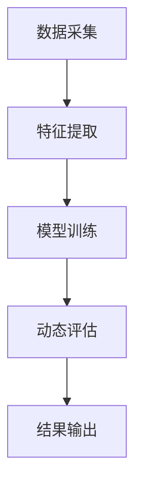
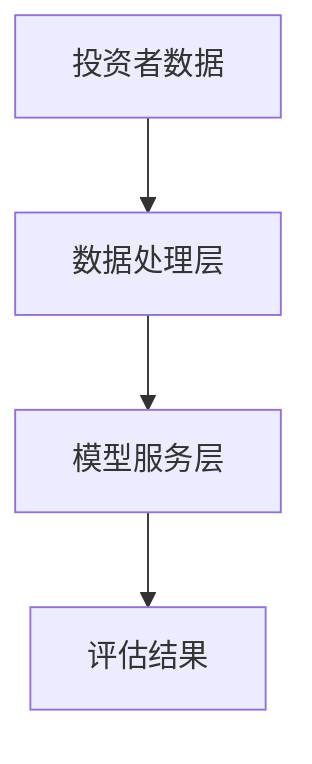
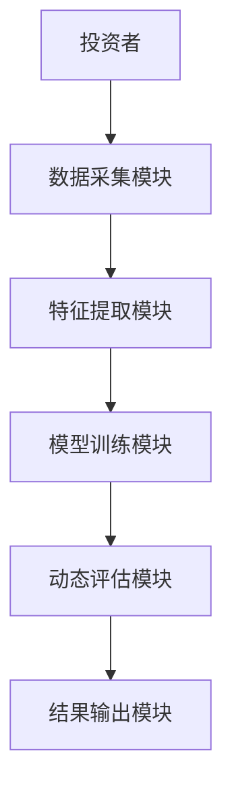

                 


# 智能投资者风险承受能力动态评估

## 关键词：智能投资者，风险承受能力，动态评估，机器学习，金融系统架构

## 摘要：本文探讨了智能投资者风险承受能力的动态评估方法，结合金融学、心理学和数据科学的原理，提出了一种基于机器学习和系统架构的解决方案。通过分析投资者行为、资产配置和市场环境，构建了一个动态评估模型，并提供了具体的算法实现和项目实战案例。文章最后总结了评估的关键点和未来的研究方向。

---

## 第一部分: 智能投资者风险承受能力动态评估背景与核心概念

### 第1章: 投资者行为分析与风险承受能力基础

#### 1.1 投资者行为分析

##### 1.1.1 投资者行为的定义与分类

投资者行为是指投资者在不同市场环境下做出的决策和行动。根据投资者的行为特征，可以将投资者分为保守型、稳健型、进取型和激进型四种类型。每种类型在风险偏好和决策模式上有显著差异。

##### 1.1.2 投资者决策的心理学基础

心理学研究表明，投资者的决策受情绪、认知偏差和外部环境的影响。例如，前景理论（Prospect Theory）指出，投资者在面对收益和损失时的风险偏好不同，这直接影响其风险承受能力。

##### 1.1.3 投资者行为与风险偏好之间的关系

风险偏好是投资者行为的核心驱动力。投资者的行为模式与其风险承受能力密切相关，不同风险偏好的投资者在市场波动中的行为表现差异显著。

#### 1.2 风险承受能力的定义与特征

##### 1.2.1 风险承受能力的定义

风险承受能力是投资者在面对市场波动时，能够承担风险损失的能力和意愿的综合体现。它不仅包括财务上的承受能力，还包括心理上的承受能力。

##### 1.2.2 风险承受能力的维度与层次

风险承受能力可以从资产配置、投资期限、风险厌恶程度等多个维度进行评估。不同层次的投资者（如机构投资者和个人投资者）的风险承受能力差异显著。

##### 1.2.3 风险承受能力与投资决策的关系

风险承受能力直接影响投资决策。例如，风险承受能力较高的投资者更倾向于投资高风险高回报的资产，而风险承受能力较低的投资者则更倾向于保守型投资。

#### 1.3 动态评估的必要性与挑战

##### 1.3.1 风险承受能力动态变化的原因

市场环境的变化、投资者自身财务状况的变化以及心理状态的变化都会影响风险承受能力。因此，需要动态评估来捕捉这些变化。

##### 1.3.2 动态评估在投资管理中的重要性

动态评估有助于投资者及时调整投资策略，优化资产配置，提高投资收益。同时，动态评估也是风险管理的重要工具，能够帮助投资者规避重大风险。

##### 1.3.3 动态评估的主要挑战与难点

动态评估需要实时数据采集、复杂的算法模型和高效的计算能力。同时，投资者行为的复杂性和市场环境的不确定性也增加了动态评估的难度。

### 第2章: 智能投资者风险承受能力动态评估的核心概念

#### 2.1 动态评估的关键要素

##### 2.1.1 投资者的资产配置与风险偏好

资产配置决定了投资者的风险承受能力。例如，投资股票比例较高的投资者风险承受能力较高，而投资债券比例较高的投资者风险承受能力较低。

##### 2.1.2 市场环境与宏观经济指标

宏观经济指标（如GDP增长率、通货膨胀率、利率等）直接影响市场环境，从而影响投资者的风险承受能力。

##### 2.1.3 投资者情绪与行为数据

投资者情绪波动会影响其风险承受能力。例如，市场恐慌时，投资者风险承受能力下降，倾向于卖出资产。

#### 2.2 核心概念的属性特征对比

##### 2.2.1 静态评估与动态评估的对比分析

静态评估仅基于当前数据，无法捕捉变化；动态评估则能够实时更新，捕捉变化。

##### 2.2.2 不同投资者群体的风险承受能力特征

机构投资者和个人投资者的风险承受能力差异显著。机构投资者通常有更高的风险承受能力。

##### 2.2.3 不同市场环境下的风险评估差异

牛市和熊市下的风险承受能力评估结果差异显著。例如，牛市中投资者风险承受能力较高，熊市中则相反。

#### 2.3 实体关系图（ER图）架构



---

## 第二部分: 智能投资者风险承受能力动态评估的算法原理

### 第3章: 动态评估的算法原理与实现

#### 3.1 数据采集与特征提取

##### 3.1.1 数据来源与采集方法

数据来源包括投资者的历史交易数据、市场数据（如股票价格、指数）、宏观经济指标、投资者问卷调查等。

##### 3.1.2 特征提取的关键步骤

特征提取包括投资者的交易频率、资产分配比例、市场波动性指标等。这些特征能够反映投资者的风险偏好和行为模式。

##### 3.1.3 数据预处理与标准化

数据预处理包括缺失值处理、异常值剔除、数据标准化等。这些步骤有助于提高模型的准确性和稳定性。

#### 3.2 模型训练与评估

##### 3.2.1 基于机器学习的分类算法

常用的分类算法包括逻辑回归、支持向量机（SVM）、随机森林等。这些算法可以用于分类投资者的风险承受能力等级。

##### 3.2.2 基于时间序列的预测模型

时间序列模型如ARIMA、LSTM等，适用于预测市场波动和投资者行为变化。

##### 3.2.3 模型评估与优化

模型评估包括准确率、召回率、F1值等指标。模型优化通过交叉验证、网格搜索等方法实现。

#### 3.3 动态评估的算法流程



#### 3.4 算法实现的Python代码示例

##### 3.4.1 数据预处理

```python
import pandas as pd
import numpy as np

# 假设data是原始数据
data = pd.read_csv('investor_data.csv')

# 删除缺失值
data = data.dropna()

# 标准化处理
from sklearn.preprocessing import StandardScaler

scaler = StandardScaler()
data_scaled = scaler.fit_transform(data)
```

##### 3.4.2 模型训练与预测

```python
from sklearn.model_selection import train_test_split
from sklearn.ensemble import RandomForestClassifier

# 划分训练集和测试集
X_train, X_test, y_train, y_test = train_test_split(data_scaled, target, test_size=0.2)

# 训练随机森林模型
model = RandomForestClassifier()
model.fit(X_train, y_train)

# 预测
y_pred = model.predict(X_test)
```

---

## 第四部分: 智能投资者风险承受能力动态评估的系统架构与实现

### 第4章: 系统架构与接口设计

#### 4.1 问题场景介绍

系统需要实时采集投资者数据，包括交易数据、市场数据、投资者问卷调查等，并动态评估投资者的风险承受能力。

#### 4.2 系统功能设计

##### 4.2.1 系统功能模块

- 数据采集模块：负责采集投资者数据。
- 特征提取模块：提取关键特征。
- 模型训练模块：训练评估模型。
- 动态评估模块：实时评估风险承受能力。

##### 4.2.2 系统功能流程



#### 4.3 系统架构设计

##### 4.3.1 系统架构图



##### 4.3.2 系统接口设计

系统接口包括数据输入接口、模型调用接口和结果输出接口。数据输入接口接收投资者数据，模型调用接口调用评估模型，结果输出接口返回评估结果。

#### 4.4 系统交互设计

##### 4.4.1 系统交互流程



---

## 第五部分: 智能投资者风险承受能力动态评估的项目实战

### 第5章: 项目实现与案例分析

#### 5.1 项目实战

##### 5.1.1 环境安装

安装必要的Python库，如Pandas、Scikit-learn、Mermaid等。

##### 5.1.2 代码实现

```python
import pandas as pd
from sklearn.ensemble import RandomForestClassifier

# 读取数据
data = pd.read_csv('investor_data.csv')

# 数据预处理
data = data.dropna()
scaler = StandardScaler()
data_scaled = scaler.fit_transform(data)

# 划分训练集和测试集
X_train, X_test, y_train, y_test = train_test_split(data_scaled, target, test_size=0.2)

# 训练模型
model = RandomForestClassifier()
model.fit(X_train, y_train)

# 预测
y_pred = model.predict(X_test)

# 输出结果
print('Accuracy:', accuracy_score(y_test, y_pred))
```

##### 5.1.3 案例分析

以某投资者为例，分析其风险承受能力动态变化的过程，展示模型的预测结果和实际结果的对比。

#### 5.1.4 代码解读与分析

详细解读代码实现，分析每一步的作用和意义。

---

## 第六部分: 智能投资者风险承受能力动态评估的总结与展望

### 第6章: 总结与展望

#### 6.1 项目总结

总结本文提出的方法和实现过程，强调动态评估的重要性和实现的可行性。

#### 6.2 未来研究方向

提出未来可能的研究方向，如引入更复杂的模型、增加更多的数据源、优化评估算法等。

---

## 附录

### 附录A: 参考文献

列出本文中引用的相关文献和资料。

### 附录B: 工具与库

列出本文中使用的主要工具和库，如Pandas、Scikit-learn、Mermaid等。

---

## 作者：AI天才研究院/AI Genius Institute & 禅与计算机程序设计艺术 /Zen And The Art of Computer Programming

---

通过以上结构和内容，文章详细阐述了智能投资者风险承受能力动态评估的背景、核心概念、算法原理、系统架构和项目实战，为读者提供了全面的理论和实践指导。

