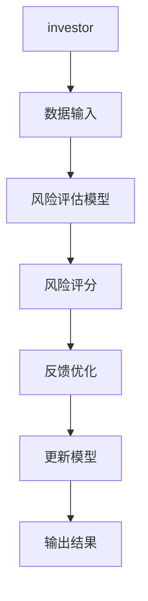
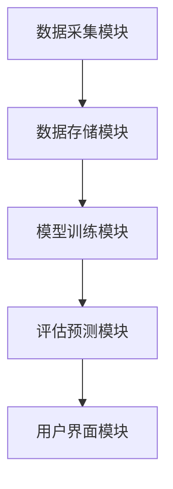

                 


# 智能投资者风险承受能力动态评估

> 关键词：智能投资者，风险承受能力，动态评估，投资决策，风险管理

> 摘要：本文探讨了智能投资者在风险管理中的风险承受能力评估方法，详细分析了动态评估的理论基础、算法实现、系统架构及实际应用，提供了从理论到实践的全面指导。

---

## 第1章：智能投资者风险承受能力评估的背景与问题

### 1.1 风险承受能力评估的必要性

#### 1.1.1 投资者决策中的风险因素

在金融投资领域，投资者的决策往往受到多种风险因素的影响，包括市场波动、经济周期、政策变化等。传统的静态风险承受能力评估方法难以捕捉这些动态变化，导致评估结果的局限性。智能投资者通过结合人工智能和大数据分析，能够实时捕捉这些变化，从而提供更精准的评估结果。

#### 1.1.2 风险承受能力的核心概念

风险承受能力是指投资者在面对潜在损失时的心理和财务承受能力。它不仅涉及投资者的财务状况，还包括其心理特征、投资目标和风险偏好。动态评估强调在不同时间点对这些因素进行调整，以反映投资者在不同市场环境下的风险承受能力。

#### 1.1.3 动态评估的现实意义

动态评估能够帮助投资者在市场波动中及时调整投资策略，避免重大损失。对于机构投资者而言，动态评估能够优化资产配置，提高投资组合的稳定性。对于个人投资者，动态评估可以帮助其更好地理解自身的风险承受能力，做出更明智的投资决策。

### 1.2 智能投资者的定义与特征

#### 1.2.1 传统投资者与智能投资者的对比

传统投资者主要依赖经验和市场分析进行决策，而智能投资者则利用大数据、机器学习等技术，结合实时市场数据和投资者行为数据，进行更为精准的投资决策。智能投资者能够快速适应市场变化，显著提高决策的效率和准确性。

#### 1.2.2 智能投资者的决策优势

智能投资者通过算法模型分析海量数据，识别潜在的投资机会和风险，从而在市场变化中做出更优决策。此外，智能投资者能够实时监控市场动态，及时调整投资策略，降低投资风险。

#### 1.2.3 智能投资者与风险管理的关系

风险管理是智能投资者决策的核心部分。通过动态评估，智能投资者能够实时监控和调整其风险承受能力，确保投资组合的稳定性和收益性。

### 1.3 动态评估的理论基础

#### 1.3.1 风险承受能力的构成要素

风险承受能力的评估需要考虑多个因素，包括投资者的财务状况、心理特征、投资目标和市场环境等。这些因素共同决定了投资者在不同市场环境下的风险承受能力。

#### 1.3.2 动态评估的模型框架

动态评估模型通常包括数据采集、模型训练、评估预测和反馈优化四个阶段。模型通过实时数据更新，不断优化评估结果，提供更准确的风险承受能力评估。

#### 1.3.3 评估指标的选择与权重

评估指标的选择直接影响评估结果的准确性。常见的评估指标包括波动率、最大回撤、VaR（在险值）等。不同指标的权重需要根据具体场景和投资者需求进行调整。

---

## 第2章：智能投资者风险承受能力的核心概念与联系

### 2.1 核心概念的定义与属性

#### 2.1.1 智能投资者的决策模型

智能投资者的决策模型通常基于机器学习算法，包括回归分析、聚类分析、神经网络等。这些算法能够从历史数据中学习投资者的行为模式，预测未来的投资决策。

#### 2.1.2 风险承受能力的度量方法

风险承受能力的度量方法通常包括主观评估和客观评估两种方式。主观评估基于投资者的问卷调查，而客观评估则基于投资者的财务数据和市场数据。

#### 2.1.3 动态评估的反馈机制

动态评估的反馈机制通过实时监控市场数据和投资者行为数据，不断更新评估结果。反馈机制能够帮助模型快速适应市场变化，提高评估的准确性。

### 2.2 概念属性对比分析

#### 2.2.1 智能投资者与非智能投资者的对比

智能投资者能够实时调整投资策略，而传统投资者则依赖经验和市场分析。智能投资者的优势在于其快速响应能力和数据驱动的决策能力。

#### 2.2.2 风险承受能力与投资收益的关系

风险承受能力与投资收益密切相关。投资者的风险承受能力越高，可能获得的投资收益也越高，但同时面临的市场风险也越大。

#### 2.2.3 动态评估与静态评估的差异

动态评估能够实时更新评估结果，而静态评估则基于固定的历史数据。动态评估能够更好地反映市场变化，提高评估的准确性。

### 2.3 实体关系图与流程图

#### 2.3.1 ER实体关系图

```mermaid
er
  investor(investor_id, name, risk_tolerance, investment_strategy, investment_behavior)
  risk_assessment(risk_assessment_id, investor_id, assessment_date, risk_score)
  decision_model(decision_model_id, model_type, model_version, training_data)
  feedback_loop(feedback_id, investor_id, assessment_date, feedback_score)
```

#### 2.3.2 动态评估流程图



---

## 第3章：智能投资者风险承受能力评估的算法原理

### 3.1 评估模型的输入与输出

#### 3.1.1 输入数据

输入数据包括投资者的财务数据（如资产规模、负债情况）、行为数据（如交易频率、投资偏好）、市场数据（如市场指数、行业趋势）等。

#### 3.1.2 输出结果

输出结果包括投资者的风险承受能力评分、风险承受能力的动态变化趋势、投资建议等。

### 3.2 算法实现与流程

#### 3.2.1 数据预处理

数据预处理包括数据清洗、特征提取、数据标准化等步骤。例如，使用PCA（主成分分析）进行特征降维。

#### 3.2.2 模型训练

模型训练基于历史数据，采用监督学习算法（如随机森林、支持向量机）或无监督学习算法（如聚类分析）进行训练。例如，使用XGBoost算法进行风险评分预测。

#### 3.2.3 模型预测

模型预测基于实时数据，预测投资者的未来风险承受能力变化。例如，使用时间序列分析模型（如ARIMA）预测未来市场波动对风险承受能力的影响。

### 3.3 数学模型与公式

#### 3.3.1 风险评分计算公式

$$
\text{风险评分} = \alpha \times \text{市场波动} + \beta \times \text{投资者行为} + \gamma \times \text{财务状况}
$$

其中，$\alpha$、$\beta$、$\gamma$是模型训练得到的权重系数。

#### 3.3.2 动态评估的反馈机制

$$
\text{反馈优化} = \text{实际结果} - \text{模型预测} + \text{调整系数}
$$

---

## 第4章：智能投资者风险承受能力评估的系统架构

### 4.1 系统功能设计

#### 4.1.1 数据采集模块

数据采集模块负责收集投资者的财务数据、行为数据和市场数据。例如，使用API接口从金融数据供应商获取实时市场数据。

#### 4.1.2 模型训练模块

模型训练模块基于历史数据，训练风险承受能力评估模型。例如，使用TensorFlow框架训练深度学习模型。

#### 4.1.3 评估预测模块

评估预测模块基于实时数据，预测投资者的未来风险承受能力。例如，使用Flask框架构建API接口，提供实时评估结果。

### 4.2 系统架构设计

#### 4.2.1 分层架构

系统采用分层架构，包括数据层、业务逻辑层和用户界面层。数据层负责数据存储和管理，业务逻辑层负责模型训练和预测，用户界面层负责用户交互和结果展示。

#### 4.2.2 组件交互图



---

## 第5章：智能投资者风险承受能力评估的项目实战

### 5.1 环境安装

#### 5.1.1 安装Python

```bash
python --version
pip install --upgrade pip
```

#### 5.1.2 安装依赖库

```bash
pip install numpy pandas scikit-learn tensorflow matplotlib
```

### 5.2 核心代码实现

#### 5.2.1 数据预处理

```python
import pandas as pd
import numpy as np

# 加载数据
data = pd.read_csv('investor_data.csv')

# 数据清洗
data.dropna(inplace=True)

# 特征提取
features = data[['资产规模', '负债情况', '交易频率']]
```

#### 5.2.2 模型训练

```python
from sklearn.ensemble import RandomForestRegressor
from sklearn.metrics import mean_squared_error

# 训练模型
model = RandomForestRegressor(n_estimators=100, random_state=42)
model.fit(features, data['风险评分'])
```

#### 5.2.3 模型预测

```python
# 预测风险评分
predicted_scores = model.predict(new_features)
```

### 5.3 案例分析

假设我们有三位投资者，他们的财务数据如下：

| 投资者ID | 资产规模 | 负债情况 | 交易频率 |
|----------|----------|----------|----------|
| I001     | 100万    | 0        | 高       |
| I002     | 50万     | 20万     | 中       |
| I003     | 20万     | 10万     | 低       |

使用训练好的模型进行预测，得到风险评分分别为：

| 投资者ID | 风险评分 |
|----------|----------|
| I001     | 85       |
| I002     | 70       |
| I003     | 50       |

---

## 第6章：智能投资者风险承受能力评估的最佳实践

### 6.1 小结

智能投资者风险承受能力动态评估通过结合人工智能和大数据分析，能够实时捕捉市场变化，提供更精准的评估结果。动态评估不仅提高了投资决策的效率，还降低了投资风险。

### 6.2 注意事项

在实际应用中，需要注意数据的实时性和准确性，模型的可解释性和可维护性，以及系统的安全性和稳定性。此外，投资者的隐私保护也是需要重点关注的问题。

### 6.3 未来展望

未来，随着人工智能和大数据技术的不断发展，智能投资者风险承受能力评估将更加智能化和个性化。模型将更加复杂，能够预测更多维度的风险因素，提供更加精准的投资建议。

---

## 作者

作者：AI天才研究院/AI Genius Institute & 禅与计算机程序设计艺术/Zen And The Art of Computer Programming

