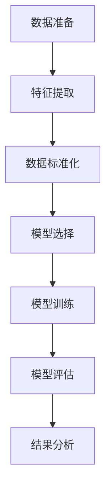
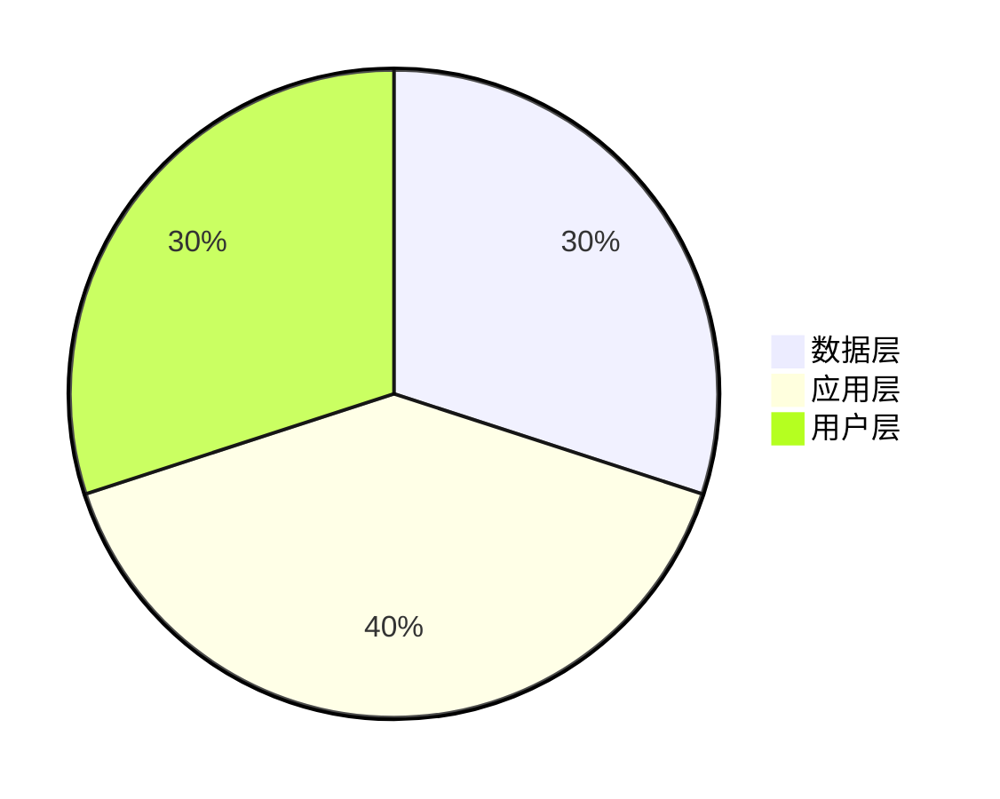
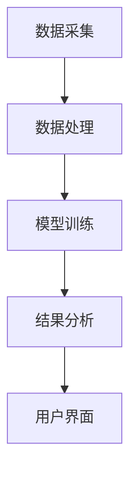
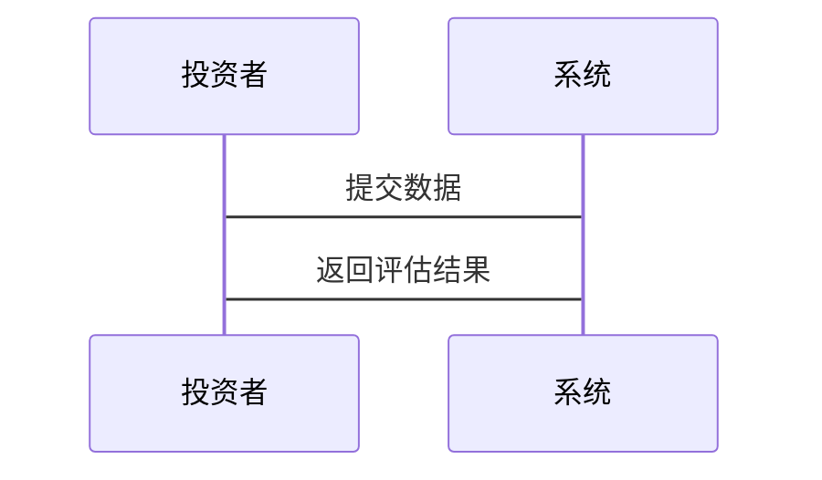

                 


# 智能投资者风险承受能力评估

> 关键词：智能评估、风险承受能力、机器学习、投资者行为分析、金融系统架构

> 摘要：本文系统地探讨了智能投资者风险承受能力评估的核心概念、算法原理、系统架构以及实际应用。通过分析传统评估方法的局限性，结合现代机器学习技术，提出了一种基于数据驱动的智能评估模型。文章详细阐述了从数据预处理到模型训练的全过程，并通过实际案例展示了系统的实现与优化。最后，总结了智能评估的优势及其在未来投资决策中的重要性。

---

## 第1章：投资者风险承受能力概述

### 1.1 投资者风险承受能力的定义与特征

投资者风险承受能力是指投资者在面对投资风险时的心理和财务上的承受能力，包括对风险的容忍度、认知能力和实际承担能力。其特征包括：

- **心理因素**：投资者对风险的态度，如厌恶风险或寻求风险。
- **财务因素**：投资者的资产规模、流动性需求和财务稳定性。
- **行为因素**：投资者在面对亏损时的决策行为和情绪反应。

### 1.2 投资者类型与风险偏好

投资者根据其风险偏好可以分为保守型、稳健型和激进型。不同类型的投资者具有不同的风险承受能力：

- **保守型投资者**：倾向于低风险投资，注重本金安全。
- **稳健型投资者**：追求稳定收益，愿意承担适度风险。
- **激进型投资者**：愿意承担高风险以获取高收益。

### 1.3 传统风险承受能力评估方法

传统评估方法通常依赖于问卷调查和历史数据分析，存在以下问题：

- **问卷评估**：主观性较强，难以准确反映投资者的真实风险承受能力。
- **历史数据分析**：依赖于过去的数据，无法预测未来的市场变化。

### 1.4 智能评估的必要性与优势

智能评估通过机器学习和大数据分析，能够更准确地评估投资者的风险承受能力。其优势包括：

- **数据驱动**：利用海量数据进行分析，提高评估的准确性。
- **实时更新**：能够根据市场变化和投资者行为动态调整评估结果。
- **个性化评估**：基于投资者的个性特征和行为数据，提供定制化的评估方案。

---

## 第2章：智能投资者风险承受能力评估的核心概念

### 2.1 数据驱动的评估方法

数据驱动的评估方法通过收集和分析投资者的多维度数据，包括交易记录、市场行为、心理测试等，构建投资者的画像。

#### 2.1.1 数据来源与类型

- **交易数据**：投资者的历史交易记录，包括买入、卖出、持仓时间等。
- **市场数据**：市场指数、行业趋势、经济指标等。
- **行为数据**：投资者在平台上的操作行为，如点击、浏览、搜索等。
- **心理数据**：通过问卷或测试获取的投资者心理特征。

#### 2.1.2 数据预处理与清洗

数据预处理是确保评估模型准确性的关键步骤，包括：

- **数据清洗**：去除噪声数据和异常值。
- **数据标准化**：将不同量纲的数据进行标准化处理。
- **数据补齐**：处理缺失数据，采用均值、中位数或插值法。

#### 2.1.3 数据特征提取

特征提取是将原始数据转化为有助于模型训练的特征，常用的方法包括：

- **主成分分析（PCA）**：降低数据维度，提取主要特征。
- **特征选择**：根据特征的重要性进行选择，去除无关特征。

### 2.2 机器学习在风险评估中的应用

机器学习算法在智能评估中的应用主要体现在以下几个方面：

#### 2.2.1 机器学习的基本概念

机器学习是一种通过数据训练模型，使其能够从数据中学习并做出预测的技术。常用的算法包括：

- **监督学习**：如线性回归、支持向量机（SVM）。
- **无监督学习**：如聚类分析。
- **深度学习**：如神经网络。

#### 2.2.2 常见机器学习算法在风险评估中的应用

- **线性回归**：用于预测投资者的收益与风险承受能力之间的关系。
- **随机森林**：用于特征重要性分析和风险分类。
- **支持向量机（SVM）**：用于投资者类型分类。

#### 2.2.3 算法选择与优化

在选择算法时，需要考虑数据的规模、特征的类型以及模型的复杂度。常用的方法包括：

- **交叉验证**：用于评估模型的泛化能力。
- **超参数优化**：通过网格搜索或随机搜索优化模型性能。

### 2.3 智能评估模型的构建与验证

#### 2.3.1 模型构建的基本步骤

1. **数据准备**：收集、清洗和特征提取。
2. **模型选择**：选择合适的机器学习算法。
3. **模型训练**：利用训练数据训练模型。
4. **模型评估**：通过测试数据验证模型的准确性。

#### 2.3.2 模型验证与评估指标

常用的评估指标包括：

- **准确率**：模型预测正确的比例。
- **召回率**：模型预测出正类的比例。
- **F1分数**：综合准确率和召回率的指标。

#### 2.3.3 模型的优化与调优

通过调整模型参数、改变特征选择或尝试不同的算法，优化模型的性能。

---

## 第3章：智能评估的算法原理

### 3.1 数据预处理与特征工程

#### 3.1.1 数据清洗与标准化

数据清洗是确保数据质量的关键步骤，包括去除重复数据、处理缺失值和异常值。数据标准化则是将不同量纲的数据转化为统一的量纲，常用的方法包括：

- **最小-最大标准化**：将数据缩放到0-1范围内。
- **Z-score标准化**：将数据转化为均值为0，标准差为1的分布。

#### 3.1.2 特征选择与降维

特征选择通过分析特征的重要性，去除无关特征。常用的特征选择方法包括：

- **递归特征消除（RFE）**：通过逐步移除不重要特征来优化模型。
- **主成分分析（PCA）**：通过降维减少特征数量。

#### 3.1.3 特征工程的实现

特征工程是通过构造新的特征或对现有特征进行变换，提高模型的性能。例如，将时间序列数据转换为移动平均或指数平滑。

### 3.2 机器学习算法实现

#### 3.2.1 线性回归模型

线性回归是一种简单且常用的回归算法，适用于线性关系的预测。其数学模型为：

$$ y = \beta_0 + \beta_1 x_1 + \beta_2 x_2 + \ldots + \beta_n x_n $$

其中，$y$是目标变量，$\beta_i$是各特征的系数，$x_i$是特征变量。

#### 3.2.2 支持向量机（SVM）

SVM是一种强大的分类算法，适用于高维数据的分类。其核心思想是通过构建超平面将数据分为不同类别。

#### 3.2.3 随机森林与梯度提升树

随机森林是一种基于决策树的集成算法，具有高准确性和鲁棒性。梯度提升树通过逐步优化模型，提高预测的准确性。

### 3.3 算法流程图

以下是智能评估算法的流程图：



---

## 第4章：智能评估系统的架构设计

### 4.1 系统架构概述

智能评估系统通常采用分层架构，包括数据层、应用层和用户层。系统架构图如下：



### 4.2 系统功能设计

#### 4.2.1 数据采集模块

数据采集模块负责收集投资者的交易数据、市场数据和行为数据。

#### 4.2.2 数据处理模块

数据处理模块负责对数据进行清洗、标准化和特征提取。

#### 4.2.3 模型训练模块

模型训练模块负责选择合适的算法，训练评估模型，并进行模型优化。

### 4.3 系统架构图

以下是系统的总体架构图：



### 4.4 系统接口设计

系统接口设计包括数据接口和用户接口，数据接口用于与第三方数据源对接，用户接口用于与投资者交互。

### 4.5 系统交互序列图

以下是系统的交互序列图：



---

## 第5章：项目实战

### 5.1 环境安装

项目实战需要安装以下环境：

- **Python**：3.6+
- **机器学习库**：scikit-learn、xgboost
- **数据处理库**：pandas、numpy
- **可视化库**：matplotlib、seaborn

### 5.2 核心实现源代码

以下是核心实现的Python代码示例：

```python
import pandas as pd
import numpy as np
from sklearn.model_selection import train_test_split
from sklearn.ensemble import RandomForestClassifier
from sklearn.metrics import accuracy_score

# 数据加载
data = pd.read_csv('investor_data.csv')
X = data.drop('risk_score', axis=1)
y = data['risk_score']

# 数据分割
X_train, X_test, y_train, y_test = train_test_split(X, y, test_size=0.2)

# 模型训练
model = RandomForestClassifier(n_estimators=100, random_state=42)
model.fit(X_train, y_train)

# 模型评估
y_pred = model.predict(X_test)
print("准确率:", accuracy_score(y_test, y_pred))
```

### 5.3 实际案例分析

通过分析真实案例，验证模型的准确性和实用性。例如，分析不同投资者类型的风险承受能力，验证模型的分类准确性。

### 5.4 项目小结

总结项目实施过程中的经验教训，优化模型的参数设置，提高模型的准确性和鲁棒性。

---

## 第6章：最佳实践与扩展

### 6.1 小结

智能投资者风险承受能力评估通过机器学习技术，提高了评估的准确性和效率。未来，随着技术的发展，评估模型将更加智能化和个性化。

### 6.2 注意事项

- 数据隐私保护：确保投资者数据的安全和隐私。
- 模型更新：定期更新模型，适应市场变化。
- 用户教育：向投资者解释评估结果，避免误用。

### 6.3 拓展阅读

- 《机器学习实战》
- 《金融数据分析与建模》
- 《风险管理与投资决策》

---

## 作者：AI天才研究院/AI Genius Institute & 禅与计算机程序设计艺术/Zen And The Art of Computer Programming

---

以上是《智能投资者风险承受能力评估》的技术博客文章的大纲和内容。通过系统化的分析和实际案例的展示，本文详细阐述了智能评估的核心概念、算法实现和系统架构，为投资者和相关从业者提供了有价值的参考和指导。

