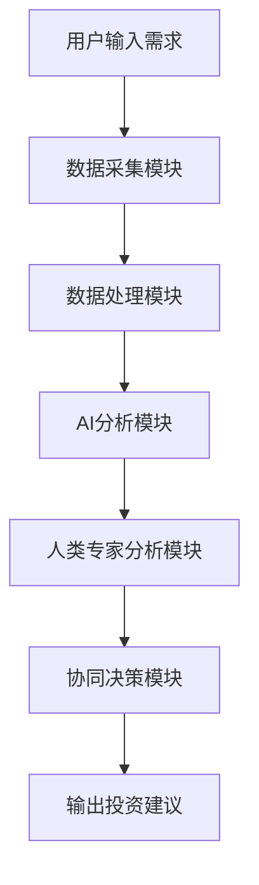
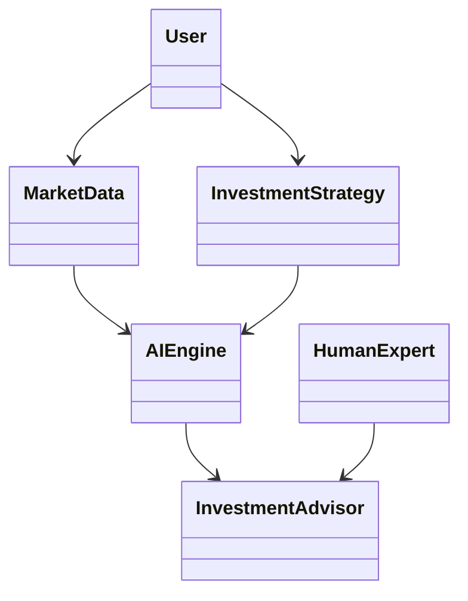
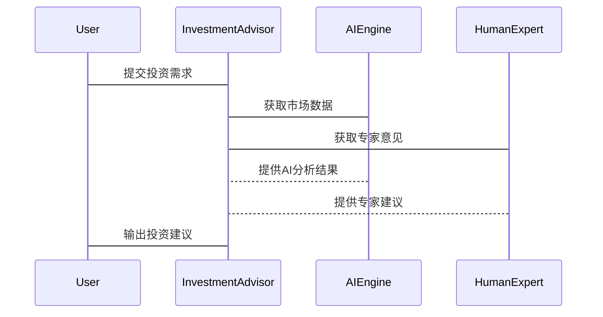

                 


# 智能投资顾问：AI与人类专家的协同策略

## 关键词：智能投资顾问，人工智能，人类专家，协同策略，金融投资，算法原理

## 摘要：本文探讨了智能投资顾问如何通过AI与人类专家的协同策略优化投资决策。文章详细分析了AI在投资顾问中的应用，比较了AI与人类专家在决策过程中的优缺点，提出了协同策略的实现方法，并通过具体案例展示了系统的实现和应用效果。本文还讨论了协同策略的未来发展方向。

---

## 第一部分：智能投资顾问的背景与核心概念

### 第1章：智能投资顾问的背景介绍

#### 1.1 问题背景与描述

##### 1.1.1 传统投资顾问的局限性
传统投资顾问依赖于人类专家的经验和市场分析，但存在以下问题：
- **信息处理能力有限**：人类专家难以处理海量数据，且决策容易受到主观因素影响。
- **决策速度慢**：在快速变化的市场中，人类专家的决策速度可能无法满足客户需求。
- **经验局限**：专家的经验可能无法覆盖所有市场情况，尤其是在新兴领域或极端市场条件下。

##### 1.1.2 AI技术在金融领域的应用潜力
人工智能（AI）技术在金融领域的应用日益广泛，尤其是在投资顾问领域。AI的优势在于：
- **数据处理能力强**：AI能够快速分析海量数据，提取有价值的信息。
- **决策速度快**：AI可以在极短时间内完成复杂计算和决策。
- **学习能力强**：AI可以通过机器学习不断优化模型，适应市场变化。

##### 1.1.3 智能投资顾问的定义与目标
智能投资顾问是一种结合人工智能技术的投资服务，旨在通过AI算法辅助人类专家进行投资决策。其目标是提高投资决策的准确性和效率，同时降低人为错误和成本。

#### 1.2 智能投资顾问的核心要素

##### 1.2.1 数据驱动的投资决策
智能投资顾问依赖于大量数据，包括市场数据、用户数据、经济指标等。通过数据分析，AI能够发现潜在的投资机会和风险。

##### 1.2.2 自动化与智能化的实现
通过自动化技术，智能投资顾问可以实现从数据采集、分析到决策的全过程自动化。智能化体现在AI算法能够不断学习和优化投资策略。

##### 1.2.3 人机协同的必要性
尽管AI在数据处理和计算方面具有优势，但人类专家在理解和判断市场情绪、制定长期投资策略方面具有不可替代的作用。因此，AI与人类专家的协同是智能投资顾问成功的关键。

#### 1.3 AI与人类专家的协同策略

##### 1.3.1 协同的基本原理
协同策略是指AI系统和人类专家共同参与投资决策的过程。AI提供数据分析和预测，人类专家提供市场理解和判断，两者结合形成最终的投资建议。

##### 1.3.2 协同的类型与特点
协同可以分为互补型和协作型两类：
- **互补型**：AI和人类专家分别负责不同的任务，如AI负责数据分析，专家负责策略制定。
- **协作型**：AI和人类专家共同参与决策过程，实时互动，动态调整策略。

##### 1.3.3 协同的优势与挑战
- **优势**：结合AI的数据分析能力和人类专家的市场理解能力，提高决策的准确性和效率。
- **挑战**：协同过程中需要解决数据共享、决策权分配、沟通效率等问题。

### 第2章：智能投资顾问的核心概念与联系

#### 2.1 协同策略的原理

##### 2.1.1 信息融合机制
信息融合机制是协同策略的核心，AI系统将来自不同数据源的信息进行整合，形成全面的市场分析。

##### 2.1.2 决策优化算法
通过优化算法，协同策略能够在AI和人类专家的共同参与下，找到最优的投资方案。

##### 2.1.3 智能体的协作模型
智能体模型描述了AI系统和人类专家在协同过程中的角色和交互方式，确保两者能够高效合作。

#### 2.2 AI与人类专家的对比分析

##### 2.2.1 决策速度与准确性对比
- **决策速度**：AI决策速度快，但可能缺乏对市场复杂情况的理解。
- **准确性**：人类专家的经验可能在某些情况下更准确，但AI在数据处理方面更具优势。

##### 2.2.2 情感因素与风险偏好对比
- **情感因素**：人类专家更容易考虑市场情绪和投资者的心理因素。
- **风险偏好**：AI可以根据历史数据量化风险，而人类专家可以根据经验判断风险偏好。

##### 2.2.3 知识深度与广度对比
- **知识深度**：人类专家在特定领域具有深度知识。
- **知识广度**：AI可以处理广泛的数据，覆盖更多的市场信息。

#### 2.3 协同过程的Mermaid流程图



---

## 第二部分：智能投资顾问的算法原理

### 第3章：智能投资顾问的算法原理

#### 3.1 协同过滤算法

##### 3.1.1 算法原理
协同过滤算法通过分析用户行为和市场数据，预测用户的潜在需求和投资偏好。

##### 3.1.2 算法实现

```python
import numpy as np

def collaborative_filtering(user_data, item_data):
    # 计算用户-物品的相似性矩阵
    user_item_matrix = np.dot(user_data, item_data.T)
    # 归一化相似性矩阵
    similarity_matrix = np.divide(user_item_matrix, np.linalg.norm(user_item_matrix, axis=1).reshape(-1,1))
    return similarity_matrix
```

##### 3.1.3 算法优化
通过引入正则化项和提升计算效率，优化协同过滤算法的性能。

#### 3.2 基于强化学习的决策模型

##### 3.2.1 强化学习的基本原理
强化学习通过不断试错，学习最优的投资策略。

##### 3.2.2 策略网络的构建

```python
import tensorflow as tf

class PolicyNetwork:
    def __init__(self, input_dim, output_dim):
        self.model = tf.keras.Sequential([
            tf.keras.layers.Dense(64, activation='relu', input_shape=(input_dim,)),
            tf.keras.layers.Dense(output_dim, activation='softmax')
        ])
        self.model.compile(optimizer='adam', loss='sparse_categorical_crossentropy')
```

##### 3.2.3 奖励函数的设计
奖励函数用于衡量投资决策的优劣。

#### 3.3 算法的数学模型与公式

##### 3.3.1 协同过滤的数学模型
$$
\text{相似度}(i, j) = \frac{\sum_{k} r_{ik} r_{jk}}{\sqrt{\sum_{k} r_{ik}^2} \sqrt{\sum_{k} r_{jk}^2}}}
$$

##### 3.3.2 强化学习的策略网络
$$
\pi(a|s) = \arg\max_a Q(s,a)
$$

---

## 第三部分：智能投资顾问的系统分析与架构设计

### 第4章：智能投资顾问的系统分析与架构设计

#### 4.1 问题场景介绍
智能投资顾问系统需要处理用户的投资需求，结合市场数据和用户偏好，提供个性化的投资建议。

#### 4.2 系统功能设计

##### 4.2.1 领域模型Mermaid类图


#### 4.3 系统架构设计

##### 4.3.1 系统架构Mermaid架构图
```mermaid
container 投资者
    User Interface
    Authentication
    Investment Query

container AI Engine
    Data Processing
    Machine Learning
    Decision Making

container Human Expert
    Market Analysis
    Strategy Formulation
    Risk Assessment

InvestmentAdvisor --operation--> AIEngine
InvestmentAdvisor --operation--> HumanExpert
```

#### 4.4 系统接口设计
系统接口包括用户登录、数据查询、投资建议生成等。

#### 4.5 系统交互Mermaid序列图



---

## 第四部分：智能投资顾问的项目实战

### 第5章：智能投资顾问的项目实战

#### 5.1 环境安装与配置

##### 5.1.1 安装Python和相关库
```bash
pip install numpy pandas scikit-learn tensorflow
```

##### 5.1.2 安装金融数据接口
```bash
pip install yfinance
```

#### 5.2 系统核心实现

##### 5.2.1 数据采集模块
```python
import yfinance as yf

def fetch_data(ticker, start, end):
    data = yf.download(ticker, start=start, end=end)
    return data['Close']
```

##### 5.2.2 数据处理模块
```python
import pandas as pd

def preprocess_data(data):
    data = data.dropna()
    return data
```

##### 5.2.3 AI分析模块
```python
from sklearn.cluster import KMeans

def analyze_data(data, n_clusters=3):
    model = KMeans(n_clusters=n_clusters)
    model.fit(data.values.reshape(-1, 1))
    return model.predict(data.values.reshape(-1, 1))
```

##### 5.2.4 专家分析模块
```python
def expert_analysis(data):
    # 示例：计算趋势分析
    trend = data.rolling(10).mean().diff().iloc[-1]
    return '上升趋势' if trend > 0 else '下降趋势'
```

##### 5.2.5 协同决策模块
```python
def make_decision(ai_prediction, expert_analysis):
    if ai_prediction == 0 and expert_analysis == '上升趋势':
        return '买入'
    elif ai_prediction == 2 and expert_analysis == '下降趋势':
        return '卖出'
    else:
        return '持有'
```

#### 5.3 项目案例分析

##### 5.3.1 数据分析
```python
import matplotlib.pyplot as plt

data = fetch_data('AAPL', '2020-01-01', '2023-01-01')
processed_data = preprocess_data(data)
plt.plot(processed_data)
plt.show()
```

##### 5.3.2 模型训练
```python
processed_data = processed_data.values.reshape(-1, 1)
model = KMeans(n_clusters=3)
model.fit(processed_data)
ai_prediction = model.predict(processed_data)
```

##### 5.3.3 专家分析与决策
expert_analysis = expert_analysis(processed_data)
decision = make_decision(ai_prediction[-1], expert_analysis)
print(f"最终决策：{decision}")
```

#### 5.4 项目小结
通过实际案例分析，展示了智能投资顾问系统的实现过程和应用效果。

---

## 第五部分：智能投资顾问的最佳实践与总结

### 第6章：最佳实践与总结

#### 6.1 最佳实践
- **数据质量**：确保数据的完整性和准确性。
- **模型可解释性**：确保AI模型的决策过程透明，便于人类专家理解和调整。
- **实时性**：优化系统的响应速度，确保实时数据分析能力。

#### 6.2 小结
智能投资顾问通过AI与人类专家的协同策略，显著提高了投资决策的效率和准确性。未来，随着AI技术的不断进步，协同策略将更加智能化和个性化。

#### 6.3 注意事项
- 定期更新模型，适应市场变化。
- 保护用户数据隐私，确保系统安全性。
- 提供用户友好的交互界面，提升用户体验。

#### 6.4 拓展阅读
- 推荐阅读《机器学习实战》和《金融时间序列分析》。

---

## 作者

作者：AI天才研究院/AI Genius Institute & 禅与计算机程序设计艺术/Zen And The Art of Computer Programming

