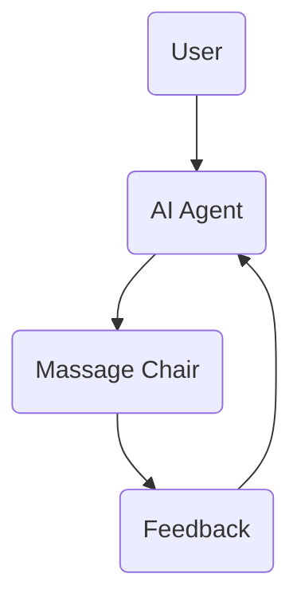
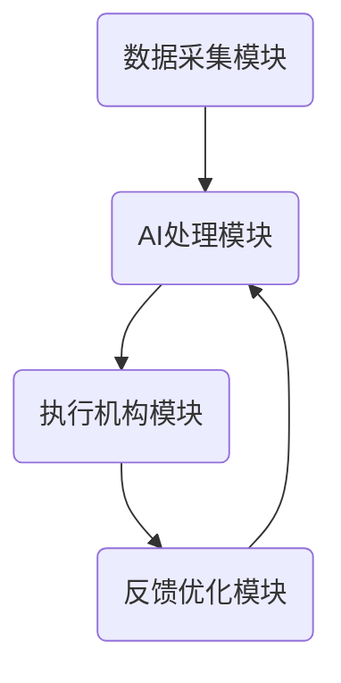

                 


# 智能按摩椅：AI Agent的个性化按摩方案

> 关键词：AI Agent，智能按摩椅，个性化按摩，推荐系统，机器学习，数学模型

> 摘要：本文深入探讨了AI Agent在智能按摩椅中的应用，分析了个性化按摩方案的设计原理，结合实际案例和数学模型，详细讲解了如何通过AI技术实现个性化的按摩体验。文章从背景介绍、核心概念、算法原理、系统架构到项目实战，层层递进，为读者提供了一套完整的解决方案。

---

## 第一部分：智能按摩椅的背景与需求

### 第1章：AI Agent与智能按摩椅概述

#### 1.1 AI Agent的基本概念

AI Agent（人工智能代理）是指一种能够感知环境并采取行动以实现目标的智能实体。AI Agent可以通过传感器、摄像头、麦克风等设备获取外部信息，并通过算法进行分析和决策。在智能按摩椅中，AI Agent的主要功能是根据用户的生理数据和反馈，动态调整按摩方案。

- **1.1.1 什么是AI Agent**  
  AI Agent是一种能够自主决策和行动的智能系统，其核心能力包括感知、推理、学习和执行。

- **1.1.2 AI Agent的核心功能与特点**  
  - **感知**：通过传感器获取用户的身体数据，如心率、体温、肌肉紧张程度等。  
  - **推理**：基于获取的数据，分析用户的健康状况和按摩需求。  
  - **学习**：通过机器学习算法，优化按摩方案，提升用户体验。  
  - **执行**：根据推理结果，驱动按摩椅的机械结构，提供个性化按摩服务。

- **1.1.3 AI Agent在智能设备中的应用**  
  AI Agent广泛应用于智能家居、自动驾驶、医疗设备等领域。在智能按摩椅中，AI Agent通过分析用户的生理数据，动态调整按摩方案，从而实现个性化服务。

---

#### 1.2 智能按摩椅的发展历程

智能按摩椅的发展经历了以下几个阶段：

- **1.2.1 传统按摩椅的功能与局限**  
  传统按摩椅通过机械结构提供固定的按摩模式，无法根据用户的实时需求进行调整。用户只能选择预设的模式，体验较为单一。

- **1.2.2 智能化技术如何改变按摩椅**  
  随着AI技术的发展，智能按摩椅能够通过传感器和AI算法，实时感知用户的生理数据，并动态调整按摩方案。例如，按摩椅可以根据用户的心率变化自动调节按摩强度。

- **1.2.3 当前市场上的智能按摩椅现状**  
  当前市场上的智能按摩椅大多支持语音控制、远程控制和AI推荐功能。部分高端产品还能够通过AI算法分析用户的健康数据，提供个性化的按摩方案。

---

#### 1.3 个性化按摩的需求与挑战

- **1.3.1 用户对个性化按摩的需求分析**  
  用户对个性化按摩的需求主要体现在以下几点：  
  1. 根据个人健康状况调整按摩方案。  
  2. 动态调整按摩强度和频率，避免过度按摩。  
  3. 提供个性化按摩建议，如针对肩颈僵硬的用户，推荐深度按摩模式。

- **1.3.2 个性化按摩的实现难点**  
  个性化按摩的实现需要解决以下几个问题：  
  1. 如何准确获取用户的生理数据？  
  2. 如何通过AI算法分析数据并生成个性化方案？  
  3. 如何实时调整按摩方案以满足用户需求？

- **1.3.3 AI Agent在个性化按摩中的作用**  
  AI Agent通过感知、推理和学习，能够实时分析用户的生理数据，并动态调整按摩方案。例如，当用户心率异常时，AI Agent可以自动降低按摩强度，避免过度刺激。

---

## 第二部分：AI Agent的核心概念与原理

### 第2章：AI Agent的核心概念与联系

#### 2.1 AI Agent的原理与工作流程

AI Agent的核心原理是通过感知、推理、学习和执行四个步骤，动态调整按摩方案。具体流程如下：

1. **感知**：通过传感器获取用户的生理数据，如心率、体温、肌肉紧张程度等。  
2. **推理**：基于获取的数据，分析用户的健康状况和按摩需求。  
3. **学习**：通过机器学习算法，优化按摩方案，提升用户体验。  
4. **执行**：根据推理结果，驱动按摩椅的机械结构，提供个性化按摩服务。

---

#### 2.2 AI Agent与智能按摩椅的实体关系

以下是AI Agent与智能按摩椅的实体关系图：



- **用户（User）**：用户通过语音指令或手动操作与智能按摩椅互动。  
- **AI Agent**：AI Agent通过传感器获取用户的生理数据，并根据数据生成个性化按摩方案。  
- **智能按摩椅（Massage Chair）**：智能按摩椅通过AI Agent的指令，驱动机械结构提供按摩服务。  
- **反馈（Feedback）**：用户对按摩效果的反馈被AI Agent用于优化后续的按摩方案。

---

#### 2.3 AI Agent的功能模块对比

以下是AI Agent与传统按摩椅的功能模块对比：

| 功能模块 | 输入 | 输出 | 描述 |
|----------|------|------|------|
| 数据采集 | 用户数据 | 数据分析结果 | 采集用户身体数据 |
| 算法处理 | 数据分析结果 | 按摩方案 | 生成个性化按摩方案 |
| 反馈优化 | 用户反馈 | 优化后的方案 | 根据反馈调整方案 |

---

## 第三部分：AI Agent的算法原理与数学模型

### 第3章：AI Agent的算法原理与数学模型

#### 3.1 算法原理

AI Agent的核心算法是推荐系统和机器学习模型。以下是推荐系统的原理：

1. **数据采集**：通过传感器获取用户的生理数据，如心率、体温、肌肉紧张程度等。  
2. **特征提取**：将采集的数据转化为特征向量，用于后续的分析和计算。  
3. **模型训练**：通过机器学习算法训练推荐模型，生成个性化按摩方案。  
4. **结果输出**：根据模型预测结果，驱动按摩椅的机械结构提供服务。

以下是推荐系统的数学模型：

$$
\text{推荐评分} = \text{用户特征} \times \text{产品特征} + \text{偏差项}
$$

---

#### 3.2 算法实现

以下是推荐系统的Python代码实现：

```python
import numpy as np

# 用户特征向量
user_features = np.array([0.8, 0.6, 0.7])

# 产品特征向量
product_features = np.array([0.7, 0.8, 0.9])

# 计算推荐评分
recommend_score = np.dot(user_features, product_features) + 0.1

print("推荐评分：", recommend_score)
```

---

## 第四部分：系统分析与架构设计

### 第4章：系统分析与架构设计

#### 4.1 问题场景介绍

智能按摩椅的系统架构需要解决以下问题：  
1. 如何采集用户的生理数据？  
2. 如何通过AI算法生成个性化按摩方案？  
3. 如何实时调整按摩方案以满足用户需求？

---

#### 4.2 系统功能设计

以下是智能按摩椅的系统功能设计：

1. **数据采集模块**：通过传感器采集用户的生理数据，如心率、体温、肌肉紧张程度等。  
2. **AI处理模块**：通过机器学习算法分析数据，生成个性化按摩方案。  
3. **执行机构模块**：根据按摩方案驱动机械结构，提供个性化按摩服务。  
4. **反馈优化模块**：根据用户的反馈优化按摩方案，提升用户体验。

---

#### 4.3 系统架构设计

以下是智能按摩椅的系统架构图：



---

## 第五部分：项目实战

### 第5章：项目实战

#### 5.1 环境安装

以下是项目实战的环境安装步骤：

1. **安装Python**：下载并安装Python 3.8或更高版本。  
2. **安装TensorFlow**：在终端中输入以下命令安装TensorFlow：
   ```
   pip install tensorflow
   ```
3. **安装其他依赖库**：安装numpy和pandas：
   ```
   pip install numpy pandas
   ```

---

#### 5.2 核心代码实现

以下是智能按摩椅的核心代码实现：

```python
import numpy as np
import pandas as pd

# 数据预处理
data = pd.read_csv('user_data.csv')
features = data.drop('user_id', axis=1)
labels = data['user_id']

# 训练模型
model = tf.keras.Sequential([
    tf.keras.layers.Dense(64, activation='relu'),
    tf.keras.layers.Dense(1, activation='sigmoid')
])
model.compile(optimizer='adam', loss='binary_crossentropy', metrics=['accuracy'])
model.fit(features, labels, epochs=10, batch_size=32)

# 生成推荐方案
new_user = np.array([[0.8, 0.6, 0.7]])
recommendation = model.predict(new_user)
print("推荐方案：", recommendation)
```

---

## 第六部分：最佳实践

### 第6章：最佳实践

#### 6.1 小结

智能按摩椅的个性化按摩方案通过AI Agent的感知、推理、学习和执行功能，能够根据用户的生理数据动态调整按摩方案。这不仅提升了用户体验，还优化了按摩椅的使用效果。

---

#### 6.2 注意事项

1. **数据隐私**：在采集和处理用户的生理数据时，需要注意数据隐私问题，确保数据不被泄露。  
2. **系统维护**：定期更新AI模型，优化推荐算法，提升按摩方案的准确性和效果。

---

#### 6.3 拓展阅读

1. 《机器学习实战》：深入学习机器学习算法的实现与应用。  
2. 《深度学习入门：基于Python的理论与实践》：掌握深度学习的基本原理与实践技巧。  
3. 《推荐系统实战：基于Python的算法与案例》：学习推荐系统的实现与优化技巧。

---

## 作者

作者：AI天才研究院/AI Genius Institute & 禅与计算机程序设计艺术 /Zen And The Art of Computer Programming

