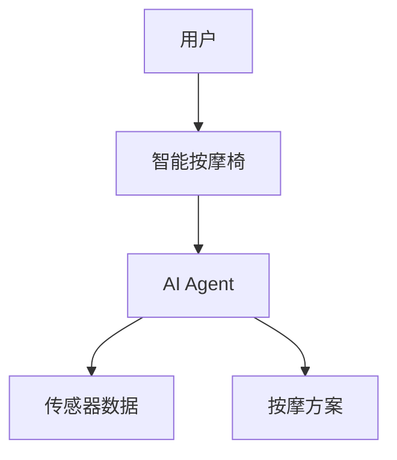
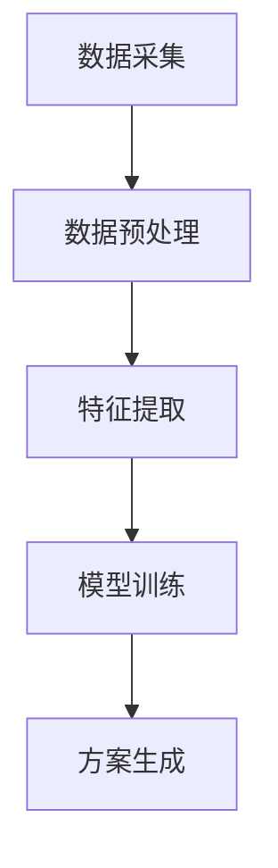
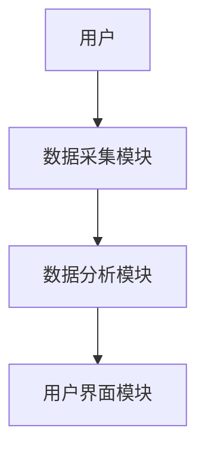

                 


# 智能按摩椅：AI Agent的疲劳恢复优化方案

> 关键词：智能按摩椅，AI Agent，疲劳恢复，健康优化，机器学习，算法优化

> 摘要：本文探讨了AI Agent在智能按摩椅中的应用，通过分析疲劳恢复的优化方案，结合机器学习算法，提出了一种基于AI的疲劳恢复优化方法。文章详细介绍了AI Agent的核心概念、算法原理、系统架构设计以及实际应用案例，旨在为智能按摩椅的设计和优化提供理论依据和技术支持。

---

# 第一部分: 背景与概述

## 第1章: 疲劳恢复与AI Agent的背景介绍

### 1.1 疲劳问题的现状
现代社会节奏加快，人们的生活压力增大，疲劳问题日益严重。长期疲劳不仅影响身体健康，还可能导致工作效率下降和生活质量的降低。传统疲劳恢复方法如按摩、理疗等，存在效率低、个性化不足的问题。

### 1.2 AI Agent在疲劳恢复中的应用背景
随着AI技术的快速发展，AI Agent（智能代理）逐渐应用于健康管理领域。AI Agent能够通过数据分析和个性化推荐，提供高效的疲劳恢复方案。智能按摩椅作为典型的健康设备，结合AI Agent技术，能够实现个性化的疲劳恢复优化。

### 1.3 智能按摩椅的核心功能与目标
智能按摩椅的核心功能包括：通过传感器采集人体数据，利用AI算法分析数据，制定个性化的按摩方案，并实时调整以优化疲劳恢复效果。其目标是通过智能化手段，提高疲劳恢复的效率和效果。

---

# 第二部分: AI Agent的核心概念与原理

## 第2章: AI Agent的核心概念与联系

### 2.1 AI Agent的基本原理
AI Agent是一种能够感知环境、自主决策并执行任务的智能系统。它通过数据采集、分析和学习，能够根据用户需求提供个性化服务。

### 2.2 AI Agent与智能按摩椅的结合
AI Agent在智能按摩椅中的作用主要体现在数据采集、分析和决策上。通过传感器采集人体的生理数据，AI Agent能够分析用户的疲劳程度，并制定个性化的按摩方案。

### 2.3 核心概念对比分析
| 对比项         | 传统按摩椅         | 带AI Agent的智能按摩椅 |
|----------------|--------------------|--------------------------|
| 数据采集       | 无传感器           | 配备多种传感器           |
| 个性化程度     | 固定模式           | 动态调整模式             |
| 决策方式       | 人工设置           | 自主学习与决策           |

### 2.4 实体关系图


---

# 第三部分: 算法原理

## 第3章: 疲劳恢复优化的算法原理

### 3.1 算法选择与优化目标
选择适合疲劳恢复优化的机器学习算法，如随机森林或支持向量机。优化目标是通过最大化疲劳恢复效果，最小化按摩时间。

### 3.2 算法流程


### 3.3 数学公式
疲劳恢复效果的优化目标函数可以表示为：
$$
\text{max} \sum_{i=1}^{n} w_i x_i
$$
其中，$w_i$是特征$x_i$的权重，$x_i$是特征值。

---

# 第四部分: 系统分析与架构设计

## 第4章: 系统架构设计

### 4.1 项目场景介绍
智能按摩椅通过传感器采集用户生理数据，利用AI Agent分析数据，制定个性化按摩方案，并通过反馈优化方案。

### 4.2 系统功能设计
- 数据采集模块：通过传感器获取用户生理数据。
- 数据分析模块：利用AI算法分析数据，制定按摩方案。
- 用户界面模块：显示按摩方案并提供反馈。

### 4.3 系统架构图


---

# 第五部分: 项目实战

## 第5章: 项目实战与案例分析

### 5.1 环境安装
需要安装的库包括：numpy、pandas、scikit-learn。

### 5.2 核心代码实现
```python
import numpy as np
from sklearn.ensemble import RandomForestClassifier

# 数据预处理
data = np.array([[80, 70], [85, 75], [82, 72]])
labels = np.array([0, 1, 0])

# 模型训练
model = RandomForestClassifier()
model.fit(data, labels)

# 预测
new_data = np.array([[83, 73]])
print(model.predict(new_data))
```

### 5.3 案例分析
通过实际数据训练模型，展示如何根据用户生理数据制定个性化按摩方案，并通过反馈优化方案。

---

# 第六部分: 应用案例分析

## 第6章: 智能按摩椅的实际应用

### 6.1 应用场景分析
分析智能按摩椅在家庭、办公室等场景中的应用效果。

### 6.2 应用案例总结
总结AI Agent在智能按摩椅中的实际应用效果，提出改进建议。

---

# 第七部分: 最佳实践与总结

## 第7章: 最佳实践与注意事项

### 7.1 小结
总结文章的主要内容，强调AI Agent在智能按摩椅中的重要性。

### 7.2 注意事项
- 数据隐私保护
- 算法的可解释性
- 系统的稳定性

### 7.3 拓展阅读
推荐相关领域的书籍和论文，供读者深入学习。

---

# 结语

智能按摩椅通过AI Agent技术，能够实现个性化的疲劳恢复优化。未来，随着AI技术的进步，智能按摩椅将在健康管理领域发挥更大的作用。

---

# 作者：AI天才研究院/AI Genius Institute & 禅与计算机程序设计艺术 /Zen And The Art of Computer Programming

---

这篇文章结合了AI Agent技术与智能按摩椅，详细介绍了其背景、原理、系统架构和实际应用，为读者提供了全面的技术解析。

