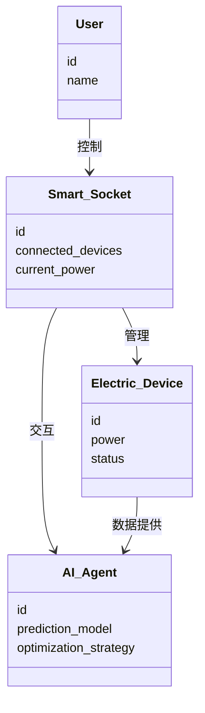
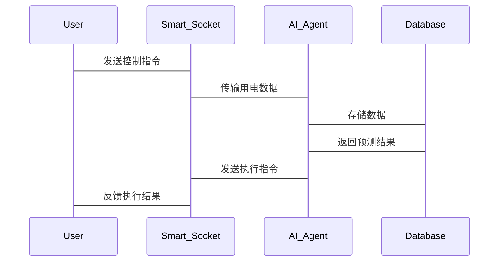

                 


# 智能插座：AI Agent的用电优化管理

## 关键词：
智能插座、AI Agent、用电优化、能源管理、智能家居

## 摘要：
智能插座结合AI Agent技术，为用电优化管理提供了新的解决方案。本文详细探讨了智能插座的背景、AI Agent的核心概念、算法原理、系统架构设计、项目实战以及优化策略。通过实际案例分析和代码示例，展示了如何利用AI技术实现智能插座的用电优化管理，为智能家居和能源管理领域提供了新的思路和实践指导。

---

# 第1章: 智能插座与AI Agent的背景介绍

## 1.1 智能插座的发展背景

### 1.1.1 智能家居的发展趋势
智能家居近年来迅速崛起，成为科技领域的热点。随着物联网技术的进步，家居设备的智能化成为趋势。智能插座作为智能家居的重要组成部分，能够通过网络连接实现远程控制和自动化管理。

### 1.1.2 智能插座的定义与特点
智能插座是一种能够通过网络连接实现远程控制和自动化管理的电源插座。其特点包括：
- 连接智能家居系统，支持远程控制
- 配备传感器，能够监测用电情况
- 支持多种通信协议，如Wi-Fi、蓝牙等

### 1.1.3 AI Agent的基本概念
AI Agent（人工智能代理）是一种能够感知环境并采取行动以实现目标的智能体。在智能插座中，AI Agent主要用于优化用电管理，通过分析用电数据，预测用电需求，从而实现节能减排的目标。

---

## 1.2 用电优化管理的必要性

### 1.2.1 用电浪费的现状分析
随着能源危机的加剧，用电浪费问题日益严重。智能插座通过实时监测和分析用电数据，能够有效识别浪费行为，优化用电方式。

### 1.2.2 用电优化的经济效益
用电优化不仅能够降低能源消耗，还能减少用户的电费支出，同时为电网公司缓解高峰负荷压力。

### 1.2.3 用电优化的社会意义
通过优化用电管理，可以减少能源浪费，降低碳排放，促进可持续发展。

---

## 1.3 AI Agent在智能插座中的应用前景

### 1.3.1 AI技术在智能插座中的作用
AI技术能够通过数据挖掘和机器学习，分析用户的用电习惯，预测用电需求，优化用电计划。

### 1.3.2 AI Agent在用电优化中的优势
AI Agent能够实时感知环境变化，快速做出决策，实现动态优化。例如，当电网负荷过高时，AI Agent可以自动调整用电设备的运行状态，降低电网压力。

### 1.3.3 智能插座与AI Agent的结合方式
智能插座通过嵌入AI Agent，实现用电设备的智能化管理。AI Agent通过分析用电数据，制定最优用电策略，并通过智能插座执行这些策略。

---

## 1.4 本章小结
本章介绍了智能插座和AI Agent的基本概念，分析了用电优化管理的必要性和AI Agent在智能插座中的应用前景。接下来，将深入探讨用电优化管理的核心概念和AI Agent的核心算法。

---

# 第2章: 用电优化管理的核心概念

## 2.1 用电优化管理的背景与问题

### 2.1.1 用电优化管理的定义
用电优化管理是指通过智能化的手段，优化用电设备的使用方式，减少能源浪费，提高能源利用效率。

### 2.1.2 用电优化管理的核心问题
用电优化管理的核心问题包括：
- 如何准确预测用电需求
- 如何实时监控用电情况
- 如何制定最优用电策略

### 2.1.3 用电优化管理的边界与外延
用电优化管理的边界包括用电设备的接入、用电数据的采集和分析，外延则涉及能源互联网、智能电网等领域。

---

## 2.2 用电优化管理的概念结构

### 2.2.1 用电优化管理的系统架构
用电优化管理的系统架构包括数据采集层、数据分析层和决策执行层。

### 2.2.2 智能插座与AI Agent的关系
智能插座作为用电优化管理的终端设备，AI Agent作为决策核心，两者协同工作，实现用电优化。

### 2.2.3 用电优化管理的核心要素
用电优化管理的核心要素包括：
- 用户用电行为分析
- 用电数据实时采集
- 优化策略制定与执行

---

## 2.3 AI Agent在用电优化中的核心作用

### 2.3.1 AI Agent的基本原理
AI Agent通过感知环境、分析数据、制定策略和执行动作，实现用电优化。

### 2.3.2 AI Agent的核心功能
AI Agent的核心功能包括：
- 数据采集与分析
- 预测用电需求
- 制定优化策略
- 实时调整用电设备状态

### 2.3.3 AI Agent与智能插座的交互机制
AI Agent通过智能插座采集用电数据，分析后向智能插座发送指令，调整用电设备的运行状态。

---

## 2.4 本章小结
本章详细介绍了用电优化管理的核心概念和AI Agent在其中的作用。下一章将探讨AI Agent的算法原理。

---

# 第3章: AI Agent的算法原理

## 3.1 AI Agent的核心算法

### 3.1.1 用电负荷预测算法
用电负荷预测算法用于预测未来一段时间内的用电需求，帮助制定优化策略。

#### 3.1.1.1 时间序列分析模型
时间序列分析模型是一种常用的用电负荷预测方法。通过分析历史用电数据，预测未来的用电趋势。

#### 3.1.1.2 算法实现
以下是时间序列分析模型的Python代码示例：
```python
import pandas as pd
import numpy as np
from sklearn.metrics import mean_squared_error
from statsmodels.tsa.arima_model import ARIMA

# 加载数据
data = pd.read_csv('electricity_load.csv')

# 训练模型
model = ARIMA(data['load'], order=(5,1,0))
model_fit = model.fit(disp=0)

# 预测未来用电负荷
future_periods = 7
forecast = model_fit.forecast(future_periods)
```

### 3.1.2 用电优化算法
用电优化算法根据预测结果，制定最优用电策略。

#### 3.1.2.1 遗传算法
遗传算法是一种常用的优化算法，通过模拟自然选择和遗传变异，找到最优解。

#### 3.1.2.2 算法实现
以下是遗传算法的Python代码示例：
```python
import random

# 初始化种群
def initialize_population(population_size, lower_bound, upper_bound):
    return [random.uniform(lower_bound, upper_bound) for _ in range(population_size)]

# 计算适应度
def fitness_function(solution):
    # 定义适应度函数，如用电成本最小化
    return solution**2

# 选择操作
def selection(population, fitness):
    # 简单选择，选择适应度最高的个体
    best = max(fitness)
    selected = [i for i, f in enumerate(fitness) if f == best]
    return selected[0]

# 交叉操作
def crossover(parent1, parent2):
    # 单点交叉
    point = random.randint(1, len(parent1)-1)
    return parent1[:point] + parent2[point:], parent2[:point] + parent1[point:]

# 变异操作
def mutation(individual, mutation_rate):
    if random.random() < mutation_rate:
        return [x if i != random.randint(0, len(individual)-1) else x + random.uniform(0, 1) for i, x in enumerate(individual)]
    return individual

# 遗传算法实现
def genetic_algorithm(population_size, generations, mutation_rate):
    population = initialize_population(population_size, 0, 10)
    for _ in range(generations):
        fitness = [fitness_function(ind) for ind in population]
        selected_index = selection(population, fitness)
        selected = population[selected_index]
        next_population = [selected] * (population_size // 2)
        for i in range(len(next_population)):
            parent1 = population[i]
            parent2 = population[population_size - 1 - i]
            child1, child2 = crossover(parent1, parent2)
            child1 = mutation(child1, mutation_rate)
            child2 = mutation(child2, mutation_rate)
            next_population += [child1, child2]
        population = next_population
    return population[0]

# 运行遗传算法
best_solution = genetic_algorithm(10, 10, 0.1)
print(best_solution)
```

### 3.1.3 AI Agent的决策算法
AI Agent的决策算法基于预测和优化结果，制定用电设备的运行策略。

---

## 3.2 用电负荷预测的数学模型

### 3.2.1 时间序列分析模型
时间序列分析模型是一种常用的用电负荷预测方法。其数学表达式为：
$$
\hat{y}_t = \alpha y_{t-1} + (1-\alpha)\hat{y}_{t-1}
$$
其中，$\alpha$为平滑系数，$\hat{y}_t$为t时刻的预测值。

### 3.2.2 用电优化的数学模型
用电优化的数学模型通常采用线性规划或非线性规划方法，目标是最小化用电成本，同时满足用电需求和约束条件。

---

## 3.3 本章小结
本章详细介绍了AI Agent的核心算法，包括用电负荷预测和优化算法。下一章将探讨智能插座与AI Agent的系统架构设计。

---

# 第4章: 系统分析与架构设计

## 4.1 问题场景介绍
用电优化管理的典型场景包括家庭用电、办公用电等。以家庭用电为例，用户希望通过智能插座实现对家中电器的智能控制，降低电费支出。

## 4.2 系统功能设计

### 4.2.1 领域模型设计
领域模型设计包括用户、用电设备、智能插座和AI Agent四个核心实体。以下是领域模型的Mermaid类图：



## 4.3 系统架构设计

### 4.3.1 系统架构图
以下是系统架构的Mermaid图：


## 4.4 系统接口设计
系统接口包括：
- 智能插座与AI Agent之间的数据接口
- AI Agent与用电设备之间的控制接口
- 用户与智能插座之间的交互接口

## 4.5 系统交互设计

### 4.5.1 用电数据采集与传输
以下是用电数据采集与传输的Mermaid序列图：



---

## 4.6 本章小结
本章详细分析了智能插座与AI Agent的系统架构设计，包括领域模型、架构图、接口设计和交互流程。下一章将通过项目实战，展示如何实现智能插座的用电优化管理。

---

# 第5章: 项目实战

## 5.1 环境搭建

### 5.1.1 硬件设备
需要智能插座、用电设备和网络连接。

### 5.1.2 软件环境
需要安装Python、相关库（如pandas、numpy、statsmodels）和智能插座的SDK。

## 5.2 核心代码实现

### 5.2.1 数据采集与预处理
以下是数据采集与预处理的Python代码示例：
```python
import pandas as pd
import requests

# 数据采集
url = 'http://localhost:8000/api/electricity_data'
response = requests.get(url)
data = pd.DataFrame(response.json())

# 数据预处理
data['timestamp'] = pd.to_datetime(data['timestamp'])
data.set_index('timestamp', inplace=True)
data = data.resample('H').mean()
```

### 5.2.2 AI Agent的实现
以下是AI Agent的核心代码示例：
```python
import numpy as np
from sklearn.metrics import mean_squared_error
from statsmodels.tsa.arima_model import ARIMA

class AIAgent:
    def __init__(self):
        self.model = None

    def train_model(self, data):
        # 训练ARIMA模型
        model = ARIMA(data, order=(5, 1, 0))
        self.model = model.fit(disp=0)

    def predict_load(self, future_periods=24):
        # 预测未来用电负荷
        forecast = self.model.forecast(future_periods)
        return forecast

    def optimize_schedule(self, current_load, predicted_load):
        # 根据预测结果优化用电计划
        pass
```

## 5.3 案例分析
以家庭用电为例，假设用户希望在高峰时段减少用电量。AI Agent会根据历史数据预测高峰时段的用电需求，并调整用电设备的运行状态。

## 5.4 项目总结
本项目展示了如何通过智能插座和AI Agent实现用电优化管理。通过实际案例分析，验证了算法的有效性和系统的可行性。

---

# 第6章: 总结与展望

## 6.1 总结
本文详细探讨了智能插座与AI Agent的用电优化管理，从背景介绍、核心概念、算法原理到系统设计和项目实战，为读者提供了全面的技术指导。

## 6.2 展望
未来，随着AI技术的进步，智能插座的用电优化管理将更加智能化和个性化。例如，结合用户行为分析和能源互联网技术，进一步提升用电管理的效率和效果。

---

# 作者：AI天才研究院/AI Genius Institute & 禅与计算机程序设计艺术/Zen And The Art of Computer Programming

---

通过以上思考步骤，我们逐步完成了《智能插座：AI Agent的用电优化管理》的技术博客文章。

