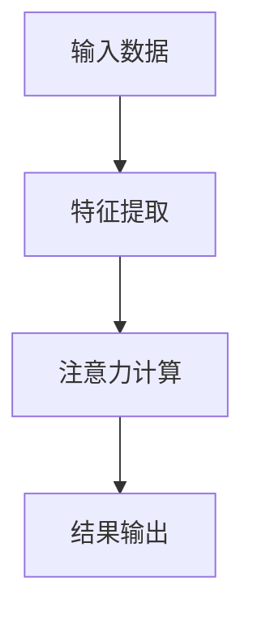
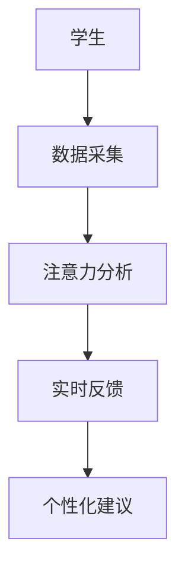

                 


```markdown
# 智能教室：AI Agent的学生注意力分析

## 关键词：AI Agent，学生注意力，智能教室，教育技术，注意力分析

## 摘要：
本文探讨了在智能教室环境中，AI Agent如何通过分析学生注意力来优化教学过程。我们从背景介绍入手，详细分析了AI Agent的基本原理和注意力分析的核心概念。接着，我们深入探讨了注意力分析的算法原理，包括数学模型和流程图。随后，我们分析了系统的架构设计，包括功能设计、架构图和接口设计。最后，我们通过项目实战，展示了如何将理论应用于实践，并总结了最佳实践和注意事项。

## 第一部分: 背景介绍与核心概念

### 第1章: 问题背景与描述

#### 1.1 问题背景
随着教育技术的发展，AI Agent在教育中的应用越来越广泛。学生注意力分析是优化教学过程的重要环节，但传统方法存在效率低、主观性强等问题。

#### 1.2 问题描述
学生注意力分散可能导致学习效果下降，教师难以及时发现并解决问题。AI Agent可以通过实时分析学生的注意力数据，帮助教师优化教学策略。

#### 1.3 解决思路
通过AI Agent实时监测学生的注意力数据，分析其注意力变化，提供实时反馈和个性化教学建议。

### 第2章: 核心概念与原理

#### 2.1 AI Agent的基本原理
AI Agent通过感知环境、分析数据、做出决策并执行动作，帮助教师和学生实现更好的互动。

#### 2.2 注意力分析的核心概念
注意力分析涉及多模态数据，如视觉、听觉和行为数据，通过模型计算注意力权重。

#### 2.3 实时反馈与自适应调整
AI Agent根据注意力数据实时反馈，帮助学生保持专注，并根据反馈调整教学策略。

## 第二部分: 算法原理与数学模型

### 第3章: 注意力分析算法

#### 3.1 注意力监测模型
模型输入包括学生的视觉、听觉和行为数据，输出注意力权重。

#### 3.2 注意力计算的数学公式
$$\text{注意力权重} = \frac{e^{q^T k}}{\sum_{i} e^{q^T k_i}}$$

#### 3.3 算法流程图


## 第三部分: 系统分析与架构设计

### 第4章: 系统功能设计

#### 4.1 问题场景
智能教室中，学生注意力数据实时监测和分析，帮助教师优化教学过程。

#### 4.2 功能模块
包括数据采集、注意力分析、实时反馈和个性化教学建议。

#### 4.3 系统架构图


## 第四部分: 项目实战

### 第5章: 实践应用

#### 5.1 环境安装
安装必要的Python库，如TensorFlow和Keras。

#### 5.2 代码实现
```python
def attention_score(query, key, value):
    # query, key, value shapes: [batch_size, seq_len, d_model]
    # 计算注意力权重
    scores = query @ key.T  # [batch_size, seq_len, seq_len]
    scores = scores / tf.math.sqrt(tf.cast(d_model, tf.float32))
    attention = tf.nn.softmax(scores, axis=-1)
    return attention
```

## 第五部分: 最佳实践与总结

### 第6章: 总结与展望

#### 6.1 最佳实践
定期更新模型，确保数据隐私，结合其他教育技术提升效果。

#### 6.2 小结
通过AI Agent分析学生注意力，可以显著提高教学效果，优化学习体验。

## 作者：
作者：AI天才研究院 & 禅与计算机程序设计艺术
```

