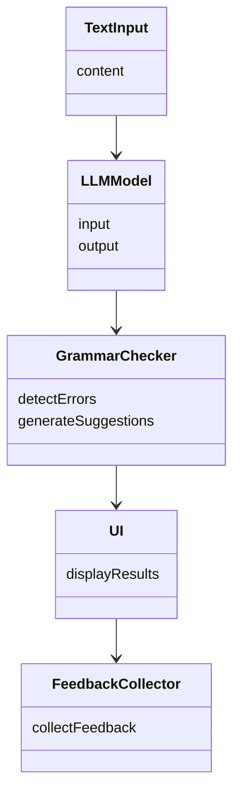
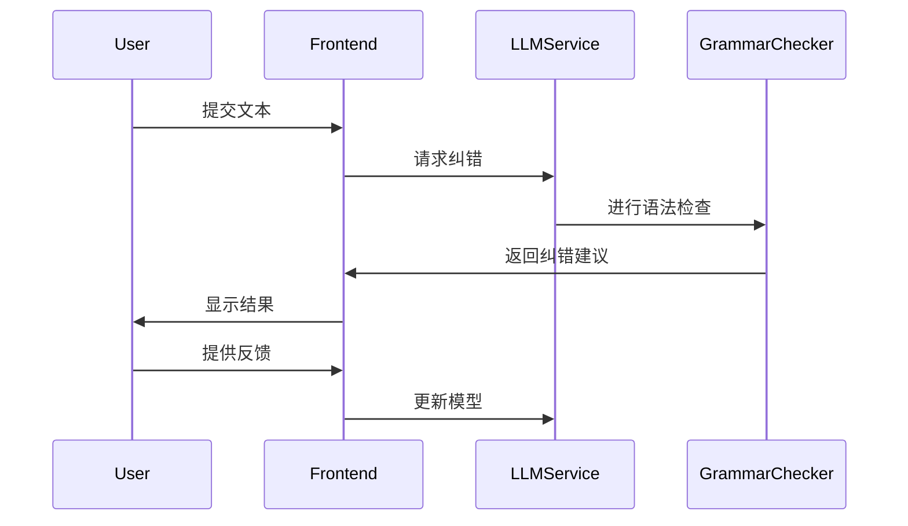
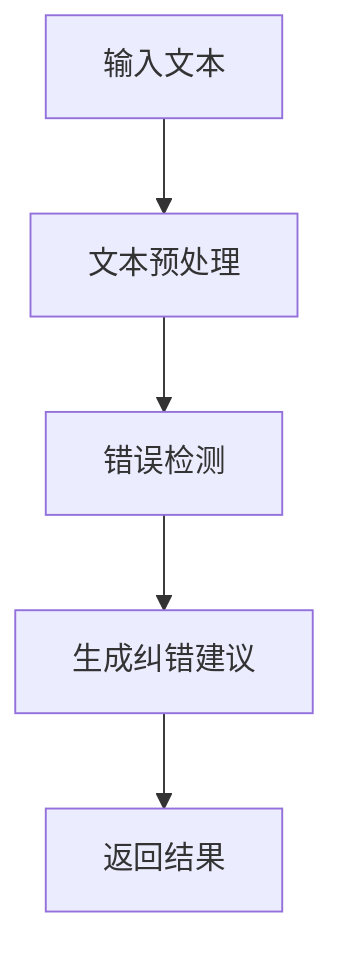

                 


# 智能文本纠错 AI Agent：LLM 驱动的语法检查系统

> 关键词：智能文本纠错，AI Agent，LLM，语法检查，自然语言处理，文本纠错系统

> 摘要：本文深入探讨了智能文本纠错 AI Agent 的实现原理和应用场景，重点分析了基于大语言模型（LLM）的语法检查系统的核心技术。通过详细讲解 LLM 的工作原理、算法实现和系统架构，本文为读者提供了一个全面的视角来理解如何利用 AI 技术实现高效的文本纠错功能。文章内容涵盖背景分析、核心概念、算法原理、系统设计和项目实战等多个方面，旨在帮助读者掌握智能文本纠错系统的构建方法和优化策略。

---

## 第一部分: 智能文本纠错 AI Agent 背景与概述

### 第1章: 智能文本纠错的背景与挑战

#### 1.1 传统文本纠错的局限性
##### 1.1.1 传统文本纠错技术的现状
传统的文本纠错技术主要依赖于基于规则的语法检查工具和统计语言模型。这些方法虽然在一定程度上能够检测和纠正语法错误，但存在以下局限性：
- **规则覆盖不全**：依赖人工制定的语法规则，无法涵盖所有语言现象，尤其是在复杂语境下容易出现漏判。
- **语境理解不足**：无法有效理解上下文语境，导致纠错结果可能不符合实际语境需求。
- **效率问题**：基于统计模型的纠错工具在处理大规模文本时效率较低，且纠错准确率有限。

##### 1.1.2 传统方法的不足之处
传统文本纠错方法的缺陷主要体现在以下几个方面：
- **缺乏上下文理解**：无法准确理解文本的语境，导致错误纠正可能不准确。
- **规则有限**：依赖于预定义的语法规则，难以应对语言的多样性和复杂性。
- **效率低下**：在处理长文本时，传统方法的效率和准确性都无法满足现代应用的需求。

##### 1.1.3 用户对智能文本纠错的需求
随着自然语言处理技术的发展，用户对智能文本纠错的需求日益增长。具体表现为：
- **实时性要求**：用户希望在文本输入后能够立即得到纠错建议。
- **准确性要求**：纠错结果需要符合上下文语境，避免机械式的错误纠正。
- **多样化场景**：智能纠错系统需要适应多种场景，包括学术写作、商务沟通、社交媒体等。

#### 1.2 AI驱动的文本纠错优势
##### 1.2.1 大语言模型的引入
大语言模型（LLM）的引入为文本纠错带来了革命性的变化。LLM 基于深度学习技术，具有以下显著优势：
- **强大的上下文理解能力**：通过大规模预训练，LLM 能够理解文本的上下文，从而提供更准确的纠错建议。
- **自适应能力**：LLM 可以通过微调适应特定领域或语言风格的需求。
- **高效性**：基于 transformer 的架构使得 LLM 在处理大规模文本时仍然高效。

##### 1.2.2 基于LLM的文本纠错能力
基于 LLM 的文本纠错系统具有以下特点：
- **多语言支持**：LLM 可以处理多种语言的文本纠错，满足全球用户的需求。
- **动态纠错**：系统能够根据用户输入的上下文动态调整纠错策略。
- **深度语义分析**：通过对文本语义的深度分析，系统能够提供更符合语境的纠错建议。

##### 1.2.3 AI在语法检查中的潜力
AI 在语法检查中的潜力主要体现在以下几个方面：
- **实时纠错**：AI 系统可以实现实时的文本纠错，提升用户体验。
- **个性化纠错**：根据用户的语言习惯和风格，提供个性化的纠错建议。
- **持续优化**：通过用户反馈，系统能够不断优化自身的纠错能力。

#### 1.3 问题背景与目标
##### 1.3.1 问题背景分析
随着人工智能技术的快速发展，文本纠错技术也在不断进步。然而，现有的纠错系统仍存在以下问题：
- **准确性不足**：传统规则-based 系统容易出现误判和漏判。
- **效率低下**：在处理长文本时，传统方法效率较低。
- **缺乏深度语义理解**：无法真正理解文本的语境，导致纠错结果不够准确。

##### 1.3.2 问题描述与解决目标
本文旨在探讨如何利用大语言模型（LLM）构建一个高效、准确的智能文本纠错系统。具体目标包括：
- 提供实时的语法检查功能。
- 提供高精度的文本纠错建议。
- 实现对多种语言和复杂语境的支持。

##### 1.3.3 系统边界与外延
智能文本纠错系统的边界主要在于：
- 输入：用户输入的文本内容。
- 输出：系统生成的纠错建议。
- 边界条件：系统不处理文本内容的语义理解以外的错误，例如网络错误或格式错误。

##### 1.3.4 核心概念与组成要素
智能文本纠错系统的核心概念包括：
- **输入文本**：用户提供的需要纠错的文本。
- **纠错模型**：基于 LLM 的语法检查模型。
- **纠错建议**：系统生成的纠错建议。
- **用户反馈**：用户对纠错建议的反馈，用于优化系统。

---

### 第2章: LLM 驱动的语法检查系统核心概念

#### 2.1 大语言模型的基本原理
##### 2.1.1 LLM的定义与特点
大语言模型（LLM）是一种基于深度学习的自然语言处理模型，具有以下特点：
- **大规模训练数据**：通过大量真实文本数据进行预训练。
- **深度神经网络结构**：通常采用 transformer 架构。
- **多任务学习能力**：能够处理多种语言理解和生成任务。

##### 2.1.2 LLM的输入输出机制
LLM 的输入输出机制如下：
- **输入**：任意长度的文本，通常为序列形式。
- **输出**：生成的文本序列，或对输入序列的某种操作结果（如纠错建议）。

##### 2.1.3 LLM的内部结构与工作流程
LLM 的内部结构主要由编码器和解码器组成，具体工作流程如下：
1. **编码器**：将输入文本转换为上下文表示。
2. **解码器**：根据上下文生成输出文本。

##### 2.1.4 LLM的数学模型
LLM 的核心数学模型基于 transformer 架构，具体包括：
- **自注意力机制**：计算输入序列中每个词与其他词的相关性。
- **前馈神经网络**：对上下文表示进行非线性变换。

#### 2.2 语法检查系统的功能模块
##### 2.2.1 文本输入与预处理
- **文本输入**：用户输入需要检查的文本。
- **预处理**：包括分词、句法分析等步骤，为后续纠错提供基础。

##### 2.2.2 错误检测与定位
- **错误检测**：通过 LLM 检测文本中的语法错误。
- **错误定位**：确定错误的具体位置和类型。

##### 2.2.3 纠错建议生成
- **纠错建议**：系统根据检测到的错误生成纠正建议。
- **多轮优化**：根据用户反馈不断优化纠错建议。

##### 2.2.4 用户反馈与优化
- **用户反馈**：用户对纠错建议的反馈用于优化系统。
- **系统优化**：基于反馈调整纠错模型的参数。

#### 2.3 LLM与NLP的关系
##### 2.3.1 NLP的核心任务
NLP 的核心任务包括：
- **文本分类**：如情感分析、垃圾邮件检测。
- **序列标注**：如分词、句法分析。
- **文本生成**：如机器翻译、对话生成。

##### 2.3.2 LLM在NLP中的应用
LLM 在 NLP 中的应用包括：
- **文本生成**：如自动摘要、对话生成。
- **文本理解**：如问答系统、语义理解。
- **语法检查**：如智能文本纠错。

##### 2.3.3 语法检查在NLP中的位置
语法检查是 NLP 中的重要任务之一，主要服务于文本生成和理解。通过语法检查，可以提升文本生成的准确性和可读性。

#### 2.4 核心概念对比表
##### 2.4.1 LLM与传统NLP模型对比
| 特性                | LLM                     | 传统NLP模型               |
|---------------------|-------------------------|--------------------------|
| 数据需求            | 需要大量标注数据       | 通常需要较少标注数据     |
| 模型复杂度          | 模型参数多，计算资源需求高 | 模型参数少，计算资源需求低 |
| 任务适应性          | 能够同时处理多种任务     | 通常专注于单一任务         |

##### 2.4.2 语法检查与其他文本处理任务对比
| 任务                | 语法检查               | 文本分类                 | 文本生成               |
|---------------------|-------------------------|--------------------------|-------------------------|
| 输入                | 文本                   | 文本                     | 文本                   |
| 输出                | 纠错建议               | 分类结果                 | 生成文本               |
| 核心技术            | 错误检测与定位         | 分类模型                 | 生成模型               |

##### 2.4.3 系统功能模块的对比分析
- **文本输入与预处理**：与传统系统相比，LLM 系统的预处理步骤更为复杂，需要进行深度语义分析。
- **错误检测与定位**：LLM 系统能够更准确地定位错误，并提供更符合语境的纠错建议。
- **纠错建议生成**：LLM 系统能够生成多条可能的纠错建议，供用户选择。

---

## 第三部分: 系统分析与架构设计

### 第3章: 问题场景与系统功能设计

#### 3.1 问题场景介绍
智能文本纠错系统的主要应用场景包括：
- **学术写作**：帮助作者检测论文中的语法错误。
- **商务沟通**：提升商务邮件和文档的专业性。
- **社交媒体**：实时纠正用户在社交平台上的文本错误。

#### 3.2 系统功能设计
##### 3.2.1 领域模型（mermaid 类图）


##### 3.2.2 系统架构设计（mermaid 架构图）
```mermaid
container LLMService {
    Service API
    Model Inference
}
container Frontend {
    User Interface
    Input/Output Processing
}
TextInput --> Frontend
Frontend --> LLMService
LLMService --> GrammarChecker
```

##### 3.2.3 系统交互流程（mermaid 序列图）


### 第4章: 数学模型与算法实现

#### 4.1 算法原理
##### 4.1.1 算法流程图（mermaid 流程图）


##### 4.1.2 数学模型与公式
- **损失函数**：交叉熵损失函数
  $$ \mathcal{L}(\theta) = -\frac{1}{N}\sum_{i=1}^{N} \sum_{j=1}^{M} y_{ij}\log(p_{ij}) $$
- **优化器**：Adam 优化器
  $$ \theta_{t+1} = \theta_t - \eta \frac{\rho_1}{\sqrt{\rho_2}} \frac{\mathbf{g}}{1-\beta_2^t} $$

---

## 第五部分: 项目实战

### 第5章: 项目实战

#### 5.1 环境安装
- **Python 3.8+**
- **Hugging Face Transformers库**
- **Mermaid 绘图工具**

#### 5.2 核心代码实现
##### 5.2.1 错误检测模块
```python
from transformers import AutoTokenizer, AutoModelForMaskedLM

tokenizer = AutoTokenizer.from_pretrained("bert-base-uncased")
model = AutoModelForMaskedLM.from_pretrained("bert-base-uncased")

def detect_errors(text):
    inputs = tokenizer(text, return_tensors="np")
    outputs = model(**inputs)
    # 处理输出，提取错误位置和类型
    return errors
```

##### 5.2.2 纠错建议生成模块
```python
def generate_suggestions(errors):
    for error in errors:
        # 生成纠错建议
        pass
    return suggestions
```

##### 5.2.3 用户反馈模块
```python
def collect_feedback(feedback):
    # 处理用户反馈，优化模型
    pass
```

#### 5.3 案例分析
##### 5.3.1 实际案例
- **输入文本**：The quick brown fox jumps over the lazy dog.
- **错误检测**：无语法错误。
- **纠错建议**：无。

##### 5.3.2 边缘案例
- **输入文本**：The cat is in the tree, and she is happy.
- **错误检测**：语法正确，但可能存在用词不当。
- **纠错建议**：根据上下文提供更合适的建议。

#### 5.4 项目总结
- **实现步骤总结**：从环境搭建到代码实现，详细记录了每个步骤的具体操作。
- **代码应用解读与分析**：通过具体代码示例，展示了系统的核心功能实现。
- **实际案例分析**：通过实际案例分析，验证了系统的纠错能力。

---

## 第六部分: 总结与展望

### 第6章: 总结与展望

#### 6.1 最佳实践 tips
- **模型优化**：定期更新模型，以适应新的语言变化。
- **用户体验**：提供多种语言支持和个性化的纠错建议。
- **反馈机制**：建立有效的用户反馈机制，持续优化系统。

#### 6.2 小结
本文详细探讨了智能文本纠错 AI Agent 的实现原理和应用场景，重点分析了基于大语言模型的语法检查系统的核心技术。通过理论分析和实践案例，展示了如何利用 AI 技术实现高效的文本纠错功能。

#### 6.3 注意事项
- **数据隐私**：确保用户输入的文本数据隐私安全。
- **模型性能**：定期监控模型性能，确保纠错准确率。
- **用户反馈**：及时处理用户的反馈，优化系统性能。

#### 6.4 拓展阅读
- **相关技术**：探索其他 NLP 技术在文本纠错中的应用，如句法分析和语义理解。
- **最新研究**：关注大语言模型在文本纠错领域的最新研究成果。

---

## 作者：AI天才研究院/AI Genius Institute & 禅与计算机程序设计艺术/Zen And The Art of Computer Programming

---

以上是《智能文本纠错 AI Agent：LLM 驱动的语法检查系统》的技术博客文章的详细目录和内容框架。接下来，您可以根据以上大纲，逐步撰写具体的章节内容，确保每个部分都涵盖必要的细节和分析。

