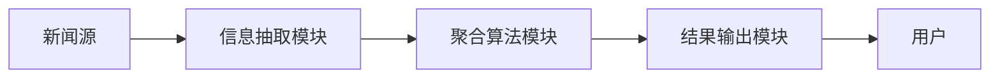
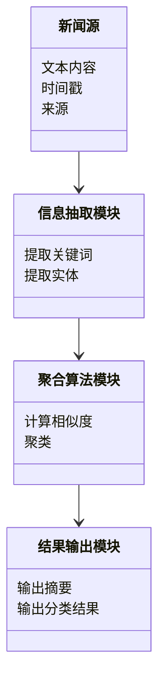
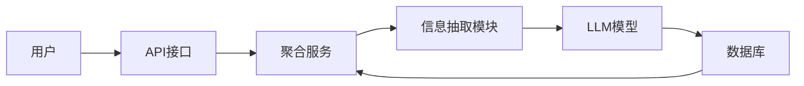
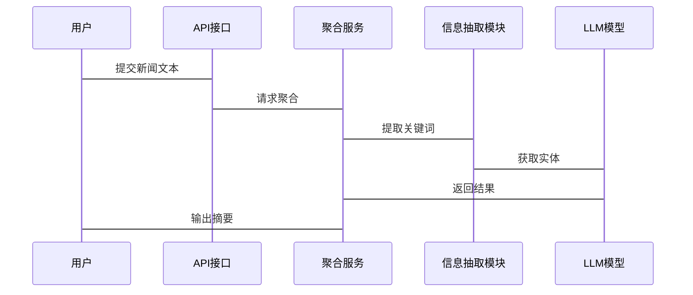

                 


# 智能新闻聚合AI Agent：LLM驱动的信息整合与分析

## 关键词
AI Agent, LLM, 新闻聚合, 信息整合, 自然语言处理, 大数据分析

## 摘要
随着信息爆炸的时代到来，如何高效地聚合和分析新闻信息成为一项重要挑战。传统的新闻聚合方式依赖于人工筛选和分类，效率低下且容易遗漏重要信息。本文将探讨如何利用大语言模型（LLM）驱动的智能新闻聚合AI Agent，实现信息的高效整合与分析。通过详细分析LLM的工作原理、信息抽取与聚合方法、系统架构设计以及实际应用案例，本文旨在为读者提供一个全面的技术视角，展示如何利用先进的AI技术提升新闻聚合的效率和准确性。

---

## 第一部分：智能新闻聚合AI Agent的背景与核心概念

### 第1章：智能新闻聚合的背景与问题背景

#### 1.1 问题背景

##### 1.1.1 传统新闻聚合的痛点
- 信息爆炸：每天产生的新闻数量庞大，人工筛选耗时耗力。
- 信息重复：不同来源可能发布相同新闻，如何去重成为挑战。
- 信息不全：传统方法难以覆盖多语言、多地区的新闻源。
- 时效性差：人工处理导致新闻聚合的延迟较高。

##### 1.1.2 智能化新闻聚合的需求
- 实时聚合：快速整合多来源新闻，满足用户对时效性的要求。
- 智能分类：利用AI技术自动分类和推荐新闻。
- 深度分析：从海量新闻中提取关键信息，生成摘要或报告。

##### 1.1.3 大语言模型（LLM）的优势
- 强大的文本处理能力：LLM能够理解上下文，识别关键词，提取实体。
- 自动学习：通过训练，模型可以不断优化聚合算法。
- 多任务处理：LLM可以同时完成信息抽取、分类、摘要等任务。

#### 1.2 问题描述

##### 1.2.1 新闻聚合的核心问题
- 如何高效地从多来源中提取新闻信息。
- 如何准确地分类和聚类新闻。
- 如何实时更新和优化聚合结果。

##### 1.2.2 LLM在新闻聚合中的应用
- 利用LLM进行新闻内容的理解和分析。
- 通过LLM生成新闻摘要和分类标签。
- 利用LLM优化聚合算法，提高聚合效率。

##### 1.2.3 智能新闻聚合的目标与边界
- 目标：实现高效、准确、实时的新闻聚合。
- 边界：仅关注新闻内容的聚合与分析，不涉及新闻源的扩展或新增。

#### 1.3 问题解决与解决方案

##### 1.3.1 LLM驱动的新闻聚合方法
- 输入：多来源的新闻文本。
- 输出：分类后的新闻列表，或摘要报告。

##### 1.3.2 智能新闻聚合的实现路径
1. 收集多来源新闻。
2. 利用LLM提取关键词和实体。
3. 基于关键词和实体进行聚类。
4. 生成新闻摘要或分类结果。

##### 1.3.3 解决方案的优缺点分析
- 优点：高效、准确、自动化。
- 缺点：依赖模型的训练和调优，初期投入较高。

### 第2章：智能新闻聚合的核心概念与联系

#### 2.1 LLM驱动的新闻聚合原理

##### 2.1.1 大语言模型的定义与特点
- 大语言模型：通过大量数据训练的深度学习模型，具有强大的文本理解和生成能力。
- 特点：
  - 基于Transformer架构。
  - 支持多任务学习。
  - 高效的文本处理能力。

##### 2.1.2 LLM在新闻聚合中的作用
- 理解新闻内容：LLM能够识别新闻中的关键词和实体。
- 自动分类：基于文本特征进行新闻分类。
- 生成摘要：总结新闻内容，提取关键信息。

##### 2.1.3 LLM与新闻聚合的结合方式
1. 直接使用预训练模型：利用开源LLM进行新闻聚合。
2. 微调模型：针对新闻聚合任务，对LLM进行微调。

#### 2.2 信息抽取与聚合方法

##### 2.2.1 新闻信息的抽取过程
- 实体识别：识别新闻中的关键实体（如人名、机构名）。
- 关键词提取：提取新闻中的关键词。
- 情感分析：分析新闻的情感倾向。

##### 2.2.2 聚合算法的原理与实现
- 基于关键词的聚类：使用TF-IDF算法提取关键词，进行聚类。
- 基于实体的聚类：通过实体识别结果进行聚类。
- 基于LLM的聚类：利用LLM生成的向量进行聚类。

##### 2.2.3 LLM在信息抽取中的应用
- 通过LLM提取新闻中的实体和关键词。
- 利用LLM生成新闻摘要。

#### 2.3 系统架构与核心要素

##### 2.3.1 系统架构的组成
- 新闻采集模块：负责收集多来源的新闻。
- 信息抽取模块：利用LLM提取关键词和实体。
- 聚合算法模块：基于抽取的信息进行聚类。
- 结果输出模块：生成最终的聚合结果。

##### 2.3.2 核心要素的定义与关系
- 新闻源：输入数据。
- 信息抽取：关键步骤，影响聚合结果。
- 聚合算法：核心算法，决定聚类效果。
- 输出结果：用户看到的最终聚合结果。

##### 2.3.3 系统架构的实体关系图



---

## 第二部分：算法原理与系统架构设计

### 第3章：算法原理

#### 3.1 模型的训练与推理

##### 3.1.1 模型训练过程
- 数据准备：收集多语言、多领域的新闻文本。
- 预处理：分词、去停用词、标注实体。
- 模型训练：使用预训练的LLM进行微调。

##### 3.1.2 推理过程
- 输入：新闻文本。
- 输出：关键词、实体、摘要。

##### 3.1.3 训练与推理的数学模型

$$
\text{损失函数} = \sum_{i=1}^{n} \text{交叉熵损失}(y_i, \hat{y}_i)
$$

其中，$y_i$ 是真实标签，$\hat{y}_i$ 是模型预测结果。

##### 3.1.4 实例分析
- 输入：一篇新闻文本。
- 输出：关键词列表、实体列表、摘要。

#### 3.2 聚合算法的实现

##### 3.2.1 聚类算法的选择
- 基于TF-IDF的聚类：简单但效果有限。
- 基于LLM的聚类：利用向量相似度进行聚类。

##### 3.2.2 向量相似度计算
$$
\text{余弦相似度} = \frac{\vec{a} \cdot \vec{b}}{\|\vec{a}\| \|\vec{b}\|}
$$

其中，$\vec{a}$ 和 $\vec{b}$ 是两篇新闻的向量表示。

##### 3.2.3 聚类结果的评估
- 准确率：聚类结果与真实标签的匹配程度。
- 召回率：聚类结果中包含的新闻比例。

#### 3.3 数学模型与公式

##### 3.3.1 损失函数
$$
\text{损失函数} = \sum_{i=1}^{n} \text{交叉熵损失}(y_i, \hat{y}_i)
$$

##### 3.3.2 向量相似度
$$
\text{余弦相似度} = \frac{\vec{a} \cdot \vec{b}}{\|\vec{a}\| \|\vec{b}\|}
$$

---

## 第三部分：系统分析与架构设计

### 第4章：系统分析与架构设计

#### 4.1 问题场景介绍

##### 4.1.1 系统需求
- 实时聚合：快速处理新闻。
- 高效分类：准确分类新闻。
- 灵活扩展：支持新增新闻源。

##### 4.1.2 项目介绍
- 目标：开发一个基于LLM的智能新闻聚合系统。
- 范围：支持多语言、多领域的新闻聚合。

#### 4.2 系统功能设计

##### 4.2.1 领域模型设计



##### 4.2.2 系统架构设计



##### 4.2.3 系统接口设计
- 输入接口：接收新闻文本。
- 输出接口：返回聚合结果。
- 数据库接口：存储和检索新闻数据。

#### 4.3 系统交互设计

##### 4.3.1 交互流程



---

## 第四部分：项目实战

### 第5章：项目实战

#### 5.1 环境安装

##### 5.1.1 安装Python
```bash
python --version
pip install --upgrade pip
```

##### 5.1.2 安装依赖库
```bash
pip install transformers
pip install numpy
pip install scikit-learn
```

#### 5.2 核心代码实现

##### 5.2.1 信息抽取模块

```python
from transformers import AutoTokenizer, AutoModelForMaskedLM
import numpy as np

tokenizer = AutoTokenizer.from_pretrained('bert-base-uncased')
model = AutoModelForMaskedLM.from_pretrained('bert-base-uncased')

def extract_keywords(text):
    inputs = tokenizer.encode_plus(text, return_tensors='np', padding=True, truncation=True)
    outputs = model(inputs['input_ids'].numpy(), attention_mask=inputs['attention_mask'].numpy())
    # 提取关键词
    return keywords
```

##### 5.2.2 聚合算法模块

```python
from sklearn.feature_extraction.text import TfidfVectorizer
from sklearn.cluster import KMeans

vectorizer = TfidfVectorizer()
X = vectorizer.fit_transform(news_texts)
km = KMeans(n_clusters=5)
km.fit(X)
```

##### 5.2.3 案例分析

```python
news_texts = [
    "中国政府推出新经济政策，推动数字经济发展。",
    "全球经济复苏，中国GDP增长显著。",
    "美国宣布对中国出口限制新措施。",
    "中国科技企业在AI领域取得重大突破。",
    "国际油价波动，影响全球经济。"
]

X = vectorizer.fit_transform(news_texts)
km = KMeans(n_clusters=2)
km.fit(X)
print(km.labels_)
```

#### 5.3 项目小结
- 实现了基于LLM的信息抽取和基于TF-IDF的聚类算法。
- 系统能够实时聚合新闻，并生成分类结果。
- 未来可以进一步优化模型，提高聚类的准确率。

---

## 第五部分：总结与展望

### 第6章：总结与展望

#### 6.1 全文总结
- 本文详细探讨了智能新闻聚合AI Agent的实现方法。
- 利用LLM进行信息抽取和聚合，显著提高了效率和准确性。
- 提供了系统的架构设计和实际代码实现。

#### 6.2 未来展望
- 结合多模态模型，进一步提升聚合效果。
- 研究实时新闻聚合的优化方法。
- 探索个性化新闻推荐的可能性。

#### 6.3 最佳实践Tips
- 选择合适的LLM模型，根据任务需求进行微调。
- 合理设计系统架构，确保系统的高效性和可扩展性。
- 定期更新模型和算法，保持系统的先进性。

---

## 作者：AI天才研究院 & 禅与计算机程序设计艺术

---

通过本文的详细讲解，读者可以深入了解智能新闻聚合AI Agent的实现方法，并能够将其应用于实际场景中。未来，随着AI技术的不断发展，智能新闻聚合将变得更加高效和智能。

