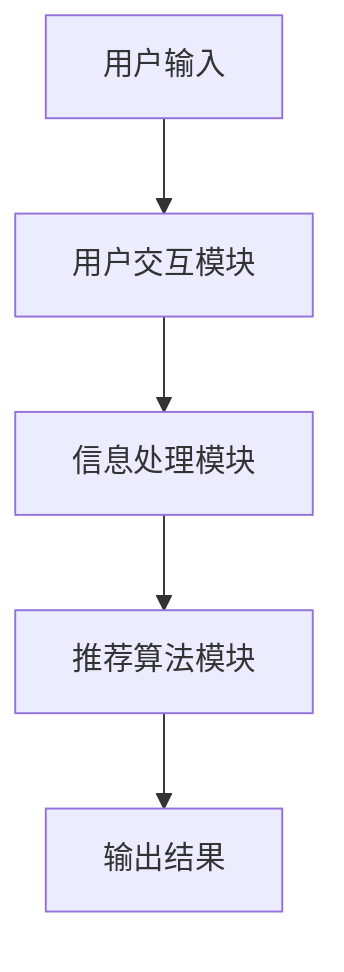
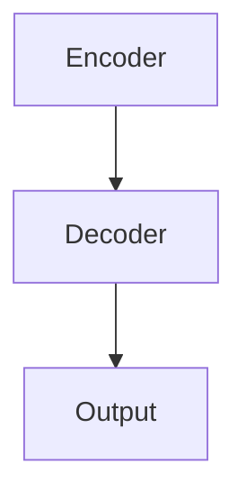
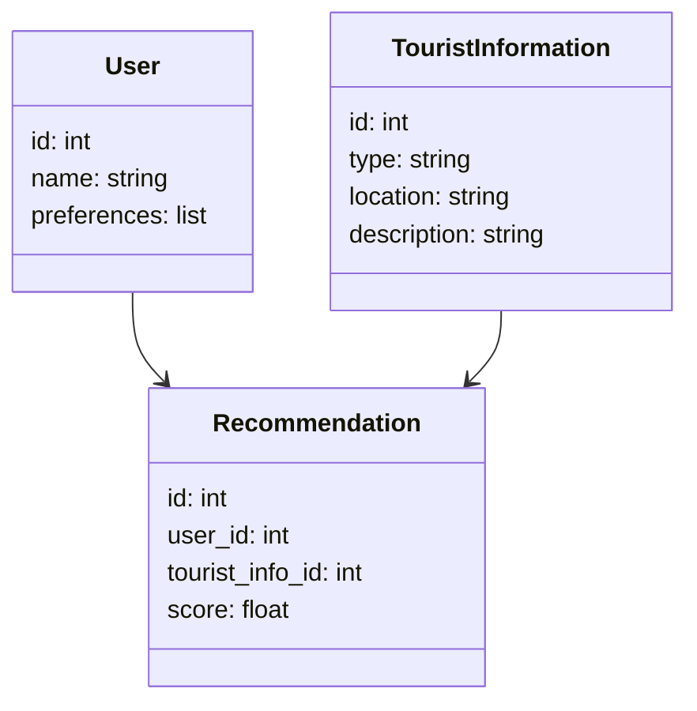

                 


# 智能旅游规划 AI Agent：LLM 辅助个性化旅行定制

> **关键词**：智能旅游、AI Agent、LLM、个性化定制、自然语言处理、旅游推荐系统、人工智能

> **摘要**：本文探讨了如何利用AI Agent和大型语言模型（LLM）技术实现个性化旅行规划。通过分析智能旅游规划的现状与挑战，阐述了AI Agent的核心概念与功能，详细讲解了LLM在旅游信息处理与推荐中的应用。本文还从算法原理、系统架构、项目实战等多个角度，全面解析了智能旅游规划AI Agent的实现过程，并通过具体案例展示了其在实际应用中的价值与潜力。

---

## 第一章: 智能旅游规划的现状与挑战

### 1.1 传统旅游规划的局限性

#### 1.1.1 传统旅游规划的流程与痛点
传统的旅游规划流程通常依赖人工服务或通用旅游平台，存在以下痛点：
- **信息碎片化**：用户需要在多个平台（如航空公司、酒店、景点等）中手动查找信息，效率低下。
- **个性化不足**：通用平台难以满足用户的个性化需求，例如偏好特定类型的食物或景点。
- **推荐不精准**：基于协同过滤的传统推荐系统难以捕捉用户的实时需求和偏好变化。

#### 1.1.2 用户需求的多样化与个性化
现代用户对旅游的需求越来越多样化，例如：
- **兴趣偏好**：用户可能偏好历史古迹、美食、自然风光等不同类型的景点。
- **行程灵活性**：用户可能希望在行程中随时调整计划。
- **个性化体验**：用户希望获得独特的旅行体验，而不是千篇一律的行程安排。

#### 1.1.3 旅游信息的碎片化与不透明
旅游信息的碎片化导致用户难以快速获取所需信息，例如：
- **信息分散**：航班、酒店、景点、餐饮等信息分散在不同的平台。
- **信息不透明**：用户难以获取实时更新的旅游信息，例如航班取消或景点关闭的通知。

### 1.2 AI Agent 在旅游规划中的应用价值

#### 1.2.1 AI Agent 的定义与特点
AI Agent（智能代理）是一种能够感知环境并采取行动以实现目标的智能系统。其特点包括：
- **自主性**：能够在没有人工干预的情况下运行。
- **反应性**：能够根据环境的变化动态调整行为。
- **学习能力**：能够通过数据学习和优化。

#### 1.2.2 AI Agent 在旅游规划中的优势
AI Agent 在旅游规划中的优势体现在以下几个方面：
- **实时信息处理**：能够快速处理大量的旅游信息，例如航班、酒店、景点等。
- **个性化推荐**：基于用户的偏好和实时数据，提供个性化的旅行建议。
- **动态调整**：在行程中实时调整计划，以应对突发情况（例如航班取消）。

#### 1.2.3 个性化旅行定制的需求与市场潜力
随着旅游业的快速发展，个性化旅行定制的需求日益增长。AI Agent 能够满足用户对个性化、高效和便捷的需求，具有巨大的市场潜力。

### 1.3 LLM 在智能旅游规划中的作用

#### 1.3.1 LLM 的基本概念与技术原理
大型语言模型（LLM）是一种基于深度学习的自然语言处理模型，能够理解和生成人类语言。其技术原理包括：
- **编码器-解码器结构**：编码器将输入文本编码为向量，解码器将向量解码为输出文本。
- **注意力机制**：通过注意力机制，模型能够关注输入文本中的重要部分。

#### 1.3.2 LLM 在自然语言处理中的优势
LLM 在自然语言处理中的优势包括：
- **强大的上下文理解能力**：能够理解长文本中的上下文关系。
- **多任务能力**：能够同时处理多种任务，例如翻译、问答、文本生成等。

#### 1.3.3 LLM 在旅游信息提取与推荐中的应用
LLM 在旅游信息提取与推荐中的应用包括：
- **文本生成**：生成个性化的旅行建议。
- **信息抽取**：从文本中提取航班、酒店、景点等信息。
- **对话系统**：与用户进行自然语言对话，理解用户需求。

### 1.4 本章小结
本章分析了传统旅游规划的局限性，阐述了AI Agent 和 LLM 在旅游规划中的应用价值和优势，为后续章节奠定了基础。

---

## 第二章: 智能旅游规划 AI Agent 的核心概念与原理

### 2.1 AI Agent 的核心要素与功能

#### 2.1.1 用户需求分析与建模
用户需求分析与建模是AI Agent 的核心任务之一，包括：
- **需求解析**：通过自然语言处理技术，解析用户的旅行需求（例如“我想去欧洲旅游，预算5000元”）。
- **用户画像**：基于用户的历史行为和偏好，构建用户画像。

#### 2.1.2 旅游信息的智能提取与处理
旅游信息的智能提取与处理包括：
- **信息检索**：从互联网上检索相关的旅游信息（例如航班、酒店、景点）。
- **信息融合**：将分散的旅游信息进行整合，形成完整的行程建议。

#### 2.1.3 个性化推荐算法与模型
个性化推荐算法与模型包括：
- **协同过滤**：基于用户相似性推荐景点。
- **基于内容的推荐**：基于景点的属性（例如类型、评分）推荐。
- **混合推荐**：结合协同过滤和基于内容的推荐。

#### 2.1.4 本小节小结
本小节详细介绍了AI Agent 的核心要素与功能，包括用户需求分析、旅游信息处理和个性化推荐。

---

### 2.2 LLM 在 AI Agent 中的角色与功能

#### 2.2.1 LLM 作为对话系统的核心
LLM 在对话系统中的作用包括：
- **自然语言理解**：理解用户的需求。
- **对话生成**：生成自然流畅的回复。

#### 2.2.2 LLM 的文本生成能力在旅行定制中的应用
文本生成能力在旅行定制中的应用包括：
- **行程规划**：生成个性化的行程安排。
- **景点描述**：生成景点的详细描述。

#### 2.2.3 LLM 的多轮对话能力与用户交互优化
多轮对话能力能够优化用户交互，例如：
- **上下文记忆**：记住之前的对话内容。
- **动态调整**：根据用户反馈实时调整推荐。

---

### 2.3 智能旅游规划 AI Agent 的系统架构

#### 2.3.1 系统功能模块划分
系统功能模块包括：
- **用户交互模块**：处理用户的输入和输出。
- **信息处理模块**：提取和处理旅游信息。
- **推荐算法模块**：生成个性化推荐。

#### 2.3.2 模块之间的交互关系
模块之间的交互关系可以用以下流程图表示：

```mermaid
graph TD
    User --> User Interaction Module
    User Interaction Module --> Information Processing Module
    Information Processing Module --> Recommendation Algorithm Module
    Recommendation Algorithm Module --> User Interaction Module
```

---

#### 2.3.3 系统的输入输出流程



---

### 2.4 本章小结
本章详细介绍了AI Agent的核心概念与功能，阐述了LLM在其中的角色与作用，并通过系统架构图展示了各模块之间的关系。

---

## 第三章: 智能旅游规划 AI Agent 的算法原理与实现

### 3.1 LLM 的基本原理与算法实现

#### 3.1.1 注意力机制与解码器结构
注意力机制的数学公式如下：

$$
\text{Attention}(Q, K, V) = \text{softmax}\left(\frac{QK^T}{\sqrt{d_k}}\right)V
$$

其中：
- \( Q \) 是查询向量。
- \( K \) 是键向量。
- \( V \) 是值向量。
- \( d_k \) 是键的维度。

解码器的结构包括编码器层和解码器层，具体流程如下：



---

#### 3.1.2 梯度下降与损失函数优化
常用的损失函数是交叉熵损失函数：

$$
\text{Loss} = -\sum_{i=1}^{n} y_i \log p(y_i)
$$

其中：
- \( y_i \) 是真实标签的概率。
- \( p(y_i) \) 是模型预测的概率。

---

#### 3.1.3 模型训练与推理过程
模型训练与推理过程可以用以下流程图表示：

```mermaid
graph TD
    Training Data --> Model Training
    Model Training --> Trained Model
    User Input --> Model Inference
    Model Inference --> Output
```

---

### 3.2 智能旅游规划中的推荐算法

#### 3.2.1 基于协同过滤的推荐算法
基于协同过滤的推荐算法公式如下：

$$
\text{相似度}(u, v) = \frac{\sum_{i \in I_u \cap I_v}(r_{u,i} - \bar{r}_u)(r_{v,i} - \bar{r}_v)}{\sqrt{\sum_{i \in I_u \cap I_v}(r_{u,i} - \bar{r}_u)^2} \cdot \sqrt{\sum_{i \in I_u \cap I_v}(r_{v,i} - \bar{r}_v)^2}}}
$$

其中：
- \( I_u \) 是用户 \( u \) 的行为记录。
- \( r_{u,i} \) 是用户 \( u \) 对项 \( i \) 的评分。
- \( \bar{r}_u \) 是用户 \( u \) 的平均评分。

---

#### 3.2.2 基于内容的推荐算法
基于内容的推荐算法公式如下：

$$
\text{相似度}(i, j) = \frac{\sum_{k=1}^{n} w_k (f_{i,k} - f_{j,k})^2}{\sqrt{\sum_{k=1}^{n} w_k^2} \cdot \sqrt{\sum_{k=1}^{n} (f_{i,k} - f_{j,k})^2}}
$$

其中：
- \( w_k \) 是特征 \( k \) 的权重。
- \( f_{i,k} \) 是项 \( i \) 的第 \( k \) 个特征。

---

#### 3.2.3 混合推荐算法的实现与优化
混合推荐算法的实现流程如下：

```mermaid
graph TD
    Collaborative Filtering --> Hybrid Recommendation
    Content-Based Filtering --> Hybrid Recommendation
    Hybrid Recommendation --> Output
```

---

### 3.3 智能对话系统的实现

#### 3.3.1 对话系统的输入处理
对话系统的输入处理包括：
- **文本预处理**：去除停用词、分词。
- **向量表示**：将文本转换为向量表示。

#### 3.3.2 对话系统的输出生成
对话系统的输出生成包括：
- **解码器层**：生成回复文本。
- **损失函数**：交叉熵损失函数。

---

#### 3.3.3 对话系统的训练与优化
对话系统的训练与优化流程如下：

```mermaid
graph TD
    Training Data --> Model Training
    Model Training --> Trained Model
    User Input --> Model Inference
    Model Inference --> Output
```

---

### 3.4 本章小结
本章详细讲解了LLM和推荐算法的原理与实现，为后续章节的系统设计奠定了基础。

---

## 第四章: 智能旅游规划 AI Agent 的系统架构与设计

### 4.1 系统功能模块划分

#### 4.1.1 用户需求收集与分析模块
用户需求收集与分析模块包括：
- **需求解析**：解析用户的旅行需求。
- **用户画像**：构建用户画像。

---

#### 4.1.2 旅游信息检索与处理模块
旅游信息检索与处理模块包括：
- **信息检索**：从互联网上检索旅游信息。
- **信息融合**：整合旅游信息。

---

#### 4.1.3 个性化推荐与生成模块
个性化推荐与生成模块包括：
- **推荐算法**：基于协同过滤、内容推荐或混合推荐算法生成推荐。
- **行程生成**：生成个性化的行程安排。

---

#### 4.1.4 用户反馈与优化模块
用户反馈与优化模块包括：
- **用户反馈**：收集用户的反馈信息。
- **模型优化**：根据反馈优化推荐算法。

---

### 4.2 系统功能流程设计

#### 4.2.1 用户需求收集与分析
用户需求收集与分析的流程如下：

```mermaid
graph TD
    User Input --> User Interaction Module
    User Interaction Module --> Information Processing Module
    Information Processing Module --> User Profile
```

---

#### 4.2.2 旅游信息检索与处理
旅游信息检索与处理的流程如下：

```mermaid
graph TD
    Information Processing Module --> Information Retrieval
    Information Retrieval --> Information Fusion
    Information Fusion --> Processed Information
```

---

#### 4.2.3 个性化推荐与生成
个性化推荐与生成的流程如下：

```mermaid
graph TD
    Processed Information --> Recommendation Algorithm
    Recommendation Algorithm --> Personalized Recommendations
    Personalized Recommendations --> User Interaction Module
```

---

### 4.3 系统架构设计

#### 4.3.1 领域模型设计
领域模型可以用以下类图表示：



---

#### 4.3.2 系统架构设计
系统架构设计可以用以下架构图表示：

```mermaid
graph TD
    User --> User Interaction Module
    User Interaction Module --> Information Processing Module
    Information Processing Module --> Recommendation Algorithm
    Recommendation Algorithm --> Output
```

---

### 4.4 本章小结
本章详细设计了智能旅游规划 AI Agent 的系统架构，包括功能模块划分、流程设计和系统架构图。

---

## 第五章: 智能旅游规划 AI Agent 的项目实战

### 5.1 环境安装与配置

#### 5.1.1 安装 Python 环境
安装 Python 环境并配置 virtualenv：

```bash
python -m pip install --upgrade pip
python -m pip install virtualenv
virtualenv venv
source venv/bin/activate
```

---

#### 5.1.2 安装依赖库
安装所需的依赖库，例如：

```bash
pip install transformers
pip install torch
pip install matplotlib
```

---

### 5.2 系统核心实现

#### 5.2.1 对话系统实现
对话系统的实现代码如下：

```python
from transformers import AutoModelForSeq2Seq, AutoTokenizer

model_name = "facebook/blenderbot-9b"
model = AutoModelForSeq2Seq.from_pretrained(model_name)
tokenizer = AutoTokenizer.from_pretrained(model_name)

def generate_response(user_input):
    inputs = tokenizer(user_input, return_tensors="pt")
    outputs = model.generate(inputs.input_ids, max_length=100)
    response = tokenizer.decode(outputs[0], skip_special_tokens=True)
    return response
```

---

#### 5.2.2 推荐算法实现
基于协同过滤的推荐算法实现代码如下：

```python
import numpy as np

def calculate_similarity(user_ratings, item_ratings):
    numerator = np.sum(user_ratings * item_ratings)
    denominator = np.sqrt(np.sum(user_ratings**2)) * np.sqrt(np.sum(item_ratings**2))
    return numerator / denominator

user_ratings = [4, 3, 2, 5]
item_ratings = [3, 4, 5, 2]
similarity = calculate_similarity(user_ratings, item_ratings)
print(similarity)
```

---

#### 5.2.3 信息处理与整合
信息处理与整合的代码如下：

```python
import requests

def get_tourist_info(location):
    response = requests.get(f"https://api.example.com/tourist-info/{location}")
    return response.json()

tourist_info = get_tourist_info("Paris")
print(tourist_info)
```

---

### 5.3 项目实战小结
本章通过具体的代码实现，展示了如何利用AI Agent 和 LLM 技术实现智能旅游规划，包括对话系统、推荐算法和信息处理的实现。

---

## 第六章: 智能旅游规划 AI Agent 的优化与展望

### 6.1 项目优化建议

#### 6.1.1 模型优化
- **模型压缩**：通过剪枝和量化技术优化模型大小。
- **在线推理优化**：优化模型推理速度。

#### 6.1.2 系统性能优化
- **分布式部署**：通过分布式部署提升系统性能。
- **缓存优化**：优化数据缓存策略。

---

### 6.2 未来研究方向

#### 6.2.1 更复杂的推荐算法
- **深度学习推荐算法**：探索基于深度学习的推荐算法。
- **多模态推荐**：结合文本、图像等多种模态的信息进行推荐。

#### 6.2.2 更智能的对话系统
- **情感分析**：通过情感分析技术优化对话体验。
- **多语言支持**：支持多种语言的对话系统。

---

### 6.3 本章小结
本章提出了项目优化建议和未来研究方向，展望了智能旅游规划 AI Agent 的发展方向。

---

## 作者：AI天才研究院/AI Genius Institute & 禅与计算机程序设计艺术 /Zen And The Art of Computer Programming

---

**本文通过系统化的分析与实践，展示了如何利用AI Agent 和 LLM 技术实现智能旅游规划。从理论到实践，本文为读者提供了全面的技术解析和实现指导。**

