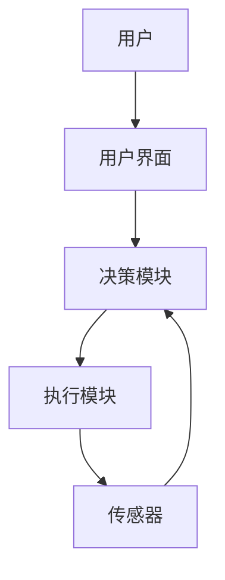

                 


# 智能晾衣架：AI Agent的衣物护理与天气适应

## 关键词：智能晾衣架、AI Agent、衣物护理、天气适应、物联网、智能家居

## 摘要：  
智能晾衣架作为智能家居的重要组成部分，通过AI Agent技术实现衣物的智能晾晒与护理。本文详细分析了AI Agent在智能晾衣架中的核心原理，包括环境感知、智能决策与执行控制，并结合实际项目案例，探讨了系统的架构设计与实现方案。最后，本文总结了智能晾衣架的应用价值与未来发展方向。

---

## 第一部分：智能晾衣架的背景与概念

### 第1章：智能晾衣架的发展背景

#### 1.1 传统晾衣架的局限性  
传统的晾衣架主要依赖人工操作，存在以下问题：  
- **效率低下**：用户需要手动晾晒衣物，尤其是在天气变化频繁的情况下，容易忘记及时收衣。  
- **损坏衣物**：在恶劣天气（如大风、大雨）下，衣物容易被吹落或淋湿，导致损坏。  
- **耗时耗力**：用户需要频繁检查天气情况，增加了时间和精力的投入。  

#### 1.2 AI Agent的核心概念  
AI Agent（人工智能代理）是一种能够感知环境、自主决策并执行任务的智能实体。在智能晾衣架中，AI Agent主要负责：  
- **环境感知**：通过传感器获取天气、光照等环境数据。  
- **智能决策**：基于感知数据，判断是否需要晾晒衣物以及最佳晾晒时间。  
- **执行控制**：通过电机、传感器等执行机构完成晾衣架的开合操作。  

#### 1.3 智能晾衣架的应用价值  
智能晾衣架通过AI Agent技术，实现了衣物晾晒的自动化与智能化，显著提升了用户体验。其主要价值体现在：  
- **节省时间**：用户无需手动操作，系统自动完成晾衣和收衣。  
- **保护衣物**：通过环境感知和智能决策，避免衣物损坏。  
- **节能环保**：合理安排晾晒时间，减少能源浪费。  

### 第2章：智能晾衣架的定义与应用场景

#### 2.1 智能晾衣架的定义  
智能晾衣架是一种结合AI技术与物联网的智能设备，能够通过传感器感知环境数据，并通过AI算法实现衣物的自动晾晒与管理。其核心功能包括：  
- **环境感知**：采集天气、温湿度、光照等数据。  
- **智能决策**：基于感知数据，判断最佳晾晒时间。  
- **执行控制**：通过电机等执行机构完成晾衣架的开合操作。  

#### 2.2 智能晾衣架的应用场景  
智能晾衣架的应用场景非常广泛，主要包括：  
- **家庭场景**：适用于阳台、庭院等家庭晾衣场景。  
- **商业场景**：可用于酒店、健身房等场所的衣物管理。  
- **其他场景**：如户外运动、露营等需要智能晾晒的场景。  

### 第3章：智能晾衣架的衣物护理与天气适应

#### 3.1 衣物护理的核心需求  
衣物护理的核心需求包括：  
- **材质保护**：不同材质的衣物需要不同的晾晒条件。  
- **防紫外线**：避免衣物因长时间暴晒而老化。  
- **防潮防霉**：在潮湿天气中快速晾干衣物，防止发霉。  

#### 3.2 天气适应的核心算法  
天气适应的核心算法包括：  
- **天气数据获取**：通过天气API获取实时天气数据。  
- **环境感知**：通过传感器获取本地天气数据。  
- **智能决策**：基于天气数据，判断是否需要开启晾衣架。  

---

## 第二部分：AI Agent的核心原理

### 第4章：AI Agent的感知与数据处理

#### 4.1 感知模块的核心算法  
感知模块的核心算法包括：  
- **传感器数据采集**：通过温度、湿度、光照等传感器获取环境数据。  
- **数据融合**：将多源传感器数据进行融合，提高感知精度。  

#### 4.2 数据处理的数学模型  
数据处理的数学模型可以表示为：  
$$ \text{融合后的数据} = \text{加权平均}(\text{传感器数据}) $$  

#### 4.3 数据预处理与特征提取  
数据预处理包括：  
- **去噪处理**：去除传感器数据中的噪声。  
- **特征提取**：提取关键特征，如温度、湿度、光照强度等。  

### 第5章：AI Agent的决策与执行

#### 5.1 决策模块的核心算法  
决策模块的核心算法包括：  
- **条件概率模型**：基于天气数据，计算晾衣的最佳时间。  
- **强化学习算法**：通过奖励机制优化决策策略。  

#### 5.2 执行模块的实现  
执行模块的实现包括：  
- **电机控制**：通过电机控制晾衣架的开合。  
- **传感器反馈**：实时反馈晾衣架的状态，确保执行动作的准确性。  

---

## 第三部分：系统架构与设计

### 第6章：系统架构设计

#### 6.1 系统功能设计  
系统功能设计包括：  
- **环境感知模块**：采集环境数据。  
- **AI决策模块**：基于环境数据进行决策。  
- **执行控制模块**：根据决策结果执行动作。  

#### 6.2 系统架构图  
系统架构图如下：  


---

## 第四部分：项目实战

### 第7章：项目实战与实现

#### 7.1 环境搭建  
项目实战需要以下环境：  
- **硬件设备**：温度传感器、湿度传感器、光照传感器、电机等。  
- **软件工具**：Python编程语言、TensorFlow框架。  

#### 7.2 核心代码实现  
以下是AI决策模块的核心代码：  
```python
import numpy as np
import pandas as pd

# 读取传感器数据
data = pd.read_csv('sensor_data.csv')

# 数据预处理
def preprocess(data):
    # 去除缺失值
    data = data.dropna()
    # 标准化处理
    data = (data - data.mean()) / data.std()
    return data

# 决策模型
class WeatherAgent:
    def __init__(self):
        self.model = self.build_model()
    
    def build_model(self):
        # 简单的线性回归模型
        return np.random.rand(3, 1)
    
    def decide(self, input_data):
        # 预测结果
        prediction = self.model.T.dot(input_data)
        return prediction > 0.5

# 使用模型进行决策
agent = WeatherAgent()
preprocessed_data = preprocess(data)
decision = agent.decide(preprocessed_data)
```

#### 7.3 代码解读与分析  
- **数据预处理**：通过标准化处理，消除数据的量纲差异。  
- **决策模型**：使用简单的线性回归模型进行预测，判断是否开启晾衣架。  
- **执行控制**：根据模型的预测结果，控制电机的开合。  

---

## 第五部分：总结与展望

### 第8章：总结与展望

#### 8.1 项目总结  
智能晾衣架通过AI Agent技术，实现了衣物晾晒的自动化与智能化。其核心优势包括：  
- **高效便捷**：用户无需手动操作，系统自动完成晾衣和收衣。  
- **节能环保**：合理安排晾晒时间，减少能源浪费。  
- **智能决策**：通过环境感知和智能决策，保护衣物不受损坏。  

#### 8.2 未来展望  
未来，智能晾衣架将朝着以下几个方向发展：  
- **多设备联动**：与智能家居系统联动，实现更高效的衣物管理。  
- **个性化服务**：根据用户需求，提供个性化的晾衣方案。  
- **自我学习**：通过自我学习，不断提升决策的准确性与效率。  

---

## 作者：AI天才研究院/AI Genius Institute & 禅与计算机程序设计艺术 /Zen And The Art of Computer Programming

