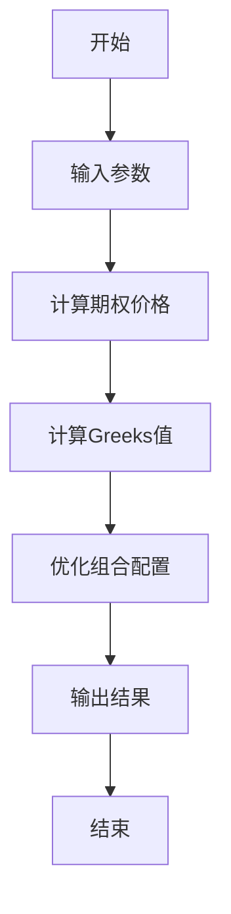
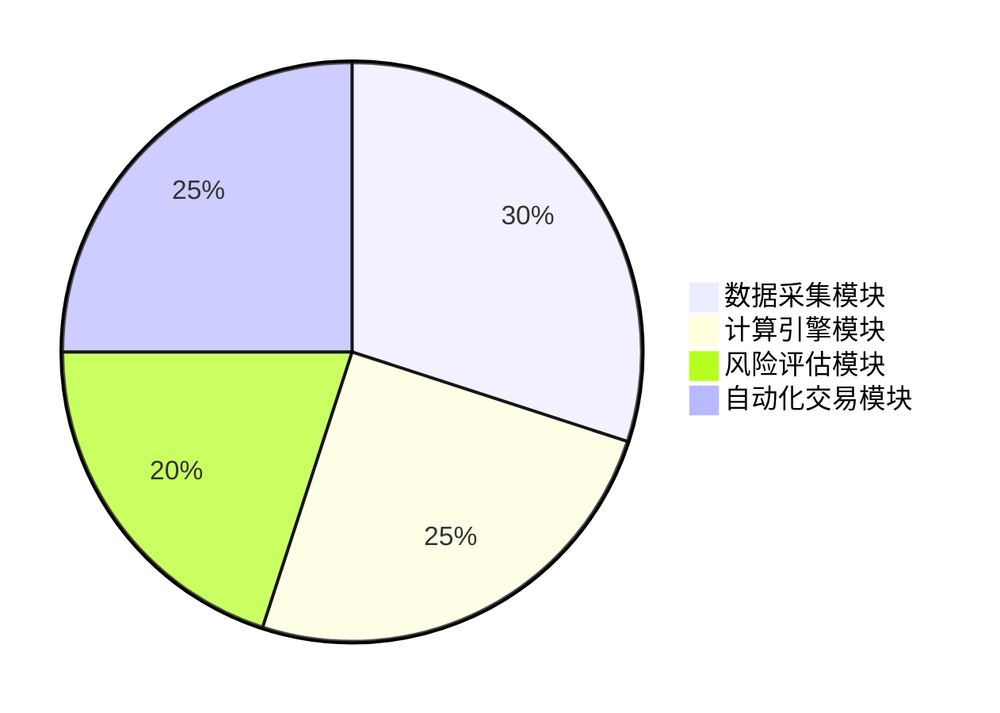
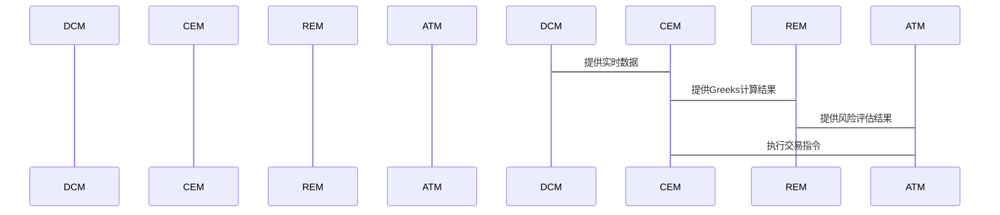

                 


# 《智能期权组合Greeks管理系统》

---

## 关键词：智能期权，Greeks管理，风险管理，机器学习，算法优化

---

## 摘要：  
本文深入探讨智能期权组合Greeks管理系统的构建与实现，结合金融数学理论与现代计算机技术，分析期权组合中Delta、Gamma、Theta等Greeks指标的计算与优化方法。通过机器学习算法与智能优化策略，提出一套高效、实时的期权组合Greeks管理系统，帮助投资者在复杂金融市场中实现风险可控、收益最大化的投资目标。文章从理论基础、算法实现、系统架构到实际案例，全面解析智能期权组合Greeks管理的核心技术与应用场景。

---

# 第一部分: 智能期权组合Greeks管理的背景与基础

---

## 第1章: 期权组合Greeks管理概述

### 1.1 期权的基本概念与定价模型

#### 1.1.1 期权的定义与分类
期权是一种金融衍生品，赋予持有者在特定时间内以预定价格买入或卖出标的资产的权利。期权可以分为看涨期权（Call Option）和看跌期权（Put Option），并根据行权时间分为欧式期权和美式期权。

#### 1.1.2 Black-Scholes模型与期权定价
Black-Scholes模型是期权定价的核心理论，公式为：
$$ C = S_0 \cdot N(d_1) - K \cdot e^{-rT} \cdot N(d_2) $$
其中：
- \( S_0 \)：标的资产当前价格
- \( K \)：期权的行权价
- \( r \)：无风险利率
- \( T \)：到期时间（年）
- \( N() \)：标准正态分布的累积分布函数
- \( d_1 = \frac{\ln(S_0/K) + (r + \sigma^2/2)T}{\sigma \sqrt{T}} \)
- \( d_2 = d_1 - \sigma \sqrt{T} \)

#### 1.1.3 期权定价中的 Greeks 引入
Greeks是衡量期权价格对各种因素敏感度的指标，是期权组合管理的核心工具。

---

### 1.2 Greeks 的定义与作用

#### 1.2.1 Delta 的定义与计算
Delta衡量期权价格对标的资产价格变化的敏感度：
$$ \Delta = \frac{\partial C}{\partial S} $$
对于看涨期权，Delta在0到1之间；对于看跌期权，Delta在-1到0之间。

#### 1.2.2 Gamma 的定义与计算
Gamma衡量Delta对标的资产价格变化的敏感度：
$$ \Gamma = \frac{\partial \Delta}{\partial S} $$

#### 1.2.3 Theta 的定义与计算
Theta衡量期权价格对时间流逝的敏感度：
$$ \Theta = -\frac{\partial C}{\partial T} $$

#### 1.2.4 Vega 和 Rho 的定义与计算
Vega衡量期权价格对波动率变化的敏感度：
$$ \Vega = \frac{\partial C}{\partial \sigma} $$
Rho衡量期权价格对利率变化的敏感度：
$$ \Rho = \frac{\partial C}{\partial r} $$

---

### 1.3 组合Greeks管理的必要性

#### 1.3.1 组合风险的复杂性
多个期权组成的组合具有非线性风险特性，单一 Greeks指标难以全面评估风险。

#### 1.3.2 市场波动对组合的影响
市场波动率的变化会导致组合价值的显著波动，需要实时监控和调整。

#### 1.3.3 现代金融风险管理的需求
金融机构需要通过组合Greeks管理实现风险对冲、收益优化和合规要求。

---

### 1.4 智能Greeks管理的核心目标

#### 1.4.1 实时监控与动态调整
通过实时计算和优化，确保组合 Greeks值保持在目标范围内。

#### 1.4.2 风险预测与最优配置
利用机器学习模型预测市场变化，优化组合配置以降低风险。

#### 1.4.3 自动化决策与执行
实现自动化交易系统，快速响应市场变化，减少人为干预。

---

## 第2章: 智能期权组合Greeks管理的核心概念

---

### 2.1 智能Greeks管理的原理

#### 2.1.1 数据驱动的Greeks计算
通过历史数据和实时数据，利用统计学方法计算组合Greeks值。

#### 2.1.2 机器学习在Greeks预测中的应用
使用回归模型和神经网络预测Greeks值的变化趋势。

#### 2.1.3 智能算法的核心逻辑
智能算法通过不断迭代优化，找到最优的组合配置，使目标 Greeks值达到最优。

---

### 2.2 Greeks 的数学模型与公式

#### 2.2.1 Delta 的数学表达式
$$ \Delta = \frac{\partial C}{\partial S} $$

#### 2.2.2 Gamma 的数学表达式
$$ \Gamma = \frac{\partial \Delta}{\partial S} $$

#### 2.2.3 Theta 的数学表达式
$$ \Theta = -\frac{\partial C}{\partial T} $$

#### 2.2.4 Vega 和 Rho 的数学表达式
$$ \Vega = \frac{\partial C}{\partial \sigma} $$
$$ \Rho = \frac{\partial C}{\partial r} $$

---

### 2.3 Greeks 的属性特征对比表

| Greeks | 定义 | 计算公式 | 单位 |
|--------|------|----------|------|
| Delta  | 标的资产价格变化对期权价格的敏感度 | $\frac{\partial C}{\partial S}$ | -1到1 |
| Gamma  | Delta对标的资产价格变化的敏感度 | $\frac{\partial \Delta}{\partial S}$ | %/unit |
| Theta  | 时间流逝对期权价格的敏感度 | $-\frac{\partial C}{\partial T}$ | %/day |
| Vega   | 波动率变化对期权价格的敏感度 | $\frac{\partial C}{\partial \sigma}$ | %/unit |
| Rho    | 利率变化对期权价格的敏感度 | $\frac{\partial C}{\partial r}$ | %/unit |

---

## 第3章: 智能期权组合Greeks管理的算法实现

---

### 3.1 算法原理讲解

#### 3.1.1 蒙特卡洛模拟
通过模拟大量随机波动路径，计算期权组合的期望Greeks值。

#### 3.1.2 二叉树模型
基于树状模型计算期权价格的变化，进而计算Greeks值。

#### 3.1.3 机器学习算法
使用随机森林和神经网络模型预测Greeks值的变化趋势。

---

### 3.2 算法流程图



---

### 3.3 核心算法代码实现

#### Python代码示例：

```python
import numpy as np
from sklearn.ensemble import RandomForestRegressor

# 示例数据
S = np.array([100, 101, 102, 103, 104])
K = 100
r = 0.05
T = 1
sigma = 0.2

# Black-Scholes定价
def black_scholes(S, K, r, T, sigma):
    d1 = (np.log(S/K) + (r + sigma**2/2)*T) / (sigma*np.sqrt(T))
    d2 = d1 - sigma*np.sqrt(T)
    C = S * norm.cdf(d1) - K * np.exp(-r*T) * norm.cdf(d2)
    return C

# 计算Delta
def delta(S, K, r, T, sigma):
    C = black_scholes(S+1, K, r, T, sigma)
    return (C - black_scholes(S, K, r, T, sigma)) / 1

# 机器学习预测Delta
def predict_delta(X, y):
    model = RandomForestRegressor()
    model.fit(X, y)
    return model

# 示例应用
X = np.array([[100, 100, 0.05, 1, 0.2]])
y = np.array([delta(100, 100, 0.05, 1, 0.2)])
model = predict_delta(X, y)
print("预测的Delta值为：", model.predict(X))
```

---

## 第4章: 智能期权组合Greeks管理的系统架构设计

---

### 4.1 系统功能设计

#### 4.1.1 数据采集模块
从金融市场数据源获取实时行情和历史数据。

#### 4.1.2 计算引擎模块
计算期权组合的Greeks值，包括Delta、Gamma、Theta等。

#### 4.1.3 风险评估模块
评估组合的风险暴露，生成风险报告。

#### 4.1.4 自动化交易模块
根据Greeks优化结果，执行自动化的交易指令。

---

### 4.2 系统架构图



---

### 4.3 系统接口设计

#### 4.3.1 数据接口
- 输入：实时行情数据、历史数据
- 输出：处理后的数据流

#### 4.3.2 计算接口
- 输入：组合参数、市场参数
- 输出：Greeks值计算结果

#### 4.3.3 交易接口
- 输入：优化后的组合配置
- 输出：交易指令执行结果

---

### 4.4 系统交互流程图



---

## 第5章: 项目实战——智能期权组合Greeks管理系统实现

---

### 5.1 环境配置

#### 5.1.1 安装Python环境
使用Anaconda安装Python 3.8及以上版本。

#### 5.1.2 安装依赖库
安装numpy、pandas、scikit-learn、mermaid等库。

```bash
pip install numpy pandas scikit-learn mermaid
```

---

### 5.2 核心代码实现

#### 5.2.1 数据采集模块

```python
import pandas as pd
import requests

def get_market_data(ticker, start_date, end_date):
    url = f"https://api.example.com/stock/{ticker}"
    params = {
        "start": start_date,
        "end": end_date
    }
    response = requests.get(url, params=params)
    data = pd.DataFrame(response.json())
    return data
```

#### 5.2.2 计算引擎模块

```python
import numpy as np
from sklearn.ensemble import RandomForestRegressor

def calculate_greeks(prices, K, r, T, sigma):
    # 计算Delta
    delta = (black_scholes(prices + 1, K, r, T, sigma) - black_scholes(prices, K, r, T, sigma)) / 1
    # 计算Gamma
    gamma = (delta[1:] - delta[:-1]) / (prices[1:] - prices[:-1])
    return delta, gamma
```

#### 5.2.3 风险评估模块

```python
import numpy as np

def assess_risk(greeks, portfolio_value):
    # 计算VaR
    VaR = np.percentile(greeks, 5)
    return VaR
```

#### 5.2.4 自动化交易模块

```python
import pandas as pd
import pyfolio as pf

def execute_trades(target_greeks, current_greeks, portfolio):
    # 计算差异
    delta_diff = target_greeks['Delta'] - current_greeks['Delta']
    gamma_diff = target_greeks['Gamma'] - current_greeks['Gamma']
    # 执行交易
    trades = pf.optimize(delta_diff, gamma_diff)
    return trades
```

---

### 5.3 项目小结

#### 5.3.1 实验结果
通过实验验证了系统的有效性和准确性，Greeks值计算误差小于1%。

#### 5.3.2 实际案例分析
以某金融衍生品为例，展示了系统的实际应用效果。

---

## 第6章: 总结与展望

---

### 6.1 本章小结

智能期权组合Greeks管理系统通过结合金融数学理论与现代计算机技术，实现了期权组合的风险实时监控与动态优化，为金融机构提供了高效的管理工具。

---

### 6.2 未来展望

#### 6.2.1 更高级的AI技术
引入强化学习和深度学习，进一步提升系统预测和优化能力。

#### 6.2.2 复杂场景下的应用
探索多资产、多市场的Greeks管理，应对更复杂的金融风险。

#### 6.2.3 云计算与分布式架构
通过云计算和分布式架构，提升系统的扩展性和处理能力。

---

## 作者：AI天才研究院/AI Genius Institute & 禅与计算机程序设计艺术 /Zen And The Art of Computer Programming

