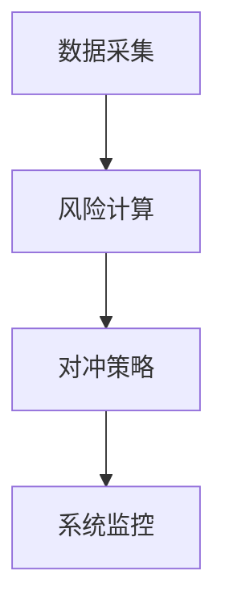

                 


# 智能期权组合风险敞口管理与对冲系统

> 关键词：智能期权、风险敞口管理、对冲系统、金融风险管理、数学模型

> 摘要：本文深入探讨智能期权组合风险敞口管理与对冲系统的核心原理和实现方法。从期权市场的基本概念出发，逐步分析风险敞口管理的必要性与意义，详细阐述智能对冲系统的数学模型与算法原理，结合实际案例展示系统架构设计与项目实现，最后总结最佳实践与未来发展方向。

---

## 第一部分: 智能期权组合风险敞口管理与对冲系统概述

### 第1章: 期权组合风险敞口管理的背景与意义

#### 1.1 期权市场的基本概念
期权是一种金融衍生品，赋予持有者在特定时间内以预定价格买入或卖出标的资产的权利。期权市场的参与者包括交易员、投资者、做市商等。期权交易的核心在于其杠杆效应和风险管理需求。

#### 1.2 风险敞口管理的必要性
期权组合的风险敞口管理是确保投资组合稳定性的关键。市场波动、利率变化和标的资产价格波动都会影响期权组合的价值。通过智能对冲系统，可以实时监控和调整组合风险，避免重大损失。

#### 1.3 智能对冲系统的核心作用
智能对冲系统通过自动化算法和实时数据分析，优化对冲策略，降低人工操作风险。其核心作用包括：实时风险评估、动态对冲调整和高效决策支持。

---

### 第2章: 期权组合风险敞口管理的核心概念

#### 2.1 风险敞口的量化指标
风险敞口的量化指标包括Delta、Gamma、Vega等，这些指标分别衡量期权组合对价格、波动率和时间的敏感性。例如，Delta = ∂V/∂S，表示期权组合价值对标的资产价格变化的敏感度。

#### 2.2 期权组合的风险分解与分析
期权组合的风险分解涉及将整体风险分解为多个风险因子的线性组合。通过主成分分析（PCA）等方法，可以识别对组合影响最大的风险因子。

#### 2.3 智能对冲系统的数学模型
智能对冲系统基于Black-Scholes模型和随机微分方程，构建动态对冲模型。例如，使用蒙特卡洛模拟（Monte Carlo simulation）评估期权组合的潜在风险。

---

## 第二部分: 智能期权组合风险敞口管理的算法原理

### 第3章: 智能对冲算法的设计与实现

#### 3.1 风险对冲的数学表达式
智能对冲算法的目标是最小化组合的风险敞口。例如，假设当前组合的Delta为Δ，目标Delta为0，则需要对冲的数量为Δ × 标的资产价格。

#### 3.2 常见对冲算法的实现
- **Delta对冲算法**：通过调整标的资产头寸，使组合Delta为零。
- **Gamma对冲算法**：通过调整期权头寸，使组合Gamma为零。
- **Vega对冲算法**：通过调整波动率头寸，对冲波动率风险。

#### 3.3 算法实现的代码示例
以下是Delta对冲算法的Python实现示例：

```python
import numpy as np

def delta_hedging(option_price, underlying_price, delta):
    # 计算需要对冲的标的资产数量
    hedge_amount = delta * underlying_price
    return hedge_amount
```

---

## 第三部分: 智能期权组合风险敞口管理系统的架构设计

### 第4章: 系统架构与功能实现

#### 4.1 系统功能模块的交互流程
智能对冲系统的功能模块包括数据采集、风险计算、对冲策略和系统监控。数据采集模块负责获取实时市场数据，风险计算模块基于数学模型评估风险敞口，对冲策略模块执行对冲操作，系统监控模块实时跟踪系统运行状态。

#### 4.2 系统架构的优缺点分析
- **优点**：高效、自动化、实时性强。
- **缺点**：依赖市场数据质量和算法准确性，存在系统性风险。

#### 4.3 系统架构图


---

## 第四部分: 智能期权组合风险敞口管理系统的项目实战

### 第5章: 项目实现与案例分析

#### 5.1 环境安装与配置
- 安装Python、NumPy、Pandas和Matplotlib等依赖库。
- 配置实时市场数据接口（如Yahoo Finance或Quandl）。

#### 5.2 核心功能实现
- 数据采集：从API获取期权和标的资产的价格数据。
- 风险计算：基于Black-Scholes模型计算Delta、Gamma等风险指标。
- 对冲策略：根据风险指标调整对冲头寸。

#### 5.3 实际案例分析
假设我们有一个看涨期权组合，当前标的资产价格为$100，波动率为20%。通过Delta对冲，我们需要买入5个标的资产来对冲组合的Delta风险。

---

## 第五部分: 最佳实践与未来展望

### 第6章: 最佳实践与小结

#### 6.1 最佳实践
- 定期校准模型参数，确保对冲策略的有效性。
- 结合市场反馈优化对冲算法。
- 建立风险管理机制，控制系统性风险。

#### 6.2 小结
智能期权组合风险敞口管理与对冲系统是金融风险管理的重要工具。通过数学模型和算法优化，可以显著提高风险管理效率和准确性。

---

## 作者：AI天才研究院/AI Genius Institute & 禅与计算机程序设计艺术 /Zen And The Art of Computer Programming

