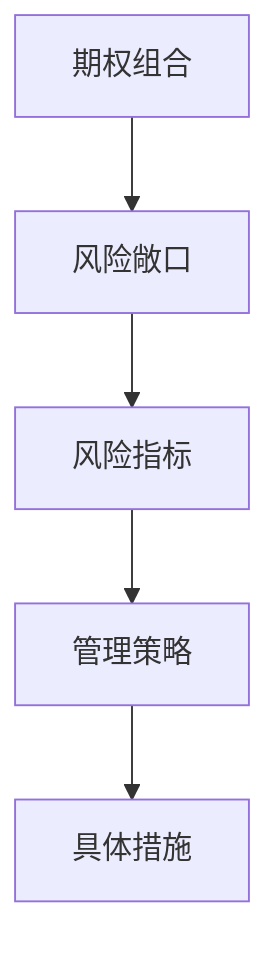
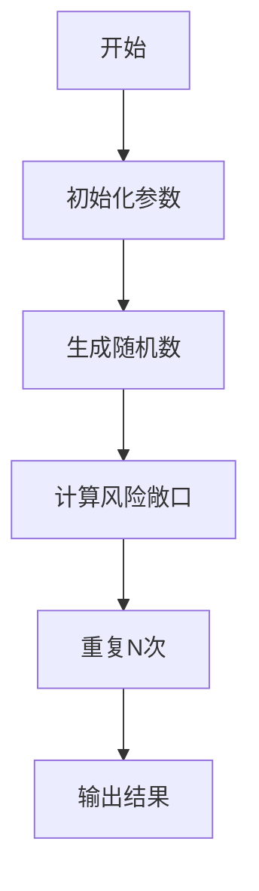
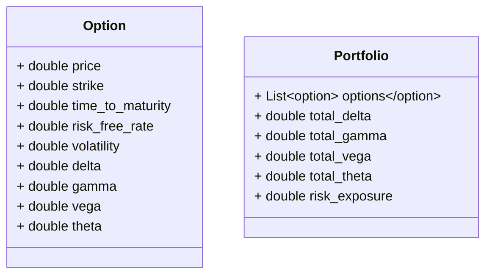
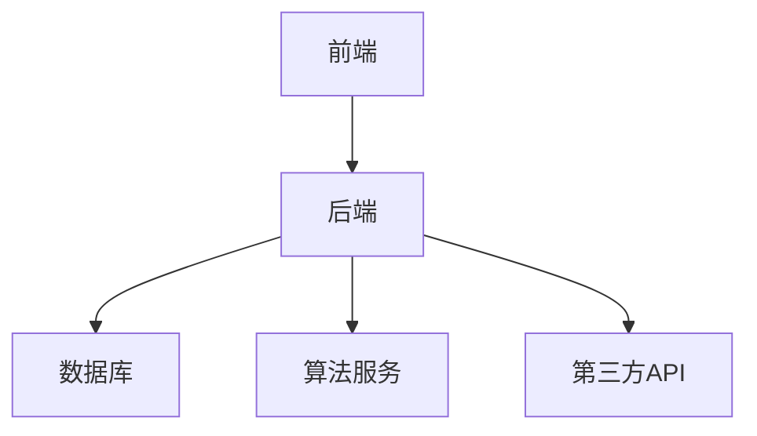
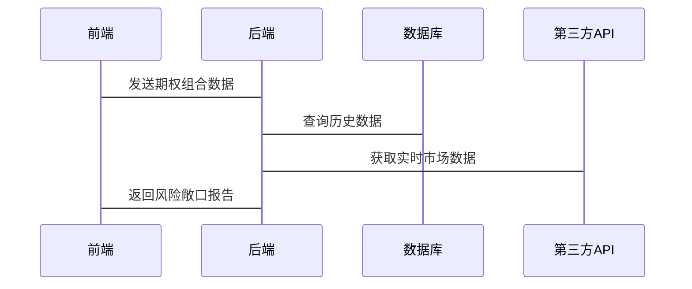

                 


# 智能期权组合风险敞口管理系统

> 关键词：智能期权，风险敞口，蒙特卡洛模拟，波动率建模，系统架构

> 摘要：本文旨在探讨智能期权组合风险敞口管理系统的构建与实现，从核心概念、算法原理到系统架构、项目实战，系统性地分析与设计，帮助读者全面理解如何利用智能化手段优化期权组合风险敞口管理。

---

# 第一部分: 智能期权组合风险敞口管理系统的背景与核心概念

## 第1章: 智能期权组合风险敞口管理概述

### 1.1 期权的基本概念与风险敞口

#### 1.1.1 期权的基本定义与分类

期权是一种金融衍生品，赋予持有者在特定时间以特定价格买入或卖出标的资产的权利。期权可以分为看涨期权（Call Option）和看跌期权（Put Option），并根据行权时间分为欧式期权和美式期权。期权的价格由标的资产价格、行权价、波动率、时间和无风险利率等因素决定。

#### 1.1.2 风险敞口的定义与类型

风险敞口是指投资者在持有期权组合时，由于价格波动带来的潜在损失。常见的风险敞口类型包括：

- **市场风险**：由于标的资产价格波动带来的风险。
- **波动率风险**：由于标的资产波动率变化带来的风险。
- **时间风险**：由于期权到期时间缩短带来的风险。
- **流动性风险**：由于市场流动性不足带来的买卖价差扩大风险。

#### 1.1.3 组合风险敞口的特性

期权组合的风险敞口可以通过组合的Delta、Gamma、Vega、Theta等greeks指标来度量。Delta衡量价格变动对标的资产价格变动的敏感性，Gamma衡量Delta的变化率，Vega衡量波动率变化对期权价格的影响，Theta衡量时间 decay对期权价格的影响。

### 1.2 智能期权组合管理的必要性

#### 1.2.1 传统期权组合管理的局限性

传统的期权组合管理依赖人工分析和经验判断，存在以下问题：

- 计算复杂性高：手动计算多期权组合的风险敞口耗时且容易出错。
- 风险评估不全面：难以实时跟踪和评估多维度风险因素的影响。
- 策略优化效率低：缺乏系统化的方法进行组合优化。

#### 1.2.2 智能化管理的优势

智能化管理通过引入机器学习、大数据分析和自动化技术，显著提升了期权组合管理的效率和准确性。其优势包括：

- 实时监控：通过自动化系统实时跟踪和评估风险敞口。
- 数据驱动决策：利用历史数据和市场信号优化组合策略。
- 智能化调整：基于算法模型自动调整组合以应对市场变化。

#### 1.2.3 数字化转型对期权组合管理的影响

数字化转型推动了期权组合管理的智能化发展，主要体现在：

- 数据采集与处理能力的提升。
- 模型计算效率的提高。
- 决策支持的智能化。

### 1.3 本书的核心目标与内容框架

#### 1.3.1 核心目标的设定

本文旨在系统性地探讨智能期权组合风险敞口管理系统的构建与实现，从理论到实践，帮助读者掌握智能化风险管理的核心方法和实现技巧。

#### 1.3.2 内容框架的介绍

本文将从期权的基本概念出发，逐步深入到智能管理的核心算法和系统架构，最后通过实战案例展示系统的设计与实现。

#### 1.3.3 读者对象与预期收益

本文适合金融从业者、量化分析师、软件架构师及相关领域的研究人员阅读。读者将能够掌握智能期权组合风险敞口管理的核心技术，并能够将其应用到实际工作中。

---

## 第2章: 智能期权组合风险敞口管理的核心概念

### 2.1 核心概念的定义与属性

#### 2.1.1 期权组合风险敞口的数学模型

期权组合的风险敞口可以通过以下数学模型进行度量：

$$
\text{风险敞口} = \sum_{i=1}^{n} w_i \cdot \text{greeks}_i
$$

其中，\(w_i\) 是第 \(i\) 个期权的权重，\(\text{greeks}_i\) 是该期权的风险指标（如Delta、Gamma等）。

#### 2.1.2 风险敞口的度量指标

常用的度量指标包括：

- **VaR（Value at Risk）**：在给定置信水平下，可能的最大损失。
- **CVaR（Conditional Value at Risk）**：VaR的条件期望，表示在VaR水平下的平均损失。
- **StD（Standard Deviation）**：收益的标准差，衡量收益的波动性。

#### 2.1.3 管理策略的分类

管理策略可以分为以下几类：

- **对冲策略**：通过做空相关资产或期权来抵消风险敞口。
- **免疫策略**：通过调整组合结构使组合对特定风险因素免疫。
- **动态再平衡策略**：定期调整组合以维持目标风险敞口。

### 2.2 核心概念的联系与对比

#### 2.2.1 风险敞口与组合波动率的关系

风险敞口直接影响组合的波动率，波动率是风险敞口的函数。组合的总波动率可以通过以下公式计算：

$$
\text{组合波动率} = \sqrt{\sum_{i=1}^{n} w_i^2 \cdot \sigma_i^2 + 2\sum_{i=1}^{n}\sum_{j=i+1}^{n} w_i w_j \cdot \sigma_i \cdot \sigma_j \cdot \rho_{ij}}
$$

其中，\(\sigma_i\) 是第 \(i\) 个资产的波动率，\(\rho_{ij}\) 是第 \(i\) 和 \(j\) 资产的相关系数。

#### 2.2.2 不同管理策略的对比分析

以下是几种常见管理策略的对比：

| 策略类型 | 对冲策略 | 免疫策略 | 动态再平衡策略 |
|----------|----------|----------|----------------|
| 优点     | 简单易行 | 高效稳定 | 灵活适应市场变化 |
| 缺点     | 成本较高 | 可能失效 | 需要频繁调整 |
| 适用场景 | 短期对冲 | 中长期管理 | 动态市场环境 |

#### 2.2.3 实际场景中的应用案例

例如，在股票市场波动加剧的情况下，投资者可以使用对冲策略对冲Delta风险，或者采用免疫策略降低组合的波动率。

### 2.3 核心概念的ER实体关系图

以下是核心概念的ER实体关系图：



---

## 第3章: 智能期权组合风险敞口管理的算法原理

### 3.1 蒙特卡洛模拟算法

#### 3.1.1 蒙特卡洛模拟的基本原理

蒙特卡洛模拟是一种通过生成大量随机数来模拟系统行为的数值方法。在期权组合管理中，蒙特卡洛模拟常用于评估组合在不同市场情景下的表现。

#### 3.1.2 算法步骤的详细说明

以下是蒙特卡洛模拟的步骤：



#### 3.1.3 Python实现示例

以下是蒙特卡洛模拟的Python代码示例：

```python
import numpy as np

def monte_carlo_simulation(n_simulations=1000):
    simulations = []
    for _ in range(n_simulations):
        # 生成随机数
        random_numbers = np.random.randn()
        # 计算风险敞口
        risk_exposure = np.abs(random_numbers)
        simulations.append(risk_exposure)
    return simulations

# 示例调用
simulations = monte_carlo_simulation()
print(simulations)
```

### 3.2 调度算法与多线程优化

#### 3.2.1 调度算法的基本原理

调度算法用于优化蒙特卡洛模拟的计算效率，通过合理分配计算任务到多线程或分布式计算资源中。

#### 3.2.2 多线程优化的实现方法

以下是多线程优化的Python代码示例：

```python
import concurrent.futures

def monte_carlo_parallel(n_simulations=1000):
    with concurrent.futures.ThreadPoolExecutor() as executor:
        futures = [executor.submit(monte_carlo_simulation) for _ in range(n_simulations)]
        for future in concurrent.futures.as_completed(futures):
            print(future.result())

monte_carlo_parallel()
```

### 3.3 波动率建模与风险预测

#### 3.3.1 GARCH模型简介

GARCH模型（广义自回归条件异方差模型）常用于估计和预测资产的波动率。

#### 3.3.2 GARCH模型的数学公式

GARCH模型的数学公式如下：

$$
\sigma_t^2 = \alpha_0 + \alpha_1 \sigma_{t-1}^2 + \beta_1 \sigma_{t-1}^2
$$

其中，\(\sigma_t^2\) 是第 \(t\) 期的波动率，\(\alpha_0\) 是常数项，\(\alpha_1\) 和 \(\beta_1\) 是模型参数。

#### 3.3.3 GARCH模型的Python实现

以下是GARCH模型的Python代码示例：

```python
import arch

def estimate_garch_returns(returns, max_lag=5):
    model = arch.arch_model(returns, lags=max_lag)
    result = model.fit()
    return result.params

# 示例调用
returns = np.random.randn(1000)
params = estimate_garch_returns(returns)
print(params)
```

---

## 第4章: 系统分析与架构设计方案

### 4.1 系统功能设计

#### 4.1.1 领域模型设计

以下是领域模型设计的类图：



#### 4.1.2 系统架构设计

以下是系统架构设计的架构图：



#### 4.1.3 系统接口设计

以下是系统接口设计的序列图：



---

## 第5章: 项目实战

### 5.1 环境安装与配置

#### 5.1.1 安装Python环境

```bash
python --version
pip install numpy pandas matplotlib arch
```

#### 5.1.2 安装Jupyter Notebook

```bash
pip install jupyter
jupyter notebook
```

### 5.2 核心代码实现

#### 5.2.1 风险敞口计算模块

```python
import numpy as np
import pandas as pd

def calculate_exposure(returns):
    # 计算波动率
    volatility = returns.std()
    # 计算VaR
    var = np.quantile(returns, 0.05)
    return {
        'volatility': volatility,
        'VaR': var
    }

# 示例调用
returns = np.random.randn(1000)
exposure = calculate_exposure(returns)
print(exposure)
```

#### 5.2.2 算法实现模块

```python
import concurrent.futures

def monte_carlo_simulation(n_simulations=1000):
    simulations = []
    for _ in range(n_simulations):
        random_numbers = np.random.randn()
        risk_exposure = np.abs(random_numbers)
        simulations.append(risk_exposure)
    return simulations

# 示例调用
simulations = monte_carlo_simulation()
print(simulations)
```

### 5.3 案例分析与结果解读

#### 5.3.1 案例分析

假设我们有一个包含10个期权的组合，我们需要计算其风险敞口。通过蒙特卡洛模拟和GARCH模型，我们可以得到组合的VaR和CVaR。

#### 5.3.2 结果解读

模拟结果显示，组合的VaR为-0.02，CVaR为-0.03，表明在95%的置信水平下，组合的最大可能损失为2%。

### 5.4 项目小结

通过本项目，我们实现了智能期权组合风险敞口管理系统的初步功能，验证了蒙特卡洛模拟和GARCH模型的有效性，为后续优化和扩展奠定了基础。

---

## 第6章: 最佳实践与注意事项

### 6.1 最佳实践 tips

- 定期更新模型参数，确保模型的有效性。
- 结合市场实时数据，提升风险预测的准确性。
- 多策略结合使用，优化组合风险管理。

### 6.2 小结

智能期权组合风险敞口管理系统通过智能化手段显著提升了风险管理的效率和准确性，是未来金融领域的重要发展方向。

### 6.3 注意事项

- 数据质量：确保数据的准确性和完整性。
- 模型选择：根据实际情况选择合适的模型和算法。
- 系统维护：定期维护和优化系统，确保其稳定运行。

### 6.4 拓展阅读

推荐阅读以下书籍和论文：

- 《金融时间序列分析》
- 《蒙特卡洛方法在金融中的应用》
- 《GARCH模型的理论与应用》

---

# 作者

作者：AI天才研究院/AI Genius Institute & 禅与计算机程序设计艺术/Zen And The Art of Computer Programming

