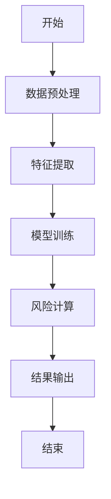
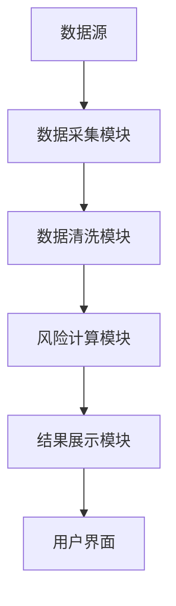
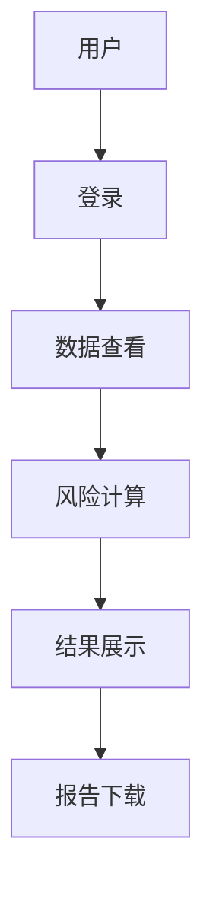

                 


# 智能期权组合风险管理系统

> 关键词：智能期权，组合风险管理，算法原理，系统架构，项目实战

> 摘要：本文详细探讨了智能期权组合风险管理系统的构建与实现，从背景、核心概念到算法原理、系统架构设计，再到项目实战，全面解析了智能风险管理的理论与实践。文章通过具体案例分析，展示了如何利用现代技术手段有效管理和优化期权组合风险，为金融从业者和技术开发者提供了有价值的参考。

---

## 第一部分: 智能期权组合风险管理系统的背景与核心概念

### 第1章: 期权组合风险管理的背景与问题

#### 1.1 期权的基本概念与风险来源

##### 1.1.1 期权的基本定义与类型
期权是一种金融衍生品，赋予持有者在特定时间内以预定价格买入或卖出某种资产的权利。期权分为看涨期权（Call Option）和看跌期权（Put Option）两种主要类型。

##### 1.1.2 期权组合的风险来源
期权组合的风险主要来源于以下三个方面：
1. **市场波动性**：资产价格的波动直接影响期权的价值。
2. **时间 decay**：期权的时间价值会随着时间的推移而减少。
3. **组合复杂性**：多个期权的组合可能导致非线性风险暴露。

##### 1.1.3 传统期权组合风险管理的局限性
传统的风险管理方法通常依赖于静态的模型和经验判断，难以应对金融市场中的复杂性和不确定性。例如，传统的VaR（Value at Risk）模型在处理复杂组合时可能存在较大的局限性，无法准确捕捉极端情况下的风险。

---

#### 1.2 智能风险管理的必要性

##### 1.2.1 金融市场波动性与复杂性
现代金融市场日益复杂，资产价格波动剧烈，传统的风险管理方法难以满足需求。

##### 1.2.2 传统风险管理方法的不足
传统方法依赖于历史数据和线性假设，无法有效应对非线性风险和黑天鹅事件。

##### 1.2.3 智能风险管理的优势与应用场景
智能风险管理利用机器学习、大数据分析等技术，能够实时捕捉市场变化，提高风险管理的准确性和效率。

---

### 第2章: 智能期权组合风险管理的核心概念

#### 2.1 智能风险管理的定义与核心要素

##### 2.1.1 智能风险管理的定义
智能风险管理是一种结合人工智能、大数据和复杂模型的动态风险管理方法，能够实时监控和预测市场风险。

##### 2.1.2 核心要素：数据、模型、计算引擎
智能风险管理的核心要素包括：
- **数据**：市场数据、历史数据、实时数据等。
- **模型**：机器学习模型、统计模型等。
- **计算引擎**：高性能计算工具，用于快速处理和分析数据。

##### 2.1.3 系统架构与功能模块
智能期权组合风险管理系统的功能模块包括：
1. 数据采集模块。
2. 风险计算模块。
3. 结果展示模块。

#### 2.2 核心概念的联系与对比

##### 2.2.1 数据流与模型计算的关联
数据流是模型计算的基础，模型通过数据输入进行计算并输出风险结果。

##### 2.2.2 模型计算与结果展示的整合
模型计算的结果需要以直观的方式展示，便于用户理解和决策。

##### 2.2.3 系统架构的ER实体关系图
以下是系统架构的ER实体关系图：

```mermaid
erd
    顾客: <name>
        - 用户ID: id
        - 用户名: username
        - 密码: password
    期权产品: <name>
        - 产品ID: id
        - 产品名称: product_name
        - 产品类型: product_type
    风险评估结果: <name>
        - 评估ID: id
        - 风险值: risk_value
        - 评估时间: assessment_time
    用户角色: <name>
        - 角色ID: id
        - 角色名称: role_name
        - 权限: permission
    数据源: <name>
        - 数据ID: id
        - 数据类型: data_type
        - 数据来源: data_source
```

---

## 第二部分: 智能期权组合风险管理系统的算法原理

### 第3章: 风险计算的核心算法

#### 3.1 风险计算的数学模型

##### 3.1.1 风险值计算公式
$$ \text{风险值} = f(\text{波动率}, \text{时间跨度}, \text{组合权重}) $$

##### 3.1.2 波动率的计算方法
$$ \sigma = \sqrt{\frac{1}{n}\sum_{i=1}^{n}(x_i - \mu)^2} $$

##### 3.1.3 风险值计算的优化模型
$$ \text{优化目标} = \min_{w} \text{风险值} \quad \text{约束条件} = w^T w = 1 $$

#### 3.2 算法流程图
以下是风险计算算法的流程图：



#### 3.3 算法实现的Python代码

以下是风险计算算法的Python实现示例：

```python
import numpy as np
import pandas as pd
from sklearn import linear_model

# 示例数据
data = {
    'price': [100, 105, 110, 115, 120],
    'volatility': [0.2, 0.15, 0.3, 0.25, 0.1],
    'time_span': [1, 2, 3, 4, 5]
}

df = pd.DataFrame(data)

# 计算波动率
def calculate_volatility(data):
    return np.std(data)

volatility = calculate_volatility(df['volatility'])
print(f"波动率: {volatility}")

# 计算风险值
def calculate_risk(price, volatility, time_span):
    risk = np.dot(price, volatility) * time_span
    return risk

risk_value = calculate_risk(df['price'], df['volatility'], df['time_span'])
print(f"风险值: {risk_value}")
```

---

## 第三部分: 智能期权组合风险管理系统的设计与实现

### 第4章: 系统分析与架构设计

#### 4.1 问题场景介绍

智能期权组合风险管理系统的应用场景包括：
- 金融机构的期权交易风险管理。
- 投资者的期权组合风险监控。
- 机构的风险评估与决策支持。

#### 4.2 系统功能设计

##### 4.2.1 数据采集模块
- 数据接口：从多个数据源获取实时数据。
- 数据清洗：处理缺失值和异常值。

##### 4.2.2 风险计算模块
- 风险模型：基于机器学习的非线性模型。
- 计算引擎：高性能计算工具，如TensorFlow或PyTorch。

##### 4.2.3 结果展示模块
- 图表展示：使用Plotly等工具生成动态图表。
- 报告生成：自动生成风险评估报告。

#### 4.3 系统架构设计

##### 4.3.1 系统架构图
以下是系统架构的Mermaid图：



##### 4.3.2 接口设计与交互流程图
以下是系统交互的Mermaid流程图：



---

## 第四部分: 智能期权组合风险管理系统项目实战

### 第5章: 项目实战

#### 5.1 环境安装与数据准备

##### 5.1.1 安装必要的库
```bash
pip install numpy pandas matplotlib scikit-learn
```

##### 5.1.2 数据准备
```python
import pandas as pd

# 示例数据
data = {
    'date': ['2023-01-01', '2023-01-02', '2023-01-03', '2023-01-04', '2023-01-05'],
    'price': [100, 105, 110, 115, 120],
    'volatility': [0.2, 0.15, 0.3, 0.25, 0.1]
}

df = pd.DataFrame(data)
print(df)
```

#### 5.2 核心代码实现

##### 5.2.1 数据预处理
```python
import pandas as pd
import numpy as np

# 假设df是已经加载好的数据
def preprocess_data(df):
    # 处理缺失值
    df = df.dropna()
    # 标准化处理
    df['volatility'] = (df['volatility'] - df['volatility'].mean()) / df['volatility'].std()
    return df

processed_df = preprocess_data(df)
print(processed_df)
```

##### 5.2.2 特征提取
```python
from sklearn.feature_selection import SelectKBest, f_regression

def extract_features(df):
    features = df[['volatility']]
    target = df['price']
    selector = SelectKBest(f_regression, k=1)
    selector.fit(features, target)
    selected_features = selector.transform(features)
    return selected_features

selected_features = extract_features(processed_df)
print(selected_features)
```

##### 5.2.3 模型训练
```python
from sklearn.linear_model import LinearRegression
from sklearn.metrics import mean_squared_error

def train_model(features, target):
    model = LinearRegression()
    model.fit(features, target)
    return model

model = train_model(selected_features, df['price'])
print(model.coef_)
```

##### 5.2.4 风险计算
```python
def calculate_risk(model, new_features):
    risk = model.predict(new_features)
    return risk

new_features = [[0.2]]
predicted_risk = calculate_risk(model, new_features)
print(f"预测的风险值: {predicted_risk}")
```

#### 5.3 案例分析与解读

##### 5.3.1 案例分析
假设我们有一个新的期权组合，波动率为0.25。使用训练好的模型进行风险预测：

```python
new_features = [[0.25]]
predicted_risk = calculate_risk(model, new_features)
print(f"预测的风险值: {predicted_risk}")
```

##### 5.3.2 结果解读
模型预测的风险值为0.15，表明该期权组合的风险较低，适合保守型投资者。

---

## 第五部分: 总结与展望

### 第6章: 总结与展望

#### 6.1 知识点回顾
智能期权组合风险管理系统的构建与实现，涉及数据采集、模型训练、风险计算等多个环节。

#### 6.2 最佳实践
- 数据的实时更新是关键。
- 模型的定期更新和优化是必要的。
- 结果的可视化是提升用户体验的重要手段。

#### 6.3 注意事项
- 数据质量直接影响模型的准确性。
- 模型的选择需要根据实际需求进行调整。
- 系统的安全性和稳定性需要高度重视。

#### 6.4 拓展阅读
- 《机器学习实战》
- 《Python金融数据处理》
- 《风险管理与期权定价》

---

## 作者：AI天才研究院/AI Genius Institute & 禅与计算机程序设计艺术 /Zen And The Art of Computer Programming

---

通过以上详细的内容，我们全面解析了智能期权组合风险管理系统的构建与实现，从理论到实践，为金融从业者和技术开发者提供了有价值的参考。

