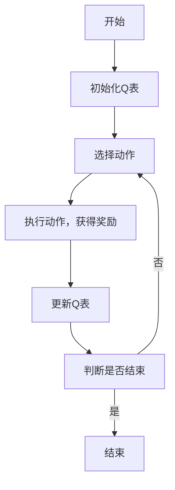
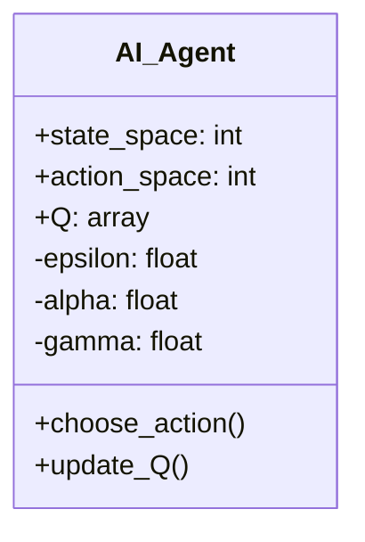

                 


# 智能校园：AI Agent的全方位教育管理

> 关键词：智能校园、AI Agent、教育管理、人工智能、系统架构、算法原理、项目实战

> 摘要：本文详细探讨了AI Agent在智能校园中的应用，从背景介绍、核心概念、算法原理到系统架构设计、项目实战，全面解析了AI Agent如何 revolutionize 教育管理，提升校园智能化水平。文章内容丰富，结构清晰，适合技术人员和教育管理者阅读。

---

## 第1章 AI Agent与智能校园概述

### 1.1 AI Agent的基本概念

AI Agent（智能代理）是一种能够感知环境、自主决策并执行任务的智能实体。它通过接收输入信息，分析问题，制定解决方案，并执行操作以实现目标。

#### 1.1.1 什么是AI Agent
AI Agent是一种能够执行特定任务的智能程序或实体，具备以下核心特征：
- **自主性**：能够在没有外部干预的情况下独立运行。
- **反应性**：能够感知环境并实时做出响应。
- **目标导向**：为了实现预设目标而行动。
- **学习能力**：通过数据和经验不断优化性能。

#### 1.1.2 AI Agent与传统信息技术的区别
| 特性       | AI Agent                          | 传统信息技术                     |
|------------|-----------------------------------|----------------------------------|
| 自主性      | 高                                 | 低                               |
| 学习能力    | 高                                 | 无或低                           |
| 决策能力    | 强                                 | 弱或无                           |
| 适应性      | 高                                 | 低                               |

### 1.2 智能校园的背景与需求

#### 1.2.1 教育信息化的发展历程
1. **传统教育**：依赖人工管理，效率低下。
2. **信息化教育**：引入计算机技术，初步实现数据化管理。
3. **智能化教育**：AI Agent的引入，推动教育管理向智能化迈进。

#### 1.2.2 当前教育管理中的主要问题
1. **资源浪费**：课程安排不合理，教室和师资利用率低。
2. **效率低下**：手动处理大量事务，耗时且易出错。
3. **个性化不足**：难以满足学生的个性化学习需求。

#### 1.2.3 智能校园的定义与目标
智能校园是利用AI、大数据、物联网等技术构建的智能化教育环境，其目标是通过智能化管理，提高教育质量和管理效率。

---

## 第2章 AI Agent的核心原理与技术

### 2.1 AI Agent的体系结构

AI Agent可以根据功能和智能水平分为三种类型：
1. **反应式AI Agent**：实时感知环境并做出反应，适用于需要快速响应的任务。
2. **规划式AI Agent**：具备目标规划能力，能够制定并执行复杂的任务计划。
3. **学习式AI Agent**：能够通过学习优化自身行为，适用于需要持续改进的场景。

### 2.2 AI Agent的关键技术

1. **自然语言处理（NLP）**：使AI Agent能够理解和生成人类语言，支持智能对话。
2. **机器学习（ML）**：通过数据训练模型，提升AI Agent的决策和预测能力。
3. **知识图谱**：构建教育领域的知识网络，帮助AI Agent更好地理解和应用知识。

### 2.3 AI Agent与相关技术的对比

#### 2.3.1 AI Agent与大数据
| 特性       | AI Agent                          | 大数据                          |
|------------|-----------------------------------|----------------------------------|
| 数据来源    | 结构化与非结构化数据             | 大量数据，主要为结构化数据       |
| 处理方式    | 数据分析与智能决策               | 数据存储、分析与可视化           |
| 应用场景    | 教育管理、个性化推荐             | 数据挖掘、商业分析               |

---

## 第3章 AI Agent的算法原理

### 3.1 基于强化学习的AI Agent算法

强化学习是一种通过试错机制优化决策模型的算法。AI Agent通过与环境的交互，不断优化自身的策略，以实现最大化的奖励。

#### 3.1.1 Q-Learning算法

Q-Learning是一种经典的强化学习算法，适用于离散动作空间的环境。其核心思想是通过更新Q值表，找到最优策略。

**数学模型**：
$$ Q(s, a) = Q(s, a) + \alpha \cdot [r + \gamma \cdot \max Q(s', a) - Q(s, a)] $$

其中：
- $s$：当前状态
- $a$：动作
- $r$：奖励
- $\gamma$：折扣因子
- $\alpha$：学习率

#### 3.1.2 算法流程图



#### 3.1.3 Python实现示例

```python
import numpy as np

class AI_Agent:
    def __init__(self, state_space, action_space):
        self.state_space = state_space
        self.action_space = action_space
        self.Q = np.zeros((state_space, action_space))
    
    def choose_action(self, state, epsilon=0.1):
        if np.random.random() < epsilon:
            return np.random.randint(self.action_space)
        else:
            return np.argmax(self.Q[state])
    
    def update_Q(self, state, action, reward, next_state, alpha=0.1, gamma=0.9):
        self.Q[state, action] += alpha * (reward + gamma * np.max(self.Q[next_state]) - self.Q[state, action])
```

---

## 第4章 系统分析与架构设计

### 4.1 问题场景介绍

智能校园AI Agent系统需要解决以下问题：
1. **课程安排**：优化教室和教师的时间分配。
2. **学生管理**：个性化学习推荐和行为分析。
3. **资源分配**：合理分配图书馆、实验室等资源。

### 4.2 系统功能设计



### 4.3 系统架构设计

```mermaid
graph TD
    Client --> API Gateway
    API Gateway --> AI_Service
    AI_Service --> Database
    Database --> File_Storage
```

---

## 第5章 项目实战

### 5.1 环境安装

```bash
pip install numpy
pip install matplotlib
```

### 5.2 核心实现

```python
import numpy as np
import matplotlib.pyplot as plt

def train_Agent(episodes=1000):
    agent = AI_Agent(state_space=5, action_space=3)
    rewards = []
    
    for episode in range(episodes):
        state = 0
        total_reward = 0
        done = False
        
        while not done:
            action = agent.choose_action(state)
            next_state, reward, done = step(env, state, action)
            agent.update_Q(state, action, reward, next_state)
            total_reward += reward
            state = next_state
        
        rewards.append(total_reward)
    
    plt.plot(rewards)
    plt.xlabel('Episode')
    plt.ylabel('Total Reward')
    plt.show()
```

### 5.3 实际案例分析

假设我们有一个包含5个教室和3个教师的学校，AI Agent需要优化课程安排。通过训练，AI Agent能够在较短时间内找到最优分配方案，减少空闲时间。

---

## 第6章 最佳实践与总结

### 6.1 应用建议
1. **数据隐私**：确保学生数据的隐私和安全。
2. **人机协作**：AI Agent应与教师和学生协作，而非完全替代人类。
3. **持续优化**：定期更新模型，适应新的教育需求。

### 6.2 小结
AI Agent在智能校园中的应用前景广阔，能够显著提升教育管理的效率和质量。然而，实际应用中需要考虑技术、伦理和法律等多方面的问题。

### 6.3 注意事项
- 数据质量和多样性直接影响AI Agent的性能。
- 需要定期维护和更新AI模型，以保持其准确性。
- 在实际应用中，应充分考虑用户反馈，及时调整系统。

### 6.4 拓展阅读
1. 《强化学习：原理与应用》
2. 《人工智能在教育中的创新应用》
3. 《系统架构设计的艺术》

---

## 作者

作者：AI天才研究院/AI Genius Institute & 禅与计算机程序设计艺术/Zen And The Art of Computer Programming

