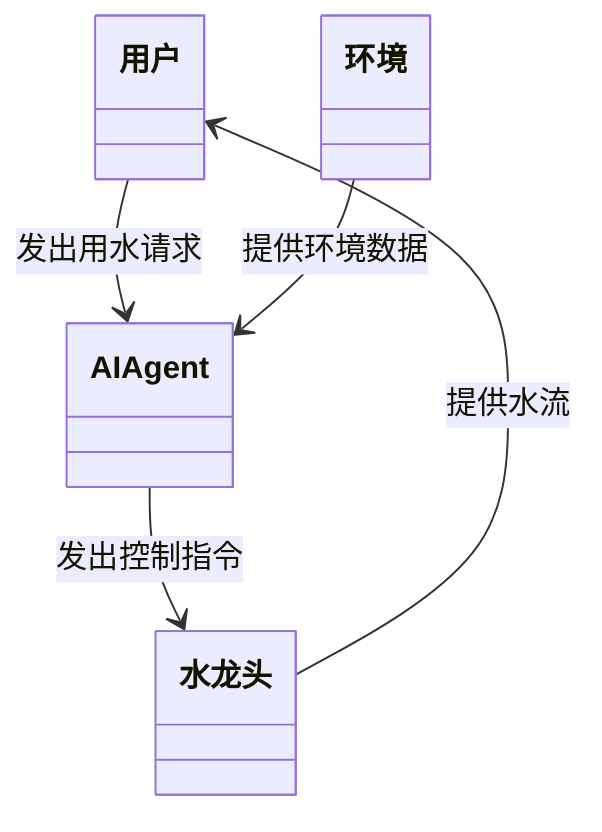

                 


# 智能水龙头：AI Agent的用水效率优化控制

> 关键词：智能水龙头，AI Agent，用水效率，优化控制，强化学习，系统架构，项目实战

> 摘要：本文深入探讨了智能水龙头在AI Agent技术下的用水效率优化控制，分析了AI Agent在水龙头控制中的核心作用，详细讲解了基于强化学习的优化算法，系统性地介绍了智能水龙头的架构设计与实现方案，并通过实战案例展示了AI Agent在提升用水效率方面的巨大潜力。

---

# 第一部分: 背景与概述

## 第1章: 智能水龙头与AI Agent概述

### 1.1 问题背景与描述

#### 1.1.1 传统水龙头的用水效率问题
传统水龙头的用水效率低下，主要表现为：
- **水资源浪费**：用户使用水龙头时，常常忘记关闭，导致水资源浪费。
- **能耗高**：水龙头的开关控制缺乏智能化，无法根据实际需求优化用水量。
- **维护成本高**：传统水龙头缺乏智能监控，出现故障时需要人工排查，维护成本较高。

#### 1.1.2 智能化与AI技术在水龙头中的应用潜力
随着AI技术的快速发展，水龙头的智能化改造成为可能：
- **智能化控制**：通过AI Agent实现水龙头的智能开关控制，优化用水效率。
- **数据采集与分析**：AI Agent可以采集用水数据，分析用户的用水习惯，提供个性化服务。
- **节能环保**：通过AI优化控制，减少水资源浪费，降低能耗。

#### 1.1.3 用水效率优化的必要性与目标
用水效率优化的必要性：
- **节约水资源**：全球水资源短缺问题日益严重，优化用水效率是节约水资源的重要手段。
- **降低能耗**：智能控制可以减少不必要的用水，降低能源消耗。
- **提升用户体验**：智能化的用水管理可以提升用户的使用体验。

优化目标：
- 实现用水量的智能控制，降低水资源浪费。
- 提供个性化用水管理服务，满足不同用户的需求。
- 提高系统的维护效率，降低维护成本。

### 1.2 问题解决与边界定义

#### 1.2.1 AI Agent在水龙头控制中的作用
AI Agent（智能体）在水龙头中的作用：
- **实时感知**：通过传感器采集用水数据，感知用户的用水行为。
- **智能决策**：基于感知数据，AI Agent可以做出最优的开关控制决策。
- **反馈优化**：根据用户反馈和环境变化，动态调整控制策略。

#### 1.2.2 用水效率优化的边界与外延
边界：
- **用户权限**：AI Agent需要区分合法用户和非法用户，防止未经授权的操作。
- **环境感知**：AI Agent需要感知环境数据，如温度、湿度等，以优化用水策略。
- **系统安全**：确保系统安全，防止恶意攻击。

外延：
- **扩展功能**：除了优化用水效率，AI Agent还可以实现远程控制、数据统计等功能。
- **互联互通**：与智能家居系统互联互通，实现家庭用水的全面智能化管理。

#### 1.2.3 智能水龙头的系统架构与核心要素
核心要素：
- **传感器**：采集用水数据，如流量、压力等。
- **AI Agent**：负责数据处理、决策和控制。
- **执行机构**：根据AI Agent的指令，控制水龙头的开关。
- **用户界面**：提供人机交互界面，让用户能够与系统进行互动。

系统架构：
- **数据采集层**：传感器采集数据。
- **数据处理层**：AI Agent对数据进行分析和处理。
- **控制层**：根据处理结果，控制水龙头的开关。
- **用户界面层**：提供可视化界面，方便用户操作。

---

# 第二部分: 核心概念与原理

## 第2章: AI Agent与用水效率优化的核心概念

### 2.1 AI Agent的基本原理

#### 2.1.1 AI Agent的定义与分类
AI Agent的定义：
- AI Agent是一种能够感知环境、自主决策并执行任务的智能实体。
- 它能够通过传感器获取环境信息，通过执行机构与环境交互。

AI Agent的分类：
- **简单反射型Agent**：基于当前感知做出反应，不依赖历史信息。
- **基于模型的反射型Agent**：利用内部模型和历史信息进行决策。
- **目标驱动型Agent**：基于目标进行决策和行动。
- **实用驱动型Agent**：基于效用函数进行决策和行动。

#### 2.1.2 AI Agent在智能水龙头中的应用特点
在智能水龙头中的应用特点：
- **实时性**：AI Agent需要实时感知用水数据，快速做出决策。
- **准确性**：优化控制策略需要高精度的数据分析和决策。
- **适应性**：能够根据环境和用户需求动态调整控制策略。

#### 2.1.3 AI Agent与传统水龙头控制方式的对比
对比分析：
| 对比维度 | AI Agent控制方式 | 传统控制方式 |
|----------|------------------|--------------|
| 决策方式 | 基于数据的智能决策 | 机械式开关控制 |
| 反应速度 | 实时响应 | 延迟响应 |
| 维护成本 | 低维护成本 | 高维护成本 |
| 节能效果 | 高节能效果 | 低节能效果 |

### 2.2 核心概念的联系与对比

#### 2.2.1 实体关系图（ER图）：AI Agent、水龙头、用户、环境的交互关系
```mermaid
er
  actor 用户
  actor 环境
  actor AI Agent
  actor 水龙头
  用户 --> AI Agent: 发出用水请求
  环境 --> AI Agent: 提供环境数据
  AI Agent --> 水龙头: 发出控制指令
  水龙头 --> 用户: 提供水流
```

---

# 第三部分: 算法原理与数学模型

## 第3章: 基于AI Agent的用水效率优化算法

### 3.1 算法原理概述

#### 3.1.1 基于强化学习的优化控制算法
强化学习（Reinforcement Learning, RL）是一种通过试错学习来优化决策的算法。在智能水龙头中，AI Agent可以通过强化学习优化用水策略。

#### 3.1.2 算法的核心思想与步骤
核心思想：
- AI Agent通过与环境的交互，学习最优的用水控制策略。
- 系统定义状态、动作和奖励，AI Agent通过试错学习，最大化累积奖励。

步骤：
1. **状态定义**：定义系统的状态，如当前水量、用户需求、环境参数等。
2. **动作定义**：定义系统的动作，如打开水龙头、关闭水龙头、调整水流等。
3. **奖励机制**：定义奖励函数，当AI Agent做出最优决策时，给予正向奖励，反之给予负向奖励。
4. **策略优化**：通过强化学习算法（如Q-learning）优化策略，使AI Agent能够在不同状态下选择最优动作。

### 3.2 数学模型与公式

#### 3.2.1 强化学习的数学模型
强化学习的基本公式：
$$ Q(s, a) = r + \gamma \max_{a'} Q(s', a') $$
其中：
- $Q(s, a)$ 表示在状态$s$下采取动作$a$的期望奖励。
- $r$ 表示即时奖励。
- $\gamma$ 表示折扣因子，用于平衡当前奖励和未来奖励的重要性。
- $s'$ 表示执行动作$a$后的下一个状态。
- $\max_{a'} Q(s', a')$ 表示在下一个状态下，动作$a'$的期望奖励最大值。

---

## 第4章: 系统分析与架构设计

### 4.1 系统分析

#### 4.1.1 问题场景介绍
智能水龙头的应用场景：
- **家庭用户**：优化家庭用水效率，降低水费支出。
- **公共场所**：如学校、酒店、办公楼等，节约用水。
- **工业应用**：优化工业用水，降低生产成本。

#### 4.1.2 系统需求分析
需求分析：
- **实时监控**：实时采集用水数据，如流量、压力等。
- **智能控制**：根据数据和用户需求，智能控制水龙头的开关。
- **数据存储与分析**：存储用水数据，分析用户的用水习惯，优化控制策略。

### 4.2 系统架构设计

#### 4.2.1 领域模型类图


#### 4.2.2 系统架构图


#### 4.2.3 系统接口设计
接口设计：
- **用户接口**：提供可视化界面，用户可以查看用水数据、控制水龙头。
- **AI Agent接口**：与水龙头和环境传感器通信，接收数据并发出控制指令。
- **数据存储接口**：存储用水数据，支持数据查询和分析。

#### 4.2.4 系统交互流程
系统交互流程：
1. 用户通过界面发出用水请求。
2. AI Agent接收请求，采集环境数据。
3. AI Agent根据数据和用户请求，做出最优决策。
4. AI Agent向水龙头发出控制指令。
5. 水龙头执行指令，提供水流。
6. 用户使用完水后，系统记录用水数据。

---

## 第5章: 项目实战

### 5.1 环境安装与配置

#### 5.1.1 环境安装
安装Python、TensorFlow、Keras等工具：
```bash
pip install python-tmermaid matplotlib numpy tensorflow
```

#### 5.1.2 数据采集与预处理
使用传感器采集用水数据，预处理数据：
```python
import numpy as np
import pandas as pd

data = pd.read_csv('water_usage.csv')
data.head()
```

### 5.2 系统核心功能实现

#### 5.2.1 AI Agent的核心算法实现
基于强化学习的优化算法实现：
```python
import numpy as np

class AI-Agent:
    def __init__(self, state_space, action_space):
        self.state_space = state_space
        self.action_space = action_space
        self.Q = np.zeros((state_space, action_space))

    def act(self, state):
        # 根据Q值选择动作
        return np.argmax(self.Q[state, :])

    def learn(self, state, action, reward, next_state):
        # Q-learning算法更新Q值
        self.Q[state, action] = reward + 0.9 * np.max(self.Q[next_state, :])
```

#### 5.2.2 水龙头控制接口实现
水龙头控制接口实现：
```python
class WaterTap:
    def __init__(self):
        self.state = 0  # 0表示关闭，1表示打开

    def open(self):
        self.state = 1

    def close(self):
        self.state = 0

    def is_open(self):
        return self.state == 1
```

### 5.3 实际案例分析与解读

#### 5.3.1 案例分析
案例分析：
- **场景**：用户在早晨洗漱时，AI Agent根据用户的用水习惯，自动调整水流大小，减少浪费。
- **数据**：用户在早晨洗漱时，平均用水量为2升，优化后减少到1.5升。
- **结果**：通过AI优化，每天节约用水量为0.5升，每年节约用水量为182.5升。

#### 5.3.2 代码实现与解读
代码实现：
```python
# 初始化AI Agent
state_space = 5  # 状态空间大小
action_space = 2  # 动作空间大小
agent = AI-Agent(state_space, action_space)

# 初始化水龙头
water_tap = WaterTap()

# 训练AI Agent
for episode in range(100):
    state = 0  # 初始状态
    while True:
        # 选择动作
        action = agent.act(state)
        # 执行动作
        if action == 0:
            water_tap.close()
        else:
            water_tap.open()
        # 获取反馈
        reward = water_tap.is_open()  # 假设打开水龙头获得奖励1，关闭获得奖励0
        next_state = 1  # 假设动作执行后状态变为1
        # 更新Q值
        agent.learn(state, action, reward, next_state)
        state = next_state
```

---

## 第6章: 最佳实践与总结

### 6.1 最佳实践 tips

#### 6.1.1 系统设计
- **模块化设计**：系统模块化设计，便于维护和扩展。
- **数据安全**：确保用户数据的安全性，防止数据泄露。
- **兼容性设计**：支持多种传感器和水龙头型号，便于不同场景的应用。

#### 6.1.2 系统维护
- **定期更新**：定期更新AI Agent的算法模型，提升优化效果。
- **故障排查**：建立完善的监控系统，及时发现并解决问题。

#### 6.1.3 用户教育
- **用户培训**：对用户进行培训，提高用户的使用效率。
- **用户反馈**：收集用户的反馈，不断优化系统功能。

### 6.2 小结
通过本文的详细分析，我们可以看到AI Agent在智能水龙头中的应用潜力。通过强化学习算法优化用水策略，结合智能传感器和执行机构，可以实现用水效率的显著提升。

### 6.3 注意事项
- **系统兼容性**：确保系统能够兼容不同的传感器和水龙头型号。
- **数据隐私**：保护用户的隐私数据，防止数据泄露。
- **系统稳定性**：确保系统的稳定运行，避免因为系统故障导致水资源浪费。

### 6.4 拓展阅读
- **相关书籍**：《强化学习入门：基于Python的算法实现》。
- **技术文档**：Google AI官方文档，学习强化学习的理论与实践。

---

作者：AI天才研究院/AI Genius Institute & 禅与计算机程序设计艺术 /Zen And The Art of Computer Programming

